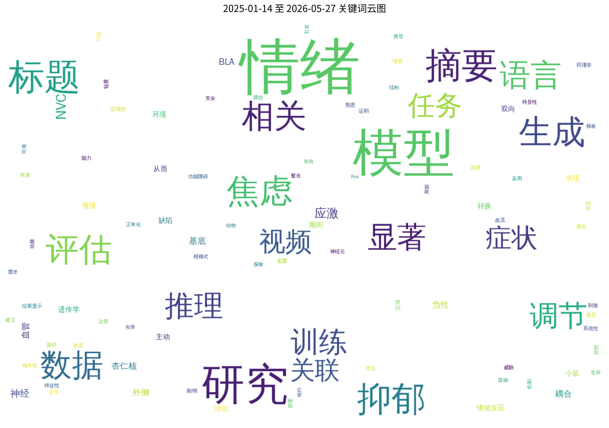
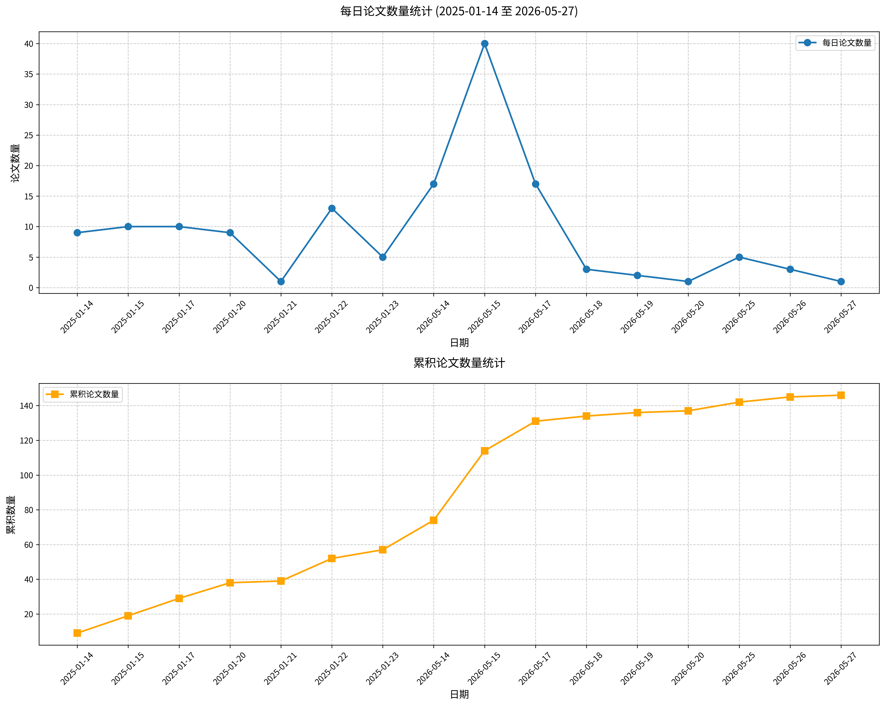

# 心理学相关论文日报 (2026-05-14)

## 📊 今日论文统计
- 总论文数：96
- 热门领域：GPT

## 📝 论文详情

### 1. “我们现在一起在旅途中”：一项关于“亲近他人”对进食障碍求助障碍与促进因素视角的定性研究

**原文标题：** "We're on the journey now together": a qualitative examination of "close others'" perspectives on barriers and facilitators to help-seeking for eating disorders.

**摘要：**
背景：进食障碍（ED）是严重疾病，深刻影响患者及其亲近他人。尽管早期干预能改善临床结局的有力证据充分，但ED患者的求助行为发生率低，且未治疗疾病的长期期常见。社会支持网络可促进求助行为，但多数研究聚焦于父母支持患有神经性厌食症（AN）的青少年寻求帮助并参与治疗的经验。本研究旨在探索广泛定义的“亲近他人”群体对所有类型ED求助行为的视角。方法：对12名“亲近他人”（包括伴侣、兄弟姐妹、其他家庭成员及父母）进行定性访谈，这些参与者曾接触过各种类型ED患者，包括神经性厌食症、神经性贪食症（BN）、回避性/限制性食物摄入障碍（ARFID）及其他特定的喂养或进食障碍（OSFED）。数据采用反思性主题分析进行处理。结果：主题被归类为求助的障碍与促进因素，同时涉及对亲近他人的影响。亲近他人识别的障碍可分为三类：亲近他人因素（如识别问题的知识与信心不足）、患者因素（如矛盾心理）及系统因素（如限制性的服务标准与长等待时间）。亲近他人通过自我学习ED知识、学习应对医疗系统以及积极减轻亲人对求助的矛盾心理来促进求助行为。亲近他人报告了多种对其福祉的负面影响，包括内疚、压力、挫败感、社会孤立以及应对多重责任时的挑战。结论：本研究结果表明，广泛定义的社会网络能在支持个体为ED寻求帮助方面发挥积极作用。鉴于样本主要为白人且大部分参与者有AN相关经验，这些结论需谨慎解读。旨在改善ED求助的干预措施应利用社会支持网络作为提高治疗可及性的一种方式。包容性服务模式应让亲近他人参与照护，同时提供心理与实际支持，以减轻照顾者负担与痛苦。

**关键词：** 进食障碍；求助行为；亲近他人；社会支持；障碍与促进因素

**论文链接：** [PubMed](https://pubmed.ncbi.nlm.nih.gov/42135807/)

---

### 2. 父母温暖与青春期后期知识对成年早期抑郁和焦虑症状的前瞻性关联：一项瑞典队列研究

**原文标题：** Prospective associations between parental warmth and knowledge in late adolescence and depression and anxiety symptoms in young adulthood: a Swedish cohort study.

**摘要：**
背景：育儿实践，如情感支持和温暖，是青少年心理健康的关键决定因素，而父母知识的作用尚不明确。父母温暖被认为能促进开放和自我表露，这引发了一个问题：父母知识是独立预测心理健康结果，还是主要反映亲子关系的质量？本研究使用前瞻性数据，检验在考虑父母温暖及相关协变量后，青春期后期的父母知识是否对成年早期的抑郁和焦虑症状有独立贡献。

方法：数据来自瑞典国家队列研究Futura01的两波调查（n=2,697）。父母温暖和父母知识在参与者18岁时测量，各用两个条目；抑郁和焦虑症状在21岁时使用患者健康问卷-4（PHQ-4）测量。协变量包括参与者性别、父母教育水平、移民背景、18岁时的居住安排以及18岁时的心理健康问题指标。分析采用线性概率模型。

结果：在未调整的分析中，青春期后期较高的父母温暖和父母知识均与成年早期报告抑郁和焦虑症状的概率较低相关。然而，当相互调整父母温暖和父母知识后，父母知识的效果不再显著，表明其与心理健康结果的关系被父母温暖所混淆。相反，即使在考虑父母知识、社会人口学特征和早期心理健康问题后，父母温暖仍与抑郁和焦虑症状的概率较低显著相关。父母温暖与父母知识之间无显著交互作用，参与者性别也未调节这些关联。

结论：本研究强调了青春期后期父母温暖对成年早期抑郁和焦虑症状的保护作用，温暖与这些结果的较低概率保持一致性关联。然而，在考虑温暖和协变量后，父母知识对心理健康未表现出独立效应。这些发现强调了在青春期后期培养温暖、支持性的亲子关系的重要性，因为这些关系似乎对成年早期具有持久益处。

**关键词：** 父母温暖；父母知识；抑郁症状；焦虑症状；青少年心理健康

**论文链接：** [PubMed](https://pubmed.ncbi.nlm.nih.gov/42135768/)

---

### 3. 迈向精准预防：机器学习识别的中国青少年不同欺凌受害类型风险与保护因素

**原文标题：** Toward precision prevention: machine learning-identified risk and protective factors for distinct bullying victimization types among Chinese adolescents.

**摘要：**
背景：中国青少年的欺凌受害表现为不同类型（言语、身体、关系、网络欺凌），每种类型具有独特的负面结果和影响因素，但目前针对特定类型的预测模型仍然稀缺。将这些不同的受害类型合并为单一结果可能会掩盖对于针对性预防至关重要的差异。因此，本研究应用机器学习预测不同的受害类型，并揭示类型特定的风险和保护因素模式，为精准干预提供证据基础。
方法：中国青少年（n = 1,981，年龄11-18岁）完成了关于欺凌受害、抑郁、焦虑、友谊质量、情绪调节、社会支持、学校氛围、特质愤怒和道德推脱欺凌行为的测量。采用5折交叉验证训练多种机器学习算法，并在无过采样情况下进行敏感性分析。对于每种受害类型，选择产生最高F2分数的超参数配置，在全训练集上重新训练模型，随后应用于测试集。使用测试集数据对F2最优模型进行SHAP分析，以识别关键预测因子，并比较主分析与敏感性分析中的特征重要性排序。
结果：随机森林对总体受害（F2 = 0.67）和身体受害（F2 = 0.52）表现最优，Bagging对言语受害（F2 = 0.65）表现最优，逻辑回归对关系受害（F2 = 0.57）表现最优，朴素贝叶斯对网络欺凌（F2 = 0.51）表现最优。抑郁、焦虑、愤怒反应和道德推脱是共同的风险因素，而学生-学生关系是共同的保护因素，但愤怒特质、性别、冲突与背叛以及教师相关因素等在受害类型间表现出不同模式。敏感性分析确认了这些模式：前五个预测因子在言语、身体、网络和总体受害中保持一致，对于关系受害，前五个中的四个也保持一致。
结论：本研究表明，机器学习能够预测不同的欺凌类型，并识别其独特的风险和保护因素模式。这些发现提示，预防策略应超越“一刀切”的方法，转向针对每种受害类型特定风险因素组合的个性化干预。

**关键词：** 机器学习、欺凌受害类型、风险因素、保护因素、中国青少年

**论文链接：** [PubMed](https://pubmed.ncbi.nlm.nih.gov/42135723/)

---

### 4. 孕妇孤独感的影响因素：一项范围综述

**原文标题：** Factors affecting loneliness in pregnant women: A scoping review.

**摘要：**
背景：孕期孤独感是孕产妇健康中一个关键但被忽视的决定因素，与产后抑郁不同。尽管COVID-19大流行凸显了这种脆弱性，但产前孤独感的机制和类型仍研究不足。方法：按照PRISMA-ScR指南进行了一项范围综述。截至2025年3月15日，检索了七个数据库。首先根据社会生态模型框架筛选影响因素，然后进行主题分析。结果：共纳入23项研究。除情绪性和社会性孤独感外，还发现了一种与母性角色转变相关的情境特异性形式（“过渡性孤独感”）。报告的孤独感患病率差异较大，范围为26.26%至55.40%。这种广泛差异可能反映了方法学异质性（如抽样和评估工具）以及人群特征。决定因素被分为个体、人际、社区和社会四个层面。结论：当前通用工具无法捕捉产前孤独感的独特过渡性质。解决这一问题需要开发孕期特异性评估工具，并实施针对多层次社会生态因素的多层次干预措施。

**关键词：** 孤独感；孕妇；社会生态模型；情绪；心理因素

**论文链接：** [PubMed](https://pubmed.ncbi.nlm.nih.gov/42135711/)

---

### 5. 牙颌面畸形患者状态-特质焦虑、心理韧性与健康相关生活质量的关系：一项前瞻性研究

**原文标题：** Associations among state-trait anxiety, resilience, and health-related quality of life in patients with dentofacial deformities: a prospective study.

**摘要：**
背景：本研究评估牙颌面畸形患者在正颌手术前后心理韧性的变化，探讨其与焦虑和生活质量的相关性，以识别术后高焦虑风险指标。方法：收集96名接受正颌手术的牙颌面畸形成人患者在四个时间点的数据：术前（T1），术后两周（T2）、三个月（T3）和六个月（T4）。使用状态-特质焦虑量表（STAI）、康纳-戴维森韧性量表（CD-RISC）和正颌生活质量问卷（OQLQ）评估心理状态和疾病特异性生活质量。结合受试者工作特征（ROC）曲线分析和逻辑回归，识别与术后焦虑升高相关的术前因素。结果：皮尔逊相关分析显示，在所有四个阶段，心理韧性与状态和特质焦虑水平呈负相关（p < 0.01），且术前韧性与术后所有阶段的状态-特质焦虑也呈负相关（p < 0.01）。此外，韧性与特质焦虑的交互作用在T4时点显著影响生活质量评分（B = 0.02, t = 2.28, p = 0.03）。康纳-戴维森韧性量表在筛查术后高焦虑水平患者方面表现出有效性〔95% CI，两周0.75（0.61,0.90），三个月0.71（0.57,0.86），六个月0.74（0.59,0.89），p < 0.01〕，对应的截断值分别为24.5、26.5和26.5。结论：心理韧性可能有助于减轻特质焦虑以提升生活质量。此外，康纳-戴维森韧性量表有潜力作为术前初步筛查工具，用于识别术后高状态-特质焦虑风险患者。

**关键词：** 状态焦虑、特质焦虑、心理韧性、健康相关生活质量、牙颌面畸形

**论文链接：** [PubMed](https://pubmed.ncbi.nlm.nih.gov/42135695/)

---

### 6. 重构关于衰老的预期——身体活动与包容性重新评估（RE-PAIR）：一项促进老年伴侣积极自我衰老认知和身体活动的随机干预方案

**原文标题：** Reframing Expectations about aging - Physical Activity and Inclusive Reappraisal (RE-PAIR): Protocol of a randomized intervention promoting positive self-perceptions of aging and physical activity in older couples.

**摘要：**
背景：年龄歧视和消极的自我衰老认知对老年人的健康、医疗保健及经济系统产生不利影响。尽管现有的心理教育和行为干预措施能有效提高积极的自我衰老认知，但其有益效果往往仅在短期随访中被观察到，或随时间推移而减弱。这可能是由于干预措施仅针对个体层面实施，而未充分关注社会环境；然而，个体的自我衰老认知很可能受到身边亲近之人的年龄相关信念和行为的影响。
目的：我们计划实施一项为期12周的多成分干预措施，以促进积极的自我衰老认知和身体活动，并探究以下问题：（1）该干预措施是否能显著改变主要结果（即自我衰老认知和身体活动）和次要结果（即自我导向和他导向的年龄歧视、对伴侣共同衰老的主观看法、感知到的伴侣年龄相关变化、焦虑和抑郁症状、身体适能及执行功能）；（2）当干预措施针对伴侣双方实施时，观察到的结果变化是否比仅针对单方实施时更大；（3）该干预措施的影响在多大程度上能从接受干预的一方扩展到未接受干预的另一方。
方法：我们将采用三组随机对照试验（RCT）设计，分别在干预前、干预后立即、以及干预后三个月和六个月进行评估。样本将分为三组，每组包括60名年龄≥65岁的配偶、同居伴侣或长期伴侣。第一组中，伴侣双方共同接受包含心理教育成分和行为成分的干预；第二组中，仅有一方接受相同的干预；第三组（对照组）中，在数据收集期间双方均不接受干预。通过问卷评估自我衰老认知、身体活动、年龄歧视、对伴侣共同衰老的主观看法、感知到的伴侣年龄相关变化、焦虑和抑郁症状，而身体适能、执行功能和注意力则通过客观的面对面评估进行测量。
结论：该项目将为针对伴侣双方的干预是否能增强或促进老年阶段积极自我衰老认知和身体活动的提升提供证据。
试验注册：ClinicalTrials.gov: NCT07113860。发布日期：2025年7月3日。方案版本3：2026年3月1日。

**关键词：** 自我衰老认知；身体活动；年龄歧视；伴侣干预；积极性情结

**论文链接：** [PubMed](https://pubmed.ncbi.nlm.nih.gov/42135676/)

---

### 7. 不确定性不耐受、特质焦虑和强迫症状在检查行为及其相关伴随因素中的作用

**原文标题：** The role of intolerance of uncertainty, trait anxiety, and OCD symptoms in checking behaviour and its associated concomitants.

**摘要：**
检查行为旨在减少不确定性并预防恐惧结果。目前尚不清楚不确定性不耐受（IU）和特质焦虑（TA）等特质如何与强迫症（OCD）症状共同影响不同威胁和不确定性水平下的检查行为。本研究（n=208）在视觉辨别与检查任务中操纵了威胁（表现分数、表现相关的电刺激）和不确定性（反馈、无反馈）。每次试验中，参与者需判断两个形状是否相同。测量指标包括自我报告的检查冲动、痛苦程度、检查频率、任务准确度以及皱眉肌活动。低TA者在高威胁（相对于低威胁）下检查更多，而高TA者的检查行为无威胁差异。低TA者反应时无显著差异，而高TA者在低威胁有反馈条件下反应更慢。高IU预测更强的检查冲动和更高的痛苦。高OCD症状者在有无反馈条件下皱眉肌反应相似，而低OCD症状者在无反馈时活动更强。这些结果表明，IU、TA和OCD症状与检查行为的不同方面相关，但需使用更可靠和生态效度更好的范式进行概念复制验证。

**关键词：** 检查行为；不确定性不耐受；特质焦虑；强迫症状；情绪与认知

**论文链接：** [PubMed](https://pubmed.ncbi.nlm.nih.gov/42135592/)

---

### 8. 从整体到局部：面孔加工中的构形到特征加工模式——源自ERP重复效应的证据

**原文标题：** From global to local: ERP repetition effects reveal a configural-to-featural pattern in face processing.

**摘要：**
理解面孔加工的时间动态对于阐明大脑如何在视觉同质类别中区分个体至关重要。以往关于特征信息（如眼睛、嘴巴等个体面部特征）与构形信息（面部特征之间的空间关系）加工顺序的研究结果并不一致。这种不一致性可能部分源于对这两类信息的不完全区分，以及不同实验条件下未受控制的低级视觉差异。在本研究中，我们通过将一项单次面孔呈现任务与基于脑电的重复抑制范式相结合，解决了上述问题。刺激材料经过精心构建，使得特征操作与构形操作之间的视觉变异性得到平衡。28名参与者观看了面孔序列，在这些序列中，特征或构形被重复，或者两者均被改变，参与者需在当前面孔与前一张面孔匹配时作出反应。通过比较每种重复条件与改变条件下的事件相关电位重复效应，计算了与特征信息和构形信息相关的ERP效应。在预先定义的感兴趣区域进行的ERP波形分析以及数据驱动的全头皮比较表明，构形重复效应在较早的时间窗口内稳定出现，而特征效应则更具变异性，主要出现在较晚的时间窗口。这些发现阐明了面孔加工的时间动态，表明构形信息相对于特征信息具有加工优先性，并为层级性面孔表征模型提供了经验性约束。

**关键词：** 面孔加工；构形加工；特征加工；ERP重复效应；时间动态

**论文链接：** [PubMed](https://pubmed.ncbi.nlm.nih.gov/42135570/)

---

### 9. 肌肉如何与大脑对话：Apelin蛋白介导运动诱导的抗抑郁效应

**原文标题：** How muscle talks to brain: apelin protein mediates exercise-induced antidepressant effects.

**摘要：**
体育锻炼可缓解抑郁症状并增强海马可塑性，但介导这些效应的肌肉-脑对话机制尚不完全清楚。本研究评估了Apelin作为运动抗抑郁效应的新型介质，具体检验了以下假设：运动诱导的骨骼肌源性Apelin通过其受体APJ信号增强海马可塑性。为期4周的自愿跑轮运动可缓解抑郁样行为，并增加血清和海马中Apelin水平，其中骨骼肌（胫骨前肌和腓肠肌）是Apelin的主要来源。肌肉特异性Apelin敲除消除了跑步的抗抑郁和促神经发生效应，而肌肉靶向Apelin过表达则模拟了野生型小鼠中跑步的益处。机制上，肌因子Apelin通过海马谷氨酸能神经元上的APJ受体增强NMDA受体介导的神经传递。特异性敲低APJ减弱了跑步的促神经发生和抗抑郁效应。此外，Apelin/APJ信号激活酪蛋白激酶2，该激酶磷酸化GluN2B亚基的丝氨酸1480位点，从而增强NMDA受体功能并激活下游calpain-2信号。我们的发现揭示了一条肌肉-脑轴，其中运动诱导的肌因子Apelin协调海马神经可塑性和抗抑郁反应，为抑郁症提供了新的治疗途径。

**关键词：** 运动抗抑郁效应；Apelin蛋白；肌肉-脑轴；海马可塑性；NMDA受体信号

**论文链接：** [PubMed](https://pubmed.ncbi.nlm.nih.gov/42135522/)

---

### 10. COVID-19期间通过分离认知缺陷与情绪负担探究心理困扰对工作记忆的影响

**原文标题：** The impact of psychological distress on working memory during COVID-19 by disentangling cognitive deficits from emotional burden.

**摘要：**
COVID-19大流行对公共健康和人类认知功能产生了深远影响，研究表明注意力、执行功能和工作记忆出现缺陷。在本研究中，我们考察了工作记忆表现与焦虑、心身症状及心理困扰（已知会影响认知功能的变量）之间的关系。我们的研究结果显示，心理困扰解释了视觉工作记忆表现中的显著变异，尤其是在疾病早期阶段困扰水平达到峰值时。这些结果强调了区分COVID-19对大脑结构的直接影响与更广泛心理负担的重要性。这些发现凸显了康复项目需要不仅关注认知损伤，还应处理患者面临的心理负担，以确保采用更全面的康复方法。

**关键词：** 工作记忆；心理困扰；认知缺陷；情绪负担；COVID-19

**论文链接：** [PubMed](https://pubmed.ncbi.nlm.nih.gov/42135397/)

---

### 11. 基于神经编码解码与知识引导的上下文情感识别研究

**原文标题：** Research on contextual sentiment recognition based on neural encoding and decoding and knowledge guidance.

**摘要：**
上下文情感识别在智能客服和心理健康监测等应用中至关重要。然而，现有模型面临多模态异质性、知识匮乏以及动态情感转换捕获不足的挑战。为解决这些问题，我们提出了一种结合动态知识引导的双分支神经编码-解码架构。该模型通过独立分支处理多模态特征（文本、语音、视频）和上下文依赖关系，同时整合显性知识（人格特质、领域规则）和从大型语言模型中蒸馏的隐性知识。一个动态上下文窗口根据情感变化进行调整，以增强实时感知。在IEMOCAP、MELD和DailyDialog数据集上的实验表明，我们的完整模型分别达到了82.1%、78.3%和76.2%的准确率，超越了包括微调GPT-4在内的当前最优基准。轻量级版本（1820万参数）在降低部署成本的同时保持了高速推理（950样本/秒）。此外，该模型展现了强大的跨数据集泛化能力和实际效用。本研究提供了一个高效框架，有效解决了上下文情感识别中的核心挑战，在性能与实用性之间取得了平衡，适用于实际部署。

**关键词：** 上下文情感识别；神经编码解码；多模态融合；知识引导；动态上下文窗口

**论文链接：** [PubMed](https://pubmed.ncbi.nlm.nih.gov/42135370/)

---

### 12. 线上与线下沟通中数字与生物标志物的实验研究数据集

**原文标题：** A dataset on the experimental study of online and offline communication with digital and biomarkers.

**摘要：**
视频会议技术的兴起改变了人们在职业与个人情境中的协作与互动方式。然而，比较视频会议与面对面互动的实证研究仍较为分散，部分原因在于缺乏同时捕捉两种模式且包含丰富行为、生理及自我报告数据的开放多模态数据集。为弥补这一空白，我们引入了该数据集，其中包含约180小时未经相识的成对受试者在受控实验室条件下进行结构化及创造性协作任务的音视频记录。受试者被随机分配至视频会议或面对面互动组。数据集包含六次唾液催产素测量、关于情感、人格特质、相关态度、沟通结果的自我报告，以及一项重复持续注意力任务。多数成对受试者提供了正面及侧面摄像视角的行为记录，个体层面数据覆盖127-131名受试者。该数据集支持对社会联结、合作、行为与生理同步性及更广泛的沟通动力学研究，填补了比较沟通研究领域关键资源空白。

**关键词：** 情感测量；面部表情；社会认知；人际沟通；生物标志物

**论文链接：** [PubMed](https://pubmed.ncbi.nlm.nih.gov/42135355/)

---

### 13. 精神分裂症谱系障碍与解离障碍中的述情障碍：两项元分析综述

**原文标题：** Alexithymia in schizophrenia spectrum disorders and dissociative disorders: two meta-analytic reviews.

**摘要：**
精神分裂症谱系障碍和解离障碍常共同发生，两者均表现出情绪加工缺陷。述情障碍——包括难以识别情绪、难以描述情绪和外向性思维——被视为一种共同的易感性因素，然而，这些障碍内部及之间各维度的相对突出程度尚不明确。本研究通过两项元分析，综合比较了精神分裂症谱系障碍（元分析1）和解离障碍（元分析2）患者与精神健康对照者在总体述情障碍及其各维度上的严重程度。预先注册的PsycINFO、PubMed和Embase检索（1970年至2024年12月31日）筛选出成人病例对照研究。采用随机效应元分析模型估计合并的Hedges' g值，随后通过混合效应元分析模型进行跨诊断比较（调节变量分析）。元分析1整合了27项精神分裂症谱系障碍研究（1477名患者，1249名对照者）。元分析2整合了30项解离障碍研究（842名患者，796名对照者）。两组患者在总体述情障碍及所有维度上均得分高于对照者。在精神分裂症谱系障碍中，难以识别情绪表现出最大的组间效应（g=0.894；CI 0.667-1.122），而难以描述情绪（g=0.622；CI 0.468-0.775）和外向性思维（g=0.585；CI 0.400-0.770）表现出中等效应。在解离障碍中，难以识别情绪（g=1.311；CI 0.991-1.632）和难以描述情绪（g=0.954；CI 0.707-1.202）均表现出大效应，而外向性思维（g=0.427；CI 0.163-0.690）表现出小到中等效应。在疾病组间比较中，剔除极端效应后，解离障碍的难以识别情绪和难以描述情绪高于精神分裂症谱系障碍，而精神分裂症谱系障碍的外向性思维更高。异质性为中等至高，精神分裂症谱系障碍研究中可能存在发表偏倚。述情障碍是一种重要的跨诊断缺陷，但其维度特征在精神分裂症谱系障碍与解离障碍之间有所不同。因此，情绪聚焦的干预应针对各疾病组突出的维度特异性缺陷。

**关键词：** 述情障碍；精神分裂症谱系障碍；解离障碍；情绪加工；元分析

**论文链接：** [PubMed](https://pubmed.ncbi.nlm.nih.gov/42135320/)

---

### 14. 重复音乐的机器人鹦鹉疗法与不同器乐现场音乐疗法对血液透析患者焦虑和疲劳水平的影响：一项随机对照试验

**原文标题：** The Effect of Music-Repeating Robotic Parrot Therapy and Different Instrumental Live Music Therapies on Anxiety and Fatigue Levels in Hemodialysis Patients: A Randomized Controlled Trial.

**摘要：**
目的：本研究旨在评估三种基于音乐的干预措施对血液透析患者焦虑和疲劳水平的影响，并与接受常规护理的同期对照组进行比较。  
方法：这项随机对照试验纳入了64名接受维持性血液透析的患者。他们被随机分配到四个相等的组（每组n=16）：现场音乐组、现场奈伊笛声音疗法组（使用一种以其舒缓、类似呼吸音调闻名的传统芦苇笛）、重复音乐的机器人鹦鹉疗法组（一种交互式机器人鹦鹉，可重复患者提供的音乐或声音），或对照组（无干预）。实验组接受每周3次、每次30分钟的干预，持续2个月。使用“贝克焦虑量表”和“疲劳严重度量表”分别测量焦虑和疲劳水平。在干预前、2个月干预期结束后立即以及干预结束后2个月进行评估。  
结果：干预前，四组间的焦虑或疲劳评分无显著差异（p > 0.05）。干预后，所有接受音乐疗法的三组在焦虑和疲劳评分上均较对照组显著降低（p < 0.001）。  
结论：三种疗法均可有效管理血液透析患者的焦虑和疲劳症状。其中，重复音乐的机器人鹦鹉疗法在降低焦虑和疲劳水平方面表现出最优越且最持久的效果。  
试验注册：ClinicalTrials.gov标识符：NCT07238374。

**关键词：** 焦虑、疲劳、音乐疗法、机器人鹦鹉、血液透析

**论文链接：** [PubMed](https://pubmed.ncbi.nlm.nih.gov/42135264/)

---

### 15. 解析法国自闭症成人印象管理及其相关自闭症特征的性别与性别差异

**原文标题：** Untangling Sex and Gender Differences in Impression Management and Associated Autism Features in French Autistic Adults.

**摘要：**
部分自闭症个体掩饰其行为差异，这一现象与广义的印象管理存在重叠。目前针对自闭症群体印象管理的研究较少，尤其在非英语国家。本研究明确了掩饰行为与印象管理的共同维度，并基于此概念澄清解决两个知识空白：（1）指派性别、性别认同与性别角色表达在解释印象管理维度差异中的各自作用；（2）这些维度如何与不同生命阶段的自闭症特征相关联。291名法国自闭症成人完成关于掩饰行为、行为恰当性关注、自我监控和性别角色表达的自我报告测量。采用自闭症诊断访谈修订版（ADI-R）和自闭症诊断观察量表第二版（ADOS-2）分别评估童年期和成年期自闭症特征。联合探索性因子分析提取掩饰行为与印象管理测量的潜在维度，分层回归与弹性网络回归分析检验印象管理维度与指派性别、性别认同及性别角色表达的关联，多元回归检验印象管理维度是否调节童年期与成年期自闭症特征的关系。结果揭示了印象管理（涵盖掩饰行为）的多维性，并呈现超出既往文献中自闭症掩饰行为性别/性别差异的细微层面。研究发现两大印象管理维度：“有意使用”（有目的性的印象管理运用）和“自我效能感”（感知到的印象管理能力）。自闭症女性和性别多元成人的印象管理有意使用高于男性；印象管理自我效能感与高亲和性特质（如关怀与协作品质）显著相关。在指派为男性的自闭症个体中，较高的印象管理自我效能感与成年期较低的自闭症社会交流特征相关。本研究为自闭症特征与印象管理在性别相关、性别相关及潜在发展层面的关联提供了新见解。

**关键词：** 印象管理；掩饰行为；自闭症；性别差异；社会认知

**论文链接：** [PubMed](https://pubmed.ncbi.nlm.nih.gov/42135209/)

---

### 16. 台湾人群中修订版心身研究诊断标准述情障碍阈值的临床意义再评估

**原文标题：** Re-evaluation of the clinical meaningfulness of the Diagnostic Criteria for Psychosomatic Research-Revised alexithymia threshold in the Taiwanese population.

**摘要：**
目的：本研究旨在使用修订版心身研究诊断标准（DCPR-R），重新评估台湾人群中述情障碍的临床意义诊断阈值，以更好地区分真正的精神病理学特征与文化常态。方法：共纳入502名参与者（277名临床样本，225名社区样本）。数据收集包括人口学信息以及评估情绪紊乱、躯体化相关特征和生活质量的自评问卷。考察不同截断值（符合3-5条标准）下的患病率和临床负担。使用多元回归模型评估各条标准的临床效用和区分贡献。结果：传统阈值（6条标准中符合3条）得出的患病率为48.8%，且未能清晰区分述情障碍组与非述情障碍组的临床特征。将截断值提高至5条标准后，患病率降至10.2%，识别出具有更严重抑郁、更少健康焦虑相关行为以及更差整体、心理和社会生活质量的个体。条目水平分析表明，反映外向型思维的标准缺乏区分价值，而情感意识缺陷和情绪调节障碍是临床严重程度的强预测因子。结论：在台湾人群中，采用更严格的述情障碍诊断阈值（5条标准）更为合适，能改善对临床有意义述情障碍的识别，其特征包括情绪紊乱、躯体化倾向及更差生活质量。强调情感调节缺陷而非外向型思维，可增强该构念在东方人群中的临床特异性与实用性。

**关键词：** 述情障碍；情绪调节；临床阈值；台湾人群；心理学

**论文链接：** [PubMed](https://pubmed.ncbi.nlm.nih.gov/42135138/)

---

### 17. 与未知共处：帕金森病中的不确定性不耐受

**原文标题：** Living with the Unknown: Intolerance of Uncertainty in Parkinson's Disease.

**摘要：**
背景：由于运动和非运动症状的波动、治疗反应的差异以及不可预测的临床病程，帕金森病（PD）以普遍存在的不确定性为特征。不确定性不耐受（IU）是一种将模糊性视为威胁并以担忧、回避或决策瘫痪来应对的倾向，可能在PD中具有重要影响，但目前缺乏针对PD的系统性综合。
目的：综合关于特发性PD中IU的概念性、定性和新兴定量文献，描述整个病程中的临床和心理社会相关性，并确定评估和干预的意义。
方法：本次靶向叙述性综述检索了MEDLINE（PubMed）、Embase、PsycINFO和Web of Science，时间范围从建库至2025年5月22日，辅以参考文献筛查和帕金森病会议或指南来源。对涉及特发性PD成人和/或护理伙伴中不确定性不耐受或密切相关不确定性构念的英文实证和临床信息性论文进行标题/摘要和全文评估，随后整理以进行叙述性综合。
结果：在定性、定量、干预和临床综述/指导类论文中，症状不可预测性、治疗不确定性、身份认同中断、羞耻感和未来规划担忧与焦虑、士气低落、回避、参与减少以及生活质量下降相关。
结论：IU可能是一种可改变且常见的潜在通路，通过该通路PD相关的不确定性——可能受多巴胺能、执行功能和压力系统脆弱性的影响——导致持续的心理和功能负担。推进PD敏感的测量手段并开发针对IU的干预措施，将其整合到多学科护理模式中，可能改善患者和护理者的适应能力及生活质量。

**关键词：** 帕金森病；不确定性不耐受；情绪；焦虑；生活质量

**论文链接：** [PubMed](https://pubmed.ncbi.nlm.nih.gov/42135068/)

---

### 18. 当挣扎成为力量：坚韧、繁荣与幸福感作为STEM学生动机强度的中介变量的心理学研究

**原文标题：** When struggle becomes strength: The psychology of grit, flourishing, and well-being as mediators of motivational intensity in STEM students.

**摘要：**
全球范围内对STEM教育的投资日益增加，但学生的参与度和保留率仍存在问题。这突显了理解支撑动机的心理过程的重要性，特别是在非西方国家如沙特阿拉伯，这些目标已体现在国家发展战略（包括2030愿景）中。本研究采用文化知情的混合方法，探讨了坚韧如何影响沙特大学STEM学生的动机强度的直接和间接假设，并将繁荣和情绪平衡作为潜在中介变量。遵循顺序解释性设计，我首先使用PLS-SEM对1050名STEM学生的调查数据进行汇总分析，随后对20名有目的选择的受访者进行定性访谈。使用经过验证的量表测量了坚韧、繁荣、积极/消极情绪和动机强度。最终模型对动机强度具有中等解释力。坚韧的毅力维度仅通过中介路径发挥作用，其中繁荣是最强中介变量，其次是积极情绪。出乎意料的是，消极情绪也与动机强度呈正相关，这一悖论通过定性研究得以解决，揭示了文化特定的意义建构过程。相比之下，坚韧的一致性维度对动机强度产生直接效应，表明其通过质不同的心理机制运作。定性数据解释了这些关系，显示伊斯兰“萨布尔”（耐心）、集体主义义务和文化意义建构系统等文化概念将消极情绪重新定义为有意义挑战和目的性参与的标志。研究结果表明，坚韧的两个维度可能通过不同的心理过程运作，整体幸福感支持人格特质转化为持续努力。

**关键词：** 坚韧；繁荣；动机强度；情绪中介；STEM教育

**论文链接：** [PubMed](https://pubmed.ncbi.nlm.nih.gov/42134182/)

---

### 19. 增强现实音频-运动训练游戏改善噪声中言语感知：单臂预可行性研究

**原文标题：** An Augmented Reality Audio-Motor Training Game for Improving Speech-in-Noise Perception: Single-Arm Pilot Feasibility Study.

**摘要：**
背景：在嘈杂环境中理解言语是听力障碍的主要挑战，仅靠助听器无法充分解决。虽然听觉训练可以增强选择性注意和言语感知，但当前的数字程序存在用户依从性差、缺乏真实3D空间音频的问题。目的：本预试验评估了ARIA（增强现实沉浸式听觉训练）的可行性、可用性和初步疗效，这是一种通过耳机传送空间音频、为中年人提供游戏化家庭听觉训练的手持移动干预措施。方法：在这项单臂、前后测及随访的预试验中，11名具有功能性听力但无需佩戴助听器的成年人（平均年龄53.0岁，标准差3.0岁）使用提供的设备（iPhone 14 Pro、AirPods Pro 2）完成了为期4周的家庭训练，干预内容为ARIA。在基线、4周和8周时，通过韩国矩阵句子测试在三种信噪比（0 dB、-6 dB和-9 dB）下评估噪声中言语感知。同时收集了可行性、可用性（系统可用性量表）、用户体验（需求满足玩家体验量表）、游戏内表现和定性反馈。结果：方案完成率为100%（11/11），证明了技术可行性。探索性疗效分析显示，训练后所有条件下的噪声中言语感知均有统计学显著改善（0 dB：t₁₀=3.43，P=.02；-6 dB：t₁₀=5.34，P<.001；-9 dB：t₁₀=4.34，P=.004）。这些改善在8周随访中得以维持。游戏内定位能力的提升与-6 dB SNR（ρ=0.639；P=.03）和-9 dB SNR（ρ=0.612；P=.045）下的言语感知提升显著相关。用户体验结果不一：平均系统可用性量表得分为70.2（标准差19.6；范围47.5-92.5），反映了可用性感知的显著个体差异。虽然72%（n=8）报告了增强现实环境设置的困难，但63%报告了对核心游戏玩法的真实掌握驱动型参与。主题分析揭示了外围可用性挑战（设置摩擦、因方案结构导致的“家庭作业”特征）与对训练范式本身成功参与之间的分离。结论：本预试验证明了基于AR的音频-运动训练家庭实施的可行性，并显示出令人鼓舞的初步疗效信号，有必要推进至对照疗效试验。形成性结果确定了更广泛应用所需的具体可用性改进，特别是在保持成功促进能力和参与度的核心游戏元素的同时简化AR设置。这些见解为平台优化和随机对照试验设计提供了明确指导。

**关键词：** 增强现实；听觉训练；噪声中言语感知；可行性；用户体验

**论文链接：** [PubMed](https://pubmed.ncbi.nlm.nih.gov/42133934/)

---

### 20. 基本情感量表（PAFI）的开发与验证：用于测量基本情感状态的自评问卷

**原文标题：** The Development and Validation of the Primary Affect Inventory (PAFI), a Self-Rating Questionnaire for the Measurement of Primary Affective States.

**摘要：**
本研究介绍了基本情感量表（PAFI），这是一份自评问卷，用于操作化Panksepp提出的基本情感（寻求、关怀、玩耍、欲望、恐惧、愤怒、恐慌/悲伤），并评估过去七天的情感状态。心理测量属性在两个样本中进行了检验：样本1（N=432，69.9%为女性，平均年龄=39.84岁，标准差=18.25岁）和样本2（N=460，85%为女性，平均年龄=34.79岁，标准差=11.63岁）。基于样本1，通过McDonald's omega估计了信度，通过探索性图分析（EGA）评估了结构效度，通过与基本情感特质（BANPS-GL）、大五人格特质（BFI-K）和精神症状（ISR）的相关性评估了聚合效度和效标效度。利用样本2，通过验证性因子分析（CFA）探究了提出的潜在结构。所有子领域均表现出良好至卓越的内部一致性（ω≥0.88）。EGA识别出与预定义基本情感相对应的七个群落。总体而言，相关分析支持了PAFI子领域、人格和症状之间的预期关系。CFA证实了相关子领域模型的优秀拟合度，而两高阶因子模型表现出可接受的拟合度。最后，两个样本中因子结构的恒等性分析表明，在标量水平上达到完全测量不变性。PAFI表现出强大的心理测量属性，包括信度、结构效度、聚合效度和效标效度。其简短格式和直白语言使其适用于跨人群有效评估基本情感状态。

**关键词：** 情感测量；基本情感；心理测量属性；信度；结构效度

**论文链接：** [PubMed](https://pubmed.ncbi.nlm.nih.gov/42133848/)

---

### 21. 一项关于共同反刍与人格、社会功能及情绪健康关联的成人代表性样本研究

**原文标题：** Investigating links between co-rumination and personality, social functioning, and emotional well-being in a representative sample of adults.

**摘要：**
共同反刍是指人们深入讨论问题、对问题进行推测并聚焦于负面情绪的现象。现有证据表明，共同反刍存在一种矛盾：一方面它能增强人际关系纽带，另一方面也会对情绪产生负面影响（例如引发焦虑）。目前该主题的研究多集中于儿童与青少年群体。本调查研究以495名英国成年居民（年龄18-87岁，按年龄、性别和种族分层）为代表性样本，考察了共同反刍的相关因素。回归模型显示，观点采择、外倾性、宜人性、焦虑等个体差异指标以及幸福感测量的成熟自评量表与自我报告的共同反刍存在关联。结构方程模型表明，共同反刍在部分个体差异因素与降低社交困扰（即减轻孤独感、改善人际关系幸福感）及增加焦虑之间起到中介作用，且效应量通常较小。在多数模型中，年龄与共同反刍呈负相关。总体而言，至少在成人群体中，共同反刍虽可能与关系满意度和更广泛的幸福感相关，但也与更高的焦虑水平并存。

**关键词：** 共同反刍；人格；情绪健康；社会功能；焦虑

**论文链接：** [PubMed](https://pubmed.ncbi.nlm.nih.gov/42133729/)

---

### 22. 优化预测戒烟即时适应性干预中吸烟渴望和复吸的监督式机器学习算法

**原文标题：** Optimising supervised machine learning algorithms predicting cigarette cravings and lapses for a smoking cessation just-in-time adaptive intervention (JITAI).

**摘要：**
本研究旨在通过系统性地改变生态瞬时评估（EMA）提示频率、预测因子数量和训练数据来源，优化戒烟即时适应性干预（JITAI）中预测高风险时刻时参与者负担与算法性能之间的平衡。37名参与者在戒烟尝试的前10天每天完成16次EMA，报告情绪、情境、行为、吸烟渴望和复吸情况。通过混合效应模型（考虑个体内聚类）评估预测复吸和吸烟渴望的随机森林算法，以F1分数和ROC-AUC为指标。结果在跨样本个体中表现从优秀到差劲不等，但总体表现中等。复吸预测优于吸烟渴望预测，尤其在ROC-AUC方面（中位F1分数：复吸0.436 [四分位距0.180-0.625]，吸烟渴望0.400 [四分位距0.048-0.649]；中位ROC-AUC：复吸0.659 [四分位距0.514-0.809]，吸烟渴望0.628 [四分位距0.510-0.729]）。相当一部分配置低于常用最低性能阈值，尤其是F1分数。减少EMA频率对结果和指标的影响具有依赖性。较少的提示提高了复吸F1分数（16次EMA：0.254 [四分位距0.081-0.500]，3次EMA：0.588 [四分位距0.353-0.667]），而ROC-AUC略有但不一致地下降（16次EMA：0.661 [四分位距0.520-0.876]，4次EMA：0.613 [四分位距0.494-0.786]，3次EMA：0.704 [四分位距0.567-0.809]）。对于吸烟渴望，两项指标均随提示减少而下降（F1分数：16次EMA：0.470 [四分位距0.141-0.745]；3次EMA：0.333 [四分位距0.000-0.600]；ROC-AUC：16次EMA：0.700 [四分位距0.582-0.811]，3次EMA：0.544 [四分位距0.421-0.676]）。特征减少对复吸预测影响微乎其微（F1分数：所有特征0.435，选定特征0.441；ROC-AUC：所有0.660，选定0.657），但略微降低了吸烟渴望性能（F1分数：所有0.410 [四分位距0.117-0.646]，选定0.400 [四分位距0.000-0.650]；ROC-AUC：所有0.632，选定0.622）。纳入参与者特定数据改善了复吸F1分数（无：0.286 [四分位距0.000-0.571]，30pc：0.542 [四分位距0.329-0.667]），但未改善ROC-AUC（无：0.655 [四分位距0.512-0.786]，30pc：0.694 [四分位距0.513-0.852]）；并损害了吸烟渴望ROC-AUC（无：0.650 [四分位距0.544-0.734]，30pc：0.614 [四分位距0.493-0.730]；F1分数：无：0.424 [四分位距0.143-0.649]，30pc：0.400 [四分位距0.000-0.703]）。总体而言，基于EMA的机器学习检测到了复吸风险，但整体性能中等且个体间差异较大。使用更高EMA密度、更大预测因子集和参与者特定训练数据的算法并未一致优于更简约的方法。然而，仅靠机器学习预测可能不足以支持真实世界中的JITAI实施，最好与基于规则的补充方法相结合。

**关键词：** 机器学习；吸烟渴望；即时适应性干预；生态瞬时评估；预测算法

**论文链接：** [PubMed](https://pubmed.ncbi.nlm.nih.gov/42133672/)

---

### 23. 亚裔美国大学生感知的种族与文化歧视与饮食失调风险：心理与情境中介路径

**原文标题：** Perceived racial and cultural discrimination and eating disorder risk among Asian American college students: Psychological and contextual mediating pathways.

**摘要：**
目的：本研究考察了亚裔美国大学生感知的种族与文化歧视与两个结果变量（SCOFF阳性饮食失调症状和瘦理想内化）之间的关联，并检验了心理与情境中介因素。参与者：数据来自2022-2024年健康心态研究中15,253名美国院校自我认同为亚裔美国人的学生。方法：采用单中介模型估计总效应、直接效应、间接效应及中介比例。结果：感知的种族与文化歧视与两个结果变量的更高风险相关。校园氛围指标——较低的群体归属感和感知的院校对学生心理健康的重视不足——与两个结果均存在显著间接关联。相比之下，在调整抑郁和焦虑症状后，心理灵活性并非显著间接路径。结论：研究结果突显了情境和制度因素（尤其是校园归属感和感知的心理健康支持）在解释歧视与饮食失调风险关联中的作用。减少歧视并加强包容性、肯定身份的校园环境的干预措施，可能有助于降低亚裔美国大学生的饮食失调风险。

**关键词：** 种族歧视；文化歧视；饮食失调；校园氛围；亚裔美国人

**论文链接：** [PubMed](https://pubmed.ncbi.nlm.nih.gov/42133637/)

---

### 24. 对不可预测威胁的敏感性介导急性戒烟对实验室冲动行为测试的影响

**原文标题：** Sensitivity to unpredictable threat mediates the effect of acute smoking abstinence on a laboratory probe of lapse behavior.

**摘要：**
引言：急性戒烟期间的焦虑与吸烟维持及冲动/复吸密切相关。焦虑的核心是对不可预测威胁的敏感性增强——即对未来不确定威胁的焦虑性担忧，动物模型研究有力表明其在剥夺期间尼古丁寻求行为中起促进作用。然而，人类相关研究结果混杂，可能源于其使用了欠佳的组间设计。因此，本研究采用被试内实验室设计，检验对不可预测威胁的敏感性是否介导了急性戒烟操作对吸烟冲动行为的影响。
方法：非治疗寻求的日常吸烟成年人（N=63）在隔夜吸烟剥夺或正常吸烟条件下参加了两次平衡的实验室实验。两次实验均完成无威胁-可预测威胁-不可预测威胁任务，评估在预期电击时听觉惊跳刺激引起的眨眼反射。随后完成McKee实验性复吸模拟任务，评估冲动行为，包括为货币奖励延迟吸烟的能力及开始后吸烟的数量。
结果：与预期一致，吸烟剥夺（相比正常吸烟）导致开始吸烟时间缩短及开始后吸烟量增加。重要的是，对不可预测威胁的敏感性部分中介了剥夺诱发的冲动行为。剥夺与对不可预测（相比无）电击的惊跳增强相关（尽管此效应仅在后续分析中出现），而这进而预测了吸烟增加。
结论：对不可预测威胁的敏感性可能是吸烟-焦虑关联中一个重要但被低估的生物行为机制。
启示：通过被试内实验室设计，本研究提供了初步证据表明对不可预测威胁的敏感性可能促进急性戒烟期间的吸烟复吸。尽管这些结果有待更大样本的重复验证，但它们表明对不可预测威胁的敏感性可作为评估戒烟干预中焦虑相关过程的潜在生物行为靶点。

**关键词：** 吸烟戒断；不可预测威胁；焦虑；冲动行为；惊跳反射

**论文链接：** [PubMed](https://pubmed.ncbi.nlm.nih.gov/42133589/)

---

### 25. 工作-生活平衡满意度在农业企业家恢复体验与职业倦怠之间的中介作用

**原文标题：** Satisfaction with Work-Life Balance as a Mediator Between Recovery Experiences and Burnout in Agricultural Entrepreneurs.

**摘要：**
目的：农业企业家面临显著的工作压力源，包括长时间工作和模糊的工作-生活界限。这些因素导致职业倦怠风险增加，但鲜有研究探讨恢复体验——心理脱离、放松、掌控感和控制感——如何影响其心理健康。本研究考察恢复体验在减少职业倦怠中的作用，并评估工作-生活平衡满意度是否中介了这一关系。
方法：采用横断面研究设计，对法国916名农业企业家进行问卷调查。参与者完成了恢复体验、工作-生活平衡满意度和职业倦怠的已验证量表测量。使用结构方程模型（SEM）检验恢复各维度与职业倦怠之间的直接和间接关联，同时控制年龄、性别、婚姻状况、子女数量、每周工作时间及农场类型等变量。
结果：结果表明，恢复体验在维持工作-生活平衡满意度和减少职业倦怠中发挥关键作用。心理脱离（β=0.190，p<.001）、放松（β=0.254，p<.001）和控制感（β=0.317，p<.001）与工作-生活平衡满意度呈正相关，支持假设1。工作-生活平衡满意度与较低的职业倦怠水平显著相关（β=-0.399，p<.001），支持假设2。放松（β=-0.153，p=.001）和控制感（β=-0.132，p=.001）与职业倦怠的直接负相关成立，支持假设3。心理脱离（β=-0.076，p<.001）、放松（β=-0.101，p<.001）和控制感（β=-0.126，p<.001）通过工作-生活平衡满意度对职业倦怠产生显著间接效应，支持假设4。掌控感与工作-生活平衡满意度或职业倦怠无显著关联。
结论：本研究强调恢复体验在缓解农业企业家职业倦怠中的关键作用。放松和控制感直接减少职业倦怠，而心理脱离主要通过提升工作-生活平衡满意度影响职业倦怠。这些发现表明，针对性的干预措施（如促进结构化恢复实践和工作-生活平衡满意度策略）可能改善这一高风险人群的心理健康。未来研究应采用纵向设计和跨文化比较，以进一步理解农业自雇劳动者的恢复体验。

**关键词：** 恢复体验；工作-生活平衡满意度；职业倦怠；农业企业家；心理健康

**论文链接：** [PubMed](https://pubmed.ncbi.nlm.nih.gov/42133447/)

---

### 26. 视频会议与面对面心理治疗中预测早期情感联结的微观过程

**原文标题：** Microprocesses predicting early emotional bond in videoconferencing and face-to-face psychotherapy.

**摘要：**
与基于结果的研究相比，关于联盟形成潜在微观过程的研究仍然有限，特别是在视频会议心理治疗中。本研究考察了预测视频会议心理治疗和面对面治疗中早期情感联结的治疗师与来访者互动模式。来自28对治疗师-来访者共56个早期治疗会话，使用治疗关系编码系统进行编码，共获得35715个行为。基于工作联盟量表-患者版的情感联结分量表，通过极端组设计确定联盟强度。贝叶斯逻辑回归模型评估了治疗师行为和治疗师-来访者序列是否预测联盟及其与治疗方式（视频会议和面对面）的交互作用。共情单独在视频会议治疗中预测更弱的情感联结，而共情后跟随来访者同意的序列在视频会议治疗中更强烈地预测情感联结。积极倾听后跟随来访者同意也仅在视频会议治疗中预测更强的情感联结，而这两种行为后跟随来访者不同意则在不同治疗方式中均预测更弱的情感联结。笑话和准确回忆来访者先前信息与视频会议治疗中的强情感联结特别相关，而早期治疗师不同意则在不同治疗方式中均预测更弱的情感联结。研究结果表明，在非言语线索有限的视频会议治疗中，精确、准确且情境敏感的言语互动对于促进情感联结尤为关键。

**关键词：** 情感联结；视频会议心理治疗；微观过程；治疗联盟；言语互动

**论文链接：** [PubMed](https://pubmed.ncbi.nlm.nih.gov/42133403/)

---

### 27. 父母情绪控制信念：与对孩子负面情绪的反应、儿童幸福感及亲子关系质量的关联

**原文标题：** Parents' emotion control beliefs: Links with responses to children's negative emotions, child well-being, and parent-child relationship quality.

**摘要：**
人们对情绪持有强烈的信念。其中一个特别重要的信念是情绪是否应该被控制，即情绪控制信念。本研究考察了父母在这些信念上的表现，特别是这些信念对儿童幸福感和亲子关系的作用。我们提出，具有更强情绪控制信念的父母对孩子负面情绪的支持性反应更少、否定性反应更多，这可能进而预测更差的儿童幸福感和更低的亲子关系质量。在研究1（父母样本量=272）中，我们发现父母的情绪控制信念与更差的儿童幸福感呈横截面相关。这种关系通过父母对孩子情绪提供更少支持性和更多否定性反应来解释。在研究2（预先注册分析；父母样本量=272，青少年样本量=275）中，我们发现父母的情绪控制信念与部分（而非全部）由父母和青少年报告的更差儿童幸福感和更低亲子关系质量指标呈横截面相关，但非纵向相关（18个月后）。在研究3（父母样本量=139）中，我们发现父母的情绪控制信念在纵向（4个月后）预测了更差的儿童幸福感和更低的亲子关系质量。这些关联通过父母对孩子情绪提供更少支持性和更多否定性反应来解释。此外，这些关联在父母和孩子的性别和年龄（研究1-3）以及父母种族（研究3）上具有相对普适性。综合来看，这些发现表明父母的情绪控制信念可能影响他们如何回应孩子的情绪——通常导致负面结果——进而塑造儿童的幸福感和亲子关系质量。

**关键词：** 情绪控制信念；父母教养；儿童幸福感；亲子关系质量；负面情绪回应

**论文链接：** [PubMed](https://pubmed.ncbi.nlm.nih.gov/42133401/)

---

### 28. 谢谢你，无论你是什么：通过拟人化对非人类实体表达感激

**原文标题：** Thank you, whatever you are: Gratitude for nonhuman entities through anthropomorphism.

**摘要：**
我们提出，拟人化在人类对非人类实体产生感激之情的过程中发挥着核心作用。通俗而言，拟人化指人类将能动性赋予非人类实体，使其能够对环境及人类自身施加影响。随后，人类会将所获得的任何益处归因于非人类实体的感知意图，认为其充满善意并值得感激。我们的五项研究（总样本量N=2019）支持这一假设。首先，研究发现个体特质性拟人化倾向与其近期与自然及人造非人类实体互动中体验到的感激之情存在相关（研究1）。在因果检验方面，实验表明，拟人化计算机（研究2）、森林（研究3）、人工智能（研究4）及洋流（研究5）能够通过引发对这些实体作为回馈性施惠者的感知，从而诱发对其的感激之情。在研究中，获得更多想象性（研究5）或实际性（研究4）益处会进一步强化这一效应。此外，感激之情增强了人类对被拟人化的非人类实体（如人工智能，研究4）的信任，以及前者保护后者（如自然，研究3及研究5）的意愿。总体而言，由于对非人类实体产生感激之情依赖于将人类特征赋予它们，本研究也为引发人类对同类产生感激之情揭示了一种潜在机制。（PsycInfo数据库记录©2026美国心理学会版权所有）

**关键词：** 拟人化；感激之情；非人类实体；情绪机制；社会认知

**论文链接：** [PubMed](https://pubmed.ncbi.nlm.nih.gov/42133400/)

---

### 29. 论语言中的性别：语言性别化及其与48种语言中人格性别差异的关联

**原文标题：** Speaking of gender: Language genderedness and its association with gender differences in personality across 48 languages.

**摘要：**
先前研究表明，人格评估可能受到人们所使用的语言的影响。因此，性别化的思维、感受和行为方式可能与不同语言中编码的性别结构相关联。本研究探讨了IPIP-NEO-120测量的人格特质中的性别差异（样本量n=755,307；涵盖122个国家的48种语言，评估语言统一为英语）与语言性别化之间的关联。语言性别化通过专家评定、基于电影字幕和维基百科大规模文本语料库的词嵌入模型估计，以及ChatGPT-5.2、Gemini 2.5 Pro和DeepSeek-V3.2等大型语言模型评定。在所有语言性别化测量指标上，与性别化程度较低的语言相比，性别化程度更高的语言与更强的人格特质性别差异相关联（r = 0.51-0.59），表明语言可能影响人们基于性别的自我概念。（PsycInfo数据库记录©2026 APA，版权所有）

**关键词：** 语言性别化；人格性别差异；情感；社会认知；人工智能

**论文链接：** [PubMed](https://pubmed.ncbi.nlm.nih.gov/42133399/)

---

### 30. 社区青年人内心空虚感的混合方法研究：与身份认同及人格功能、健康风险行为和（不良）适应性应对策略的关联

**原文标题：** A mixed-methods investigation of feelings of inner emptiness in community young adults: Associations with identity and personality functioning, health risk behaviors, and (mal)adaptive coping strategies.

**摘要：**
内心空虚感是一种与自伤和自杀行为相关的跨诊断体验，但其潜在结构及心理社会关联因素在非临床青年人群中仍不明确。本研究采用混合方法，探讨了社区青年（这一处于身份认同与人格巩固关键期、且易出现不良行为的发展阶段）的空虚感结构及其与身份认同及人格功能、健康风险行为和应对策略的关联。共737名青年（平均年龄=21.70岁；66.6%为女性）完成了在线自我报告量表，并撰写了关于其空虚体验的个人叙述。对主观空虚量表和多元空虚感量表进行了探索性与验证性因子分析。定量分析评估了与心理社会因素的关联，并对叙述数据进行了主题分析，以探讨空虚的主观体验及其应对策略。因子分析揭示了三因素结构：内心空虚感、关系缺失感和无意义感。叙述分析支持了这一结构。空虚体验常被以躯体化术语描述，且在频率、持续时间和触发因素上存在差异。内心空虚感与身份认同障碍、人格功能失调以及更高的自伤和进食障碍风险显著相关。此外，空虚感与外化及疏离性应对策略的使用增加有关，同时也伴随寻求支持等适应性策略。这些发现提供了超越临床人群的空虚感更细致理解，并凸显了其与自我及人际功能失调、内化性健康风险行为及回避型应对策略的关联。未来需进行纵向研究以探讨时间路径。（PsycInfo数据库记录©2026美国心理学会版权所有）

**关键词：** 内心空虚感；身份认同；人格功能；健康风险行为；应对策略

**论文链接：** [PubMed](https://pubmed.ncbi.nlm.nih.gov/42133397/)

---

### 31. 意大利版主观空虚量表在非临床与临床样本中的心理测量学特性

**原文标题：** Psychometric properties of the Italian version of the Subjective Emptiness Scale in nonclinical and clinical samples.

**摘要：**
主观空虚是一种以持续的未实现感与外部世界脱节为特征的状态。传统上与边缘型人格障碍相关联的主观空虚，现逐渐被认可为一种与不良临床结局和显著心理社会功能损害相关的跨诊断构念。尽管其重要性显著，专门评估这一构念的工具仍较为稀缺。为弥补这一空白，Price等人（2022）开发了主观空虚量表（SES），这是一个包含五个条目的自评量表，旨在捕捉空虚的核心特征。研究一在1,204名非临床样本（71.3%女性；平均年龄=30.79，标准差=11.31）中检验了意大利版SES的心理测量学特性。研究二旨在于177名被诊断为人格障碍的临床样本（56%女性；平均年龄=33.22，标准差=11.71）中验证这些发现。两项研究结果表明，意大利版SES展现出稳定的单维结构、跨性别的完全测量不变性，以及在普通和临床人群中良好的内部一致性。SES得分还与概念相关构念呈现出预期的相关模式。然而，其超越抑郁症状的增量效度似乎存疑，提示主观空虚与抑郁相关体验之间存在显著重叠。对主观空虚的准确评估可能有助于更精细地理解其作为人格病理学核心心理机制的作用，并为针对性干预措施的开发提供依据，最终改善治疗结局。未来研究应厘清空虚与抑郁之间的概念与实证边界，以提升测量精度。（PsycInfo数据库记录©2026 APA，版权所有）

**关键词：** 主观空虚；心理测量学；人格障碍；跨诊断构念；意大利版量表

**论文链接：** [PubMed](https://pubmed.ncbi.nlm.nih.gov/42133396/)

---

### 32. 人格功能、正常范围特质与适应不良特质之间的差异：挪威纵向样本中的重复研究

**原文标题：** Differences between personality functioning, normal-range traits, and maladaptive traits: Replication in a longitudinal Norwegian sample.

**摘要：**
人格障碍的替代模型已获得广泛认可，然而，人格功能、适应不良特质与正常范围人格特质之间的概念及经验重叠程度，及其对临床评估的影响，仍存在争议。近期研究开始以更系统的方式检验这些关联，但纵向证据仍然有限，且现有发现的普遍性尚未得到充分检验。在本项预先注册的研究中，我们针对一项关于中国犯罪者的近期纵向研究中原有的11个预先注册假设，进行了概念性重复研究。我们利用挪威社区样本，在6个月内收集的4波数据（N=1,418）中，考察了人格功能、正常范围特质与适应不良特质之间的关联与区别。总体而言，我们大致重复了原始研究报告的结果模式。结果显示，人格功能与人格特质在分布和纵向属性上存在系统性差异。在时间跨度上，适应不良特质由人格功能的损害与正常范围人格特质共同预测，这表明两者既有共享贡献也有独特贡献。综合来看，这些发现为人格障碍替代模型框架内人格功能与特质维度之间的相似性与区别提供了进一步的纵向支持。通过将先前研究扩展到不同人群和方法学背景，本项重复研究增强了现有结论的稳健性和普遍性的证据。

**关键词：** 人格障碍；替代模型；人格功能；适应不良特质；纵向研究

**论文链接：** [PubMed](https://pubmed.ncbi.nlm.nih.gov/42133394/)

---

### 33. 人格特质与工作满意度之间的双向关系？基于两项研究的连续时间分析方法

**原文标题：** Reciprocal relationships between personality traits and job satisfaction? A continuous time approach with two investigations.

**摘要：**
组织研究传统上认为人格特质是工作结果的稳定预测因素，但近年来研究者开始探讨工作经历如何促进人格特质的发展。然而，关于工作经历（如工作满意度）是否确实能塑造人格适应，已有研究结论不一。基于人格科学的最新发展——强调心理和特殊工作经历作为人格改变的积极或消极强化因素——我们开展了两项研究，从个体内水平考察工作满意度是否以及如何影响大五人格特质，并同时受其影响。我们首先对现有纵向研究进行了预先注册的连续时间元分析（k = 11, N ≈ 142,914）。随后，我们基于独立样本（N > 2,000）开展了一项为期3年、共11波次、时间分辨率较高的主研究。收敛性结果表明：个体内工作满意度的变化正向预测尽责性和情绪稳定性的后续变化，而这两种特质的增加又与工作满意度的后续提升相关。样本特征和工作情境调节了工作满意度与人格特质之间的个体内关系。工作满意度对人格特质的社会化效应，以及人格特质对工作满意度的选择效应，在长时与中时间尺度上呈倒U形演变。研究结果突显了工作满意度与人格特质之间的双向个体内关系，以及时间在塑造这些效应中的重要作用。 (PsycInfo数据库记录，© 2026 APA，版权所有)

**关键词：** 人格特质；工作满意度；双向关系；连续时间分析；个体内变化

**论文链接：** [PubMed](https://pubmed.ncbi.nlm.nih.gov/42133391/)

---

### 34. 赞美还是贬抑？对心态年轻的老年人的反应

**原文标题：** Celebrate or derogate? Reactions to older adults who feel young at heart.

**摘要：**
较年轻的主观年龄通常与65岁以上成年人的积极健康和幸福感结果相关。然而，那些试图看起来或表现得比实际年龄更年轻的人可能面临负面反应，因为这种行为违反了旨在维持年龄群体层级边界并减轻对年轻人社会和经济资源威胁的规定性刻板印象。年轻人和中年人对规定性年龄刻板印象（即老年人应“符合年龄行为”）被违反的感知程度，可能预测他们对心态“比实际年龄更年轻”的老年目标对象的负面评价。通过两项研究，我们考察了年轻人和中年人对不同性别和主观年龄的老年目标对象的态度和评价。对老年目标对象反刻板印象行为和举止的感知，中介了老年目标对象的较年轻主观年龄与参与者对其热情、能力、整体喜爱度和互动意愿评价之间的关系。具体而言，主观年龄比实际年龄更年轻的老年目标对象被认为违反了规定性刻板印象，这反过来降低了对目标对象热情、能力和可爱度的评价，并减少了参与者与其互动的意愿。与可供性管理理论方法一致，违背刻板印象的老年人可能被年轻感知者视为对其目标的威胁，从而面临负面反应。（PsycInfo数据库记录（c）2026 APA，版权所有）。

**关键词：** 主观年龄；规定性刻板印象；老年人；社会认知；负面评价

**论文链接：** [PubMed](https://pubmed.ncbi.nlm.nih.gov/42133380/)

---

### 35. 任务依赖的心脑相互作用调节人类自我意识

**原文标题：** Task-Dependent Heart-Brain Interactions Regulate Human Self-Awareness.

**摘要：**
心脑相互作用是自我意识的基础，而自我意识是识别自身并区别于他人的基本功能。然而，自我意识如何受心脑相互作用调节，以及这种调节是否受任务诱发的内部状态支配，尚不清楚。本研究使用自身面孔、名人面孔和陌生人面孔，通过两种不同任务（自身面孔识别和名人面孔识别）诱发人类受试者的内部状态（自我相关和非自我相关）。结果显示，以刺激前心跳诱发电位为指标的心脑相互作用，不仅预测了受试者随后的自我识别，还调节了自我识别与外部刺激驱动的感觉差异之间的关系。有趣的是，这种预测和调节均强烈依赖于任务：仅在自身面孔识别任务中出现，而在名人面孔识别任务中未出现。综上，我们的结果首次揭示了适应性的心脑相互作用自我意识加工过程，为理解心脑相互作用（或更广义的身脑相互作用）如何调节人类自我意识添加上一个必要约束条件，即任务诱发的内部状态。

**关键词：** 心脑相互作用；自我意识；心跳诱发电位；任务依赖性；面部识别

**论文链接：** [PubMed](https://pubmed.ncbi.nlm.nih.gov/42133227/)

---

### 36. 暴露于全球疾病负担饮食因素与复发性抑郁症状风险：前瞻性Whitehall II队列研究

**原文标题：** Exposure to Global Burden of Disease dietary factors and risk of recurrent depressive symptoms: the prospective Whitehall II cohort study.

**摘要：**
目的：尽管越来越多的证据表明饮食质量与抑郁症相关，但全球疾病负担（GBD）提出的饮食风险因素在国际层面上与抑郁症的关联程度仍未知。为填补这一空白，全球疾病负担生活方式与精神障碍（GLAD）项目制定了统一方案，我们旨在通过评估英国Whitehall II研究中15个GBD饮食风险因素和超加工食品（UPF）摄入与13年随访期间复发性抑郁症状（DepS）的关联，为GLAD项目做出贡献。方法：对4099名无DepS既往史的参与者（73.6%为男性，平均年龄=61.2岁，标准差=5.9岁）进行分析，其饮食暴露数据来自2002/04年的食物频率问卷。复发性DepS定义为在2002-2004年至2015-2016年间的四次重复测量中至少两次出现DepS，DepS使用流行病学研究中心抑郁量表（评分≥16）或抗抑郁药物使用进行评估。结果：在调整性别、年龄和社会经济地位后，逻辑回归结果显示，水果消费（228克）和纤维摄入（7.4克）每增加1个标准差，分别与复发性DepS的几率降低17%和15%相关（水果OR=0.83，95% CI 0.73-0.95；纤维OR=0.85，95% CI 0.75-0.96）。在额外调整社会人口学因素、健康行为和健康相关因素（包括普遍认知障碍）后，这些关联仍然存在。结论：在16个GBD饮食因素中，仅水果和纤维在Whitehall II研究中显示出与复发性抑郁症状几率降低的一致关联。

**关键词：** 抑郁症状；饮食风险因素；情绪；流行病学；前瞻性研究

**论文链接：** [PubMed](https://pubmed.ncbi.nlm.nih.gov/42133131/)

---

### 37. 北非与中东地区亲密伴侣暴力导致女性重度抑郁症的全球疾病负担研究

**原文标题：** Major depressive disorder attributed to intimate partner violence against women in North Africa and the Middle East: Global Burden of Disease Study.

**摘要：**
目的：中东和北非地区的亲密伴侣暴力（IPV）是一个具有临床和社会双重意义的重大问题。本研究旨在利用2021年全球疾病负担数据，重点揭示这些地区因IPV导致女性重度抑郁症（MDD）的患病率。方法：分析了1990年至2021年期间所有年龄段MDD的患病率、发病率、伤残调整生命年（DALYs）和生命损失年（YLLs）。对因女性IPV导致的MDD相关DALYs进行了评估，并按国家和年龄组进行了细化。结果以绝对计数和每10万人口的估计值呈现，并附有95%不确定区间。结果：2021年年龄标准化MDD患病率为每10万人口4,883例[95% UI: 4,013至5,940]，与1990年水平相比变化了16%。2021年，北非和中东地区超过1400万女性受MDD影响，发病率接近2200万[21,810,159；95% UI 17,783,296至26,732,692]，该发病率几乎是1990年的两倍。2021年，因女性IPV导致的MDD年龄标准化DALYs为每10万人口102.87[95% UI 0.42至226.38]。因女性IPV导致的MDD全年龄段DALYs计数估计值为314,734[95% UI 1,307至692,580]。因IPV导致的MDD最高年龄标准化DALYs出现在巴勒斯坦（每10万人口180.74[95% UI 1.11至416.15]），其次是阿富汗（每10万人口152.62[95% UI 0.88至347.86]）和突尼斯（每10万人口136.03[95% UI 0.38至317.19]）。讨论：研究结果突显了该超级区域抑郁症的高患病率，强调了这一心理健康状况带来的重大负担。此外，IPV成为导致MDD的一个促成因素。这些发现强调了制定健康政策的必要性，以应对抑郁症的影响，同时解决IPV的影响。因此，有必要通过提高社会意识来预防IPV的负面后果。

**关键词：** 重度抑郁症；亲密伴侣暴力；情绪障碍；全球疾病负担；女性心理健康

**论文链接：** [PubMed](https://pubmed.ncbi.nlm.nih.gov/42133087/)

---

### 38. 烟草使用障碍成人抵抗渴求的电生理相关性

**原文标题：** Electrophysiological correlates of resisting craving in adults with tobacco use disorders.

**摘要：**
背景：烟草使用障碍（TUD）是全球导致过早死亡的主要原因之一。尽管大多数患有TUD的成年人曾尝试戒烟，但只有不到10%的人成功戒烟至少6个月。渴求是导致吸烟复发的主要原因之一。事件相关电位（ERPs）已在线索诱发范式下得到广泛研究。然而，关于抵抗渴求的ERPs研究较少，而此类活动可能代表促进戒烟的潜在治疗靶点，因此具有重要意义。
目的：本研究旨在比较线索诱发范式下抵抗渴求与普通渴求状态下的ERPs相关性。
方法：对53名患有TUD的成年人进行了尿可替宁、烟草依赖、焦虑和冲动性评估。在两种条件（渴求与抵抗渴求）下呈现与香烟相关的刺激，并通过视觉模拟量表收集渴求评分。使用64个Ag-AgCl电极记录脑电图。
结果：结果显示，在抵抗渴求条件下，P3和早期晚正电位（LPP）振幅显著小于渴求条件。P1和晚期LPP振幅也较小，但未通过多重比较校正。此外，焦虑水平与抵抗渴求和渴求条件下的P3振幅相关，但未通过多重比较校正。
结论：本研究有助于识别帮助TUD患者抵抗渴求的潜在脑靶点。

**关键词：** 烟草使用障碍；抵抗渴求；事件相关电位；P3；晚正电位

**论文链接：** [PubMed](https://pubmed.ncbi.nlm.nih.gov/42132535/)

---

### 39. 经颅直流电刺激调节炎症标志物改善卒中后认知障碍和抑郁：一项探索性随机试验

**原文标题：** TDCS Modulates Inflammatory Markers to Improve Post-Stroke Cognitive Impairment and Depression: An Exploratory Randomized Trial.

**摘要：**
背景：外周炎症标志物可作为缺血性卒中后认知障碍和抑郁的指标。卒中后认知障碍阻碍康复和生活质量。经颅直流电刺激（tDCS）是一种有前途的非侵入性干预手段，但其与炎症变化和临床改善的联系尚不明确。目的：评估tDCS对卒中患者认知和抑郁的影响，并探讨炎症标志物变化是否介导了这些效应。方法：60名患者被随机分为实验组（n=30）接受活性tDCS（2 mA，每天20分钟作用于患侧背外侧前额叶皮层）和对照组（n=30）接受假刺激，同时接受4周标准康复训练。通过酶联免疫吸附试验（ELISA）在干预前后测量血清白细胞介素-1β（IL-1β）、白细胞介素-6（IL-6）、白细胞介素-10（IL-10）和肿瘤坏死因子-α（TNF-α）水平。使用蒙特利尔认知评估（MoCA）和汉密尔顿抑郁量表（HAMD）评估认知和抑郁。结果：干预后，仅实验组显示IL-6和TNF-α显著降低（均P < .01），而IL-1β和IL-10无显著变化（P > .05）。实验组在MoCA和HAMD评分上的改善优于对照组（P = .01和.04）。IL-6变化（ΔIL-6）和TNF-α变化（ΔTNF-α）预测了MoCA评分改善（ΔMoCA，R² = .607，P < .01）。ΔIL-6和病程预测了HAMD评分改善（ΔHAMD，R² = .501，P < .01）。结论：tDCS联合常规康复治疗可降低促炎细胞因子水平，改善认知和抑郁症状，支持其作为抗炎神经康复治疗的潜在应用。临床试验注册：经颅直流电刺激干预卒中后工作记忆下降的机制研究，https://www.chictr.org.cn/showproj.html?proj=208836，ChiCTR2300077242。

**关键词：** 经颅直流电刺激，卒中后抑郁，认知障碍，炎症标志物，神经康复

**论文链接：** [PubMed](https://pubmed.ncbi.nlm.nih.gov/42132480/)

---

### 40. 网络层面失连接追踪卒中后抑郁症状改善

**原文标题：** Network-level disconnectivity tracks poststroke depressive symptom improvement.

**摘要：**
目的：卒中后抑郁是卒中后最常见的心理状况，可能严重影响预后。然而，与卒中后抑郁恢复相关的神经生物学生物标志物仍不清楚。在这项纵向观察研究中，我们旨在探究病灶诱导的局部损伤、网络层面失连接以及纵向结构连接对卒中后抑郁及其恢复的影响。方法：62名参与者在首次卒中后3个月和12个月时接受了使用Montgomery-Asberg抑郁评定量表的心理评估。首先，我们通过基于体素的病灶-症状映射和病灶网络映射评估了病灶与3个月时MADRS评分的关系。接着，利用两个时间点收集的多壳扩散加权MRI数据（n=29），评估了结构连接与MADRS评分（从3个月到12个月的变化）之间的纵向关系。结果：患者病灶映射至一个以左背外侧前额叶皮层为中心的连接脑网络（PFDR <0.05）。纵向扩散MRI分析显示，在识别的结构网络中，定量各向异性增加与抑郁症状的纵向改善相关（P=0.014），且独立于人口统计学和临床协变量。未发现病灶与局部脑结构之间存在显著关联。结论：抑郁症状及其改善映射至特定的结构脑网络。对该网络完整性的了解可能有助于预测卒中后抑郁。临床试验注册：START-PrePARE 澳大利亚新西兰临床试验，www.anzctr.org.au，注册号：ACTRN12610000987066。EXTEND ClinicalTrial.gov标识符：NCT00887328。

**关键词：** 卒中后抑郁；脑网络；结构连接；纵向研究；抑郁症状改善

**论文链接：** [PubMed](https://pubmed.ncbi.nlm.nih.gov/42132478/)

---

### 41. 创伤中情感与认知因素的层级模型：基于创伤暴露参与者AURORA数据库的检验

**原文标题：** A hierarchical model of affective and cognitive factors in trauma: examination utilizing the AURORA database of participants following trauma exposure.

**摘要：**
关于情感与认知风格如何影响创伤症状学存在争议，本研究旨在检验一个包含负性情绪和焦虑敏感性在内的层级模型，以解释创伤暴露后急性期及随后12个月内的创伤症状。研究对象为2987名患者，均在暴露于急性创伤后72小时内从美国急诊科招募，并在创伤后2周完成焦虑敏感性、负性情绪及创伤症状学的自我报告评估；其中1374名参与者在创伤后12个月再次报告了创伤症状学。研究采用结构方程模型评估创伤后2周及纵向12个月的层级模型。负性情绪和焦虑敏感性在创伤后急性期（2周）及12个月时均对创伤症状学有直接效应。焦虑敏感性在两个模型中均被证实为主导因素。这些发现支持了以下观点：深层次的情感与认知风格是影响后续创伤症状的重要因子，并可能成为减少急性症状及后续创伤后心理健康问题的有效干预靶点。

**关键词：** 创伤症状学；负性情绪；焦虑敏感性；层级模型；情感与认知因素

**论文链接：** [PubMed](https://pubmed.ncbi.nlm.nih.gov/42132337/)

---

### 42. 基础视觉加工与高级社会认知之间的联系：在以社交功能障碍为特征的跨诊断样本中，目光感知作为桥梁

**原文标题：** The link between basic visual processing and higher-level social cognition: Eye gaze perception as a bridge in a transdiagnostic sample enriched with social dysfunction.

**摘要：**
背景：社交认知缺陷在许多精神疾病中普遍存在，并导致更广泛的社交功能障碍。一个假设机制涉及基础视觉加工的改变，这可能破坏低级社交线索的感知，进而损害更广泛的社交认知过程。本研究在跨诊断青少年样本中探讨了基础视觉加工与不同层次社会认知之间的关系。方法：148名青少年（从健康个体到具有神经精神诊断和显著社交功能障碍的个体）完成了两项基础视觉加工测量（对比敏感度和视觉整合）以及一系列社交认知任务，涵盖低级（目光感知）、中级（情绪识别）和高级（心理理论）社会认知。我们使用四级路径模型检验了基础视觉加工是否预测目光感知，进而预测情绪识别，再预测心理理论。结果：较差的对比敏感度和视觉整合与较不精确的目光感知相关，而目光感知又与较差的情绪识别相关，情绪识别进而与较差的心理理论相关。该四级路径模型显示出良好的拟合度，且优于替代模型。结论：这些发现表明，基础视觉加工影响基本社交线索（如目光方向）的感知，进而损害更复杂的社会感知和推理。值得注意的是，本研究将先前在慢性精神分裂症患者中的观察扩展到跨诊断青少年样本，表明基础视觉加工改变可能是导致精神疾病及其各阶段社交认知缺陷的共享机制。

**关键词：** 基础视觉加工；社交认知；目光感知；情绪识别；跨诊断

**论文链接：** [PubMed](https://pubmed.ncbi.nlm.nih.gov/42132002/)

---

### 43. 日常积极养育与青少年幸福感之间的动态联系：日常青少年情绪调节的调节作用

**原文标题：** Dynamic Links Between Daily Positive Parenting and Adolescent Well-Being: The Moderating Role of Daily Adolescent Emotion Regulation.

**摘要：**
引言：青少年时期的幸福感往往会下降，近期证据表明幸福感在青少年个体内部也存在日常波动。父母使用积极行为支持是促进儿童发展的公认积极养育策略，但对其在青少年发展阶段影响的研究仍有限。本研究评估了父母使用积极行为支持与青少年幸福感之间的日常联系，以及青少年日常情绪调节是否调节了这些关联。方法：本研究纳入135名父母（91.9%为女性；平均年龄=47.65岁，标准差=6.17岁）及其青少年子女（54.8%为女性；平均年龄=15.56岁，标准差=1.16岁）作为样本，他们完成了为期21天的每日日记方案。参与者于2022年至2024年间在全美招募。结果：多层模型结果显示，青少年情绪调节的日常变异调节了父母使用积极行为支持与青少年幸福感之间的关系。具体而言，仅在青少年报告较低情绪调节的日子里，父母日常的积极行为支持与更好的幸福感相关联。结论：本研究为支持需求视角提供了新颖证据——在青少年更难以管理情绪的日常中，父母使用积极行为支持对青少年幸福感最为有益。这些发现凸显了在日间时间尺度上考察养育效应异质性的重要性。

**关键词：** 积极养育；青少年幸福感；情绪调节；日常变化；调节作用

**论文链接：** [PubMed](https://pubmed.ncbi.nlm.nih.gov/42131995/)

---

### 44. 外部特征对种族分类的重要性：韩国人能否识别韩国、日本和中国面孔？

**原文标题：** The importance of external features for categorizing ethnicity: can Koreans identify Korean, Japanese, and Chinese faces?

**摘要：**
仅凭面孔能在多大程度上识别一个人的种族？需要什么信息才能做到这一点？本文首次探讨了这些问题，尤其研究了内部和外部面部特征在密切相关的东西亚种族间进行精细种族分类中的作用。具体而言，我们测试了韩国参与者将男性面孔分为韩国、日本或中国种族的能力——根据参与者自身的直觉判断，他们认为这对自己来说应该很容易。参与者被随机分配到三个组间条件之一：仅显示内部面部特征的内部特征条件；内部特征模糊但发型和面部轮廓可见的外部特征条件；以及同时呈现内部和外部特征的完整面孔条件。我们的研究结果表明，仅基于内部特征的分类准确率勉强高于随机水平，而完整面孔和仅外部特征条件都产生了更可靠的、高于随机水平的表现——尽管整体准确率较低，约为50%。本研究强调了外部特征在准确分类种族背景中的重要性，并揭示了韩国人可靠区分东亚种族间的整体能力较低。

**关键词：** 种族分类；面部特征；内部特征；外部特征；跨种族识别

**论文链接：** [PubMed](https://pubmed.ncbi.nlm.nih.gov/42131928/)

---

### 45. 感知学业压力通过自我同情预测高成就初中生的状态焦虑：一项日记法研究

**原文标题：** Perceived Academic Stress Predicts State Anxiety via Self-Compassion in High-Achieving Junior School Students: A Daily Diary Study.

**摘要：**
背景：先前研究已证实感知学业压力与焦虑之间存在关联。然而，日常自我同情与日常状态焦虑之间的关系及机制在青少年（尤其是高成就学生）中尚不明确。方法：本研究采用为期21天的日记法设计及多层模型分析，探究日常感知学业压力是否以及如何与日常状态焦虑相关。数据收集于2025年完成。共106名学业成绩排名前8.68%的高成就九年级学生（男生59名，女生47名；年龄14-17岁，平均年龄15.02岁，标准差0.59）连续21天完成感知学业压力、自我同情及状态焦虑的日常测量。结果：多层回归分析显示，日常感知学业压力显著正向预测日常状态焦虑（b=0.68，p<0.001）。此外，1-1-1多层中介分析表明，日常自我同情中介了日常感知学业压力与日常状态焦虑之间的关系（个体内水平：b=0.05，95% CI=[0.036, 0.074]；个体间水平：b=0.31，95% CI=[0.118, 0.528]）。结论：本研究结果提示，旨在增强自我同情的干预措施（如慈悲聚焦疗法）可能有助于减少青少年的状态焦虑。

**关键词：** 感知学业压力；状态焦虑；自我同情；日记法；高成就学生

**论文链接：** [PubMed](https://pubmed.ncbi.nlm.nih.gov/42130446/)

---

### 46. 抑郁和焦虑障碍的异质性通路：基于全国纵向队列的聚类预测研究

**原文标题：** Heterogeneous pathways to depressive and anxiety disorders: A cluster-based predictive study in a nationwide longitudinal cohort.

**摘要：**
背景：由于风险通路存在显著异质性，抑郁和焦虑障碍的早期预测颇具挑战。基于汇总人群训练的常规机器学习模型可能会掩盖亚组特异性机制，并限制预防策略的可解释性。本研究评估了混合无监督-有监督框架在识别有意义亚组及生成更具可解释性风险预测方面的效能。方法：我们分析了15,897名日本成年人的队列数据，这些受试者完成了基线（2020年8-9月）和6个月随访（2021年2-3月）调查，且在基线时未筛查出抑郁和焦虑障碍（K6评分<13）。利用169项基线人口学、心理社会、生活方式和行为变量，我们采用层次聚类推导数据驱动的亚组。在每个聚类内，训练随机森林模型以预测随访时新发的抑郁和焦虑障碍（K6≥13），并利用SHAP（SHapley Additive exPlanations）解释预测因子。结果：整体6个月发病率为6.23%。五聚类解决方案揭示了两个高风险亚组：生活质量差的老年人群（12.9%）和工作-家庭负荷过重的在职父母人群（29.8%）。与基于完整样本训练的全局模型相比，先聚类后预测框架的整体性能大致相当，但在最高风险亚组中表现更优，并揭示了更具差异化的预测因子轮廓。孤独感、健康相关生活质量、幸福感及人格特征在中度逆境聚类中占主导，而生活方式紊乱（睡眠、饮食及不规律作息）则表征了高风险晚年亚组，酒精依赖与工作-家庭负担则表征了高风险在职父母亚组。结论：在预测前应对风险因素异质性，可能有助于制定更具可解释性、符合情境的个体化预防策略。

**关键词：** 情绪障碍；机器学习；异质性；风险预测；聚类分析

**论文链接：** [PubMed](https://pubmed.ncbi.nlm.nih.gov/42130384/)

---

### 47. 生物心理社会风险因素的累积与认知障碍：社区老年人中步速减慢、抑郁和低教育程度的影响

**原文标题：** Accumulation of Biopsychosocial Risk Factors and Cognitive Impairment: The Impact of Slower Gait, Depression, and Low Education in Community-Dwelling Older Adults.

**摘要：**
背景：老年人认知下降是痴呆的前驱阶段，作为一项重大公共卫生问题，需要早期预防关注。认知下降涉及生物、心理和社会因素之间的复杂交互作用。本研究应用生物心理社会（BPS）模型，探讨这些多维领域如何共同影响认知功能，并评估与多维脆弱性相关的累积风险。  
方法：分析来自661名年龄≥65岁、参与社区健康筛查的社区老年人的数据。通过受试者工作特征（ROC）分析确定TUG_log的年龄特异性截断值。低教育程度（≤6年）和抑郁（SGDS-K ≥8）被用于定义心理社会风险因素。进行了相关性分析、逻辑回归分析和中介分析。  
结果：步态受损（OR=1.46，95% CI=1.01-2.11）和低教育程度（OR=3.75，95% CI=2.60-5.42）与认知障碍的较高风险相关，而抑郁症状在调整后无显著关联。风险随生物心理社会因素的累积而增加，当三个因素同时存在时，OR值达到18.13（95% CI=3.73-88.09）。中介分析显示，抑郁症状通过身体机能受损间接影响认知。  
结论：老年人的认知功能受相互作用的生物、心理和社会因素影响。多维脆弱性的累积与认知下降风险增加相关，强调了综合、多领域预防策略的必要性。

**关键词：** 认知障碍；生物心理社会模型；抑郁；步速；教育程度

**论文链接：** [PubMed](https://pubmed.ncbi.nlm.nih.gov/42130177/)

---

### 48. 抑郁症状的潜在特征分析及其与问题性社交媒体使用及人口学特征在中国大学生中的关联

**原文标题：** Latent profile analysis of depressive symptoms and its associations with problematic social media use and demographic characteristics among Chinese college students.

**摘要：**
本研究对3,540名大学生进行了抑郁量表和问题性社交媒体使用量表的测量，以考察抑郁水平在其中的分类分布，以及问题性社交媒体使用（PSMU）和人口学特征的预测作用。结果显示，大学生的抑郁水平可分为低、中、高三个潜在类别。更高的PSMU水平与更高的抑郁水平相关联。此外，男性、农村背景和年级等人口学因素也对抑郁水平产生显著影响。

**关键词：** 抑郁症状；潜在特征分析；问题性社交媒体使用；大学生；人口学特征

**论文链接：** [PubMed](https://pubmed.ncbi.nlm.nih.gov/42129886/)

---

### 49. 曼陀罗涂色对产后情绪低落的干预效果：一项随机对照试验

**原文标题：** The effect of mandala coloring on postpartum blues: a randomized controlled trial.

**摘要：**
产后情绪低落，也称为产后悲伤，是一种新妈妈常经历的心理状态，其特征包括悲伤、过度哭泣、易怒和难以做出决策。本研究旨在评估曼陀罗涂色对减轻近期分娩女性产后情绪低落的效果。研究纳入77名产后女性，分为两组：对照组39人，实验组38人。数据收集包括信息表、斯坦因情绪低落量表（SBS）和爱丁堡产后抑郁量表（EPDS）。实验组进行为期两周的曼陀罗涂色活动，对照组不进行干预。在干预前后分别使用SBS和EPDS评估产后情绪低落症状。干预后，实验组女性的产后情绪低落症状显著减轻（p < .05）。参与曼陀罗涂色的实验组相较于对照组表现出明显改善，SBS和EPDS评分结果如下：SBS-1（6.82 ± 2.30 vs. 7.31 ± 2.48）；SBS-2（3.97 ± 2.03 vs. 6.18 ± 2.74）；EPDS-1（15.37 ± 2.01 vs. 16.00 ± 1.82）；EPDS-2（10.03 ± 3.15 vs. 13.82 ± 2.97）。曼陀罗涂色是减轻新妈妈产后情绪低落和产后抑郁症状的有效方法。

**关键词：** 产后情绪低落、曼陀罗涂色、随机对照试验、情绪干预、产后抑郁

**论文链接：** [PubMed](https://pubmed.ncbi.nlm.nih.gov/42129702/)

---

### 50. 加速间歇性θ爆发刺激的额叶-岛叶回路机制

**原文标题：** Fronto-insular circuit mechanisms of accelerated intermittent theta burst stimulation.

**摘要：**
经颅磁刺激（TMS）是一种广泛用于抑郁症的神经调控治疗方法，但其机制尚不明确。间接临床证据表明，TMS能增强前额叶皮质靶点内的可塑性，并激活下游神经网络。然而，建立因果机制以优化庞大的刺激参数空间一直具有挑战性。利用加速间歇性θ爆发刺激（前边缘皮质[PL]-aiTBS）的光遗传模型（该模型可产生快速抗抑郁样效应），我们研究了前额叶内端脑投射神经元中细胞类型特异性对突触相关基因表达、脊柱密度增加及兴奋性电流增强的影响。全脑c-Fos免疫标记、光纤光度法、化学遗传学和投射特异性光遗传学操作表明，PL-aiTBS激活了一个额叶-岛叶网络，该网络对其抗抑郁样行为效应既是必要的也是充分的。最后，我们利用人类皮层内立体脑电图（EEG）和静息态fMRI验证了额叶-岛叶连接性和TMS诱发反应的关键作用。这些结果确立了额叶-岛叶回路作为aiTBS抗抑郁效应的关键介导因子。

**关键词：** 情感调控；抗抑郁机制；经颅磁刺激；额叶-岛叶回路；神经可塑性

**论文链接：** [PubMed](https://pubmed.ncbi.nlm.nih.gov/42102818/)

---

### 51. 近期情绪识别中皮肤电活动信号处理与深度学习方法的趋势

**原文标题：** Recent trends in electrodermal activity signal processing and deep learning methods for emotion recognition.

**摘要：**
皮肤电活动（EDA）因其与交感神经系统激活的密切关联，已成为情绪识别中最具信息量的生理信号之一。尽管情感计算研究近年来发展迅速，但针对EDA量身定制的信号处理技术的系统性研究仍然有限。这一空白至关重要，因为分解和信号处理策略的选择直接影响情绪识别系统的准确性、鲁棒性和可解释性。此外，定义情绪本身并通过EDA追踪其生理表现（从原始测量到识别出的情感状态）仍是一个未解决的挑战，凸显了方法学严谨性的需求。在本综述中，我们综合了2018年至2025年间的发展，重点关注情绪识别中的先进EDA信号处理方法和深度学习方法。我们回顾了常见的EDA采集部位，讨论了由非平稳性和个体间差异带来的挑战。该综述系统地比较了时域、频域、时频和先进的时序分析技术，以及新兴的用于情感建模的端到端深度学习架构。与以往强调系统级设计的综述不同，本研究采用以信号处理为中心和基于生理学的视角。此外，我们通过关键性能指标对广泛使用的EDA分解方法进行了结构化的比较评估，为方法选择和解释提供了统一框架。总体而言，本综述为研究人员和从业者提供了全面资源，同时倡导将经典信号处理的可解释性与预测方法的预测能力相结合的混合方法。

**关键词：** 皮肤电活动；情绪识别；信号处理；深度学习；情感计算

**论文链接：** [PubMed](https://pubmed.ncbi.nlm.nih.gov/41825763/)

---

### 52. 性别与情绪表达：一种发展情境视角

**原文标题：** Gender and Emotion Expression: A Developmental Contextual Perspective

**摘要：**
已有研究报告了成年人在情绪表达上存在微小但显著的性别差异，女性表现出更高的情绪表达性，尤其是在积极情绪以及内化性消极情绪（如悲伤）方面。然而，这些性别差异在发展中何时出现？哪些发展性和情境性因素影响其出现？本文描述了一个关于儿童期情绪表达性别差异的发展性生物-心理-社会模型。本文介绍了支持该模型的已有实证研究（至少基于以美国白人中学阶级青少年为主的样本），并指出了现有文献的局限性以及未来关于性别与儿童情绪研究的方向。

**关键词：** 性别差异；情绪表达；发展视角；生物-心理-社会模型；儿童

**论文链接：** [Crossref](https://doi.org/10.1177/1754073914544408)

---

### 53. 表情模糊性导致预测语境在面孔情绪感知中具有更大影响

**原文标题：** Expression ambiguity leads to greater influence of predictive context during face emotion perception

**摘要：**
理论表明，当表情模糊时，语境对面孔情绪加工的影响更大。然而，关于这种“语境加权”随表情模糊性变化的证据非常有限。我们使用情绪性句子线索为中性面孔提供预测语境，随后面孔表情发生变化。表情与句子线索一致或不一致。为调节表情模糊性，我们操纵了表情强度：实验1a/1b使用愤怒和快乐面孔设置了低模糊性（80%强度）和高模糊性（20%强度），实验2使用厌恶和悲伤面孔增加了中等模糊性（50%强度）。参与者对面孔情绪进行分类。当面孔表情与预测语境一致时，错误率低于不一致时。关键的是，当表情更模糊时（尤其是实验1b和2），一致性效应更大，表明语境加权更强。漂移扩散模型显示，这一效应源于利用预测语境提高面孔表情证据积累的效率。我们的发现首次提供了经验证据，表明情绪感知基于面孔和先前语境在预测加工框架内的灵活整合，且语境加权的程度由表情模糊性水平决定。

**关键词：** 表情模糊性；语境加权；情绪感知；预测加工；面孔情绪

**论文链接：** [Crossref](https://doi.org/10.31234/osf.io/f75cv_v5)

---

### 54. 情绪化的女性？用真实和动态的情绪表达测试性别对情绪表达和识别的影响

**原文标题：** Emotional women? Testing gender effects on emotion expression and recognition with genuine and dynamic emotion expressions

**摘要：**
过去的研究表明女性在情绪表达和感知方面更为突出，这通常被公众视为一种普遍信念（Briton & Hall, 1995; Plant et al., 2000; Timmers et al., 2003）。然而，越来越多的研究结果不一致，发现性别对情绪表达和感知的影响通常较小。很少有研究使用真实的情绪表达和感知来评估日常生活中情绪表达或感知是否存在性别差异。在本研究中，我们收集了多个情绪表达及其对应的情绪体验自我报告。表达数据来自128名参与者（94名女性；34名男性）。另外824名参与者（494名女性，313名男性，17名其他）报告了他们在这些表达中感知到的情绪。这产生了来自772个表达的3775个情绪感知结果。研究发现，性别在情绪表达或情绪感知上均无显著差异。本研究与更广泛的研究一致，表明性别对情绪表达和感知的影响依赖于情境和社会期望，且在被发现时通常很小。通过扩展的自然表达，任何可能的性别差异均未被检测到。

**关键词：** 情绪表达；情绪感知；性别差异；真实情绪；动态表情

**论文链接：** [Crossref](https://doi.org/10.31234/osf.io/u7erj_v1)

---

### 55. 歌唱声音中的情感表达：声乐表演中的声学模式

**原文标题：** The expression of emotion in the singing voice: Acoustic patterns in vocal performance

**摘要：**
关于歌唱声音中情感表达的声学相关性研究尚少。本研究探讨两个相关问题：歌手对音乐作品的情感诠释如何影响歌唱发声中的声学参数？这些模式是否足够特异以实现对预期表达目标的统计区分？八名专业歌剧歌手被要求以无意义内容向上和向下演唱音阶，并像在舞台上一样表达不同情感。录音室录音通过一组标准参数进行声学分析。结果显示，所研究的情感具有显著的声学特征。总体而言，悲伤与温柔为一类，愤怒、喜悦和自豪为另一类，形成鲜明对比。这种对比基于响度、声音动态、高扰动变异水平以及低频能量偏高趋势等成分的低水平与高水平。这一模式可通过高功率和唤醒特征的情感中这些成分的高水平来解释。多重判别分析得出的分类准确率显著高于随机水平，证实了声学模式的可靠性。

**关键词：** 情感表达；歌唱声音；声学模式；声乐表演；判别分析

**论文链接：** [Crossref](https://doi.org/10.1121/1.5002886)

---

### 56. 情绪表达的社会校准

**原文标题：** The Social Calibration of Emotion Expression

**摘要：**
本文分析了情绪在社会互动中的作用及其对社会结构化和微观社会秩序形成的影响。文章认为，面部情绪表达是生成稳健社会互动模式的关键。首先，文章表明，行为者对情绪表达进行编码时，既结合了先天性的生理原则，又融合了社会习得的方面，从而产生了精细且具有社会分化的表达方言。其次，文章论证，对面部表情的解码依赖于这一组合，因此情绪状态的相互归因、情境解释和行为倾向在社会单元内部比跨社会单元更为有效。第三，这种联结影响情绪传染的条件，文章认为，在表现出相似编码和解码特征的社会单元内部，情绪传染更为有效，从而以一种连贯但社会分化的方式协调情绪和行为倾向。

**关键词：** 情绪表达；社会互动；面部表情；编码与解码；情绪传染

**论文链接：** [Crossref](https://doi.org/10.1177/0735275112437163)

---

### 57. 情绪调节：文化与基因的交互作用

**原文标题：** Emotion Regulation: The Interplay of Culture and Genes

**摘要：**
鉴于越来越多实证证据支持情绪过程既受文化塑造也受生物因素影响，因此迫切需要整合这些情绪过程的决定因素。与此类研究思路相似，我们在基因-文化交互作用的研究中，考察了文化与生物因素如何共同影响情绪调节。本文旨在呈现同时考虑文化与遗传因素作为两种交互作用影响情绪调节的研究。一系列针对OXTR rs53576基因-文化交互作用的实验一致表明，携带与社会情感敏感性相关等位基因的个体，比未携带者更倾向于采用符合文化规范的调节策略。这些发现强调了理解塑造社会行为的社会文化和遗传因素之间交互作用的重要性。

**关键词：** 情绪调节；基因-文化交互作用；情绪感知；OXTR基因；社会认知

**论文链接：** [Crossref](https://doi.org/10.1111/spc3.12003)

---

### 58. 沉浸式与适应不良性白日梦中的共情、情绪调节与创造力

**原文标题：** Empathy, Emotion Regulation, and Creativity in Immersive and Maladaptive Daydreaming

**摘要：**
白日梦对于创造力以及理解我们自身和他人的心智至关重要。然而，有些成年人的白日梦程度极端，以至于这种行为变得具有破坏性，这种状况被称为适应不良性白日梦（MD）。我们提出，高度沉浸式的白日梦并非总是适应不良的，白日梦的沉浸特征可能有益于情绪调节、共情和创造力。本研究从MD及其他社区在线招募了来自56个国家的542名参与者。我们的结果显示，MD的适应不良成分预测了更高的情感共情、更差的情绪调节能力以及更低的创造性产出。白日梦的沉浸成分预测了对幻想角色更高的共情以及更差的情绪调节。这些结果表明，MD的沉浸成分和适应不良成分具有不同的行为关联，但任何形式的沉浸式白日梦都不是有效的情绪调节策略。研究讨论了有效治疗MD规划的启示。

**关键词：** 白日梦，共情，情绪调节，创造力，适应不良性白日梦

**论文链接：** [Crossref](https://doi.org/10.1177/0276236619864277)

---

### 59. 遵循内心：情绪自适应地影响感知

**原文标题：** Follow Your Heart: Emotion Adaptively Influences Perception

**摘要：**
本文献综述介绍了一项新的研究项目，表明空间布局的感知受到情绪的影响。尽管感知系统通常被描述为封闭和绝缘的，但本综述呈现的研究表明，多种诱发的情绪（如恐惧、厌恶、悲伤）可以引起视觉和听觉的变化。因此，感知系统可能是高度互联的，使得情绪信息能够影响感知，而感知进而影响认知。本文呈现的研究工作还表明，基于情绪的感知变化有助于我们解决特定的适应性问题，因为情绪并不会改变对世界的所有感知。考虑情绪的适应性意义使我们能够预测情绪何时以及如何影响感知。

**关键词：** 情绪；感知；视觉；听觉；适应性

**论文链接：** [Crossref](https://doi.org/10.1111/j.1751-9004.2011.00352.x)

---

### 60. 联络纤维束损伤损害面部表情情绪识别

**原文标题：** Damage to Association Fiber Tracts Impairs Recognition of the Facial Expression of Emotion

**摘要：**
一系列皮层和皮层下结构已被证实参与面部表情的情绪识别。然而，这些区域如何作为系统的一部分进行通信以完成识别仍不清楚，但白质束可能对此过程至关重要。我们假设：(1) 白质束损伤与识别障碍相关；(2) 连接视觉皮层与情绪相关区域的联络纤维束（下纵束ILF和/或下额枕束IFOF）的断开程度与识别表现呈负相关。对103名患有局灶性、稳定脑损伤的患者进行了测试，将其病变映射到参考大脑，并评估其对六种基本面部表情情绪的识别能力。来自概率图谱的联络纤维束与参考大脑共配准。将估计断开程度的参数纳入一般线性模型，以预测情绪识别障碍，同时考虑病变大小和皮层损伤。与右侧IFOF相关的损伤显著预测了整体面部情绪识别障碍，以及对悲伤、愤怒和恐惧的特定识别障碍。一名受试者在右侧IFOF和ILF位置出现纯白质病变，表现出明确且无可争议的情绪识别障碍。额外分析表明，恐惧识别障碍可能源于IFOF损伤而非杏仁核损伤。我们的发现证明了白质联络束在面部表情情绪识别中的关键作用，并确定了可能最为关键的特定纤维束。

**关键词：** 面部表情；情绪识别；联络纤维束；白质损伤；下额枕束

**论文链接：** [Crossref](https://doi.org/10.1523/jneurosci.0796-09.2009)

---

### 61. 情绪在非适应性互联网使用中的作用

**原文标题：** The Role of Emotion in Maladaptive Internet Use

**摘要：**
本章探讨非适应性互联网使用。非适应性互联网使用被定义为习惯性给用户带来问题的互联网使用模式。作者回顾了非适应性互联网使用的历史，随后讨论了该现象的三种不同视角：疾病模型、认知行为模型和社会认知解释。特别关注情绪状态作为非适应性互联网使用的前因与后果。随后评估了该主题的当代学术研究状况，重点关注最新趋势与方法论局限性。本章最后讨论了文献中的空白及未来对非适应性互联网使用的研究方向。

**关键词：** 情绪；非适应性互联网使用；认知行为模型；社会认知；情感状态

**论文链接：** [Crossref](https://doi.org/10.1093/oso/9780197520536.003.0010)

---

### 62. 社交焦虑障碍情绪聚焦疗法的新进展

**原文标题：** New Developments in Emotion-Focused Therapy for Social Anxiety Disorder

**摘要：**
社交焦虑障碍（SAD）是一种高度复杂、慢性、致残且代价高昂的焦虑障碍。尽管认知行为疗法（CBT）对许多患者有效，但仍有大量患者对CBT无反应或在治疗结束时仍存在明显症状。药物治疗的效果也较为有限。为增加患者获得有效治疗的机会，需要更多经实证支持的治疗选择。情绪聚焦疗法（EFT）在有效治疗SAD方面显示出巨大潜力，尤其适合治疗SAD，因为SAD的核心心理病理过程——普遍的情绪回避、情绪分化困难以及高水平的自我批评——恰恰也是EFT的主要治疗靶点。EFT基于这样一种假设：改变适应不良情绪的最有效途径并非通过理性或技能学习，而是通过激活其他更具适应性的情绪。EFT旨在触及构成SAD基础的羞耻相关情绪记忆，并通过将其暴露于新的适应性情绪体验（如赋权性愤怒、悲伤和自我同情）来转化这些记忆。本文介绍了针对SAD的EFT的核心特征、EFT对SAD功能失调的观点及其改变过程，同时呈现了EFT治疗SAD的有效性研究结果，以及关于治疗过程中变革机制的初步发现。

**关键词：** 情绪聚焦疗法；社交焦虑障碍；情绪回避；羞耻；心理治疗机制

**论文链接：** [Crossref](https://doi.org/10.3390/jcm9092918)

---

### 63. Adv-Emotion：面部表情对抗攻击方法

**原文标题：** Adv-Emotion: The Facial Expression Adversarial Attack

**摘要：**
人工智能正朝着智能化和人性化的方向快速发展。近期研究表明，许多深度学习模型容易受到对抗样本的攻击，但针对面部表情识别系统的对抗样本研究相对较少。人机交互需要面部表情识别功能，因此应考虑人工智能人性化的安全性需求。受面部表情识别的启发，我们旨在探索面部表情识别对抗样本的特性。本文首次研究面部表情对抗样本（FEAEs），提出了一种针对面部表情识别系统的对抗攻击方法，一种新的FEAEs对抗硬度的测量方法，以及两种评估FEAEs可迁移性的指标。实验结果表明，我们的方法优于其他基于梯度的攻击方法。研究发现，FEAEs不仅可以攻击面部表情识别系统，还可以攻击人脸识别系统。FEAEs的可迁移性和对抗硬度可以被有效且准确地测量。

**关键词：** 面部表情识别，对抗样本，深度学习，对抗攻击，人机交互

**论文链接：** [Crossref](https://doi.org/10.1142/s0218001421520169)

---

### 64. 情绪聚焦疗法作为抑郁症、焦虑症及相关障碍的跨诊断治疗：一项初始可行性随机对照试验方案

**原文标题：** Emotion-focused therapy as a transdiagnostic treatment for depression, anxiety and related disorders: Protocol for an initial feasibility randomised control trial

**摘要：**
背景：抑郁症、焦虑症及相关障碍，包括强迫症和创伤/应激相关障碍，具有高患病率、慢性病程并导致显著损害。这些障碍还高度共病，且似乎共享病因和维持因素。近期发展出现了系统性地解决这些障碍共同/共享特征的跨诊断方法。跨诊断方法的一个关键优势是能够减轻心理健康专业人员需精通多种单一障碍治疗的压力。目前几乎所有跨诊断方法均来自认知行为疗法（CBT）。然而，并非所有来访者都偏好或受益于CBT。情绪聚焦疗法（EFT）代表了CBT的一种循证替代方案。本研究旨在检验EFT的跨诊断改编版（EFT-T）作为抑郁症、焦虑症及相关障碍的治疗方法。方法：当前研究是一项随机对照试验，旨在确定EFT-T与等待列表对照组在治疗抑郁症、焦虑症及相关障碍中的疗效。最多40名来自心理学/咨询服务机构的来访者将被随机分配到两种条件：EFT-T（n=20）和等待列表对照组（含延迟干预，n=20）。主要结局指标将包括总体焦虑严重度与功能损害症状、总体抑郁严重度与功能损害症状，以及常规临床评估结果——结局测量。还将使用特定障碍自评量表来评估各自主要诊断的核心症状。来访者将在治疗前、第16周、治疗结束时以及6个月随访时接受评估。讨论：本研究旨在对EFT-T作为抑郁症、焦虑症及相关障碍的跨诊断治疗进行初步检验。它将提供效应量估计，以为一项比较EFT-T与标准跨诊断治疗CBT的比较试验提供计算统计检验力的依据。注册：ISRCTN11430110；注册于2019年1月7日。

**关键词：** 情绪聚焦疗法；跨诊断治疗；抑郁症；焦虑症；随机对照试验

**论文链接：** [Crossref](https://doi.org/10.12688/hrbopenres.12993.1)

---

### 65. 老年抑郁和焦虑障碍中的情绪加工：系统综述

**原文标题：** Emotion processing in depression and anxiety disorders in older adults: systematic review

**摘要：**
背景：情绪认知和情感信息的有效解读是社会互动和日常功能的重要因素，这些方面的困难可能构成心理健康问题的病因和维持因素。在患有抑郁和焦虑的年轻人中，研究表明情绪加工的行为和大脑激活方面存在显著变化，倾向于将中性刺激评估为消极，并优先关注消极刺激。然而，在老龄化过程中，研究表明情绪加工会受到“积极效应”的影响，即老年人更多关注积极而非消极刺激。目的：本综述考察了老年抑郁和老年焦虑情绪加工研究的数据，试图理解这些疾病中情绪加工变化的意义，以及这些变化与衰老过程中情绪加工改变的交互作用。方法：我们按照PRISMA指南进行了系统综述。纳入使用情绪加工任务、研究老年抑郁或焦虑障碍患者并包含健康对照组的文章。结果：在老年抑郁中，几乎没有一致的行为学证据表明情绪加工受损，但在这些过程中存在脑回路改变的证据。在老年焦虑和创伤后应激障碍中，存在对消极或威胁相关词汇加工干扰的证据。结论：这些发现如何与老龄化中的积极偏倚相契合尚不清楚。未来需要在更大群体中进行研究，进一步探讨疾病与年龄之间的交互作用以及发病年龄的重要性。

**关键词：** 情绪加工；老年抑郁；老年焦虑；积极效应；系统综述

**论文链接：** [Crossref](https://doi.org/10.1192/bjo.2020.143)

---

### 66. 校准情绪调节策略在关系情境中的使用：依恋视角

**原文标题：** Calibrating Use of Emotion Regulation Strategies to the Relationship Context: An Attachment Perspective

**摘要：**
本研究检验了成人依恋取向是否以理论上一致的方式预测情绪调节策略的使用，以及依恋取向与情绪调节策略之间的关联是否受到关系情境关键特征的调节。96对情侣（192人）报告了他们的依恋取向、情绪调节策略的习惯性使用（认知重评、表达抑制、负性情绪表达），以及对关系亲密度和伴侣负面行为的感知。高度安全型个体报告了更多使用认知重评，尤其是在他们感觉与伴侣更亲密时，并在伴侣对其表现出更多负面行为时减少了抑制。高度回避型个体报告了更多使用抑制，尤其是在他们感知到更多负面伴侣行为时，以及当他们的伴侣更回避时。高度焦虑型个体在伴侣更回避时也使用了更多抑制，但当他们与不那么回避的伴侣配对时，表达了更多负面情绪。恐惧回避型个体的情绪调节模式既类似于高度安全型，也类似于疏离回避型个体。本研究阐明了关注特定关系中的调节效应以及测试双方人格特征的联合效应，如何有助于识别情绪调节策略的情境边界，并澄清情侣中的情绪反应模式。

**关键词：** 依恋取向；情绪调节策略；认知重评；表达抑制；关系情境

**论文链接：** [Crossref](https://doi.org/10.1111/jopy.12165)

---

### 67. 治疗师作为特权环境：临床工作者的关系性身体如何塑造自闭症谱系障碍儿童的感知、唤醒、注意、情绪与认知

**原文标题：** The Therapist as a Privileged Environment: How the Relational Body of the Clinician Shapes Perception, Arousal, Attention, Emotion, and Cognition in Children with Autism Spectrum Disorder

**摘要：**
传统的自闭症干预模式倾向于将治疗师视为一个外部主体，其选择性强化、示范或教导自闭症谱系障碍（ASD）儿童的行为。本文基于理论与实验研究，主张将治疗师重新定位在人际系统内部，而非其之上或之外，这不仅在理论上合理，在临床上亦具有重要影响。至关重要的是，我们延伸了现有观点，提出治疗师的调节功能并非仅由维持稳定且内在连贯的自主体制状态所定义。实验证据与临床工作表明，自闭症治疗中的调节作用受治疗师根据儿童不断变化的情感和自主体状态，灵活地实时调节具身信号（包括姿势、面部表情、语音韵律、运动节奏甚至呼吸节律）的能力所塑造。本文提出了一个模型，其中治疗师不仅是技术的提供者或中立的传递系统，而是为儿童构成一个特权环境——一个动态、感官、关系性和调节性的背景，其实时特性深刻影响儿童如何感知、被唤醒、引导注意、调节情绪以及建构认知。

**关键词：** 情绪调节；面部表情；社会认知；人工智能；自闭症谱系障碍

**论文链接：** [Crossref](https://doi.org/10.31234/osf.io/pja9d_v1)

---

### 68. 情绪的强度

**原文标题：** The Intensity of Emotion

**摘要：**
本文概述了一种理论，该理论假设情绪是具有特殊功能的动机状态，其功能在于使个体适应情境条件。该理论认为，情绪系统位于中枢神经系统中，具有反应迅速、能够快速从一种情绪状态转换到另一种情绪状态、每次只产生一种情绪的特点，并且该情绪的强度是其目标阻碍程度的非单调函数。文章报告了来自多项实验测试的支持数据，并讨论了选定的理论问题。

**关键词：** 情绪强度；情绪理论；动机状态；非单调函数；中枢神经系统

**论文链接：** [Crossref](https://doi.org/10.1207/s15327957pspr0301_1)

---

### 69. 理解口罩对面部身份、情绪、年龄和性别加工的影响

**原文标题：** Understanding the Impact of Face Masks on the Processing of Facial Identity, Emotion, Age, and Gender

**摘要：**
COVID-19疫情为政府和个人带来了新的挑战。为减少病毒传播而采取的 unprecedented 努力开创了人脸识别的新领域，在该领域中，面部被口罩部分遮挡。以往研究表明，口罩会降低面部身份和情绪识别的准确性。当前研究聚焦于口罩对这些及其他重要社会维度加工速度的影响。我们在此系统评估了COVID-19口罩对面部身份、情绪、性别和年龄识别的影响。四项实验（样本量N=116）要求被试在预定维度（如情绪）上对面孔进行分类，并同时测量了反应速度和准确性。结果显示，口罩几乎阻碍了所有测试的面部维度（即情绪、性别、年龄和身份）的感知，干扰了正常的分类速度和准确性。我们还发现，口罩的不利效应并非由于整体加工机制，因为面孔倒置效应（FIE）在无口罩条件下通常并不大于有口罩条件。此外，口罩的影响并非自动发生，在某些情境下，观察者能够至少部分控制其有害效应。

**关键词：** 口罩；面部加工；情绪识别；社会认知；面孔倒置效应

**论文链接：** [Crossref](https://doi.org/10.3389/fpsyg.2021.743793)

---

### 70. 认知情绪调节策略对降低社交焦虑和提升社交自我效能感的有效性

**原文标题：** Effectiveness cognitive emotion regulation strategies to reduce social anxiety and improve social self-efficacy

**摘要：**
背景：本研究旨在探讨基于认知情绪调节策略的培训项目对降低哈希姆大学学生社交焦虑和提升社交自我效能感的有效性。材料与方法：研究样本包括57名学生，随机分为两组：实验组28人，对照组29人。实验组接受了包含18次课程的培训项目，而对照组未接受任何实验处理。实验组和对照组的学生在培训前后均完成了社交焦虑量表和社交自我效能感量表。结果：研究发现，在社交焦虑水平后测中，实验组的平均得分显著低于对照组；在社交自我效能感量表后测中，实验组的平均得分显著高于对照组。结论：基于认知情绪调节策略的培训项目在降低社交焦虑和提升社交自我效能感方面非常有效。

**关键词：** 认知情绪调节策略；社交焦虑；社交自我效能感；培训项目；干预研究

**论文链接：** [Crossref](https://doi.org/10.4103/jehp.jehp_172_24)

---

### 71. 母亲人际问题与青少年子代依恋安全性

**原文标题：** Maternal interpersonal problems and attachment security in adolescent offspring

**摘要：**
背景：关于与青少年依恋安全性相关的父母层面因素的研究，可为预防或减少青少年精神病理学及其他负面结果提供依据。本研究考察了一个相关的父母层面变量：母亲的人际问题。人际问题是人格病理学的一个关键特征，可通过人际环状模型（IPC）进行良好描述，并已被证明与亲密/浪漫关系中的适应不良成人依恋相关；然而，尚无研究探讨其与子代依恋的关系。因此，本研究的第一目标是考察母亲人际问题与青少年依恋不安全性之间的关系。基于先前证据表明，父母回忆的与照顾者的联结与子代联结及依恋质量相关，第二目标是检验母亲回忆的与自身母亲的联结是否部分中介了这一关系。
方法：参与者包括351名精神科住院青少年（平均年龄=15.26岁，64.1%为女性）及其生母。逻辑回归用于检验母亲人际问题是否与儿童依恋访谈分类（安全vs.不安全；安全vs.专注型vs.冷漠型；非紊乱型vs.紊乱型）相关。一个中介模型（N=210）检验了母亲人际问题与青少年依恋之间的关系是否由母亲回忆的母婴联结所中介。
结果：母亲人际问题与不安全（vs.安全）、冷漠型（vs.安全）及专注型（vs.安全）依恋相关。母亲人际问题与紊乱型依恋之间无显著关系。中介分析表明，母亲人际问题通过母亲回忆的母性关怀间接与青少年依恋安全性相关，但该模型仅解释了青少年子代依恋中7%的方差。
结论：结果首次证明母亲人际问题与青少年不安全性依恋可能性较高相关。因此，研究人员可考虑借鉴IPC文献进一步探讨代际风险机制，并定制旨在改善亲子关系及依恋的干预措施。此外，研究结果强调了母亲回忆的与照顾者的经历在风险传递中的中介作用，提示基于依恋或心理化的干预可能对存在人际问题及人格病理学的母亲有益。

**关键词：** 母亲人际问题；青少年依恋；依恋安全性；人际环状模型；代际传递

**论文链接：** [Crossref](https://doi.org/10.1186/s40479-022-00188-8)

---

### 72. 艺术创造力在预测情绪调节困难与减轻社交焦虑中的作用：基于横断面分析的洞见

**原文标题：** The role of artistic creativity in predicting difficulties in emotion regulation and reducing social anxiety: insights from a cross-sectional analysis

**摘要：**
背景：社交焦虑障碍（SAD）是一种常见的精神疾病，其特征为对负面评价的强烈恐惧和社交回避，这会显著损害生活质量。近期研究强调了情绪调节在SAD发生和维持中的重要性。艺术创造力被认为是一种可能增强情绪调节并减轻社交焦虑的潜在因素。本研究旨在探讨成年人艺术创造力、情绪调节困难与社交焦虑之间的关系。
方法：这项相关性描述性研究以320名参与者为样本，包括来自德黑兰的大学生以及专业或半专业艺术家。参与者通过便利抽样选出。数据收集使用了托伦斯创造性思维测试、情绪调节困难量表和利博维茨社交焦虑量表。采用SPSS 26版进行皮尔逊相关分析和多元回归分析。
结果：结果显示，艺术创造力与情绪调节困难（r = -0.42, P < 0.01）及社交焦虑（r = -0.38, P < 0.01）均呈显著负相关。此外，多元回归分析表明，艺术创造力显著预测了情绪调节困难18%的变异和社交焦虑15%的变异（P < 0.01）。
结论：这些发现表明，增强艺术创造力可能作为改善情绪调节和减轻社交焦虑的保护因素。建议将创造性艺术项目纳入心理健康促进计划中，特别是在学术和文化环境中。

**关键词：** 艺术创造力；情绪调节；社交焦虑；情绪调节困难；横断面研究

**论文链接：** [Crossref](https://doi.org/10.1097/ms9.0000000000004602)

---

### 73. 行动、情绪与人格：新兴的概念整合

**原文标题：** Action, Emotion, and Personality: Emerging Conceptual Integration

**摘要：**
多支研究文献共同指出，与目标追求相关的趋近行为和积极情感由一个自我调节系统管理，而与威胁相关的回避（或退缩）行为和消极情感则由另一个自我调节系统管理。在简要回顾这些文献后，作者探讨了这些主题与更广泛的人格领域的关系。具体而言，他们将趋近系统反应性的个体差异映射到外倾性人格维度上，并将回避（退缩）系统反应性的个体差异映射到神经质维度上。这种映射需要对当前的外倾性和神经质概念进行轻微调整。然而，这种调整既有收益也有成本：特别是，它使这些维度更明确地嵌入以过程为导向的行动控制概念化中。

**关键词：** 情绪；行动控制；人格；趋近-回避系统；外倾性-神经质

**论文链接：** [Crossref](https://doi.org/10.1177/0146167200268008)

---

### 74. 职业女足运动员情绪状态、情绪调节与执行功能的关系

**原文标题：** Relationship Between Emotional States, Emotion Regulation and Executive Functions in Professional Female Football Players

**摘要：**
足球表现取决于多种相互作用的因素，包括身体、技术、战术和心理成分。在与最佳表现相关的心理因素中，包括运动员的情绪状态、情绪调节及执行功能。这些过程有助于关注相关的外部刺激，并使运动员能够在比赛过程中计划、适应和调节自身行为。尽管执行功能和情绪状态在运动情境中已被广泛研究，但探讨运动员（尤其是女足运动员）中这些变量之间关系的研究仍较为有限。本研究旨在探索墨西哥女足联赛中女足运动员的情绪状态、情绪调节与认知任务表现之间的关系。28名运动员参与了两项个体评估，通过心理和神经心理学测试评估了焦虑和抑郁水平、情绪调节及执行功能（包括计划、抑制控制、工作记忆和认知灵活性）。结果显示，决策方面的表现与运动员的情绪调节能力之间存在关系，同时抑郁水平与工作记忆任务的起始潜伏期也存在关联。这些发现支持了情绪过程与认知功能在女足运动员中存在关联的结论。

**关键词：** 情绪调节；执行功能；女足运动员；情绪状态；工作记忆

**论文链接：** [Crossref](https://doi.org/10.20944/preprints202605.1007.v1)

---

### 75. 氯胺酮与难治性抑郁症中的面部表情识别：一项计算模型分析

**原文标题：** Ketamine and facial emotion recognition in treatment-resistant depression: a computational account

**摘要：**
背景：面部表情识别缺陷在抑郁症中已被明确界定，但在难治性抑郁症（TRD）中研究不足。过去数十年，亚麻醉剂量的氯胺酮已成为TRD的有效治疗方法，但其对情感处理的影响仍知之甚少。计算精神病学的方法，如决策的序贯证据采样模型，可为揭示TRD患者接受氯胺酮抗抑郁治疗前后面部表情识别的潜在认知过程提供有价值的见解。目的：利用层次漂移扩散模型（HDDM）对TRD中的面部表情识别以及氯胺酮治疗效应提供计算模型分析。方法：在这项观察性病例对照研究中，24名TRD患者和35名健康对照完成了一项面部表情识别任务。TRD患者分别在治疗前、首次消旋氯胺酮输注后2-4小时以及治疗一周后接受评估。健康对照组在相似时间间隔内（无干预措施）接受评估，以评估基线差异及与任务重复相关的潜在学习效应。分析准确率和反应时，并用HDDM进行拟合，将正确的面部表情识别形式化为一个带噪声的证据累积过程。比较最佳拟合模型的参数在组间和时间点上的差异。结果：治疗前，TRD患者反应较慢但准确率与对照组相当。接受氯胺酮后，患者反应显著快于基线水平，也快于健康对照组的重复测试。这些效应由患者基线时更长的非决策时间和更宽的反应边界所支撑，两者在开始氯胺酮治疗后均有所降低。未发现患者存在负性偏见的证据（行为或计算层面）。结论：结果表明，与精神运动迟缓和反应谨慎性相关的加工过程（而非情感处理），是TRD患者在面部表情识别中观察到缺陷的基础，并且这些缺陷在开始氯胺酮治疗后可以得到恢复。

**关键词：** 难治性抑郁症；氯胺酮；面部表情识别；计算精神病学；层次漂移扩散模型

**论文链接：** [Crossref](https://doi.org/10.31234/osf.io/7vb32_v1)

---

### 76. 儿童时期声音和音乐情绪识别表现的发育变化与跨领域联系

**原文标题：** Developmental change and cross‐domain links in vocal and musical emotion recognition performance in childhood

**摘要：**
尽管人类声音和器乐音乐中传递情绪的声学心理线索配置非常相似，但跨领域识别表现的发育性联系尚未得到充分研究。本研究调查了220名5至10岁儿童识别音乐片段和声音表达（快乐、悲伤或恐惧）的能力。结果显示，整体识别表现随年龄增长而提高，且在所有发育阶段中，声音和音乐条件下的识别成绩均存在显著相关。音乐刺激的识别得分高于声音刺激，女性表现优于男性。这些结果证实，儿童在5岁时已建立声音与音乐刺激中情绪识别的联系，且对听觉刺激中情绪的敏感性受年龄和性别影响。

**关键词：** 情绪识别；声音表达；音乐感知；儿童发育；跨领域关联

**论文链接：** [Crossref](https://doi.org/10.1111/bjdp.12097)

---

### 77. 基于面部关键点和深度学习方法的视障人士口罩遮挡面部情绪识别

**原文标题：** Masked Face Emotion Recognition Based on Facial Landmarks and Deep Learning Approaches for Visually Impaired People

**摘要：**
当前用于判断人类情绪的AI系统严重依赖嘴唇和嘴部运动，以及眉毛、眼睛和前额等其他面部特征。此外，由于眼睛和眉毛周围的暗区，低光照图像通常被错误分类。本文提出了一种针对口罩遮挡面部图像的情绪识别方法，该方法结合了低光照图像增强和基于卷积神经网络的面部上部特征分析。所提出的方法使用了包含8种面部表情类型和420299张图像的AffectNet图像数据集。首先，面部输入图像的下部被合成口罩覆盖。采用边界和区域表示法来标示头部和面部上部特征。其次，我们通过部分被覆盖的口罩面部特征，有效采用了基于面部关键点检测方法的特征提取策略。最后，将这些特征、已识别关键点坐标以及方向梯度直方图，通过卷积神经网络整合到分类流程中。实验评估表明，所提出的方法在AffectNet数据集上达到69.3%的准确率，优于其他方法。

**关键词：** 情绪识别；面部表情；面部关键点；深度学习；视障人士

**论文链接：** [Crossref](https://doi.org/10.3390/s23031080)

---

### 78. 揭示社会情境中的婴儿惊奇：生理、行为与面部表情标记的多维分析

**原文标题：** Unveiling Infant Surprise in a Social Context: A Multidimensional Analysis of Physiological, Behavioural, and Facial Expression Markers.

**摘要：**
惊奇是早期学习的基石，但在前语言婴儿中识别惊奇颇具挑战性，因为其许多标记常与注意力或社会参与相混淆。本研究旨在利用行为和生理测量指标识别惊奇特异性指标。99名14-22个月龄的婴儿观察了五次工具使用演示，这些演示以中性或惊奇方式呈现。我们测量了刺激后1秒和3秒时的社会性注视、惊奇面部表情、冻结行为、心率和皮肤电活动。采用贝叶斯混合效应模型和因子分析来区分惊奇与持续注意力或情感。看向实验者的注视时长是惊奇最可靠的指标：在惊奇条件下，婴儿注视实验者的时间比中性条件更长，尤其是在第一次演示后。惊奇面部表情和冻结行为在惊奇条件下高于中性条件，但它们在多次演示中的持续性表明，它们更多反映了持续注意力而非惊奇本身。心率成为惊奇相关唤醒的相关指标，反映了与社会性注视时长观察到的模式，而皮肤电活动则呈现不同的特征，在中性条件下反应更大，并与减少的注视反应相关，被解释为沮丧或疲劳的指标。因子分析通过分离与惊奇和持续注意力相关的不同测量簇，为此解释提供了汇聚证据。总之，这些发现说明多维方法如何能够将惊奇反应与更持久的注意和情感过程区分开来，为评估婴儿期情绪提供了一个稳健的框架。

**关键词：** 婴儿惊奇；社会性注视；面部表情；心率；皮肤电活动

**论文链接：** [Crossref](https://doi.org/10.31234/osf.io/kshw3_v1)

---

### 79. 婴儿脸上的情绪

**原文标题：** Emotion in the Infant's Face

**摘要：**
摘要：达尔文将“自然实验”视为阐明人类情绪表达进化基础的重要策略。患有颅面畸形的婴儿尤其值得关注，因为形态异常及其导致的面部表情扭曲或缺陷可能使照顾者更难以解读并准确理解他们的信号。作为一项关于颅面畸形对婴儿面部表情及亲子互动影响的大型研究的一部分，研究者对患有不同类型颅面畸形的婴儿以及对照组的婴儿在3个月和6个月大时与母亲互动的过程进行了录像。婴儿的面部表情使用Baby FACS进行编码。研究人员选取了16名婴儿展示四种典型婴儿表情（哭脸、消极脸、兴趣和微笑）的37张幻灯片，由38名无经验的观察者按照从极度痛苦到极度快乐的7点量表进行评分。他们的评分与基于客观Baby FACS标准的评分显著相关（所有婴儿组的r>0.9）。一项4（婴儿组）×4（表情类别）的方差分析显示，表情类别的主效应显著（F(3)=71.9，P=0.000），但婴儿组的主效应及组别与表情的交互作用不显著。因此，即使对于面部严重畸形的婴儿，观察者的评分在事先设定的Baby FACS标准方面也是高度“准确的”。这些发现表明，婴儿面部表情的信号价值非常稳健，暗示解读婴儿面部表情中情绪意义的能力可能具有生物学基础。

**关键词：** 情绪表达；面部表情；婴儿；颅面畸形；信号价值

**论文链接：** [Crossref](https://doi.org/10.1196/annals.1280.024)

---

### 80. 蓝色忧郁还是红色愤怒？色彩色块与色彩词汇在情绪关联上的相似模式

**原文标题：** Feeling Blue or Seeing Red? Similar Patterns of Emotion Associations With Colour Patches and Colour Terms

**摘要：**
对许多人而言，颜色传递着情感意义。普遍观点认为，对颜色的感知是影响情绪的关键。然而，科学研究通常通过呈现色块或颜色词汇来测试颜色与情绪的关系。使用色块时，研究者需花费大量精力进行颜色呈现；使用词汇时，研究者对参与者所想象的颜色的控制力则弱得多。在这项被试间研究中，我们检验了情绪与颜色之间的关联是否因词汇与色块的不同呈现方式而存在差异。参与者将20个情绪概念（基于效价、唤醒度和力量维度）与12种颜色进行关联，这些颜色以色块（n=54）或词汇（n=78）形式呈现。除紫色外（r=-0.23），特定情绪概念与词汇及色块的关联模式高度相似（r=0.82）。我们还观察到黑色的差异：当以词汇形式呈现时，黑色关联更强烈的负面情绪且情绪强度更高。在效价、唤醒度和力量维度上，词汇与色块的差异较小。因此，使用颜色词汇或色块研究颜色-情绪关系的结果应大体可比。情绪更可能与颜色概念本身关联，而非特定的颜色知觉或颜色词汇。

**关键词：** 颜色-情绪关联；色块；颜色词汇；效价；唤醒度

**论文链接：** [Crossref](https://doi.org/10.1177/2041669520902484)

---

### 81. 人们是否了解其浪漫伴侣如何看待自己的情绪？情绪元准确性及其与瞬时浪漫关系质量的关联证据

**原文标题：** Do People Know How Their Romantic Partner Views Their Emotions? Evidence for Emotion Meta-Accuracy and Links with Momentary Romantic Relationship Quality

**摘要：**
人们是否了解其浪漫伴侣（即感知者）如何看待自我（即元感知者）的情绪，表现出情绪元准确性？这是否与关系质量相关？通过对189对浪漫伴侣样本的分析，我们在三种不同的互动情境中发现了两种情绪元准确性的证据：（a）规范性情绪元准确性，即个体能够了解感知者对元感知者情绪的符合常人感受的印象；（b）独特性情绪元准确性，即个体能够了解感知者对元感知者情绪的独特印象。此外，在不同互动情境中，规范性情绪元准确性与元感知者和感知者的瞬时关系质量呈正相关，且在冲突互动中这一关联尤为显著。而独特性情绪元准确性与感知者在各互动情境中的瞬时关系质量呈负相关，在冲突互动中也与元感知者的瞬时关系质量呈负相关。总体而言，对元感知者而言，准确推断感知者的规范性印象，同时对感知者的独特印象保持“无知”的幸福感，可能是一种适应性的策略。

**关键词：** 情绪元准确性；浪漫关系；关系质量；人际感知；情绪表达

**论文链接：** [Crossref](https://doi.org/10.1177/01461672211068225)

---

### 82. 日本样本中电影的情绪诱发效果

**原文标题：** EMOTION ELICITATION EFFECT OF FILMS IN A JAPANESE SAMPLE

**摘要：**
电影是诱发情绪的有效刺激手段。先前的研究（Gross & Levenson, 1995）开发了一套用于诱发特定情绪的电影素材，并考察了西方参与者对这些电影的情绪反应。在本研究中，我们探讨了这些电影在日本样本中是否具有类似的情绪诱发能力。31名日本参与者观看了8段分别用于诱发特定情绪（愉悦、愤怒、满足、厌恶、恐惧、中性、悲伤和惊讶）的电影片段，并使用16个离散情绪量表和2个维度情绪量表评估了自身的情绪体验。离散情绪量表结果表明，所有电影片段均明显诱发了目标情绪，同时也诱发了若干非目标情绪。维度情绪量表显示，几乎所有电影片段在效价维度上均诱发了理论上合理的情绪。这些结果表明，这些电影可能具有诱发情绪的普遍性能力。

**关键词：** 电影情绪诱发；日本样本；情绪体验；离散情绪；维度情绪

**论文链接：** [Crossref](https://doi.org/10.2224/sbp.2007.35.7.863)

---

### 83. 去趋势移动平均、功率谱密度与相干性：基于脑电图的面部表情情绪感染评估三种方法

**原文标题：** Detrending Moving Average, Power Spectral Density, and Coherence: Three EEG-Based Methods to Assess Emotion Irradiation during Facial Perception

**摘要：**
理解大脑对面部表情的反应有助于解释情绪加工和记忆机制。本研究旨在探讨由视觉情绪刺激引起的脑电活动动态变化，重点关注负面、正面和中性人脸表情所引发的认知机制变化。研究采用三种方法分析大脑反应：功率谱密度、去趋势移动平均（DMA）和相干性分析。通过记录48名受试者在观看国际情绪图片系统中面部图像刺激时的脑电图，获取并评估诱发反应的地形图表征，以揭示大脑皮层中特定的脑电活动模式。θ波和β波系统是大脑的两个关键认知系统，其激活方式因性别而异。结果还表明，DMA方法能够提供关于皮层网络功能稳定性的信息，因此可与更常用的脑电分析方法结合使用。

**关键词：** 情绪感染；面部表情；脑电图；去趋势移动平均；功率谱密度

**论文链接：** [Crossref](https://doi.org/10.3390/app12157849)

---

### 84. 边缘型人格障碍中的愤怒不稳定与攻击性——一项生态瞬时评估研究

**原文标题：** Anger instability and aggression in Borderline Personality Disorder – an ecological momentary assessment study

**摘要：**
背景：愤怒和攻击性是边缘型人格障碍（BPD）的核心特征，在很大程度上导致了该疾病对个体及社会造成的负担。多项研究表明，BPD患者表现出更频繁、更持久且强度更高的愤怒发作，并且报告了更高的反应性攻击发生率。然而，仅有少数研究在患者日常生活中调查了愤怒与攻击性，且未考虑愤怒的不稳定性。为了进一步了解BPD患者真实生活中攻击性及其与愤怒强度和愤怒不稳定性的关联，本研究旨在更好地描述伴有或不伴有攻击行为的日子中患者所体验到的愤怒特征。方法：BPD伴高攻击性患者及健康参与者参与了一项生态瞬时评估（EMA）研究，每日三次评估状态愤怒和攻击性，持续两周。采用多水平模型进行分析，并通过平方连续差异操作化愤怒不稳定性。结果：正如预期，BPD患者报告的愤怒体验不稳定性高于健康参与者。最值得注意的是，在BPD组中，攻击行为的发生与愤怒强度及愤怒不稳定性显著相关。具体而言，在患者表现出攻击行为的日子里，他们报告的愤怒强度和愤怒不稳定性均高于未表现出攻击行为的日子。结论：了解攻击行为发生日的特征有助于改进干预措施以减少攻击行为，从而减轻攻击性对BPD患者、其周围环境及社会造成的负担。

**关键词：** 愤怒不稳定性；攻击性；边缘型人格障碍；生态瞬时评估；情绪波动

**论文链接：** [Crossref](https://doi.org/10.1186/s40479-022-00199-5)

---

### 85. 情绪调节困难在背叛创伤与创伤后应激、抑郁和焦虑症状之间的中介作用

**原文标题：** Emotion Regulation Difficulties Mediate Associations Between Betrayal Trauma and Symptoms of Posttraumatic Stress, Depression, and Anxiety

**摘要：**
创伤暴露后的情绪调节困难日益受到研究人员和临床医生的关注。以往研究强调了情绪调节困难在多种心理困扰形式中的作用，并指出在背叛创伤（由受害者亲近之人，如父母或伴侣实施的躯体、性或情感虐待）的幸存者中，情绪调节能力尤其受损。然而，尚不清楚与其它创伤类型相比，背叛创伤暴露后的情绪调节困难与心理症状之间的联系是否存在差异。本研究招募了593名男性和女性大学本科生，完成了情绪调节困难量表（Gratz & Roemer, 2004）、简短背叛创伤量表（Goldberg & Freyd, 2006）、事件影响量表（Horowitz, Wilner, & Alvarez, 1979）和创伤症状检查表（Elliott & Briere, 1992）。路径分析模型显示，背叛创伤通过情绪调节困难间接影响闯入症状（β = 0.11）、回避症状（β = 0.13）、抑郁症状（β = 0.17）和焦虑症状（β = 0.14），这一效应符合中介作用。情绪调节困难并未在其他创伤暴露与心理症状之间起到中介作用。研究结果可为治疗匹配工作提供参考，并表明情绪调节困难可能构成背叛创伤后的关键治疗靶点。

**关键词：** 情绪调节困难；背叛创伤；创伤后应激；抑郁；焦虑

**论文链接：** [Crossref](https://doi.org/10.1002/jts.21819)

---

### 86. 情绪网络密度是焦虑和抑郁的潜在临床标志物：生态瞬时评估与日常日记的比较

**原文标题：** Emotion network density is a potential clinical marker for anxiety and depression: Comparison of ecological momentary assessment and daily diary

**摘要：**
目标：利用两个不同时间尺度（90分钟、每日）的高频纵向数据集，我们检验了情绪网络密度（一种情绪僵化性的指标）作为临床水平焦虑和抑郁的预测因子。设计：基于手机的高频纵向评估。方法：119名参与者（61名焦虑抑郁患者，58名健康对照）通过手机应用完成生态瞬时评估，每天9次，连续8天，对多种负性情绪和正性情绪进行评分。169名参与者（97名焦虑抑郁患者，72名健康对照）完成在线日常日记，连续50天记录其负性情绪和正性情绪。采用多水平向量自回归模型计算每个数据集中负性情绪和正性情绪的网络密度。结果：在生态瞬时评估数据中，负性情绪和正性情绪网络密度均显著预测参与者的诊断状态，其效应超越了人口统计学变量以及负性情绪和正性情绪的均值和标准差。更高的负性情绪网络密度和更低的正性情绪网络密度与焦虑和抑郁诊断相关。在日常日记数据中，负性情绪和正性情绪网络密度未能显著预测诊断状态。结论：以情绪网络密度为指标的更高负性情绪僵化性和更低正性情绪僵化性，在日内水平（而非日间水平）评估时，是焦虑和抑郁障碍的潜在临床标志物。考虑情绪网络密度以及日常生活中情绪的均值和变异性，可能有助于焦虑和抑郁障碍的诊断预测。实践要点：情绪网络密度，即先前情绪预测和影响当前情绪的程度，指示了一个僵化或抗变化的情绪系统。数小时内的情绪僵化性或抗变化性（而非日间水平）可能表征焦虑和抑郁障碍。僵化的负性情绪系统与焦虑和抑郁障碍相关，而僵化的正性情绪系统可能指示心理健康。考虑日内情绪僵化性，可为检测焦虑和抑郁障碍提供超出人口统计学变量及日常生活中情绪均值和变异性的额外信息。

**关键词：** 情绪网络密度，焦虑，抑郁，生态瞬时评估，日常日记

**论文链接：** [Crossref](https://doi.org/10.1111/bjc.12295)

---

### 87. 在线社交网络中的人格表达与印象形成：理解准确性、印象管理与元准确性过程的整合方法

**原文标题：** Personality Expression and Impression Formation in Online Social Networks: An Integrative Approach to Understanding the Processes of Accuracy, Impression Management and Meta–Accuracy

**摘要：**
本文研究在线社交网络中人格表达与印象形成的过程。我们探讨在零相识情境下，人们是否、何时以及为何能够准确判断他人的人格（准确性）、成功管理他人对自己的印象（印象管理）以及准确推断他人对自己的印象（元准确性）。基于目标对象的在线社交网络个人资料（样本量N=103），收集了整体感知者的印象，并将其与目标对象的自我观点、期望印象和元感知进行比较。此外，独立组的薄片感知者仅基于在线社交网络个人资料中四种信息中的一种（头像照片、兴趣领域、群组列表和公告板）形成人格印象，并对超过300个在线社交网络线索（例如，有吸引力的人和好友数量）进行了编码。研究结果显示，准确性、印象管理和元准确性均得到证据支持，但其程度受到特质（例如，大五人格和自尊）、信息类型以及特质与信息交互作用的影响。研究结果可以通过线索表达和线索利用过程来解释（透镜模型分析）。本文还讨论了在线和离线环境中研究人格印象的未来前景。版权©2013欧洲人格心理学协会。

**关键词：** 人格表达；印象形成；准确性；印象管理；元准确性

**论文链接：** [Crossref](https://doi.org/10.1002/per.1935)

---

### 88. 经典迷幻药物使用与心理健康机制：探究灵性与情绪加工在社区样本焦虑、抑郁情绪及进食障碍症状中的中介作用

**原文标题：** Classic Psychedelic Use and Mechanisms of Mental Health: Exploring the Mediating Roles of Spirituality and Emotion Processing on Symptoms of Anxiety, Depressed Mood, and Disordered Eating in a Community Sample

**摘要：**
近年来研究重新系统考察了迷幻药物使用与心理健康及幸福感之间的关系。尽管初步发现显示这些物质具有一定的治疗价值，但迷幻药物使用可能减少心理困扰的具体机制仍不明确。为此，我们调查了一个社区样本（n = 159），所有参与者均报告曾使用过迷幻药物，以探究迷幻药物使用与自评灵性、情绪调节困难及心理健康症状之间的关系。结果显示，经典迷幻药物使用可预测更高的灵性水平，而灵性又进一步预测更好的情绪调节能力，最终预测更低的焦虑、抑郁情绪及进食障碍症状水平。这些结果有助于理解迷幻药物在心理健康中可能的作用变化机制，并进一步丰富了将灵性培养与情绪调节作为独立及相关构念、具有治疗效果的文献基础。

**关键词：** 迷幻药物；灵性；情绪调节；焦虑；抑郁

**论文链接：** [Crossref](https://doi.org/10.1177/00221678211048049)

---

### 89. 面对不可避免的远端威胁时的注意性不动——惊跳增强与恐惧性心动过缓作为情绪与注意的指标

**原文标题：** Attentive immobility in the face of inevitable distal threat—Startle potentiation and fear bradycardia as an index of emotion and attention

**摘要：**
在恐惧条件化过程中，一个线索（CS）预示着不可避免的远端威胁（US），并引发可描述为注意性不动（僵滞）的条件反应。有机体保持静止并监测危险源，同时惊跳反应增强，表明处于防御性过度警觉状态。尽管在这种情境下，动物实验中迷走神经介导的恐惧性心动过缓也被可靠观察到，但人类恐惧条件化研究结果不一。采用单一线索恐惧条件化与消退范式，我们测试了恐惧条件化组（n=40；CS与US配对呈现）相较于非条件化对照组（n=40；CS与US非配对呈现）的心率反应与惊跳增强，以反映低水平防御策略。此外，我们基于试次评估了电击预期评分，以反映对先前偶联关系的陈述性知识。各组一半被试在消退阶段接受假刺激或经皮迷走神经刺激（tVNS），作为额外概念验证。结果发现，恐惧学习组在CS呈现期间的心率减速强于对照组。这种习得性恐惧性心动过缓与条件化惊跳增强呈正相关，但与CS-US偶联关系的陈述性知识无关。tVNS消除两组间心率变化的差异，并去除了恐惧学习组中晚期心率减速与惊跳增强之间的显著相关性。结果表明，恐惧条件化线索在人类中引发注意性不动，其特征为心率减速与惊跳增强。这种防御反应模式由预示不可避免远端威胁的线索触发，与啮齿动物中观察到的条件化恐惧反应相似。

**关键词：** 恐惧条件化；注意性不动；惊跳增强；恐惧性心动过缓；防御性过度警觉

**论文链接：** [Crossref](https://doi.org/10.1111/psyp.13812)

---

### 90. 社交焦虑个体中场景对厌恶面部表情检测的影响：情绪强度的作用

**原文标题：** Scene effects on disgusted facial expression detection in individuals with social anxiety: the role of emotional intensity

**摘要：**
表现出高社交焦虑（HSA）的个体通常在不同社交场景中识别具有不同强度水平的威胁性刺激时遇到挑战，这最终影响他们的社交互动。然而，社交场景和情绪强度及其交互作用如何影响HSA个体对威胁刺激的识别，目前尚不明确。为解决这一问题，本研究对20名HSA参与者与22名低社交焦虑（LSA）个体实施了一项面部识别任务。结果表明，在社交场景呈现阶段，无论场景效价如何，HSA个体产生的P2波幅均大于LSA个体；在面部识别阶段，HSA个体的N170波幅小于LSA个体，且对2%强度厌恶面孔的识别时间低于LSA个体。此外，场景与面部的一致性促进HSA个体对厌恶面孔的更快识别，但对LSA个体无影响。因此，我们的发现表明，HSA个体在识别面孔时受到社交场景的影响，并在场景呈现阶段投入过多认知资源，导致在执行面部识别任务时资源不足。然而，场景与面孔的情绪一致性能够促进HSA个体对面孔的识别。

**关键词：** 社交焦虑；面部表情识别；厌恶情绪；场景一致性；情绪强度

**论文链接：** [Crossref](https://doi.org/10.22541/au.169989581.15033302/v1)

---

### 91. 无智力障碍的经典型半乳糖血症患者的社会认知、情绪调节与社会能力

**原文标题：** Social cognition, emotion regulation and social competence in classical galactosemia patients without intellectual disability

**摘要：**
【摘要】目的：经典型半乳糖血症（CG）是一种先天性半乳糖代谢障碍。许多CG患者存在长期并发症，包括认知功能低下。有迹象表明存在社会功能障碍，但文献证据有限。因此，本研究旨在通过调查社会认知、神经认知和情绪调节，提高我们对CG患者社会能力的理解。方法：对无智力障碍的CG患者实施了一套全面的（神经）心理学测试，包括自我和代理人问卷。通过面部情绪识别、心理理论和自我报告共情来评估社会认知。将标准化结果与一般人群的常模数据进行比较。结果：研究纳入了23名患者（年龄8-52岁）的数据。在群体水平上，CG患者尽管自我报告社交技能较低，但对社会角色表示满意，且无社会功能障碍。他们在表现测试（情绪识别和心理理论）和自我报告问卷（共情）中均表现出社会认知各维度的缺陷。成年患者的社会参与度低于一般人群。父母报告其子女的社会功能较低、适应性情绪调节能力较差以及存在沟通困难。个体间得分存在差异。结论：本研究表明，无智力障碍的CG患者对其社会能力（尤其是社会功能）感到满意。尽管如此，大部分CG患者存在社会认知缺陷。由于得分存在较大变异性以及自我报告与代理人报告之间存在差异，建议对所有CG患者进行包括社会认知在内的个体化、全面的神经心理学评估。治疗方案需根据患者个体情况进行定制。

**关键词：** 社会认知，情绪调节，社会能力，半乳糖血症，面部情绪识别

**论文链接：** [Crossref](https://doi.org/10.1017/neu.2023.61)

---

### 92. 动机、情绪、学习体验与课堂环境中第二语言可理解性发展的纵向与横截面研究

**原文标题：** Motivation, Emotion, Learning Experience, and Second Language Comprehensibility Development in Classroom Settings: A Cross‐Sectional and Longitudinal Study

**摘要：**
本研究通过横截面与纵向分析，探讨了108名高中生在外语课堂中如何根据不同的动机、情绪和学习体验特征，提高其第二语言口语的可理解性。学生的学习模式主要与其情绪状态（焦虑vs.愉悦）相关，其次受其动机倾向（对理想未来自我的清晰愿景）影响。学生的焦虑感与较弱的理想二语自我共同与项目初期的表现（经过多年外语教学后的表现）呈负相关。学生的愉悦感与更强的理想二语自我则预测了他们在三个月项目期内练习和发展二语口语的程度。结果表明，更频繁地使用二语并伴随积极情绪会直接影响语言习得，进而可能减少消极情绪并提升长期二语可理解性。

**关键词：** 情绪；动机；第二语言可理解性；课堂学习；纵向研究

**论文链接：** [Crossref](https://doi.org/10.1111/lang.12297)

---

### 93. 规律性身体活动对压力、焦虑、抑郁、生活满意度、心理健康及正负性情绪的影响

**原文标题：** Düzenli Fiziksel Aktivitenin Stres, Kaygı, Depresyon, Yaşam Memnuniyeti, Psikolojik İyi Oluş ve Pozitif-Negatif Duygu Üzerine Etkisi

**摘要：**
本研究旨在考察久坐个体在接受8周身体活动干预后，其在压力、焦虑、抑郁、生活满意度、心理健康及正负性情绪水平上的变化，并比较前测与后测得分。研究采用前测-后测实验与对照组准实验设计。研究样本由50名实验组和50名对照组共100名个体组成。数据通过“抑郁、焦虑与压力量表”、“生活满意度量表”、“心理健康量表”和“正负性情绪量表”收集。所得数据在组内和组间进行了比较。采用独立样本t检验，比较实验组和对照组在压力、焦虑、抑郁、生活满意度、心理健康和正负性情绪水平的前测与后测得分。采用皮尔逊相关分析检验各因变量之间的关系。结果表明，实验组个体在前测与后测得分上，其压力、焦虑、抑郁、生活满意度、心理健康和正负性情绪水平存在显著差异（p<0.05），而对照组未发现此类显著差异（p>0.05）。研究还发现，压力、焦虑、抑郁与负性情绪之间存在正相关关系；生活满意度、心理健康与正性情绪之间也存在正相关关系。此外，压力、焦虑、抑郁和负性情绪与生活满意度、心理健康和正性情绪之间呈负相关关系。

**关键词：** 情绪；身体活动；心理健康；压力与焦虑；正负性情绪

**论文链接：** [Crossref](https://doi.org/10.38021/asbid.1248186)

---

### 94. 边缘型人格障碍中的情绪失调、冲动与愤怒沉思：杏仁核与脑岛的作用

**原文标题：** Emotion dysregulation, impulsivity and anger rumination in borderline personality disorder: the role of amygdala and insula

**摘要：**
边缘型人格障碍（BPD）是一种严重的精神障碍，其特征为情绪调节缺陷、人际功能障碍、解离和冲动。已有研究普遍探索了脑部异常，但不同边缘系统结构对BPD症状的具体贡献尚未明确描述。本研究旨在填补这一空白，探索杏仁核和脑岛的功能与结构改变，并强调它们对神经精神症状的贡献。28名BPD患者（年龄23.7±3.42岁；男性6名，女性22名）和28名匹配的健康对照组接受了脑部磁共振成像（1.5T，包括3D T1加权序列和静息态功能磁共振成像）及全面的神经精神评估。研究评估了杏仁核和脑岛的体积、皮层厚度及功能连接性，并分析其与神经精神量表的相关性。BPD患者左侧脑岛皮层厚度显著降低（p=0.027），且与愤怒沉思量表呈负相关（p=0.019；r=-0.450）。对女性患者的聚焦分析显示，BPD患者右侧杏仁核体积显著减少（p=0.037），并与情绪调节困难量表（p=0.031；r=-0.415）、贝克抑郁量表（p=0.009；r=-0.50）及反刍反应量表（p=0.045；r=-0.389）相关。BPD患者中杏仁核与额极、楔前叶及颞极之间的功能连接性降低，这些功能连接改变与愤怒沉思量表（p=0.009；r=-0.491）及巴瑞特冲动性量表（p=0.020；r=-0.447）相关。BPD患者的杏仁核和脑岛存在改变，这两个边缘系统结构与特定的神经精神症状（如情绪调节困难、抑郁、愤怒及抑郁性沉思）相关。

**关键词：** 情绪失调；边缘型人格障碍；杏仁核；脑岛；愤怒沉思

**论文链接：** [Crossref](https://doi.org/10.1007/s00406-023-01597-8)

---

### 95. 建构情绪理论：超越感觉

**原文标题：** The Theory of Constructed Emotion: More Than a Feeling

**摘要：**
van Heijst等人近期发表的一篇文章试图调和情绪科学中的两种研究取向——基本情绪理论与建构情绪理论，提出前者将情绪解释为身体的生物调节状态，而后者则解释由这些状态变化产生的感受。这种将情绪割裂为客观生理状态与主观感受的二分法，涉及三种误导性的简化，从根本上歪曲了建构情绪理论，并阻碍了情绪科学的进展。本文识别了这些误导性简化及其导致的事实错误、实证疏漏和进化论层面的过度简化。随后我们讨论为何这些错误会持续出现，直到科学家认识到这两种理论本质上不可调和。它们基于不可通约的假设，需要不同的评估方法。只有直接正视这些差异，情绪科学中的研究壁垒才能最终消解，从而加速积累可在现实世界中使用的可靠科学知识。

**关键词：** 建构情绪理论；基本情绪理论；情绪科学；误导性简化；理论不可通约性

**论文链接：** [Crossref](https://doi.org/10.1177/17456916251319045)

---

### 96. MSDSANet：基于多流网络和双尺度注意力网络特征表示的多模态情绪识别

**原文标题：** MSDSANet: Multimodal Emotion Recognition Based on Multi-Stream Network and Dual-Scale Attention Network Feature Representation

**摘要：**
针对脑电图情绪识别模型在特征表示粒度和时空依赖建模方面的不足，提出了一种融合多尺度特征表示和注意力机制的多模态情绪识别模型。该模型由特征提取模块、特征融合模块和分类模块组成。其中特征提取模块包括用于提取浅层脑电图特征的多流网络模块和用于提取浅层眼电图特征的双尺度注意力模块。多尺度和多粒度的特征融合提高了多模态特征表示的丰富性和可判别性。在两个数据集上的实验结果表明，所提出的模型优于现有模型。

**关键词：** 多模态情绪识别；脑电图；眼电图；多尺度特征；注意力机制

**论文链接：** [Crossref](https://doi.org/10.3390/s25072029)

---

## 🔍 关键词云图

## 📈 近期论文趋势

## 🎙️ 语音播报
- [收听今日论文解读](../audio/2026-05-14_daily_papers.mp3)