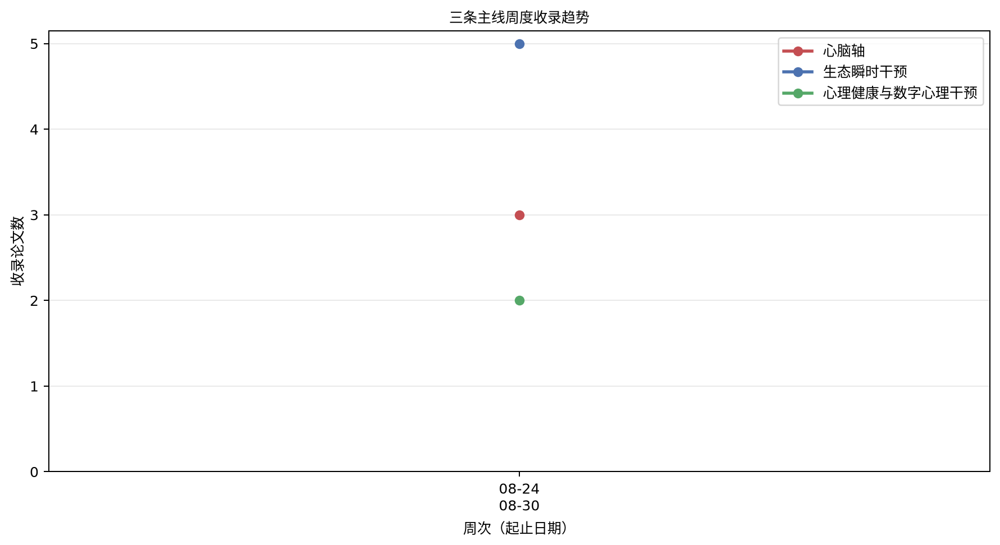

# 心脑、生态瞬时干预与数字心理健康文献周报（2026-08-24 至 2026-08-30）

本期收录 6 篇文献。

## 重点推荐
收录 4 篇文献。

### 1. 多模态脑电图–心率变异性评估个体调节模式：一种面向精准精神病学的扰动范式

- 原文标题：Multimodal EEG–HRV assessment of individual regulatory patterns: a perturbation-based approach toward precision psychiatry
- 作者：Zsoltné Hauber, Sándor György Fekete, Elek Dinya, István Karsai, Gábor Elbert
- 期刊：Frontiers in Psychiatry，JCR Q2，IF 3.2
- 发表时间：2026-08-24
- 主题标签：心脑轴；生态瞬时干预
- 关键词：脑电图；心率变异性；自主神经调节；个体差异；精准精神病学

**摘要**：背景：当代精神病学研究日益强调需要客观、具有生物学基础的标志物，以补充基于症状的诊断框架。尽管脑电图广泛用于探究与注意、唤醒和认知控制相关的神经动态，但这些方法通常以脑为中心，依赖于静态或静息态范式。尽管理论模型强调脑–身体交互，自主神经动态的整合仍然有限。方法：本初步研究采用结合可穿戴脑电图与心率变异性的多模态、基于扰动的范式，考察皮质–自主神经调节动态。十名健康受试者暴露于简短的听觉条件（静默、噪声刺激和双耳节拍听觉输入）。分析额叶上β频段活动及迷走神经介导的心率变异性指标，以刻画受试者在各条件下的个体内调节反应。结果：在皮质和自主神经指标中均观察到条件相关变异，但未检测到显著的组水平效应。反应的方向和幅度呈现出显著的个体间差异。部分受试者中，脑电图与心率变异性指标之间的协调变化提示多模态皮质–自主神经反应模式，而其他受试者则表现出分歧或极小的反应轮廓。十名受试者中有四名观察到额叶上β活动降低与RMSSD升高的协调变化。鉴于本研究的探索性及样本量有限，这些观察应视为初步且具有假说生成意义。结论：这些发现支持多模态、刺激依赖性方法在表征超越静态生物标志物的动态脑–身体反应方面的潜在价值。所观察到的多模态反应配置与协调的皮质–自主神经反应模式一致，并为生成有关脑–身体调节个体差异的假说提供了有用框架。作为探索性初步研究，当前发现需在更大且临床多样化的队列中得到验证，方能得出有关生理亚型或临床应用的结论。该基于扰动的多模态脑电图–心率变异性框架可能通过为表征个体脑–身体反应变异性提供方法论基础，对未来的生理学知情的精准精神病学研究有所贡献。

**原文链接**：[Crossref](https://doi.org/10.3389/fpsyt.2026.1851256)

### 2. 基于瞳孔直径、皮电活动与心率通过自主神经唤醒对情绪视频进行机器学习分类

- 原文标题：Machine learning classification of emotional videos via autonomic arousal based on pupil diameters, electrodermal activity and heart rate.
- 作者：Bruno Laeng, Imac Zambrana, Jie Hou, Ørjan Grøttem Martinsen, Kristiane Holm
- 期刊：International journal of psychophysiology : official journal of the International Organization of Psychophysiology，JCR Q2，IF 2.6
- 发表时间：2026-08-25
- 主题标签：心脑轴；生态瞬时干预
- 关键词：自主神经唤醒；瞳孔直径；机器学习情绪分类；皮电活动

**摘要**：本研究评估了皮电活动、心率变异性与瞳孔直径通过机器学习检测情绪状态的能力，以探究简单的唤醒指标是否能区分复杂情绪标签：愉悦、敬畏、厌恶、养育之爱与悲伤。在实验室环境中，47名参与者在观看10段短视频后立即从五个选项中选出最适切情绪标签。分类仅依赖三种心理生理指标，并应用三种机器学习模型：支持向量机、随机森林与极限梯度提升。特征包括基线校正的平均瞳孔直径与皮电活动峰值。噪声较大的心率变异性数据因信噪比不佳而被剔除。瞳孔直径反映交感去甲肾上腺素能激活及自主神经系统内的交互耦合，可提供稳定的状态估计。在核心情感环状模型中，支持向量机达到峰值准确率，瞳孔直径在所有架构中特征重要性得分最高。结果揭示多对一映射，即离散效价状态产生难以区分的生理特征：高唤醒状态与低唤醒状态被混淆。值得注意的是，敬畏引发瞳孔收缩，与厌恶特征相似。剔除心血管特征显著提升了随机森林与极限梯度提升的性能。这些发现提示，简单唤醒指标，尤其是瞳孔测量，无需复杂时间序列分析即可分类情绪。非侵入式传感器可能有助于开发以客观生理数据校准的敏感计算机系统。

**原文链接**：[PubMed](https://pubmed.ncbi.nlm.nih.gov/42641989/)

### 3. 基于移动即时通讯应用、由治疗伴侣代理实施的针对抑郁症状年轻成人的干预研究：概念验证与准实验研究

- 原文标题：Investigating the mobile messenger app-based intervention delivered by a therapeutic companion agent for young adults with depressive symptoms: A proof-of-concept and quasi-experimental study.
- 作者：Youngjae Yoo, Minuk Kim, Soyoung Kim, Gayeon Lee, Jinwoo Kim
- 期刊：Digital health，JCR Q1，IF 3.3
- 发表时间：2026-08-28
- 主题标签：生态瞬时干预；心理健康与数字心理干预
- 关键词：治疗伴侣代理；生态瞬时评估/干预；抑郁症状；移动即时通讯；概念验证

**摘要**：背景：尽管数字干预对患有抑郁症的年轻成人具有临床潜力，但低参与度仍是持续挑战。对话式治疗伴侣代理（TCA）可通过建立数字治疗联盟来应对这一障碍。目的：本研究旨在开发一个整合行为激活、生态瞬时评估/干预（EMA/EMI）与游戏化的Wizard-of-Oz TCA原型，并评估其对患有抑郁症状的年轻成人的概念验证可行性、可接受性与初步临床疗效。方法：招募58名年龄20至39岁（50.0%女性）的韩国年轻成人，其抑郁症状处于亚临床至中度严重水平（患者健康问卷-9）。干预组（n=29）与TCA互动六周，频率匹配的被动对照组（n=29）维持日常常规。主要结局为可行性（依从性）与可接受性（满意度）。次要疗效结局（贝克抑郁量表-II、广泛性焦虑障碍-7、生活质量享受与满意度问卷-简版）每两周评估一次。结果：58名参与者中57人完成研究。干预被证实可行、可接受且可用，达到69.5%的严格准时EMA依从率、66.2%的行为激活常规完成率、平均每日满意度3.49/5.0分、系统可用性量表（SUS）平均74.02分，均达到预先设定的基准。探索性分析表明，与对照组相比，干预组在抑郁症状减轻与生活质量改善方面有显著更大提升。结论：基于TCA的干预可行且可接受，成功培育了数字治疗联盟。尽管初步临床信号令人鼓舞，仍需未来全效力的随机对照试验以明确确立临床疗效。

**原文链接**：[PubMed](https://pubmed.ncbi.nlm.nih.gov/42662150/)

### 4. 每日心率变异性生物反馈练习对杏仁核结构协变网络的影响

- 原文标题：Effects of daily heart rate variability biofeedback practice on the amygdala's structural covariance network.
- 作者：Kalekirstos Alemu, Hyun Joo Yoo, Kaoru Nashiro, Jungwon Min, Padideh Nasseri, Christine Cho, Paul Choi, Shelby L Bachman, Shai Porat, Shubir Dutt, Julian F Thayer, Mara Mather
- 期刊：International journal of psychophysiology : official journal of the International Organization of Psychophysiology，JCR Q2，IF 2.6
- 发表时间：2026-08-30
- 主题标签：心脑轴；生态瞬时干预
- 关键词：心率变异性生物反馈；神经内脏整合模型；结构性磁共振成像；结构协变；情绪调节；前额叶皮层；杏仁核

**摘要**：神经内脏整合模型认为，杏仁核与前额叶皮层之间的交互作用影响心率变异性（HRV）和情绪调节。新近证据亦提示HRV影响参与情绪调节的脑区。本研究在既往功能性磁共振成像研究基础上，采用结构协变分析考察HRV生物反馈干预对杏仁核与皮层区域结构协变的影响。在生物反馈干预期间考察杏仁核与皮层区域的协变，可揭示HRV调节尝试如何影响参与HRV和情绪调节的神经结构。研究采集151名参与者（100名年轻成人、51名老年成人）基线和干预后MRI扫描数据，参与者完成为期5周的每日生物反馈训练，以增强（Osc+条件）或降低（Osc-条件）HRV。在两个年龄组中，两种干预条件与右侧杏仁核和左侧内侧前额叶皮层之间相反的结构协变模式相关。在Osc+条件下，左侧杏仁核体积变化与右侧眶额皮层体积变化呈负相关，而Osc-条件下未观察到显著关联。上述发现与神经内脏整合模型一致，即前额叶皮层对皮层下结构发挥抑制性影响，且HRV影响参与情绪调节的脑区。

**原文链接**：[PubMed](https://pubmed.ncbi.nlm.nih.gov/42669395/)

## 心脑轴
收录 0 篇文献。

本期无符合条件的文献。

## 生态瞬时干预
收录 1 篇文献。

### 1. 健康研究中的数字表型：方法、缺口与机遇的范围综述

- 原文标题：Digital Phenotyping in Health Research: Scoping Review of Methods, Gaps, and Opportunities.
- 作者：Nolwenn Badier, Alice Lafitte, Audrey Difernand, Gloria A Aguayo, Guy Fagherazzi, Jukka-Pekka Onnela, Benjamin Vittrant, Bastien Lechat, Quentin De Larochelambert, Jean-François Toussaint, Lidia Delrieu
- 期刊：Journal of medical Internet research，JCR Q1，IF 6.0
- 发表时间：2026-08-28
- 主题标签：生态瞬时干预
- 关键词：数字表型；可穿戴设备；纵向数据；方法学综述；健康研究

**摘要**：背景：可穿戴及互联数字设备持续产生大量真实世界的行为、生理和环境数据，为健康监测和个体化照护提供了新机会。数字表型已成为一个有前景的范式，然而在如何分析此类数据方面共识有限。不一致的分析实践和方法学报告不足可能损害结果的可重复性、可比性和有效性。目的：本范围综述考察了健康研究中数字表型的当前分析实践，识别方法学缺口，并强调透明性和标准化方法的必要性。方法：在PubMed、Scopus、Embase和Web of Science中进行文献检索，并以Google Scholar作为补充来源。纳入研究发表于2024年12月31日之前，涉及人类群体，并在纵向健康研究中使用可穿戴数字设备。研究由多名评审者依据预定纳入标准独立筛选。数据提取聚焦于6个方法学领域：样本量确定、变量选择与定义、数据清洗与预处理、数字表型方法、预测建模，以及大规模数据情境下的统计显著性处理。结果：共纳入162项研究。多数研究自2018年起发表（n=144，89%），主要在北美洲开展（n=92，57%）。最常用的设备为活动追踪器（n=81，50%）、智能手机（n=35，22%）、加速度计（n=26，16%）和智能手表（n=24，15%）。最常见的结果为活动水平（n=67，41%）、睡眠（n=65，40%）、步数（n=63，39%）和心率（n=46，28%）。在所有方法学领域均观察到异质性和报告不足。预处理是最常报告的部分（n=88，54%），但缺失数据处理等具体方面仍描述不一致（n=35，22%）。仅30%（n=48）的研究报告了样本量确定方法，27%（n=43）描述了变量选择方法。30%（n=48）的研究识别出数字表型方法且以基于回归的模型为主。17%（n=28）的研究报告了预测建模方法，算法差异大且验证程序报告有限。仅4.3%（n=7）的研究明确讨论了与大规模或高维数据集相关的统计挑战。各健康领域的实践各异，没有领域在所有方法学组成部分中持续展现全面报告。结论：数字表型研究正在快速扩展，但方法学实践仍异质性高且标准化不足。通过提供当前健康研究中可穿戴来源纵向数据处理与分析方式的跨领域概览，本综述强调了分析选择报告与论证中的反复缺口，尤其在样本量确定、预处理、变量定义、预测建模和统计推断方面。这些发现提示需更清晰的分析框架和更一致的报告实践，以提高基于可穿戴数字健康研究的透明性、可重复性和方法学严谨性。

**原文链接**：[PubMed](https://pubmed.ncbi.nlm.nih.gov/42660539/)

## 心理健康与数字心理干预
收录 1 篇文献。

### 1. 与AI驱动的数字心理健康干预Yuna相关的情绪和压力的即时及持续改善：真实世界回顾性研究

- 原文标题：Immediate and Sustained Improvements in Mood and Stress Associated With Yuna, an AI-Powered Digital Mental Health Intervention: Real-World Retrospective Study.
- 作者：Kelsey McAlister, Courtney Jewell, Chad Stecher, Jennifer Huberty
- 期刊：JMIR mHealth and uHealth，JCR Q1，IF 6.2
- 发表时间：2026-08-25
- 主题标签：心理健康与数字心理干预
- 关键词：AI驱动的数字心理健康干预；情绪改善；压力改善；真实世界研究；会话内即时效应

**摘要**：背景：AI驱动的数字心理健康干预是解决传统心理健康护理障碍的一种有前景的方法。然而，其在真实世界中即时和持续获益的证据仍然有限。目的：这项真实世界回顾性研究旨在探索与使用Yuna（一种AI驱动的数字心理健康干预）相关的感知情绪和压力变化模式。具体目标包括描述用户人口统计学和会话特征，量化会话内及持续使用过程中的情绪和压力变化幅度，并识别与会话内情绪和压力变化相关的会话层面因素。方法：成年Yuna用户中启动至少一次会话者被纳入研究。用户在会话前后使用视觉模拟量表自我报告情绪和压力。采用线性混合效应模型探索会话内即时改善以及会话间情绪和压力症状的持续变化。同时使用线性混合效应模型检验会话内改善的预测因素，包括基线症状严重程度、会话时长、使用的独特治疗方法总数、安全护栏激活和性别。结果：共纳入5549名真实世界用户。用户在情绪和压力方面均表现出显著的即时会话内改善，敏感性分析结果一致。会话间分析显示基线和压力的逐步改善。基线症状严重程度是即时会话内变化的最强预测因素，其次是会话时长。使用的独特治疗方法数量较多与两种结局的较小改善相关。结论：使用Yuna与感知的会话内情绪和压力改善相关，并初步提示多次会话后情绪和压力逐步改善。然而，缺乏对照组和潜在选择偏倚排除了因果结论。这些发现为AI驱动的数字心理健康干预作为可及、按需支持工具提供了有前景的真实世界证据。未来需要前瞻性对照设计以确定因果效应并评估所观察改善的可持续性。

**原文链接**：[PubMed](https://pubmed.ncbi.nlm.nih.gov/42641108/)

## 数据分析

- 本周唯一收录：6 篇。
- 三条主线：心脑轴 3 篇；生态瞬时干预 5 篇；心理健康与数字心理干预 2 篇。
- 首个统计周，后续周报将显示与前一周的变化。
- 提示：交叉研究可同时计入多条主线，因此三条主线之和可能高于唯一论文数。

### 热门主题

脑电图（1）；心率变异性（1）；自主神经调节（1）；个体差异（1）；精准精神病学（1）；自主神经唤醒（1）；瞳孔直径（1）；机器学习情绪分类（1）；皮电活动（1）；AI驱动的数字心理健康干预（1）；情绪改善（1）；压力改善（1）

### 关键词云图

### 三主线周度趋势

