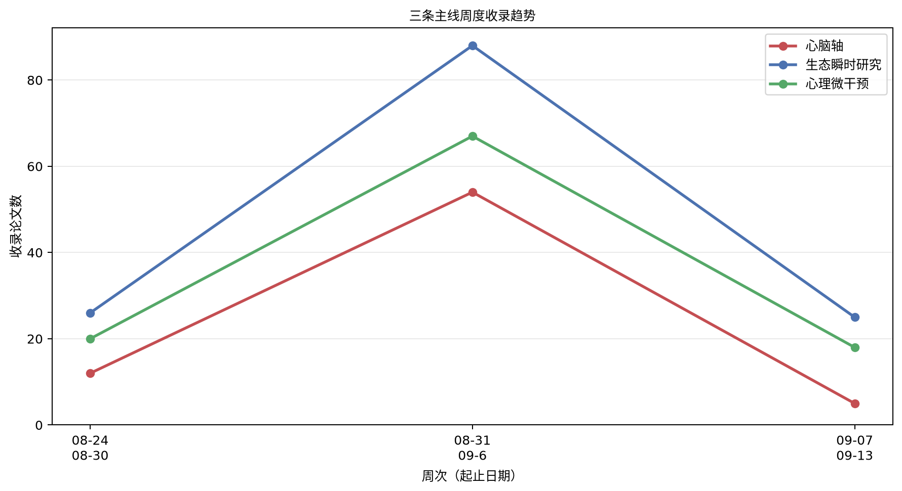

# 心脑、生态瞬时研究与心理微干预文献周报（2026-09-07 至 2026-09-13）

本期收录 41 篇文献。

## 重点推荐
收录 4 篇文献。

### 1. 基于智能手机的工作场所心理健康生态瞬时干预：随机对照试验

- 原文标题：A Smartphone-Based Ecological Momentary Intervention for Workplace Mental Health: Randomized Controlled Trial.
- 作者：Sisi Li, Lik Hang Lincoln Lo, Chiu Yi Charlie Lau, Megan Lam, Meanne Chan
- 期刊：JMIR mHealth and uHealth，JCR Q1，IF 6.3（2025）
- 发表时间：2026-09-08
- 主题标签：生态瞬时研究；心理微干预
- 关键词：生态瞬时干预；工作场所心理健康；随机对照试验

**摘要**：背景：工作相关压力已被广泛认为与多种精神障碍风险增加及心理健康状况不佳有关。快速增长的移动健康服务行业为工作场所心理健康提供了新的机会。目的：本随机对照试验检验了Neurum（Neurum Limited）的有效性，这是一种基于智能手机的干预工具，具有生态瞬时评估和干预功能，旨在真实世界环境中实时减轻工作场所压力。方法：共招募201名在职成年人，接受为期4周的基于智能手机的干预，该干预在Neurum上提供认知行为疗法、正念练习和自我调节练习。采用简单随机化程序。干预组参与者被鼓励记录情绪日记、完成心理健康练习，并在适用时提供用户反馈。主要结局采用抑郁、焦虑和压力量表21项（DASS-21；Cronbach α=0.87）测量。结果：干预组包括102名参与者，对照组包括99名参与者。干预组退出人数（n=21）多于对照组（n=2；χ21=18.259；P<.001）。最终样本包括178名参与者（男性：85/178，47.8%；女性：93/178，52.2%；平均年龄34.65岁，SD 7.67岁）。分析显示，4周干预后，干预组DASS-21得分下降（干预前后平均差[MD]=-14.518），而对照组得分上升（干预前后MD=3.319；F1,176=59.358，P<.001；η2=0.252）。这一效应主要由压力减轻驱动（F1,176=64.679，P<.001；干预组干预前后MD=-6.692，对照组干预前后MD=2.000）。平均而言，参与者完成6.27（SD 9.4）次练习，并提供9.74（SD 18.2）条情绪日记记录，每日参与时长为4.95（SD 6.89）分钟。然而，DASS-21得分变化与练习次数或情绪日记记录数之间的关联未达到统计学显著性。结论：本研究主要证实了Neurum在减轻非机构化在职成年人抑郁、焦虑和压力症状方面的有效性，并具有令人满意的用户留存率。尽管可能存在与健康相关的文化差异，Neurum仍为非临床环境中及时需求和一般可及性提供了循证数字健康证据，可作为传统面对面且高成本心理健康服务的替代方案。未来方向讨论了在线心理健康服务中的个性化方法。

**原文链接**：[PubMed + Crossref](https://doi.org/10.2196/72435)

### 2. 自我反思韧性恢复活动促进训练对急救医疗服务临床医生：一项新型数字干预的随机对照试点试验

- 原文标题：Self-Reflection Resilience-Recovery Activity Promotion Training for Emergency Medical Service Clinicians: A Randomized Controlled Pilot Trial of a Novel Digital Intervention
- 作者：Bryce Hruska, Bernard Appiah, Collins Annor, maria pacella, Marley S. Barduhn
- 期刊：未提供，JCR 待 JCR 数据核验，IF 待 JCR 数据核验
- 发表时间：2026-09-09
- 主题标签：生态瞬时研究；心理微干预
- 关键词：急救医疗服务临床医生；数字干预；生态瞬时评估；心理微干预；随机对照试点试验

**摘要**：急救医疗服务临床医生面临显著的心理健康风险。本随机对照试点试验考察了：1）自我反思韧性恢复活动促进训练（SRR-RAPT）的可行性、可接受性和可采纳性；2）SRR-RAPT对假设作用机制（HMAs：从压力源中获得意义、适应性自我反思、恢复活动、恢复体验）的影响；3）SRR-RAPT对心理健康结局（MHOs：创伤后应激障碍、焦虑、抑郁）的影响。参与者为年龄≥18岁且在未来8天内至少安排1个班次的急救人员。126名工作者中83名符合条件并随机分配至干预组（n=37）或对照组（n=46）。多数为白人（89%）和男性（51%）。两组均完成8次每日评估以监测HMAs/MHOs。干预组参与者额外接受10个关于压力源、经验教训和恢复策略的反思问题。我们在3周内招募了超过80%的应答者；70/83人提交了至少1份完整评估（M=6.07，SD=2.20）；SRR-RAPT被评价为有帮助、有用且可接受。干预组在多次评估中报告了更多的意义获得（b=1.46，95%CI=0.17，2.75，p=.027），且在随后每次评估中水平更高（b=0.35，95%CI=0.16，0.53，p<.001）。更高的依从性预测了多次评估中更多的意义获得（b=1.53，95%CI=0.03，1.02，p=.039）以及随后每次评估中更高的水平（b=0.13，95%CI=0.06，0.20，p<.001）。其他HMAs或MHOs未检测到显著差异。结果支持该干预的可行性和可接受性，但在确定性试验之前需要进行改进以检测所有HMAs/MHOs的预期差异。

**原文链接**：[Crossref](https://doi.org/10.31234/osf.io/qfndj_v2)

### 3. 超越治疗小时：面向持续心理健康的智能人际心理治疗

- 原文标题：Beyond the Therapy Hour: Smart Interpersonal Psychotherapy for Continuous Mental Health Care (Preprint)
- 作者：Srishti Meera Sardana, Jennifer J. Mootz, Myrna Weissman, Sandeep Gopalakrishnan
- 期刊：未提供，JCR 待 JCR 数据核验，IF 待 JCR 数据核验
- 发表时间：2026-09-12
- 主题标签：生态瞬时研究；心理微干预
- 关键词：人际心理治疗；数字表型；即时适应性干预

**摘要**：抑郁症是全球主要致残原因之一，但有效心理治疗的可及性在各类医疗系统中仍然有限。人际心理治疗（IPT）是一种成熟且基于证据的抑郁症及其他精神障碍治疗方法，强调情绪与人际功能之间的双向关系。然而，传统实施模式需要受过训练的治疗师和结构化治疗会谈，限制了其可扩展性与可及性。数字心理健康技术为扩大治疗覆盖提供了有前景的机会，但许多现有工具缺乏对成熟循证干预框架的依托，且长期参与度有限。本文为概念性论文，提出智能人际心理治疗（S-IPT），这是IPT的一种数字增强改编版本，旨在通过移动感知、数字表型和适应性行为干预，将传统面对面治疗延伸至治疗会谈之外。S-IPT保留了IPT的核心理论结构，包括四个人际问题领域，同时整合了能够监测社会参与行为指标的移动健康技术进展。通过将人际机制转化为数字支持的干预，并将这些干预映射到四个IPT问题领域，S-IPT旨在真实世界情境中强化治疗性洞察，并在临床接触之间支持关系功能。我们考察数字行为信号、对话界面和即时适应性干预如何支持IPT的核心机制，同时保持对治疗模型的忠实性。文中还讨论了伦理考量，包括治疗联盟的维持和自杀风险管理。最后，我们提出了必要的临床研究议程，以评估数字增强IPT在真实世界心理健康系统中的有效性和实施情况。

**原文链接**：[Crossref](https://doi.org/10.2196/preprints.111889)

### 4. 解锁行动与幸福感：即时适应性运动提示如何通过减少久坐时间和提升行为一致性来塑造幸福感

- 原文标题：Unlocking action and well-being: how just-in-time adaptive exercise prompts shape happiness through reduced sedentary time and greater behavioral consistency
- 作者：Chao Wang, Xiaocen Hao, Javad Khodadadi Sangdeh
- 期刊：Journal of Health, Population and Nutrition，JCR Q1，IF 3.7（2025）
- 发表时间：2026-09-13
- 主题标签：生态瞬时研究；心理微干预
- 关键词：即时适应性干预；微随机试验；久坐行为；行为一致性；主观幸福感

**摘要**：本研究考察了基于规则的即时适应性运动干预是否通过减少久坐时间和提升日常运动中的行为一致性来改善主观幸福感。研究采用微随机试验设计，纳入160名成年女性，在7天基线导入期后接受为期8周的智能手机干预。在符合条件的决策点，参与者被随机分配接受适应性运动提示或不接受提示。通过蓝牙腕戴式追踪器采集设备来源的运动数据，并使用生活满意度量表和WHO-5幸福感指数量表评估主观幸福感。多层混合效应模型显示，提示显著增加了随机化后30分钟的步数以及打破久坐行为的可能性。增长模型表明，在整个干预期间，每日步数和研究特定的行为一致性指数均有所增加，每日久坐时间有所减少。重复测量分析显示，从基线到后测，生活满意度、心理幸福感和运动自我效能均有改善，且这些增益在随访时基本得以维持。间接效应模型与以下可能性一致：减少久坐时间和提升行为一致性部分解释了提示暴露与后测幸福感之间的关联；然而，这些中介发现依赖于时间顺序和无未测量混杂的假设。研究结果支持精心定时的、基于规则的数字提示的潜力，并强调需要对设备和指数进行独立验证。

**原文链接**：[Crossref](https://doi.org/10.1186/s41043-026-01433-4)

## 心脑轴
收录 5 篇文献。

### 1. 使用心理测量指标与心率变异性预测纵向创伤后应激障碍症状：一种机器学习方法

- 原文标题：Predicting longitudinal post-traumatic stress disorder symptoms using psychological measures and heart rate variability: a machine-learning approach.
- 作者：Mariana Xavier, Izabela Mocaiber, Orlando Fernandes, Liana Catarina Lima Portugal, Arthur Viana Machado, Eliane Volchan, William Berger, Débora Christina Muchaluat-Saade, Isabel Antunes David, Raquel Menezes Gonçalves, Camila Monteiro Fabricio Gama, Rita De Cássia Soares Alves, Letícia Oliveira, Mirtes Garcia Pereira
- 期刊：European journal of psychotraumatology，JCR Q1，IF 4.2（2025）
- 发表时间：2026-09-07
- 主题标签：心脑轴
- 关键词：创伤后应激障碍；心率变异性；机器学习

**摘要**：背景：创伤后应激障碍（PTSD）是一种由众多生物心理社会风险与保护因素塑造的多因素疾病。机器学习方法为建模这些复杂且相互作用的症状表达影响因素提供了强大工具，但许多现有方法依赖的数据难以大规模应用。目的：本研究将可及的心理测量指标与心率变异性（HRV）相结合，以建模非临床样本中经历创伤个体与PTSD症状相关的脆弱性与韧性因素。重要的是，纵向随访补充了横断面设计，使我们能够检验早期心理与生理标记是否预测后续PTSD症状。方法：采用稀疏多核学习（MKL）方法实现回归模型，可在构念层面（如心理测量与HRV指标）和单个条目层面估计预测因子的相对贡献。样本包括176名本科生，完成了评估强直静止、乐观、正负性情绪、应对策略和童年虐待的心理测量量表。暴露于负性刺激期间的HRV作为自主神经预测因子纳入。PTSD症状严重程度（PCL-5）在横断面（T1）和18个月后（T2）进行评估。结果：MKL成功预测了两个时间点的PTSD症状严重程度。在横断面和纵向模型中，负性情绪在T1和T2均被一致识别为最具影响力的预测因子。其他相关预测因子包括强直静止、童年虐待和应对策略。结论：这些发现强调了结合易于测量的预测因子以增强PTSD风险早期识别并指导更个性化预防与干预策略开发的潜力。

**原文链接**：[PubMed](https://doi.org/10.1080/20008066.2026.2715185)

### 2. 在睡眠中重新激活放松练习以影响频繁噩梦者的皮层高唤醒

- 原文标题：Reactivating a Relaxation Exercise During Sleep to Influence Cortical Hyperarousal in Individuals With Frequent Nightmares.
- 作者：C Sayk, A Probst, F Lange, S Eickemeier, J Amores, H-V Ngo, M Ehsanifard, K Junghanns, I Wilhelm
- 期刊：Journal of sleep research，JCR Q1，IF 4.6（2025）
- 发表时间：2026-09-09
- 主题标签：心脑轴；心理微干预
- 关键词：噩梦；皮层高唤醒；放松练习；睡眠；EEG

**摘要**：睡眠期间的高频EEG活动反映皮层高唤醒，近来已被纳入噩梦的病因学模型。然而，由于在睡眠中操纵高唤醒的实验方法有限，其确切作用仍未得到充分理解。在本研究中，我们考察了在睡眠期间重新呈现与放松相关的气味线索以重新激活先前练习过的深呼吸放松练习，是否能降低以beta（16.25-31 Hz）和gamma（31.25-45 Hz）活动为指标的皮层高唤醒，并进而减少噩梦症状。二十五名每周至少经历一次噩梦的参与者（21名女性，平均年龄（SD）=23.12（3.70）岁）完成了为期一周的深呼吸放松训练，并配对一种气味线索。在随机、盲法、交叉设计中，在两个实验室夜晚分别呈现与放松相关的气味或对照气味。基于气味的重新激活未影响beta或gamma功率，但意外地与纺锤波数量和密度显著降低相关。重新激活夜晚的纺锤波数量与主观入睡后觉醒呈正相关。噩梦症状未受影响。这些发现表明，气味线索重新激活放松练习并未调节皮层高唤醒或噩梦症状，尽管改变了纺锤波活动。该纺锤波效应的功能意义仍有待确定。未来研究应采用更长的重新激活时段和针对皮层高唤醒的替代干预，以进一步阐明其在噩梦病因学中的因果作用以及基于睡眠的干预的治疗潜力。

**原文链接**：[PubMed](https://doi.org/10.1111/jsr.70443)

### 3. 边缘型人格障碍中的选择性内感受损伤及治疗效果

- 原文标题：Selective interoception impairments and treatment effects in borderline personality disorder.
- 作者：Jella Voelter, Danilo Postin, Christina Müller, Mandy Roheger, André Schulz, Robin Bekrater-Bodmann, René Hurlemann, Dirk Scheele
- 期刊：Translational psychiatry，JCR Q1，IF 7.5（2025）
- 发表时间：2026-09-10
- 主题标签：心脑轴；心理微干预
- 关键词：边缘型人格障碍；内感受；辩证行为治疗

**摘要**：边缘型人格障碍患者存在严重的情绪失调以及身体意象和自我感知的紊乱。内感受，即对内部身体信号的处理和感知，与情绪加工密切相关，但边缘型人格障碍是否损害特定内感受成分以及这些缺陷如何随治疗变化仍不清楚。本研究采用自我报告和客观测量，在为期四周的住院辩证行为治疗前（边缘型人格障碍患者55例，健康对照31例）和治疗后（边缘型人格障碍患者37例，健康对照31例）或等待间隔后，考察边缘型人格障碍患者和健康对照的两种关键内感受成分：准确性和注意。内感受准确性及其元认知觉察通过心跳辨别任务评估，内感受注意则通过问卷、强度评分以及功能性磁共振成像内感受注意任务中的单变量和多变量神经反应测量。辩证行为治疗前，边缘型人格障碍患者自我报告的内感受注意降低，且与更多人际问题相关。患者还表现出岛叶和背侧前扣带皮层中由心脏内感受和外部感受注意所诱发的活动模式相似性更高。在行为或自我报告的内感受准确性或元认知觉察方面未发现显著组间差异。然而，症状更严重的边缘型人格障碍患者行为内感受准确性受损。经过四周住院辩证行为治疗后，自我报告的内感受注意显著改善，而其他内感受成分未见显著变化。研究结果表明，边缘型人格障碍涉及选择性内感受注意紊乱，且仅自我报告测量对治疗有反应。这些结果支持对内感受进行多维度评估，并提示内感受注意训练对所有边缘型人格障碍患者可能有益，而对症状更严重者还需额外的准确性训练。

**原文链接**：[PubMed](https://doi.org/10.1038/s41398-026-04414-7)

### 4. 对心率变异性作为创伤后应激障碍预测指标的批判性再评估：一项叙述性综述

- 原文标题：Critical re-evaluation of heart rate variability as a predictor of posttraumatic stress disorder: a narrative review.
- 作者：J Patrick Neary, R Nicholas Carleton, Przemyslaw Guzik
- 期刊：Neuroscience，JCR Q2，IF 3.3（2025）
- 发表时间：2026-07-07
- 主题标签：心脑轴
- 关键词：心率变异性；创伤后应激障碍；自主神经系统

**摘要**：创伤后应激障碍（PTSD）与经历潜在心理创伤事件后心率变异性（HRV）的改变有关。长期以来，HRV被广泛认为反映自主神经系统（ANS）及其对心脏的调节影响；然而，近期证据并不支持这一关联。本叙述性综述评估了当前关于HRV与PTSD及其他创伤后应激损伤（PTSI）关系的文献，仅聚焦于实证观察到的HRV指标变化，而不依赖未经证实的生理解释。本综述揭示了显著的方法学异质性、不一致的测量方法以及建立因果关系所需的纵向数据的缺乏。结果表明，尽管PTSD个体的HRV相较于对照组有所改变，但这些差异较小、多变且依赖情境。测量信度和解释效度方面的重大局限，使得目前无法推荐将HRV作为评估PTSI的独立临床或筛查工具。此外，HRV结果应作为生理信号的直接测量来讨论，而非作为理论性的ANS构念。

**原文链接**：[PubMed](https://doi.org/10.1016/j.neuroscience.2026.07.003)

### 5. 未知复杂系统中的多变量随机耦合：确定性脑-体通信中的信息性随机性

- 原文标题：Multivariate stochastic coupling in unknown complex systems: Informative randomness in deterministic brain-body communication
- 作者：Andrea Scarciglia, Vincenzo Catrambone, Claudio Bonanno, Gaetano Valenza
- 期刊：Physical Review E，JCR Q1，IF 2.5（2025）
- 发表时间：2026-09-11
- 主题标签：心脑轴
- 关键词：脑-心交互；随机耦合；多变量近似熵

**摘要**：生理系统表现出受动态随机性影响的确定性行为，其中信息性随机成分在复杂系统交互中起关键作用。当底层确定性动力学未知时，全面刻画多变量随机成分具有挑战性。我们提出一个用于估计受动态噪声影响的未知确定性系统中随机耦合的框架。该框架基于多变量近似熵（MApEn）的多变量扩展，利用该指标在存在动态噪声时的发散特性。在建立方法的理论基础与有效性（可容纳任意多变量噪声概率分布）之后，我们证明在双变量白高斯噪声情形下，该框架能够在无需底层确定性函数先验知识的情况下对噪声协方差矩阵进行闭式估计。为此，我们引入一种迭代算法来估计协方差矩阵系数。该算法识别出沿目标曲线对多变量MApEn的差异行为进行重缩放的参数值。我们使用合成数据集和真实生理记录验证了该框架。分析揭示了对脑-心交互的重要洞见，特别是通过低频振荡活动对随机耦合在睡眠阶段转换中的调制。我们的结果表明，有意识清醒状态以更强的随机耦合为特征，这种耦合在向睡眠转换过程中逐渐减弱。该框架为研究随机生理动力学及其相关网络开辟了新途径，并具有跨广泛科学学科的潜在应用。

**原文链接**：[Crossref](https://doi.org/10.1103/5n8x-155p)

## 生态瞬时研究
收录 21 篇文献。

### 1. 体育相关专业大学生的日常学业与运动负荷及心理健康相关状态：一项14天生态瞬时评估网络研究

- 原文标题：Daily academic and sport-related strain and mental-health-related states among university students in sport-related majors: a 14-day ecological momentary assessment network study
- 作者：Aozhou Wang, Can Ao, Nongqin Guan, Cong Ma
- 期刊：Frontiers in Psychology，JCR Q1，IF 3.8（2025）
- 发表时间：2026-09-07
- 主题标签：生态瞬时研究
- 关键词：生态瞬时评估；多层向量自回归；网络分析；大学生；睡眠

**摘要**：本研究针对体育相关专业大学生，探讨其学业要求与日常训练或比赛并行的短期状态组织。采用14天生态瞬时评估设计，每天进行三次智能手机评估，并使用多层向量自回归建模。初始招募来自中国重庆某高校的72名学生，排除重复在指定EMA窗口外作答的5人及协议或作答质量不合格的7人后，保留60名学生的分析样本，共2520个观测值。研究对八个简短的状态指标建模：疲劳、酸痛或躯体疼痛、学业压力、表现担忧、抑郁情绪、紧张焦虑易怒、反刍和注意力困难。修订后的主要时间模型采用群体水平固定滞后斜率，未出现奇异或收敛问题。酸痛和疲劳具有最大的时间外向强度，而紧张焦虑易怒指标具有最大的时间内向强度。在同期网络中，紧张焦虑易怒和反刍的预期影响与桥接中心性估计最高。参与者水平自助法和个案剔除分析显示保留样本内中心性稳定性较高，但人际边估计精度明显较低。敏感性分析表明，广泛的外向和同期结构对训练、学业和一天中时段等测量情境相对稳健，而若干内向时间关系，尤其涉及学业压力的关系，对情境敏感。在调整参与者平均睡眠、前一晚同一结果值、研究日和参与者水平聚类后，比平时更差的睡眠仍前瞻性关联于次日早晨全部八个状态指标的更高水平。这些发现描述了该单一大学样本中所测特定瞬时指标之间的条件关联，未建立因果路径、全面的双重职业功能或干预靶点。

**原文链接**：[Crossref](https://doi.org/10.3389/fpsyg.2026.1889946)

### 2. 可穿戴传感器为围产期情绪障碍表型分型提供机遇：一篇叙述性综述

- 原文标题：Wearable Sensors Offer Opportunities for Phenotyping Perinatal Mood Disorders: a Narrative Review
- 作者：Olimpia Carrioli, Lauryn Keeler Bruce, Saara M Kriplani, Tamar Schaap, Caden Stewart, Benjamin L Smarr
- 期刊：Reproduction，JCR Q2，IF 3.4（2025）
- 发表时间：2026-09-07
- 主题标签：生态瞬时研究
- 关键词：可穿戴传感器；围产期情绪障碍；生态瞬时评估

**摘要**：妊娠期和产后时期已知会引发睡眠、昼夜节律和激素动态的变化。这些相同的生物学轴也与一般人群中的焦虑和抑郁有关。鉴于围产期心理健康的高负担以及母亲福祉对母婴双方的严重后果，区分最具风险者的研究是优先事项。为何有些妊娠经历这些变化却不引发情绪障碍，而许多却会，目前尚不清楚，但这提示必然存在多种类型的紊乱，其中一些与更高的风险相关。当前的照护标准依赖于在预定就诊前后收集的周期性、且往往为自我报告的评估，这可能限制早期发现和及时干预的机会。我们综述了可穿戴技术能够补充金标准的证据，即通过在个体层面提供对睡眠、昼夜节律和激素动态的连续、高分辨率、个性化生态监测。这些丰富的数据，结合适当的数据科学和机器学习技术，能够实现妊娠的早期分型，以支持更早的诊断和干预，并具有个性化洞察、定制治疗和更快康复的潜力。

**原文链接**：[Crossref](https://doi.org/10.1093/reprod/xaag115)

### 3. 基于行为与生理被动传感器的机器学习模型对精神分裂症复发预测的差异化预测性能：系统综述与元分析

- 原文标题：Differential predictive performance of machine learning models for schizophrenia relapse prediction using behavioral versus physiological passive sensors: A systematic review and meta-analysis.
- 作者：Meesala Krishna Murthy
- 期刊：Asian journal of psychiatry，JCR Q1，IF 4.9（2025）
- 发表时间：2026-09-08
- 主题标签：生态瞬时研究
- 关键词：被动感知；精神分裂症复发预测；生态瞬时评估

**摘要**：在全球范围内，1%的人口会罹患精神分裂症，且其中超过80%的患者即使接受最佳治疗仍会复发。复发预后十分重要且需要早期识别；然而，临床上并未常规开展此类工作，传统临床监测也无法反映症状的实时变化。智能手机和可穿戴设备中被动感知技术的孵化，使得对复发风险的行为与生理标志物进行连续、客观监测成为可能。本系统综述与元分析旨在评估行为传感器、生理传感器及多模态方法对精神分裂症谱系障碍患者复发预测的预测效度。依据PRISMA 2020指南，检索了PubMed、Google Scholar、Scopus、IEEE Xplore、ArXiv和PsycInfo数据库（2015—2025年）。同时对关键研究进行了后向和前向引文检索，以补充检索策略。在741条记录中，纳入55项研究，其中50项纳入元分析。行为传感器、生理传感器和多模态系统的合并AUC分别为0.720、0.729和0.806，多模态系统表现最佳。在当前研究集中，总体而言，深度学习模型优于经典机器学习方法（AUC 0.789 vs. 0.719），且较大规模研究比较小规模研究显示出更高的预测准确性。通过偏倚风险评估的方法学质量总体较高。总体而言，多模态被动感知显示出最佳的预测准确性，可能有助于临床环境中对复发的连续监测。

**原文链接**：[PubMed](https://doi.org/10.1016/j.ajp.2026.105153)

### 4. 基于智能手机的数字表型分析用于视物正常者的非24小时睡眠-觉醒障碍：一项258天连续昼夜节律监测研究

- 原文标题：Smartphone-based digital phenotyping of sighted non-24-h sleep-wake disorder: A 258-d continuous circadian monitoring study.
- 作者：Tien-Yu Chen, Tsung-Hua Lu, Hsiang-Chih Chang, Yu-Hsuan Lin
- 期刊：Chronobiology international，JCR Q2，IF 2.5（2025）
- 发表时间：2026-09-08
- 主题标签：生态瞬时研究
- 关键词：数字表型分析；生态瞬时评估；昼夜节律监测；非24小时睡眠-觉醒障碍；智能手机被动感知

**摘要**：在视物正常者中诊断非24小时睡眠-觉醒障碍（N24SWD）仍然困难，因为需要对昼夜节律进行长期、高分辨率的监测。虽然活动记录仪和暗光褪黑素起始时间（DLMO）被视为金标准，但其长期使用往往不切实际且依从性负担重。我们呈现了一项为期258天的连续评估，采用基于智能手机的数字表型分析，通过app-count算法和Tudor-Locke规则，从被动智能手机交互数据中无干扰地推断睡眠-觉醒模式。具体而言，Rhythm应用被动记录带时间戳的人-智能手机交互事件——屏幕开/关、通知以及正在使用的应用程序——而非加速度计数据，并将其聚合为不重叠的5分钟时段，根据交互的有无判定为睡眠或清醒。结果与109天的活动记录仪和7天的动态DLMO采样进行验证，显示出高度一致性。由于该指标反映的是人-智能手机交互而非第二路加速度计信号，智能手机（25.16小时）与活动记录仪（25.11小时）几乎相同的昼夜节律周期表明，基于交互的表型分析能够独立恢复长期自由运行周期。基于智能手机的追踪为N24SWD的长期昼夜节律监测提供了一种实用、低负担的替代方案。

**原文链接**：[PubMed](https://doi.org/10.1080/07420528.2026.2712429)

### 5. 癌症患者对生态瞬时评估的依从性：系统综述与元分析

- 原文标题：Compliance With Ecological Momentary Assessment Among Patients With Cancer: Systematic Review and Meta-Analysis.
- 作者：Guiyuan Ma, Cai Deng, Zitong Zhang, Qiming Ding, Can Gu
- 期刊：Journal of medical Internet research，JCR Q1，IF 8.2（2025）
- 发表时间：2026-09-08
- 主题标签：生态瞬时研究
- 关键词：生态瞬时评估；依从性；癌症患者

**摘要**：背景：癌症患者在疾病管理过程中常经历心理状态的显著波动。传统研究工具难以实时捕捉这些动态变化，限制了临床医生对患者真实状况的理解。生态瞬时评估（EMA）能够进行高频、实时的数据采集，提供具有更高生态效度的患者报告数据。然而，EMA研究的有效性关键取决于患者依从性，而已报告的依从率差异很大，缺乏系统的定量综合。目的：本研究旨在系统综述并定量分析癌症患者对EMA的依从性，并检验EMA设计特征是否与依从性相关。方法：检索Web of Science、PubMed、Embase、Cochrane Library、CINAHL、PsycINFO、CNKI和万方数据库中截至2026年4月30日发表的文献。依从性定义为已完成提示数除以已发送提示数。采用logit转换和随机效应模型（Hartung-Knapp-Sidik-Jonkman校正）合并单组比例。计算预测区间以描述未来可比情境下依从性的预期分布。进行亚组分析、单变量元回归、留一法敏感性分析及小样本效应检验。使用乔安娜布里格斯研究所患病率数据研究报告批判性评估清单评估偏倚风险，使用改良的EMA研究报告清单评估方法学报告质量，并使用推荐分级的评估、制定与评价方法评估证据确定性。结果：共纳入23项研究，涉及13565名参与者。合并依从率为78.55%（95% CI 73.48%-82.87%），预测区间为48.59%-93.41%。亚组分析未发现研究特征之间存在稳健差异。尽管研究时长显示出统计学显著的亚组检验结果，但在排除单一类别后结果不稳定。元回归分析同样未发现研究时长、每日提示数、每次提示条目数或评估窗口之间存在显著线性关联。留一法分析显示没有单项研究驱动合并估计值。关于偏倚风险，2项研究被判定为低风险，21项为中等风险。质量评分范围为6.5至9.0，合并依从率的证据确定性根据推荐分级的评估、制定与评价方法被评为极低。结论：癌症患者对EMA的总体依从性为中等至较高，提示在肿瘤学研究环境中重复的真实世界评估可能是可行的。然而，极高的异质性、较宽的预测区间和极低的证据确定性表明依从性依赖于具体情境。因此，合并估计值应被解释为近似基准，而非普遍预期率。未来的肿瘤学EMA研究应使用标准化的依从性分母，透明报告缺失提示，并前瞻性评估以患者为中心的设计策略，以在保持数据质量的同时减轻负担。

**原文链接**：[PubMed + Crossref](https://doi.org/10.2196/87506)

### 6. 健康研究中密集纵向数据收集方法：选择测量指标与设计采样方案教程

- 原文标题：Intensive Longitudinal Data Collection Methods in Health Research: Tutorial for Selecting Measures and Designing a Sampling Protocol.
- 作者：Jimikaye Courtney, Genevieve Dunton
- 期刊：JMIR mHealth and uHealth，JCR Q1，IF 6.3（2025）
- 发表时间：2026-09-08
- 主题标签：生态瞬时研究
- 关键词：密集纵向数据；生态瞬时评估；即时适应性干预

**摘要**：密集纵向数据（ILD）包括在急性时间尺度（如每秒、每小时或每天）内采集的频繁且密集的重复测量，用于研究个体内过程在日内及跨日的变化。ILD通过可穿戴传感器数据、生态瞬时评估或每日日记进行采集，能够在生态效度条件下提供对个体内过程的独特洞察，有助于加深对变量间时间关系和潜在因果过程的理解，同时为即时适应性干预的开发提供信息。移动与传感器技术的进步推动了ILD研究的激增，其发展速度已超出ILD研究设计的正式培训供给。在设计ILD研究时，研究者需对测量的频率（即多久一次）和时间安排（即何时）做出审慎决策。关于测量频率和时间安排的决策受到个体与构念间变异性、评估目的、回忆偏差顾虑、显著性、缺失信息以及参与者需求等因素的影响。研究结果的解释、因果推断以及ILD的预测价值也受到评估时间安排、测量间时间滞后、“一天”如何定义以及数据聚合选择等相关决策的影响。由于对ILD研究的兴趣和采用日益增加，而正式培训不足，研究者可从关于如何设计ILD研究的指导中获益。因此，本文旨在通过逐步决策教程，结合考察在急性时间尺度上变化的现象（如身体活动和酒精使用）的应用健康行为研究实例，为研究者规划ILD研究提供实用指导。

**原文链接**：[PubMed + Crossref](https://doi.org/10.2196/81290)

### 7. 屏幕上的理想与屏幕外的煎熬：一项关于大学生短视频媒体使用与进食障碍症状双向关联的每日日记研究

- 原文标题：On-screen ideals and off-screen ordeals: a daily diary study of the bidirectional links between short-video media use and eating disorder symptoms in college students.
- 作者：Honglei Gu, Yuhang Hu, Yiran Jia, Yufang Cheng, Jie Fang
- 期刊：Eating disorders，JCR Q1，IF 3.5（2025）
- 发表时间：2026-09-09
- 主题标签：生态瞬时研究
- 关键词：短视频媒体使用；进食障碍症状；每日日记；消极情绪；密集纵向设计

**摘要**：随着短视频平台的迅速普及，人们对其心理健康影响的担忧日益加剧，尤其是对进食障碍的影响。然而，关于短视频媒体使用与进食障碍症状之间的双向关联，以及这些关联背后的情绪机制，目前仍知之甚少。本研究采用密集纵向设计，连续21天收集了200名中国大学生的每日数据。研究运用多层结构方程模型，考察短视频媒体使用与进食障碍症状之间的相互预测关系，以及消极情绪在个体内和个体间两个层面上的中介作用。在个体内层面，短视频媒体使用与进食障碍症状呈现相互强化的关系，消极情绪在其中起中介作用。在个体间层面，两个构念通过消极情绪间接相互预测，但直接效应不显著。这些发现表明短视频媒体使用与进食障碍症状之间可能存在自我强化循环，凸显了消极情绪的重要中介作用，并展示了21天每日日记设计在捕捉这些构念之间双向关联方面的方法学价值，对促进大学生情绪调节和更健康的数字参与具有实践意义。

**原文链接**：[PubMed](https://doi.org/10.1080/10640266.2026.2731469)

### 8. PM2.5、绿地、身体活动与压力之间的时空关联：一项香港的地理生态瞬时评估研究

- 原文标题：Spatiotemporal associations between PM2.5, greenspace, physical activity, and stress: a geographic ecological momentary assessment study in Hong Kong.
- 作者：Zhenchuan Yang, Mei-Po Kwan, Yan Zhang
- 期刊：Environmental research，JCR Q1，IF 8.2（2025）
- 发表时间：2026-09-09
- 主题标签：生态瞬时研究
- 关键词：地理生态瞬时评估；感知压力；身体活动

**摘要**：城市环境健康研究常使用基于居住地的静态暴露评估，忽视了流动性、累积暴露和活动—出行情境如何塑造环境感知、行为与心理健康。本研究考察了香港PM2.5、视线水平绿地、身体活动、环境感知与感知压力之间随时间与情境变化的关联。研究对800名成年人进行了为期两天的地理生态瞬时评估（GEMA），整合了170万条PM2.5测量数据、210万条加速度计记录、4800次GEMA评估，以及来自430万张街景图像的视线水平绿地数据。暴露与身体活动按5至600分钟时间窗汇总，并在八种情境下采用有向无环图引导的多关系双重机器学习（DAG-MR-DML）框架进行分析。关联在不同情境和暴露窗口间差异显著。较高的PM2.5总体与更多低强度身体活动相关，但与更少中高强度身体活动相关，而情境特异性关联在方向上有所不同。客观绿地在总体上与身体活动关联有限，且与更高压力相关，但在混合活动和主动出行期间与更低压力相关。相比之下，更好的感知绿地在特定情境中与更多身体活动和更低压力相关。客观绿地在总体上与更好的感知绿地无关，并呈现相反的情境特异性估计。较高的PM2.5与更差的感知空气质量相关，而感知空气污染与更高压力相关，但与身体活动无关。累积PM2.5和身体活动总体上与压力无持续关联，尽管情境特异性关联从有益到不利不等。这些发现表明，流动性情境和累积窗口显著影响环境—健康关联，凸显了情境感知型城市健康干预的必要性。

**原文链接**：[PubMed](https://doi.org/10.1016/j.envres.2026.125659)

### 9. 数据笔记：当下心境，双胞胎早期发展研究中关于抑郁与心理健康的生态瞬时评估

- 原文标题：[Data Note] Mood in the Moment, an Ecological Momentary Assessment of Depression and Mental Health within the Twins Early Development Study (TEDS)
- 作者：Sarah Moody, Adele Taylor, Celestine Lockhart, Rachel Ogden, Ray Leal, Andrew McMillan, Thalia C. Eley, Alex Siu Fung Kwong
- 期刊：Wellcome Open Research，JCR 待 JCR 数据核验，IF 待 JCR 数据核验
- 发表时间：2026-09-09
- 主题标签：生态瞬时研究
- 关键词：生态瞬时评估；抑郁；纵向队列；心理健康；数据笔记

**摘要**：抑郁通常起病于青春期，个体在生命后期常经历反复发作，因此识别影响抑郁轨迹的机制、风险与保护因素至关重要。纵向队列研究考察关键特征以理解全生命周期的抑郁发展，而生态瞬时评估（EMA）则捕捉心理健康如何随时刻变化。本数据笔记描述了一个为期六周的EMA研究数据集，参与者为从双胞胎早期发展研究（TEDS）这一纵向队列中招募的430人（n=338为女性；平均年龄29.5岁；93人当前有心理健康诊断），包括每日三次调查和四份问卷（每位参与者共130个数据点）。参与者按抑郁轨迹分组，并重复测量抑郁（PHQ-8/9/SMFQ）、焦虑（GAD-2/7）、自尊（RSE）、认知思维风格（CSQ）、心理韧性（BRS）、社交性、位置、日常活动、饮食、运动、物质使用、睡眠、心理健康治疗、近期生活事件、疼痛以及生殖与月经因素。参与者完成了84%的调查（n=45461）和94%的问卷（n=1616）。在不同轨迹间发现均值差异，最显著的是青少年持续性轨迹与稳定低轨迹之间，包括SMFQ（M=13.49，SD=5.81 对 M=3.59，SD=3.45）、GAD-7（M=10.68，SD=4.72 对 M=4.55，SD=3.51）以及每日焦虑和抑郁症状（PHQ-9：M=350.61，SD=196.74 对 M=107.14，SD=121.65；GAD-2：M=79.58，SD=60.44 对 M=23.5，SD=38.60）。为便于未来研究者独立使用该数据集，未剔除任何离群值。未对缺失数据进行插补；数据解读应谨慎。尽管如此，在纵向队列中收集EMA数据是一种新颖方法，为理解心理健康的长期发展与时刻影响提供了许多令人兴奋的机会。

**原文链接**：[Crossref](https://doi.org/10.12688/wellcomeopenres.27585.1)

### 10. iOS快捷指令作为免费无代码工具用于事件触发式经验采样

- 原文标题：iOS Shortcuts as a Free, No-Code Tool for Event-Triggered Experience Sampling
- 作者：Douglas A. Parry, Tilo Hartmann
- 期刊：未提供，JCR 待 JCR 数据核验，IF 待 JCR 数据核验
- 发表时间：2026-09-09
- 主题标签：生态瞬时研究
- 关键词：经验采样；事件触发；iOS快捷指令

**摘要**：事件触发式经验采样在特定行为或情境发生时即时推送情境调查。该方法对于捕捉低频或情境依赖的体验具有重要价值，但通常需要定制或昂贵的软件。本文介绍iOS快捷指令这一预装自动化功能如何为iPhone上的事件触发式调查提供免费、无代码的替代方案。借助触发—动作编程，研究者可以配置自动化流程，在指定事件发生时启动带有嵌入情境参数的调查链接。我们描述了操作步骤，概述了触发器、动作与嵌入变量的工作流程，并通过实例和模板展示了该方法。

**原文链接**：[Crossref](https://doi.org/10.31234/osf.io/de5ra_v1)

### 11. 情绪与媒体：利用被动感知与生态瞬时评估考察青少年不同智能手机媒体使用与抑郁情绪的日常双向关联

- 原文标题：Mood and Media: Leveraging Passive Sensing and EMA to Assess Daily, Bidirectional Associations of Different Smartphone-Based Media Use and Depressed Mood in Adolescents
- 作者：Bianca Caproni, Melissa J. Dreier, Jennifer Fedor, Carissa A. Low, Jessica L. Hamilton
- 期刊：Journal of Technology in Behavioral Science，JCR 待 JCR 数据核验，IF 待 JCR 数据核验
- 发表时间：2026-09-09
- 主题标签：生态瞬时研究
- 关键词：被动感知；生态瞬时评估；抑郁情绪；青少年；媒体使用

**摘要**：当前研究对于屏幕时间对青少年心理健康是有益、有害还是无影响存在广泛分歧。本研究考察社交媒体使用是否与抑郁情绪相关，以及抑郁情绪是否与青少年的社交媒体使用相关，并与其他媒体使用进行对比。参与者（N=19；13至18岁；68.4%男性，79%白人）在新冠疫情期间允许一款应用程序（AWARE）被动监测安卓手机使用情况，并在30天内每天两次回答关于情绪和社交媒体使用的调查。研究分析了日常数字媒体使用与抑郁情绪的双向多层模型。在同日水平上，较低水平的抑郁情绪与更多社交游戏时间相关（β=-0.08，p=0.04），反之亦然（β=-0.07，p=0.04），也与更多查看社交游戏应用相关（β=-0.10，p=0.03），反之亦然（β=-0.12，p=0.03）。较高水平的抑郁情绪与更多流媒体使用时间相关（β=0.10，p=0.02），反之亦然（β=0.08，p=0.02）。社交游戏时间预测了次日较低水平的抑郁情绪（β=-0.07，p=0.04）。社交媒体或个别游戏与抑郁情绪之间没有关联。研究结果表明，屏幕时间与心理健康之间的关系可能取决于青少年所参与的内容，强调需要进一步开展类似研究并扩大样本，以更好地支持健康的媒体使用和青少年心理健康。

**原文链接**：[Crossref](https://doi.org/10.1007/s41347-026-00711-6)

### 12. 压力心态、感知压力与认知功能的关联：一项生态瞬时评估研究

- 原文标题：Stress mindset, perceived stress, and the association with cognitive function using ecological momentary assessment.
- 作者：Amanda A Miller, Daisy V Zavala, Martina Luchetti, Elizabeth Milad, Selin Karakose, Antonio Terracciano, Angelina R Sutin
- 期刊：Anxiety, stress, and coping，JCR Q2，IF 2.6（2025）
- 发表时间：2026-09-10
- 主题标签：生态瞬时研究
- 关键词：压力心态；感知压力；认知功能；生态瞬时评估；微纵向研究

**摘要**：背景与目标：无法适应日常压力的人更容易出现短期认知失误；个体的心态（例如压力增强型心态，即认为压力能够提升表现的信念）可能缓冲这一关联。设计：基于286名参与者（40至70岁）的数据，我们采用微纵向研究设计，考察压力增强型心态与日常生活中瞬时感知压力和认知之间的关联。方法：压力心态在基线测量，感知压力和认知功能（空间记忆、持续视觉注意、加工速度）每天测量三次，连续八天，共6188次观测。结果：控制时间和情境因素后的多层模型显示，压力心态与瞬时感知压力无关，瞬时感知压力与瞬时认知功能无关。此外，压力增强型心态并未调节感知压力与认知之间的关联。结论：尽管理论和实验研究强调压力增强型心态的益处，但我们的发现表明，这种益处可能不会延伸到日常生活中的压力与认知。

**原文链接**：[PubMed](https://doi.org/10.1080/10615806.2026.2730063)

### 13. 述情障碍与创伤后应激中悖论性调节成功：一项生态瞬时评估研究

- 原文标题：Alexithymia and paradoxical regulatory success in posttraumatic stress: An ecological momentary assessment study.
- 作者：Andrea Putica, Hope O'Brien, Rahul Khanna, James Agathos
- 期刊：Emotion (Washington, D.C.)，JCR Q1，IF 3.8（2025）
- 发表时间：2026-09-10
- 主题标签：生态瞬时研究
- 关键词：述情障碍；生态瞬时评估；创伤后应激；情绪调节；内感受

**摘要**：述情障碍，即识别和描述情绪的困难，与创伤后应激症状相关，但其潜在机制仍不清楚。我们检验了述情障碍的调节效应是否通过受损的情绪调节监测（即准确评估调节是否成功的能力）或更广泛的内感受缺陷（损害对身体情绪信号的获取）来发挥作用。创伤暴露参与者（N = 49）完成了述情障碍、创伤后应激症状、抑郁、焦虑和内感受觉察的基线测量，随后进行了三波生态瞬时评估。在每一波中，参与者在3个月内连续5天每天收到五次提示（2,420次观测），报告情绪清晰度、感知到的调节成功、身体连接以及反应聚焦策略（反刍、情绪隐藏、假装）。滞后模型显示，在述情障碍高的个体中，更高的感知调节成功悖论性地预测下一次评估时更低的情绪清晰度，而更多的情绪隐藏和感知成功预测3个月内创伤后应激症状的恶化。内感受发现结果不一：情绪觉察在个体层面预测更好的结果，但瞬时身体连接显示出不一致的关联。这些发现揭示了一种悖论模式，即在述情障碍高的个体中，主观的调节成功印象先于下游情绪结果的恶化。这一模式与调节监测受损的解释一致，尽管它反映的是校准错误的评估、不同的调节目标还是系统性的报告偏差，仅凭自我报告无法确定，需要在更大样本中使用情绪变化的客观指标进行重复验证。

**原文链接**：[PubMed](https://doi.org/10.1037/emo0001748)

### 14. 在减重项目中对应激及应激相关概念的密集纵向评估：一项纵向生态瞬时评估研究的方案

- 原文标题：Intensive longitudinal assessment of stress and stress-related concepts across a weight loss program: Protocol for a longitudinal ecological momentary assessment study.
- 作者：Chelsea L Kracht, Ann M Davis, Udayan Apte, Madigan Snodgrass, Taylor Y Collier, Jeffery J Honas, John M Jakicic
- 期刊：PloS one，JCR Q2，IF 2.8（2025）
- 发表时间：2026-09-10
- 主题标签：生态瞬时研究
- 关键词：生态瞬时评估；应激；减重

**摘要**：背景：日常应激的波动以及无法应对这种应激（即应对）会对行为产生负面影响，并可能影响减重。使用生态瞬时评估（EMA）对心理因素和行为进行纵向研究，可为能够在实时调整以改变应激及应激相关因素从而增强减重的干预提供信息。本研究旨在考察行为减重项目期间应激及应激相关概念与减重的变异性，以期为未来干预提供依据。方法：将招募新加入现有社区行为减重项目的肥胖个体（体重指数≥30 kg/m²）。参与者将完成四次访视，分别对应项目前（第0周）、项目早期（第6周）、项目中期（3个月）和项目结束（6个月）。每次访视包括身高、体重以及与慢性应激和应对、体重相关行为有关的问卷。随后参与者将完成至少14天的EMA，包括每天一次晨间调查、在固定3小时窗口内四次信号触发调查，以及通过智能手机应用进行一次夜间调查。在这14天内，参与者还将完成体力活动和睡眠的设备测量以及清醒时唾液采集以评估皮质醇。主要暴露为基线时信号触发调查中应激、应对和情感的差异（即变异性）。主要结局为6个月内的体重变化。本研究于2024年3月启动，2024年10月在Clinical Trials注册。研究于2025年3月开始招募，预计2027年初完成。讨论：研究结果可能为在行为减重干预中开展以改善应激为重点的生态瞬时干预以支持行为改变并可能促进减重提供依据。试验注册：ClinicalTrials.gov NCT06668259。

**原文链接**：[PubMed + Crossref](https://doi.org/10.1371/journal.pone.0357572)

### 15. 更积极、更活跃：日常代际互动对情绪与身体活动的影响

- 原文标题：More positive and more active: Effects of daily intergenerational engagement on emotion and physical activity.
- 作者：Claire M Growney, Tammy English
- 期刊：The journals of gerontology. Series B, Psychological sciences and social sciences，JCR Q1，IF 3.6（2025）
- 发表时间：2026-09-10
- 主题标签：生态瞬时研究
- 关键词：代际互动；密集纵向方法；每日日记；情绪体验；身体活动

**摘要**：目的：代际互动——此处指与较年轻家庭成员共度的时间——能够促进健康与幸福感。在整个成年期，尤其是晚年生活中，代际互动是一种具有潜在意义的社交参与形式。本研究采用密集纵向方法，考察代际互动如何与日常情绪体验和身体活动相关联。方法：本研究纳入265名年龄在23至92岁之间的参与者，完成为期9天的每日日记方案，评估其代际互动与情绪体验；该期间的身体活动通过计步数和久坐分钟数进行客观评估。结果：多层模型显示，代际互动与情绪体验和身体活动均存在显著的个体内关联。在老年参与者与较年轻家庭成员共度更多时间的日子里，他们报告白天有更多高唤醒积极情绪（快乐、热情、兴奋）。在整个样本的年龄跨度内，参与者在与较年轻家庭成员共度更多时间的日子里，报告睡前有更多低唤醒积极情绪（满足、放松、平静）。最后，两项客观指标均显示，代际互动较多的日子里身体活动更多，而其他社交参与与步数或久坐分钟数无关。讨论：这些发现凸显了代际互动作为积极情绪体验和身体活动的有意义日常生活情境。尤其对老年人而言，代际互动可能代表一种自然发生的路径，通过情感上有意义的社交纽带同时支持情绪健康和日常活动机会。

**原文链接**：[PubMed](https://doi.org/10.1093/geronb/gbag191)

### 16. 互联网递送的超诊断CBT对适应障碍学生的效果与机制：认知不灵活性、自我关怀与正念的作用

- 原文标题：Effectiveness and mechanisms of internet-delivered transdiagnostic CBT for students with adjustment disorder: the role of cognitive inflexibility, self-compassion, and mindfulness.
- 作者：A Juszczyk-Kalina, T J Farchione, A L Williams, P Holas
- 期刊：Cognitive behaviour therapy，JCR Q1，IF 3.4（2025）
- 发表时间：2026-09-10
- 主题标签：生态瞬时研究；心理微干预
- 关键词：适应障碍；互联网递送CBT；每日日记评估

**摘要**：适应障碍在大学学生中高度流行，并与显著痛苦和学业功能受损相关，但循证干预仍然有限。本随机对照试验评估了为期六周的互联网递送统一方案（iCBT-UP）对适应障碍学生的效果与机制，并与主动对照（iPMR）和等待名单对照进行比较。共有181名符合ICD-11适应障碍标准的学生被随机分配（2:2:1）至iCBT-UP组（n=79）、iPMR组（n=63）或等待名单组（n=39）。评估在基线、治疗后和一个月随访时进行。结局包括适应障碍、学业适应、经验性回避、自我关怀和正念。每日日记评估捕捉了自我关怀、正念和心理灵活性的变化。采用混合重复测量方差分析和中介分析检验治疗效果。两种主动干预相对于等待名单均显著减轻了适应障碍症状，而仅iCBT-UP改善了学业适应。经验性回避的减少和自我关怀的增加中介了iCBT-UP对适应障碍症状减轻的效果。自我关怀也中介了iCBT-UP对学业适应改善的效果。每日日记分析显示，两种主动条件下自我关怀和心理灵活性均有所增加。这些发现支持超诊断CBT作为适应障碍的有效干预，并突出了关键的变化机制。

**原文链接**：[PubMed](https://doi.org/10.1080/16506073.2026.2720139)

### 17. 情感动态还是反应偏差？日常生活评估中的极端反应风格

- 原文标题：Affect Dynamics or Response Bias? Extreme Response Style in Daily-Life Assessments.
- 作者：Mirka Henninger, Sandro Menegola, Niels Vanhasbroeck, Francis Tuerlinckx
- 期刊：Multivariate behavioral research，JCR Q1，IF 3.5（2025）
- 发表时间：2026-09-11
- 主题标签：生态瞬时研究
- 关键词：极端反应风格；经验取样法；情感动态

**摘要**：密集纵向数据（ILD）越来越多地用于研究情感动态，如个体内变异性和惯性。这些参数通常被解释为实质性的个体差异，但它们可能受到稳定的反应风格倾向的偏差影响，尤其是极端反应风格（ERS）。在本研究中，我们考察了ERS是否与从多个经验取样法（ESM）数据集中估计的情感动态存在系统性关联（总N=1254）。我们采用联合贝叶斯IRTree-位置-尺度建模方法，在多个ESM数据集中同时估计个体特定的ERS以及情感变异性和惯性，并使用元分析方法综合研究层面的关联。我们发现，较高的ERS与更大的个体内变异性一致相关。相反，我们没有发现ERS与情感或情绪惯性相关的证据。这些结果表明，常用的个体内变异性测量可能部分反映了系统性的反应行为，而非仅仅是真实的情感波动。因此，忽视ERS可能会使从位置-尺度和相关多层动态模型中获得的变异性估计产生偏差。总体而言，本研究强调了在建模情感动态和解释ILD研究中个体特定变异性参数时考虑反应风格的重要性。

**原文链接**：[PubMed](https://doi.org/10.1080/00273171.2026.2721527)

### 18. 智能手机与可穿戴设备数字表型在首发精神病患者中的依从性与可接受性

- 原文标题：Adherence and Acceptability of Smartphone- and Wearable-Based Digital Phenotyping in Patients With First-Episode Psychosis: Observance et acceptabilité du phénotypage numérique fondé sur les téléphones intelligents et les objets personnels connectés chez les patients présentant un premier épisode de psychose.
- 作者：Lu Yang, Kate Ross, Mackenzie Palmer, Qiang Ye, David Olson, Sabina Abidi, Jason Morrison, Philip G Tibbo, Jianli Wang
- 期刊：Canadian journal of psychiatry. Revue canadienne de psychiatrie，JCR Q1，IF 4.4（2025）
- 发表时间：2026-09-11
- 主题标签：生态瞬时研究
- 关键词：数字表型；生态瞬时评估；首发精神病

**摘要**：目的：考察首发精神病（FEP）患者对基于智能手机和可穿戴设备的数字表型的依从性，并探讨利益相关者对其在结局预测中潜在应用的看法。方法：开展为期六天的混合方法数字表型评估，包括通过智能手机进行的生态瞬时评估（EMA）和使用可穿戴设备的被动监测。从新斯科舍省早期精神病干预项目招募12至35岁的FEP患者（N=40）。本分析聚焦依从性、可接受性和利益相关者观点。主动依从性和被动依从性分别定义为完成EMA问卷的比例和可获得可穿戴数据的比例。采用探索性混合效应回归分析考察依从性的时间趋势及相关因素。对19名患者、6名照护者和6名临床医生进行半结构化访谈并作主题分析。结果：平均主动依从率为71.32%（SD=28.77）。心率和加速度计的被动依从率平均为85.45%（SD=25.80），睡眠数据为82.90%（SD=26.65）。EMA问卷完成几率从第3天开始下降，被动依从率从第2天开始下降；但在调整先前依从性后，两种趋势均不再显著。探索性分析中，多数人口学和临床变量与依从性未见一致关联。较高的社会与职业功能评估量表得分与较低的EMA问卷完成几率相关（OR=0.91，95%CI：0.84，0.98），鉴于样本量小，此发现应谨慎解读。利益相关者指出了依从性障碍，包括EMA问卷负担、心理风险、可用性与技术挑战，以及因学校或工作限制而无法使用数字工具。结论：数字表型在临床稳定的FEP患者中总体可行且可接受，但实施时应纳入保障措施，以减少EMA负担、心理困扰、可用性障碍以及与未来预测性反馈相关的伦理风险。

**原文链接**：[PubMed + Crossref](https://doi.org/10.1177/07067437261486958)

### 19. 解析回避性自动思维与回避行为之间的纵向关系

- 原文标题：Parsing the Longitudinal Relationship Between Avoidant Automatic Thoughts and Avoidance.
- 作者：Samuel R Chanenson, Laura E Knouse
- 期刊：Journal of attention disorders，JCR Q1，IF 3.2（2025）
- 发表时间：2026-09-12
- 主题标签：生态瞬时研究
- 关键词：回避性自动思维；回避行为；生态瞬时评估；注意缺陷多动障碍；纵向关系

**摘要**：目的：回避性自动思维（AAT）被认为是注意缺陷多动障碍（ADHD）中问题性回避的一种机制。AAT与当下任务回避呈正相关；然而，二者关系的纵向性和方向性尚未得到探讨。目标：本研究检验AAT是否能更好地预测未来回避，还是回避能更好地预测未来AAT。方法：采用纵向生态瞬时评估（EMA）设计，我们对97名患有和不患有ADHD的本科生在基线和随后6天中每天5次测量了AAT和回避。结果：基线AAT在控制基线回避之后仍能预测6天内的平均回避，但基线拖延在控制基线AAT之后不能预测未来平均AAT频率。ADHD诊断对任一关系均无调节作用。滞后分析显示，某一时刻的任务回避能预测下一观测时点的AAT，即使在控制AAT后依然如此，而反向关系不显著。结论：本研究评估了CBT关于思维影响未来行为的观点，并揭示结论可能取决于分析的时间尺度以及评估的是个体间效应还是个体内效应。研究结果可能对CBT及其他针对回避的技能型治疗具有临床意义，尤其是对ADHD人群。

**原文链接**：[PubMed](https://doi.org/10.1177/10870547261487760)

### 20. 有进食障碍与无进食障碍女性日常生活中应对压力的情绪调节：一项生态瞬时评估研究

- 原文标题：Emotion Regulation in Response to Stress in the Daily Lives of Women With and Without Eating Disorders: An Ecological Momentary Assessment Study
- 作者：Sarah E. Racine, Ege Bicaker, Alexia E. Miller, Vittoria Trolio, Lisa Y. Zhu
- 期刊：International Journal of Eating Disorders，JCR Q1，IF 4.7（2025）
- 发表时间：2026-09-13
- 主题标签：生态瞬时研究
- 关键词：生态瞬时评估；情绪调节；进食障碍；压力；日常动态

**摘要**：目的：情绪调节困难是进食障碍已知的风险与维持因素。少有研究探讨进食障碍患者使用适应性或非适应性情绪调节策略的情况，尤其是采用生态效度较高的数据。本研究旨在：（1）比较有进食障碍与无进食障碍女性在压力源报告与严重程度、适应性与非适应性情绪调节策略的使用及其感知有用性方面的差异；（2）探讨在进食障碍女性中，适应性与非适应性情绪调节策略的使用及感知有用性能否预测其进食障碍行为的发生。方法：参与者包括188名患有多种进食障碍的女性与49名无进食障碍史的女性。她们连续14天每天完成5次信号触发的调查，询问压力源、情绪调节策略、清除行为与非适应性运动。进食后完成的事件触发调查评估暴食与限制行为。结果：与无进食障碍女性相比，进食障碍女性报告的压力源数量更多、压力严重程度更高、适应性策略使用更少、非适应性策略使用更多，且对适应性策略的感知有用性更低。个体内层面的结果均未通过Benjamini–Hochberg错误发现率校正。然而，使用适应性策略并认为其更有用与随后暴食的可能性降低相关。使用分心策略与未来的限制行为相关，而认为分心无帮助则预测未来的非适应性运动。讨论：进食障碍女性日常生活中压力更多，并使用效果较差的策略来调节压力，这可能有助于解释进食障碍的发生与维持。然而，在进食障碍女性中，适应性或非适应性策略使用与随后进食障碍行为之间的关系鲜有被发现。

**原文链接**：[Crossref](https://doi.org/10.1002/eat.70207)

### 21. 在日常生活中测量应对策略：经验取样法与日记法研究的系统综述

- 原文标题：Measuring Coping Strategies in Daily Life: A Systematic Review of Experience Sampling Methodology and Daily Diary Studies
- 作者：Petra Mikolič Brence, Sara Bugarinović, Gaja Zager Kocjan
- 期刊：Stress and Health，JCR Q2，IF 2.9（2025）
- 发表时间：2026-09-13
- 主题标签：生态瞬时研究
- 关键词：应对策略；经验取样法；日记法

**摘要**：日记法和经验取样法（ESM）的进展改善了对日常生活中应对策略及其在塑造健康与幸福感中作用的研究。在本综述中，我们考察了用于研究自然情境中应对的研究设计、测量方法和分析实践。我们对2025年12月5日之前发表的使用日记法或ESM在多个日子或时刻测量应对策略的研究进行了系统综述。研究考察了取样方案、评估频率和持续时间、应对策略的测量、压力源评价的纳入，以及用于建模应对过程的分析技术。55项研究符合纳入标准。结果表明，80%采用日终日记设计，通常持续1至3周，而更高频率的ESM方案较少见，范围为2至14天。应对策略通常使用简化或单条目测量进行评估，多改编自已有问卷。许多研究纳入了对压力源强度或可控性等评价，从而能够检验应对灵活性。多层模型是主要的分析方法，使研究者能够区分个体内动态与个体间差异。然而，分析以同时性为主，时间顺序模型相对罕见。总体而言，该文献在捕捉日常情境中的应对方面取得了实质性进展，但测量的异质性和时间建模的有限使用制约了关于应对与心理及生理健康结果之间时间关联的累积知识。未来研究将受益于理论假设、评估策略和分析方法之间更好的协调。

**原文链接**：[Crossref](https://doi.org/10.1002/smi.70223)

## 心理微干预
收录 14 篇文献。

### 1. FIERCE项目方案：一项评估以积极情绪为核心的冥想干预对高压力医生的随机对照试验

- 原文标题：Protocol for project FIERCE: A randomized controlled trial to evaluate a positive emotion-focused meditation intervention for physicians with elevated stress.
- 作者：J Richard T Korecki, Diana Winston, Elizabeth Ko, Sun Yoo, Joshua Khalili, Julienne E Bower
- 期刊：PloS one，JCR Q2，IF 2.8（2025）
- 发表时间：2026-09-09
- 主题标签：心理微干预
- 关键词：正念干预；四无量心；医生压力；随机对照试验；积极情绪

**摘要**：引言：近80%的医疗从业者因工作场所压力源而出现不良心理症状（如抑郁、职业倦怠、睡眠障碍）。压力水平升高与不利的职业、患者及从业者相关结局相关，给本已紧张的医疗系统带来沉重负担。鉴于压力对员工和患者健康的双重影响，亟需有效干预以减轻医疗专业人员的痛苦并促进其福祉。基于正念的干预在应对这些挑战方面显示出前景。我们开发了一项为期六周、远程递送的正念干预——情绪力量训练（BEST）项目，其基于佛教四无量心修习，以培养慈、悲、喜、舍四种独特的情感品质。本研究旨在评估基于四无量心的正念干预对医生感知压力（主要结局）、职业倦怠、抑郁症状及炎症生物标志物的可行性与疗效，同时提升心理福祉与睡眠质量（次要结局）。我们还将探究干预效果的潜在中介因素，包括慈悲、积极情感、舍心与正念。方法：我们将招募90名全职医生，开展一项远程、双臂随机对照试验，按1:1分配至冥想干预组或等待名单对照组。参与者将在基线、课程中期及干预后完成自评问卷并提供血样，以评估结局与中介因素。讨论：本项目旨在推进基于正念的干预研究，通过培养对自身及他人的亲社会与利他情感来减轻痛苦并促进福祉。尽管正念干预已引起广泛关注，但尚无研究专门借鉴四无量心修习来针对慈、悲、喜、舍。这项新颖的研究可拓展我们对培养仁慈与慈悲以减轻高危人群痛苦之修习的理解。试验注册：ClinicalTrials.gov NCT07283744，注册于2025年10月14日。Open Science Framework，注册于2026年6月26日。

**原文链接**：[PubMed + Crossref](https://doi.org/10.1371/journal.pone.0357906)

### 2. 视频与应用程序类游戏用于青少年情绪调节：范围综述

- 原文标题：Video and App-Based Games for Youth Emotion Regulation: Scoping Review.
- 作者：Angela May Ashley, Jaidyn Kataryna Charlton, Hannah Wayne-Phillips, Aislin R Mushquash, Christine Wekerle
- 期刊：JMIR mental health，JCR Q1，IF 7.4（2025）
- 发表时间：2026-09-09
- 主题标签：心理微干预
- 关键词：情绪调节；视频游戏；应用程序干预；青少年；范围综述

**摘要**：背景：情绪调节是一种跨诊断构念，涵盖多种策略，可用于促进适应性应对技能，以支持10至24岁青少年的心理健康。情绪调节对训练和干预具有响应性，例如通过视频和应用程序类游戏进行干预。既往文献显示，视频和应用程序类游戏会影响青少年的心理福祉，并可能成为一种可及的方式，帮助青少年在生活中学习和运用情绪调节策略。目的：既往综述尚未聚焦于支持情绪调节的视频和应用程序类游戏，以及它们如何可能使有或无心理健康诊断的青少年获益。本范围综述旨在收集、审查并理解关于视频和应用程序类游戏对青少年情绪调节结局影响的研究范围，以及需要进一步调查的领域。方法：我们对MEDLINE、Embase和APA PsycInfo进行了范围检索，时间从数据库建立之初至2025年12月（含）。纳入标准为：英文发表；纳入平均年龄在10至24岁之间的青少年；评估使用视频或应用程序类游戏以帮助改善其情绪调节技能的干预或干预辅助措施。我们提取了人群特征（针对视频游戏或应用程序）、干预有效性以及所涉及的情绪调节策略。结果：在筛选14,456项研究后，我们确定33项研究纳入最终综述。出现了四类反复出现的结局：整体情绪调节技能的变化、情绪改善、心理健康症状管理以及情绪识别。结论：尽管大多数研究报告了这些领域的改善，但部分研究也报告了持续存在困难的方面。结果表明，视频和应用程序类游戏可作为有益且易于获取的工具，通过多种策略支持青少年情绪调节，未来研究需解决结果不一致的问题，并提出改善数字健康的建议。

**原文链接**：[PubMed](https://doi.org/10.2196/96935)

### 3. 整合瑜伽与正念在网络游戏障碍管理中的应用：当前证据与未来方向的叙述性综述

- 原文标题：Integrating Yoga and Mindfulness in the Management of Internet Gaming Disorder: A Narrative Review of Current Evidence and Future Directions.
- 作者：Ojas Shokeen, Anika Magan
- 期刊：Current psychiatry reports，JCR Q1，IF 7.5（2025）
- 发表时间：2026-09-09
- 主题标签：心理微干预
- 关键词：网络游戏障碍；正念干预；瑜伽干预

**摘要**：综述目的：尽管认知行为疗法（CBT）仍是网络游戏障碍（IGD）的一线治疗，但瑜伽与正念类干预（YBIs/MBIs）的治疗潜力尚未得到充分整合。本叙述性综述评估其在减轻IGD症状及相关心理社会结局方面的疗效，并识别潜在治疗机制与研究空白。近期发现：在现有文献中，正念冥想持续优于渐进式肌肉放松，可减轻IGD严重程度，并有神经影像学证据支持前额叶—纹状体连接改善。正念导向恢复增强在三个月随访时产生持久的症状减轻，而整合瑜伽模块在青少年中对IGD症状、心理困扰与注意控制均带来广泛改善。YBIs/MBIs作为IGD辅助治疗显示出有意义的潜力，尤其在与CBT整合时，并在学校与临床环境中具有显著的文化适应性。未来研究应优先开展多中心随机对照试验、标准化结局测量组合及延长随访，以确立其独立疗效。

**原文链接**：[PubMed](https://doi.org/10.1007/s11920-026-01717-w)

### 4. 在睡眠中重新激活放松练习以影响频繁噩梦者的皮层高唤醒

- 原文标题：Reactivating a Relaxation Exercise During Sleep to Influence Cortical Hyperarousal in Individuals With Frequent Nightmares.
- 作者：C Sayk, A Probst, F Lange, S Eickemeier, J Amores, H-V Ngo, M Ehsanifard, K Junghanns, I Wilhelm
- 期刊：Journal of sleep research，JCR Q1，IF 4.6（2025）
- 发表时间：2026-09-09
- 主题标签：心脑轴；心理微干预
- 关键词：噩梦；皮层高唤醒；放松练习；睡眠；EEG

**摘要**：睡眠期间的高频EEG活动反映皮层高唤醒，近来已被纳入噩梦的病因学模型。然而，由于在睡眠中操纵高唤醒的实验方法有限，其确切作用仍未得到充分理解。在本研究中，我们考察了在睡眠期间重新呈现与放松相关的气味线索以重新激活先前练习过的深呼吸放松练习，是否能降低以beta（16.25-31 Hz）和gamma（31.25-45 Hz）活动为指标的皮层高唤醒，并进而减少噩梦症状。二十五名每周至少经历一次噩梦的参与者（21名女性，平均年龄（SD）=23.12（3.70）岁）完成了为期一周的深呼吸放松训练，并配对一种气味线索。在随机、盲法、交叉设计中，在两个实验室夜晚分别呈现与放松相关的气味或对照气味。基于气味的重新激活未影响beta或gamma功率，但意外地与纺锤波数量和密度显著降低相关。重新激活夜晚的纺锤波数量与主观入睡后觉醒呈正相关。噩梦症状未受影响。这些发现表明，气味线索重新激活放松练习并未调节皮层高唤醒或噩梦症状，尽管改变了纺锤波活动。该纺锤波效应的功能意义仍有待确定。未来研究应采用更长的重新激活时段和针对皮层高唤醒的替代干预，以进一步阐明其在噩梦病因学中的因果作用以及基于睡眠的干预的治疗潜力。

**原文链接**：[PubMed](https://doi.org/10.1111/jsr.70443)

### 5. USleep：基于应用程序的音频干预改善在职成年人睡眠障碍的疗效，一项多臂随机对照试验

- 原文标题：USleep: efficacy of app-based audio interventions to improve sleep disturbance in working adults, a multi-arm randomized controlled trial.
- 作者：Jessica Vazzaz, Faith Matcham, Marcos Economides, Heather Bolton, Kate Cavanagh
- 期刊：Sleep，JCR Q1，IF 7.0（2025）
- 发表时间：2026-09-09
- 主题标签：心理微干预
- 关键词：睡眠障碍；数字干预；随机对照试验

**摘要**：研究目的：评估通过心理健康应用程序（MHapp）提供的三类独立音频睡眠干预（睡前故事、睡眠声音、睡眠技能）在改善有睡眠障碍的在职成年人睡眠方面的疗效。方法：开展了一项多臂平行随机对照试验。通过线上招募有自报睡眠障碍的成年人，随机分配至睡前故事组、睡眠声音组、睡眠技能组或数字对照组。参与者在基线（t0）和为期4周干预后（t1）完成关于睡眠障碍及其他相关结局的自评问卷。主要分析采用意向性治疗原则，使用混合效应模型。结果：共495名在职成年人（平均年龄32.7岁；55.8%为女性）被随机分组。对于睡眠障碍（主要结局），组间Hedges g效应量非常小且无统计学显著性（睡前故事组 vs 对照组：g=0.12，95% CI -0.13至0.37；睡眠声音组 vs 对照组：g=0.14，95% CI -0.11至0.39；睡眠技能组：g=0.07，95% CI -0.07至0.29），干预组睡眠障碍的减少略大于对照组。在睡眠相关损害、心理健康、幸福感和睡前唤醒方面也观察到相同模式。结论：通过MHapp提供的音频睡眠干预在减少在职成年人自报睡眠障碍方面未表现出优于数字对照组的疗效。尽管安全且耐受性良好，但本研究结果不支持将其作为睡眠障碍的独立治疗方法。未来研究应探索真实世界环境中的有效性，包括用户跨类别的内容选择，并使用客观睡眠测量。临床试验注册：在https://www.isrctn.com/注册，名称为“评估基于音频的数字工具在Unmind职场幸福平台上改善睡眠的疗效”；https://www.isrctn.com/ISRCTN13426045；注册号：13426045。

**原文链接**：[PubMed](https://doi.org/10.1093/sleep/zsag154)

### 6. 边缘型人格障碍中的选择性内感受损伤及治疗效果

- 原文标题：Selective interoception impairments and treatment effects in borderline personality disorder.
- 作者：Jella Voelter, Danilo Postin, Christina Müller, Mandy Roheger, André Schulz, Robin Bekrater-Bodmann, René Hurlemann, Dirk Scheele
- 期刊：Translational psychiatry，JCR Q1，IF 7.5（2025）
- 发表时间：2026-09-10
- 主题标签：心脑轴；心理微干预
- 关键词：边缘型人格障碍；内感受；辩证行为治疗

**摘要**：边缘型人格障碍患者存在严重的情绪失调以及身体意象和自我感知的紊乱。内感受，即对内部身体信号的处理和感知，与情绪加工密切相关，但边缘型人格障碍是否损害特定内感受成分以及这些缺陷如何随治疗变化仍不清楚。本研究采用自我报告和客观测量，在为期四周的住院辩证行为治疗前（边缘型人格障碍患者55例，健康对照31例）和治疗后（边缘型人格障碍患者37例，健康对照31例）或等待间隔后，考察边缘型人格障碍患者和健康对照的两种关键内感受成分：准确性和注意。内感受准确性及其元认知觉察通过心跳辨别任务评估，内感受注意则通过问卷、强度评分以及功能性磁共振成像内感受注意任务中的单变量和多变量神经反应测量。辩证行为治疗前，边缘型人格障碍患者自我报告的内感受注意降低，且与更多人际问题相关。患者还表现出岛叶和背侧前扣带皮层中由心脏内感受和外部感受注意所诱发的活动模式相似性更高。在行为或自我报告的内感受准确性或元认知觉察方面未发现显著组间差异。然而，症状更严重的边缘型人格障碍患者行为内感受准确性受损。经过四周住院辩证行为治疗后，自我报告的内感受注意显著改善，而其他内感受成分未见显著变化。研究结果表明，边缘型人格障碍涉及选择性内感受注意紊乱，且仅自我报告测量对治疗有反应。这些结果支持对内感受进行多维度评估，并提示内感受注意训练对所有边缘型人格障碍患者可能有益，而对症状更严重者还需额外的准确性训练。

**原文链接**：[PubMed](https://doi.org/10.1038/s41398-026-04414-7)

### 7. 基于智能手机的酒精刺激趋近-回避偏差矫正：概念验证研究

- 原文标题：Smartphone-Based Approach-Avoidance Bias Modification for Alcohol Stimuli: Proof-of-Concept Study.
- 作者：Matthis Morgenstern, Benjamin Pietsch, Hilmar Zech, Anya Pedersen, Reiner Hanewinkel
- 期刊：JMIR formative research，JCR Q2，IF 2.4（2025）
- 发表时间：2026-09-10
- 主题标签：心理微干预
- 关键词：趋近-回避偏差矫正；酒精使用障碍；智能手机干预

**摘要**：背景：针对酒精相关刺激的自动趋近倾向进行干预，已被证明作为住院治疗的附加手段可显著降低酒精使用障碍患者的复饮率。传统的趋近-回避任务训练需要临床环境和固定设备。目的：测试一款移动应用程序，使训练能够在临床环境之外进行，同时捕捉实际运动参数，如加速度。方法：三项概念验证研究评估了移动应用程序版趋近-回避任务的信度和效度。研究1在26名大学生中测试了6次居家训练的技术稳定性和测量信度。研究2在15名酒精使用障碍住院患者中考察了趋近-回避倾向。研究3在28名足球迷中测试了3次或6次训练后酒精相关偏差的可改变性。结果：该应用程序在研究1中表现出较高的技术稳定性和测量信度。在研究2中，患者推开酒精相关图片时反应时更快（回避倾向），将图片拉向自己时加速度更大（趋近倾向）。在研究3中，参与者也表现出基于反应时的酒精回避偏差和较小的基于加速度的酒精趋近偏差。训练后在反应时上观察到训练效应，表明酒精回避增加。基于加速度的酒精回避增加仅在具有风险饮酒的参与者中发现。结论：移动应用程序版趋近-回避任务似乎能够产生可靠的测量，并可能具有有效改变酒精相关自动倾向的潜力。本研究为概念验证，因此所有结果应视为探索性。未来需要随机对照试验来评估该应用程序在非临床人群中改变实际饮酒行为的潜力。

**原文链接**：[PubMed](https://doi.org/10.2196/89635)

### 8. 互联网递送的超诊断CBT对适应障碍学生的效果与机制：认知不灵活性、自我关怀与正念的作用

- 原文标题：Effectiveness and mechanisms of internet-delivered transdiagnostic CBT for students with adjustment disorder: the role of cognitive inflexibility, self-compassion, and mindfulness.
- 作者：A Juszczyk-Kalina, T J Farchione, A L Williams, P Holas
- 期刊：Cognitive behaviour therapy，JCR Q1，IF 3.4（2025）
- 发表时间：2026-09-10
- 主题标签：生态瞬时研究；心理微干预
- 关键词：适应障碍；互联网递送CBT；每日日记评估

**摘要**：适应障碍在大学学生中高度流行，并与显著痛苦和学业功能受损相关，但循证干预仍然有限。本随机对照试验评估了为期六周的互联网递送统一方案（iCBT-UP）对适应障碍学生的效果与机制，并与主动对照（iPMR）和等待名单对照进行比较。共有181名符合ICD-11适应障碍标准的学生被随机分配（2:2:1）至iCBT-UP组（n=79）、iPMR组（n=63）或等待名单组（n=39）。评估在基线、治疗后和一个月随访时进行。结局包括适应障碍、学业适应、经验性回避、自我关怀和正念。每日日记评估捕捉了自我关怀、正念和心理灵活性的变化。采用混合重复测量方差分析和中介分析检验治疗效果。两种主动干预相对于等待名单均显著减轻了适应障碍症状，而仅iCBT-UP改善了学业适应。经验性回避的减少和自我关怀的增加中介了iCBT-UP对适应障碍症状减轻的效果。自我关怀也中介了iCBT-UP对学业适应改善的效果。每日日记分析显示，两种主动条件下自我关怀和心理灵活性均有所增加。这些发现支持超诊断CBT作为适应障碍的有效干预，并突出了关键的变化机制。

**原文链接**：[PubMed](https://doi.org/10.1080/16506073.2026.2720139)

### 9. 成人的心智、身体与幸福感：探索简短冥想干预的效果

- 原文标题：Mind, Body, and Well-being in Adults: Exploring the Efficacy of a Brief Meditation Intervention
- 作者：Joshua A. Marmara, Warwick Hosking, Siân A. McLean
- 期刊：Mindfulness，JCR Q1，IF 4.1（2025）
- 发表时间：2026-09-10
- 主题标签：心理微干预
- 关键词：自我关怀冥想；简短干预；身体欣赏

**摘要**：目的：自我关怀融合了正念、自我友善与共同人性，已被证实与更高的身体欣赏和积极幸福感相关。本随机对照试验考察了简短、自我引导的自我关怀冥想干预（不包含以外貌为中心的指导语）对非临床成人样本的身体欣赏、积极幸福感、自我关怀和身体不满的影响。方法：参与者（N=227；平均年龄=30.97，SD=5.28）按1:1随机分配至干预组（n=114），在3周内收听三段20分钟的引导式自我关怀冥想播客，或分配至等待名单对照组（n=113）。评估在基线、干预后和6周随访时进行。排除标准包括当前或近期患有进食障碍或焦虑障碍、有惊恐发作史、非澳大利亚居民或年龄不在18至39岁之间。结果：意向性治疗混合重复测量方差分析显示显著的组别×时间交互作用：与对照组相比，干预组在身体欣赏、自我关怀和积极幸福感方面表现出更大改善，身体不满有所减少。这些收益在6周随访时得以维持。与预期相反，自我报告的冥想频率并未预测结果变化。探索性分析显示，自我友善和正念的增加与更大的身体欣赏和积极幸福感相关，而自我评判的减少与更低的身体不满相关。结论：简短的自我关怀练习，即使不包含针对外貌的特定指导语，也能为身体欣赏和积极幸福感带来持久益处。未来研究应考察参与质量、优化练习频率并增加性别多样性，以提升可扩展的自我关怀干预的覆盖范围和有效性。预注册：本研究未预注册。

**原文链接**：[Crossref](https://doi.org/10.1007/s12671-026-02981-w)

### 10. 嵌入大学学术基础设施的AI驱动心理健康支持的随机试验

- 原文标题：Randomized Trial of AI-Powered Mental Health Support  Embedded in University Academic Infrastructure
- 作者：Julie Youko Anne Cachia, Xuan Zhao, Wenxi Pu, Chi Liao, merel Keijsers, Julian De Freitas, Peter Cornish, Rebecca Fortgang
- 期刊：未提供，JCR 待 JCR 数据核验，IF 待 JCR 数据核验
- 发表时间：2026-09-10
- 主题标签：心理微干预
- 关键词：AI心理健康干预；随机对照试验；数字干预

**摘要**：在资源匮乏的环境中实现数字心理健康的潜力，需要一种能在真实世界系统中运作且人们愿意参与的工具。我们报告了一项预注册的为期6周随机对照试验（N = 1,137），评估Flourish——一种可扩展的AI驱动心理健康干预——在加拿大心理学家供给最低省份的一所大学中的效果。该干预通过学术基础设施引入，而非作为自愿参与的健康服务提供。参与者被随机分配至应用访问组或常规照护组。Flourish防止了学期内积极情感、心理韧性和蓬勃感的下降，并加速了孤独感的降低，将既往证据扩展至资源受限情境，并为关于专门构建的AI能否改善福祉的新兴文献提供了信息。参与度很高：95%在两周内激活了应用，平均每周使用3.2天。将AI驱动的福祉工具嵌入机构基础设施，可能在临床能力无法满足需求之处扩展支持。

**原文链接**：[Crossref](https://doi.org/10.31234/osf.io/hd8fz_v1)

### 11. 开发一项简短的正念干预以提升幸福感：一种基于理论、证据和以人为本的方法

- 原文标题：Development of a brief mindfulness-based intervention to improve well-being: A theory-, evidence- and person-based approach.
- 作者：Kelly Birtwell, Tim Duerden, Rebecca Morris, Christopher J Armitage
- 期刊：Psychology and psychotherapy，JCR Q1，IF 3.4（2025）
- 发表时间：2026-09-11
- 主题标签：心理微干预
- 关键词：简短正念干预；幸福感；干预开发；以人为本；混合方法

**摘要**：背景：简短正念干预比标准的八周课程更短、强度更低，可在规模化实施时以更少资源为参与者提供健康与幸福益处。然而，简短正念干预通常是临时开发的，缺乏对其所含成分的明确理论依据。本研究旨在采用基于理论、证据和以人为本的方法，开发一项以人为中心的简短正念干预以提升幸福感。方法：招募正念教师和正念课程参与者参加一项混合方法在线调查（N=42）以及一项INDIGO研究（N=21）。INDIGO是一种新颖的混合方法，结合了时间线和故事板技术。研究收集了关于对简短正念干预及其成分态度的数据。采用定性和定量方法分析数据，并结合正念-意义理论创建干预原型方案。该方案通过INDIGO呈现，并提交给焦点小组参与者（N=12）进行讨论和反馈。随后对干预进行完善。结果：最终形成的简短正念干预包含五次90分钟的课程，包括聚焦注意练习、非正式正念、三步呼吸空间、小组讨论和心理教育。该干预以人为中心，因为它促进灵活性和参与者选择，包括不同的正念练习选项。结论：本研究描述了为提升幸福感而系统开发的一项简短正念干预，可在初级保健、公共卫生和高等教育等多种环境中实施。未来需要进一步测试在這些环境中实施这一新型简短正念干预的可行性。

**原文链接**：[PubMed + Crossref](https://doi.org/10.1111/papt.70110)

### 12. 可穿戴数字疗法改善失眠患者睡眠结局的有效性：随机对照试验的系统综述与元分析

- 原文标题：Effectiveness of Wearable Digital Therapeutics in Improving Sleep Outcomes Among Individuals With Insomnia: Systematic Review and Meta-Analysis of Randomized Controlled Trials.
- 作者：Wenhui Zhu, Mingming Chen, Yixuan Guo, Bin Zhang, Chunliu Luo
- 期刊：Journal of medical Internet research，JCR Q1，IF 8.2（2025）
- 发表时间：2026-09-11
- 主题标签：心理微干预
- 关键词：可穿戴数字疗法；失眠；睡眠结局；元分析；随机对照试验

**摘要**：背景：可穿戴设备越来越多地用于睡眠监测和辅助治疗。现有元分析多将复合数字疗法合并分析，很少单独分离出独立可穿戴设备，也很少区分客观与主观终点。独立可穿戴干预是否能改善成人失眠患者的睡眠结局，以及哪些因素会调节治疗异质性，目前仍不清楚。目的：本研究旨在评估可穿戴数字干预对成人失眠患者睡眠结局相对于对照策略的有效性，并通过元回归探讨有效性的调节因素，包括设备佩戴位置、干预时长和对照类型。方法：本系统综述与元分析依据PRISMA 2020声明和PRISMA-S指南开展。检索了5个电子数据库和临床试验注册库，时间自建库至2026年5月18日。纳入标准为随机对照试验，评估可穿戴数字干预对成人失眠患者的效果，并与假干预、等待名单、常规照护或主动对照条件进行比较，干预时长至少1周。研究筛选、数据提取和偏倚风险评估由2名评审者独立完成。采用限制最大似然随机效应模型并结合Hartung-Knapp-Sidik-Jonkman校正计算合并估计值。使用I²统计量评估异质性，并对主要分析计算95%预测区间。采用GRADE方法评定证据确定性。结果：共纳入16项随机对照试验（N=910）。可穿戴数字干预与客观入睡潜伏期显著降低相关（均数差-4.52，95% CI -8.38至-0.67，预测区间-9.52至0.47分钟），并显著改善主观睡眠效率（均数差2.00%，95% CI 1.90%-2.11%，预测区间1.85%-2.15%）。主观总睡眠时间也显著增加（均数差19.11，95% CI 2.98-35.24，预测区间-16.20至54.43分钟）。元回归显示，对照类型、干预时长和设备位置均不能解释失眠严重指数（ISI）的异质性（R²=0）。敏感性分析证实合并ISI估计的稳健性，Egger检验未提示小样本效应（P=.07）。证据确定性为中等至高等。结论：可穿戴数字干预对成人失眠患者的客观入睡潜伏期、主观睡眠效率和主观总睡眠时间具有选择性获益，但未改善总体ISI。尽管对若干睡眠参数存在统计学显著效应，但较宽的预测区间、较大的异质性和有限的研究数量表明这些发现仍属初步且非结论性。可穿戴设备应被视为可负担的辅助工具，仍需进一步验证，而不能替代失眠的一线认知行为治疗。需要大规模、长期、方案标准化的随机对照试验以及患者层面的外部验证来巩固证据基础。

**原文链接**：[PubMed + Crossref](https://doi.org/10.2196/93496)

### 13. 数字干预对乳腺癌术后化疗间歇期患者心理韧性的有效性：准实验研究

- 原文标题：The Effectiveness of Digital Intervention on Psychological Resilience in Postoperative Breast Cancer Patients During Chemotherapy Intervals: Quasi-Experimental Study.
- 作者：Xin He, Qianyu Zhang, Liping Wang, Qunying Fang, Chen Chen, Shujin Wang, Erlong Sun, Jinghan Yang, Weichao Liu
- 期刊：Journal of medical Internet research，JCR Q1，IF 8.2（2025）
- 发表时间：2026-09-11
- 主题标签：心理微干预
- 关键词：数字干预；心理韧性；乳腺癌；化疗间歇期；正念干预

**摘要**：背景：乳腺癌术后化疗间歇期患者在家康复期间常经历心理困扰和心理韧性下降。数字正念干预可能为这一脆弱时期提供可及的心理支持；然而，针对乳腺癌术后化疗间歇期患者的定制化干预证据仍然有限。目的：本研究旨在检验数字干预对乳腺癌术后化疗间歇期患者心理韧性的有效性。方法：于2021年10月至2022年6月开展了一项重复测量准实验研究。从中国浙江省某三级医院乳腺外科招募80名符合条件的参与者，71名完成研究。对照组接受常规出院指导和护理随访，干预组额外接受为期8周的数字心理韧性干预。在基线（T0）、干预后3个月（T1）和干预后6个月（T2）评估结局。测量工具包括Connor-Davidson心理韧性量表（CD-RISC）、医院焦虑抑郁量表（HADS）、社会支持评定量表（SSRS）、乳腺癌幸存者自我效能量表（BCSSS）和乳腺癌治疗功能评估量表（FACT-B）。使用SPSS 26.0进行独立样本t检验、卡方检验和重复测量方差分析。结果：两组在结局指标上基线无统计学显著差异。在T1时，干预组CD-RISC得分高于对照组（均值67.58，SD 11.41 vs 均值62.09，SD 10.18；P=.036），BCSSS得分也更高（均值42.36，SD 3.59 vs 均值39.23，SD 4.90；P=.003）。然而，这些组间差异在T2时不再具有统计学显著性（P>.05）。心理韧性和自我效能均观察到显著的时间效应和组×时间交互效应（P<.05）。干预组在T1（均值11.78，SD 1.48 vs 均值15.86，SD 1.54；P<.001）和T2（均值9.69，SD 1.51 vs 均值12.03，SD 1.42；P<.001）的HADS得分均低于对照组，且具有显著的时间、组别和组×时间交互效应（P<.05）。对于SSRS和FACT-B得分，T1或T2时均未发现统计学显著的组间差异（P>.05），但两个量表均显示显著的时间效应（P<.05）。结论：数字心理韧性干预有效缓解了乳腺癌术后化疗间歇期患者的焦虑和抑郁，并在干预后早期显著增强了其心理韧性和自我效能。尽管心理韧性和自我效能的改善在6个月终点时未持续优于对照组，但该干预改善了患者的康复轨迹，并在干预后早期提供了显著的短期获益。未来研究应探索维持这些长期获益的策略。

**原文链接**：[PubMed + Crossref](https://doi.org/10.2196/81610)

### 14. 警察对正念干预的体验：基于混合方法对感知变化与机制的自下而上探索

- 原文标题：Police Officers’ Experiences of a Mindfulness-based Intervention: a Bottom-up Exploration of Perceived Changes and Mechanisms Using Mixed Methods
- 作者：Machteld Hoeve, Floor B. van Rooij, Susan M. Bögels, Esther I. de Bruin
- 期刊：Journal of Police and Criminal Psychology，JCR Q2，IF 1.6（2025）
- 发表时间：2026-09-11
- 主题标签：心理微干预
- 关键词：正念干预；警察；混合方法；幸福感；作用机制

**摘要**：本研究考察了警察在正念干预中个人目标、幸福感的体验变化及假定作用机制。数据来自三个来源：目标达成量表、评估调查和访谈。82名警察参与了正念干预的效果研究。其中45名参与者在基线、后测和随访时完成了目标达成工具，60名在后测时完成了评估调查，10名接受了访谈。研究采用混合方法评估参与者对变化和机制的体验，使用线性混合模型分析个人目标的潜在变化，并使用定性方法分析评估调查和访谈数据。结果显示，培训总体评分为8.2分（满分10分），90%的参与者打算在培训后继续冥想。线性混合模型显示，培训后个人目标的改善具有大效应量。所有接受访谈的警察以及完成评估调查的警察都体验到压力相关症状的减少和幸福感的改善，包括行为、身体和心理方面的幸福感。参与者提到了多种变化机制，包括注意监控、接纳、换位思考、平和、自我同情和去中心化。参与正念干预是增强韧性和管理执法职业压力的一种有前景的方法。本研究未进行预注册。

**原文链接**：[Crossref](https://doi.org/10.1007/s11896-026-09860-z)

## 数据分析

- 本周唯一收录：41 篇。
- 三条主线：心脑轴 5 篇；生态瞬时研究 25 篇；心理微干预 18 篇。
- 较上一统计周 减少 113 篇。
- 提示：交叉研究可同时计入多条主线，因此三条主线之和可能高于唯一论文数。

### 热门主题

生态瞬时评估（15）；随机对照试验（5）；正念干预（4）；数字干预（4）；即时适应性干预（3）；情绪调节（3）；创伤后应激障碍（2）；心率变异性（2）；睡眠（2）；被动感知（2）；每日日记（2）；感知压力（2）

### 关键词云图

### 三主线周度趋势

