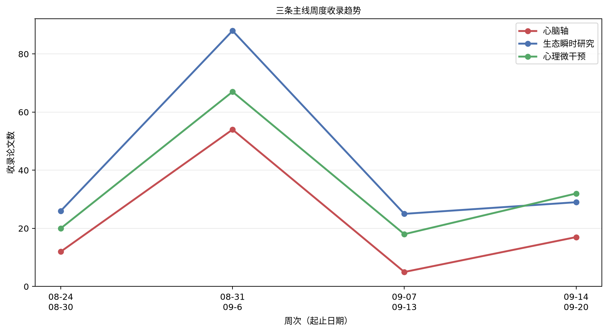

# 心脑、生态瞬时研究与心理微干预文献周报（2026-09-14 至 2026-09-20）

本期收录 58 篇文献。

## 重点推荐
收录 15 篇文献。

### 1. 长新冠中自主神经功能、睡眠质量与每日疲劳及精力症状的双向关联：纵向数字健康研究

- 原文标题：Bidirectional Associations Between Autonomic Function, Sleep Quality, and Daily Fatigue and Energy Symptoms in Long COVID: Longitudinal Digital Health Study.
- 作者：Nana Yaw Aboagye, Mark R Baker, Kenneth Baker, Silvia Del Din
- 期刊：JMIR cardio，JCR Q2，IF 2.4（2025）
- 发表时间：2026-09-14
- 主题标签：心脑轴；生态瞬时研究
- 关键词：长新冠；心率变异性；生态瞬时评估；可穿戴监测；疲劳

**摘要**：背景：长新冠以持续性疲劳为特征，常伴随自主神经功能紊乱和睡眠障碍。每日症状严重程度是否影响随后的睡眠和自主神经恢复（反向时间方向）仍缺乏探索。目的：考察客观测量的睡眠质量、夜间心率变异性（HRV）与报告新冠后疲劳症状个体的每日疲劳和精力水平之间的双向个体内关联。方法：采用纵向观察设计，对14名长新冠个体使用可穿戴设备（Fitbit Inspire 3）进行连续监测，中位监测28天（范围12至73天），获得678057条分钟级观测。自动提取夜间HRV参数（RMSSD、高频功率、低频/高频比）和睡眠指标（时长、效率、深睡、快速眼动睡眠）。疲劳（4级量表）和精力（5级量表，0-100）通过智能手机应用报告。采用两种时间连接策略：前瞻性策略将上午/下午症状报告与前一夜睡眠/HRV连接；反向策略将晚间报告与随后夜间睡眠/HRV连接。重复测量相关分析处理个体内聚类；个体均值中心化累积链接混合模型分离个体内与个体间效应。结果：前瞻性个体内分析（n=260次观测，14名参与者）发现3个经Bonferroni校正后仍显著的关联：睡眠时长与次日疲劳（r=-0.276）、REM睡眠与次日疲劳（r=-0.215）、睡眠效率与次日精力呈反直觉负向关联（r=-0.196）。HRV指标与症状无显著个体内日间关联。Mundlak模型显示HRV-RMSSD关联主要体现为个体间效应：HRV长期较高者报告持续较低的疲劳和较高的精力。睡眠×步数交互显著，表明较长睡眠对疲劳的保护性关联在活动较多的日子被削弱，符合劳累后不适模式。探索性反向分析中，晚间精力与当晚HRV-RMSSD呈名义显著关联，但经Bonferroni校正后不显著。结论：在这项探索性纵向研究中，睡眠时长和REM睡眠与次日疲劳存在日间个体内关联，而HRV-RMSSD可区分平均症状负担较好与较差的个体。反直觉的睡眠效率-精力关联最可能反映偶然性。晚间精力与夜间HRV-RMSSD之间未经校正的初步反向关联有待重复验证。需要实验研究检验因果机制和临床意义。

**原文链接**：[PubMed](https://doi.org/10.2196/99630)

### 2. Nova方案：一项针对大规模创伤事件平民幸存者的综合多模态纵向研究

- 原文标题：The Nova Protocol: a comprehensive multimodal longitudinal study among civilian survivors of a mass trauma event.
- 作者：Roee Admon, Ophir Netzer, Noa Magal, Lisa Simon, Amir Harduf, Michal Oren, Omri Radai, Stephanie Keren Cohen, Meital Bobek, Mary Grankin, Ron Menshes, Yonatan Stern, Noga Mandelblit, Avraham Shmueli, Eden Eldar, Daniel Sand, Tzuk Polinsky, Raz Gross, Roy Salomon
- 期刊：European journal of psychotraumatology，JCR Q1，IF 4.2（2025）
- 发表时间：2026-09-14
- 主题标签：心脑轴；生态瞬时研究
- 关键词：大规模创伤；纵向研究；生态瞬时评估；可穿戴传感器；心脏内感受；PTSD

**摘要**：背景：2023年10月7日以色列南部袭击是现代史上最致命的恐怖袭击之一，造成1182人死亡、4000余人受伤、251人被劫持。位于加沙边境附近的全夜户外锐舞活动Nova音乐节平民伤亡最为惨重，超过370名参与者遇难。幸存者在狭窄时间窗内暴露于具有相似特征的长时间生命威胁性创伤。许多幸存者还报告在袭击期间及随后数小时处于精神活性物质的急性影响下。这一平民大规模创伤与自然主义药物暴露的悲剧性组合，为前瞻性研究创伤加工提供了罕见机会。目的：本文阐述Nova方案的基本原理、设计与方法学，该方案是一项针对2023年10月7日Nova音乐节袭击幸存者及社会文化对照组的综合多模态纵向观察研究。方法：该方案覆盖创伤后最初数周至约24个月，包含三个主要评估时间点。它整合了重复在线临床评估、长时间可穿戴传感器监测、生态评估、唾液内分泌与炎症标志物、结构与功能MRI、心脏内感受范式、在线及扫描仪内强化学习任务，以及半结构化定性访谈。主要结局为PTSD症状严重度（PCL-5）与一般心理困扰（K6），并辅以丰富的次要测量组合。结论：Nova方案为刻画平民大规模创伤后塑造临床轨迹的心理、行为、生理、炎症、神经、内感受与主观机制提供了异常丰富的纵向框架。由于精神活性物质暴露为自然主义且自我选择，研究结果将被解释为机制性与预后性关联而非因果效应。该方案有望为早期风险检测及可扩展的灾后监测与干预策略提供信息，同时为精神活性物质如何影响创伤加工提供独特见解。

**原文链接**：[PubMed](https://doi.org/10.1080/20008066.2026.2721729)

### 3. 通过生态瞬时干预递送的“每日成长”育儿项目：原型试点随机对照试验

- 原文标题："Daily Growth" Parenting Program Delivered via Ecological Momentary Intervention: Pilot Randomized Controlled Trial of a Prototype.
- 作者：Stefanie Ewald, Tomer Savariego Berkowitz, Storm Hiskens-Ravest, Kelsie Bufton, Maria Bates, Eric O, Matthew Fuller-Tyszkiewicz, Gabriella Louise King, Elizabeth Mary Westrupp
- 期刊：JMIR pediatrics and parenting，JCR Q2，IF 2.3（2025）
- 发表时间：2026-09-14
- 主题标签：生态瞬时研究；心理微干预
- 关键词：生态瞬时干预；育儿项目；情绪调节

**摘要**：背景：尽管有证据表明育儿干预可降低儿童心理健康问题发生率，但其覆盖面和参与度仍然较低。“每日成长”是一款数字育儿项目，旨在采用生态瞬时干预方法改善亲子情绪调节。该项目每天发送两次提示，并推送针对近期育儿情境定制的3分钟视频，提供两种项目类型（情绪辅导和积极游戏）以满足不同家长偏好。生态瞬时干预很少在育儿项目中得到检验。目的：本试点旨在评估生态瞬时干预设计及“每日成长”原型的可行性与可接受性，该项目从计划的60个视频中提供10个视频，涵盖两种项目。方法：一项试点随机对照试验招募了189名2至4岁儿童的澳大利亚家长，随机分配至干预组（n=94）或主动对照组（n=95）。参与者在基线和项目期结束时完成25分钟在线调查。在干预的2周内，参与者通过电子邮件收到每天两次的1分钟生态瞬时干预前调查。报告任何亲子负性情绪或情绪失调的参与者会收到一项资源。干预组参与者被即时随机分配观看3分钟情绪辅导或积极游戏视频，而对照组参与者收到一个育儿网站链接。参与者随后收到1分钟生态瞬时干预后调查。两种条件下，育儿支持均根据5种预设育儿情境之一进行定制。结果：总体而言，71%（135/189）的参与者完成了2周后调查，超过三分之二的参与者完成了至少一半的每日生态瞬时干预前调查。尽管存在技术问题，大多数参与者会向其他家长推荐“每日成长”（53/67，79%），会使用所学技能（46/67，69%），报告其易于使用（45/67，67%），并对“每日成长”感到满意（40/67，60%）。结论：本试点评估了简短生态瞬时干预资源能否实时吸引家长参与。结果表明，“每日成长”原型具有可行性且接受度良好，支持在更大规模试验中进一步实施。

**原文链接**：[PubMed + Crossref](https://doi.org/10.2196/87917)

### 4. 算法增强的个性化音乐干预对痴呆患者的效果

- 原文标题：Effects of an algorithmically enhanced personalized music-based intervention in patients with dementia.
- 作者：Madhuri Sangam, Rebecca Eilish Irvine, Matthew Sunda, Justin Grant, Okeanis Vaou, Anna DePold Hohler
- 期刊：Journal of Alzheimer's disease : JAD，JCR Q2，IF 3.4（2025）
- 发表时间：2026-09-15
- 主题标签：心脑轴；心理微干预
- 关键词：个性化音乐干预；心率变异性；痴呆；焦虑；抑郁

**摘要**：背景：音乐干预（MBI）作为支持痴呆患者的非药物策略正日益受到认可。Rubato是一个人工智能驱动的音乐平台，利用机器学习和深度神经网络，通过实时心率变异性监测来提供旨在减轻压力和焦虑的个性化音乐干预。目的：评估一种针对轻度痴呆个体的个性化音乐干预。方法：在这项随机对照试验中，纳入了二十名轻度痴呆患者（包括阿尔茨海默病），干预组和对照组各随机分配十人。干预组参与者每天使用Rubato应用程序30分钟，持续12周，而对照组接受标准护理。干预前后问卷评估了认知（简易精神状态检查）、焦虑（状态-特质焦虑量表）、生活质量（痴呆生活质量问卷）、抑郁（老年抑郁量表）和记忆（即刻散文记忆测验）。结果：与对照组相比，干预组在接受MBI后焦虑和抑郁评分显著下降（分别为p=0.037和p=0.028）。总体而言，80%的干预组参与者表现出焦虑减轻，而对照组为30%；70%的干预组参与者表现出抑郁减轻，而对照组为20%。在认知、生活质量或记忆方面未发现统计学显著差异，尽管干预组呈现出改善趋势。结论：这些初步发现表明，Rubato的MBI可能减轻痴呆患者的焦虑和抑郁，尽管统计效力有限，但具有临床意义的益处。需要更大规模、更长随访时间的研究来验证这些发现，并进一步考察其对认知和生活质量的影响。

**原文链接**：[PubMed + Crossref](https://doi.org/10.1177/13872877261487385)

### 5. MindCare+：面向印度尼西亚心理健康监测与支持的数字化表型框架

- 原文标题：MindCare+: A Digital Phenotyping Framework for Mental Health Monitoring and Support in Indonesia
- 作者：Majdi Ilaf Faradis, Paramitha Dwi Fahrani, Akhmad Kholid, Ahmad Daud Fairuz, Sabrina Mutia Hafid, Qorry Amanda
- 期刊：未提供，JCR 待 JCR 数据核验，IF 待 JCR 数据核验
- 发表时间：2026-09-15
- 主题标签：生态瞬时研究；心理微干预
- 关键词：数字化表型；纵向监测；阶梯式心理支持

**摘要**：背景：印度尼西亚青少年心理健康负担沉重且服务缺口巨大。印度尼西亚全国青少年心理健康调查估计，34.9%的青少年存在心理健康问题，5.5%符合过去12个月精神障碍标准。仅有2.6%存在心理健康问题的青少年获得过支持或咨询服务。智能手机与可穿戴传感能够捕捉纵向行为与生理信号，但当前数字化表型证据异质性较大，并受缺失数据、外部验证有限及临床效用不确定等因素制约。目的：将最初的MindCare+学生创新构想重构为一种有证据边界、有人类监督的研究架构，用于印度尼西亚的纵向心理健康风险监测与阶梯式心理支持。方法：采用循证的概念框架开发方法。将原始提案分解为传感、解释、筛查、支持、专业整合、治理与实施等维度。通过针对性文献将拟议功能分类为近期可实现能力、转化假设，或在未经前瞻性验证前不应假定的功能。未生成参与者层面数据，也未进行疗效分析。结果：MindCare+被界定为一个基于知情同意的闭环系统，连接智能手机衍生的行为特征、可选的可穿戴生理数据、主动且经过验证的自我报告、数据质量与隐私门控、纵向个人基线、情境化多模态解释、可见的不确定性、阶梯式支持以及人工升级。被动信号被视为风险相关背景，而非精神科标签。主动筛查被用作额外评估层，而非诊断。提出分阶段验证路径，从数据采集可靠性与心理测量本地化，到前瞻性临床比较、人因测试、公平性与隐私评估，以及受控实施。结论：MindCare+应作为一项研究计划而非自主心理健康检测器来评估。其核心可检验问题是：隐私保护下的纵向传感，结合主动筛查与有意义的人类监督，能否在不产生不可接受的误报、监控负担、不公平或伤害的前提下，改善对临床相关变化的识别与适当支持的获取。

**原文链接**：[Crossref](https://doi.org/10.20944/preprints202609.1140.v1)

### 6. 通过无创脑刺激调节任务结果价值以缓解现实世界中的拖延行为

- 原文标题：Modulating task-outcome value to mitigate real-world procrastination via noninvasive brain stimulation.
- 作者：Zhiyi Chen, Zhilin Ren, Wei Li, Zhenzhen Huo, Zhuanzheng Wang, Ye Liu, Bowen Hu, Wanting Chen, Ting Xu, Leonov Artemiy, Chenyan Zhang, Bernhard Hommel, Tingyong Feng
- 期刊：eLife，JCR 待 JCR 数据核验，IF matched
- 发表时间：2026-09-16
- 主题标签：生态瞬时研究；心理微干预
- 关键词：拖延；经验采样法；经颅直流电刺激

**摘要**：拖延是一种普遍存在的行为问题，与个体健康和社会生产力相关。一个主流模型认为，拖延反映了任务厌恶与对积极任务结果的追求之间的失衡，但该理论框架既未在现实世界环境中得到验证，也未被有效应用于指导干预。为填补这一空白，我们开展了一项双盲、随机、假对照试验。患有慢性拖延的成年人接受了七次针对左侧背外侧前额叶皮层的高定义经颅直流电刺激。我们采用密集经验采样法，评估了阳极高定义经颅直流电刺激对现实世界拖延行为在离线后效应和长期后效应方面的作用。这种神经调控产生了对现实世界拖延的持久减少，效果在6个月随访时仍得以维持。中介分析表明，结果价值的增加，而非任务厌恶的减少，在统计上解释了行为改善的变异。这些发现与以下假设一致：增强背外侧前额叶皮层功能可能通过选择性放大对未来奖励的估值来减少拖延，而非通过减少对任务的负面感受，这也为未来行为干预提示了一条有针对性的、基于理论的路径。

**原文链接**：[PubMed](https://doi.org/10.7554/elife.108241)

### 7. 患者与临床医生对跨诊断经验采样与生态瞬时干预方案的看法

- 原文标题：Patients' and clinicians' perspectives on a transdiagnostic experience sampling and ecological momentary intervention protocol.
- 作者：Adam Kurilla, Daniel Dančík, Radoslav Lošonský, Alica Hujsová, Sebastián Petreje, Júlia Hysi, Valentína Cviková, Sára Majsniarová, Petra Brandoburová, Anton Heretik, Michal Hajdúk
- 期刊：Journal of mental health (Abingdon, England)，JCR Q1，IF 3.5（2025）
- 发表时间：2026-09-16
- 主题标签：生态瞬时研究；心理微干预
- 关键词：经验采样法；生态瞬时干预；跨诊断监测

**摘要**：背景：经验采样法（ESM）与生态瞬时干预（EMI）是以人为中心心理健康照护中颇具前景的工具，但关于长期跨诊断监测的证据仍有限。目的：本研究探讨服务使用者与临床医生对一种长期跨诊断ESM方案及按需EMI内容的可用性与临床实用性的看法。方法：在DISCONNECT项目中，89名服务使用者启动了为期30天的ESM监测期，其中84人完成了事后问卷以评估其自我监测方案的体验。对20名服务使用者和10名门诊临床医生进行了半结构化访谈。数据采用内容分析和主题内容分析。结果：两个利益相关群体均认为ESM可接受且具有临床价值。参与者报告自我觉察增强、对症状模式的理解改善，以及心理教育、治疗规划和医患沟通机会增加。EMI虽获积极评价但使用频率较低。参与者强调需要个性化评估、灵活时间安排、个体化反馈和情境敏感干预。主要障碍包括监测负担、临床医生时间限制和组织层面挑战。结论：长期跨诊断ESM监测似乎可行、可接受且具有临床意义，但成功实施需要更高程度的个性化并整合进常规照护。

**原文链接**：[PubMed](https://doi.org/10.1080/09638237.2026.2732883)

### 8. 超越前后测比较：面向密集纵向干预的时变建模综合效应量框架

- 原文标题：Beyond Pre-Post Comparisons: A Comprehensive Effect Size Framework for Intensive Longitudinal Interventions via Time-Varying Modeling
- 作者：Xiaohui Luo, Yue Liu, Hongyun Liu, Laura Francina Bringmann
- 期刊：未提供，JCR 待 JCR 数据核验，IF 待 JCR 数据核验
- 发表时间：2026-09-16
- 主题标签：生态瞬时研究；心理微干预
- 关键词：密集纵向干预；时变自回归模型；效应量框架

**摘要**：密集纵向干预（ILIs）在人们日常生活中反复实施干预，同时密集追踪其心理状态，为生态效度高、实时且个性化的支持提供了独特机会。然而，这类研究产生的数据极为丰富，评估方法却仍主要依赖前后测均值比较，将每人数十甚至数百次观测压缩为少数汇总统计量，二者之间存在显著错配。为解决这一错配，作者提出了一套基于贝叶斯多层时变自回归（TV-AR）模型并纳入广义加性混合模型（GAMM）框架的综合效应量框架。该框架从四个维度组织效应量：被试水平（总体平均、个体特异和组间）、参数类型（均值水平、自回归效应和方差）、时间尺度（整合性和时间特异性）以及研究阶段（积极干预期和干预后衰减期）。这些指标使研究者不再局限于判断干预是否有效，而能进一步回答效应何时出现、何时趋于平台或消退，干预如何重塑过程的动态与稳定性，以及对谁有效。作者以一项针对负性情绪的正念密集纵向干预数据演示该框架，该研究在干预前和干预期间对干预组与对照组进行评估，并提供公开可用的带注释R代码和教程。总体而言，该框架为评估密集纵向干预提供了实用而灵活的工具包，支持干预科学向更动态、过程导向和个性化方向转变。

**原文链接**：[Crossref](https://doi.org/10.31234/osf.io/tm6k8_v1)

### 9. 日常生活中情绪事件的口头披露：一项关于感知控制、情感与披露内容的微随机生态瞬时评估研究（预印本）

- 原文标题：Verbal disclosure of emotional events in daily life: a micro-randomized ecological momentary assessment study of perceived control, affect, and disclosure content (Preprint)
- 作者：Silja Markheiser, Amelie Sempert, Carina Rose, Johanna Hepp, Christian Clemm von Hohenberg
- 期刊：未提供，JCR 待 JCR 数据核验，IF 待 JCR 数据核验
- 发表时间：2026-09-17
- 主题标签：生态瞬时研究；心理微干预
- 关键词：口头披露；生态瞬时评估；微随机试验；感知控制；情感

**摘要**：背景：既往研究表明思想披露可能带来心理益处，但研究主要集中于结构化的书面披露（即表达性写作）。相比之下，关于口头披露的效果，尤其是自然发生的情绪事件后的即时效果，所知甚少。感知控制被认为可能是披露后情感改善的潜在机制之一。目的：本研究有三个主要目标：1）检验日常生活中口头披露情绪事件是否立即提升感知控制并改善情感；2）检验口头披露中的情感语言是否与瞬时感知控制和情感相对应；3）探究哪些披露内容与随后感知控制和情感的变化相关。方法：52名跨诊断临床样本成人完成了14天的生态瞬时评估。参与者报告自然发生的正性和负性情绪事件，并在事件层面被微随机分配到口头披露事件（66.7%）或不披露对照条件（33.3%）。在操纵前和操纵后约5分钟评估对情绪状态的感知控制和情感效价。整个研究期间，参与者报告了1557个情绪事件并提供了1039段音频录音。我们使用多层模型检验披露的效果。此外，我们使用基于词典的词汇分析量化言语的情感内容，并使用大语言模型对负性事件录音中的七种高阶披露特征进行编码：情境描述、具体情绪标注、重新评价、解决导向、接纳、自我验证和自我批评。结果：口头披露并未显著提升说话前后的感知控制（b = 1.90，p = .06），感知控制的变化在披露和对照条件之间也无差异（b = 0.82，p = .47）。然而，感知控制的增加与情感更积极的变化强烈相关（b = 0.22，p < .001）。词汇分析显示，参与者在报告比平时更积极的情感和更高的感知控制时，使用了更多积极和更多与情感相关的语言。基于大语言模型的分析显示，披露内容主要包含情境描述和情绪标注，而若干更明确的调节过程出现频率较低。七种大语言模型衍生的内容特征均未显著预测情感或感知控制的即时变化。结论：据我们所知，这是首个在日常生活中对自然发生的情绪事件进行口头披露实验测试的研究。简短叙述主要引发情境描述和情绪标注，几乎没有证据表明存在更明确的调节过程。尽管披露并未立即改善感知控制，但该研究证明了在日常生活中实验性研究口头披露及其内容的可行性。未来工作应在更大样本中测试更有针对性的提示。

**原文链接**：[Crossref](https://doi.org/10.2196/preprints.112215)

### 10. 迈向心理健康研究与服务中生态瞬时评估（EMA）的协调统一：关于EMA核心条目集的德尔菲研究

- 原文标题：Toward Harmonizing Ecological Momentary Assessment (EMA) in Mental Health Research and Services: A Delphi Study on an EMA Core Item Set
- 作者：Christian Rauschenberg, Annette Brose, Joshua M Smyth, Peter Kuppens, Peter Wilhelm, Inez Myin-Germeys, Harald Baumeister, Christine Knaevelsrud, Pascal-M. Aggensteiner, Patrick Bach, Florian Bähner, Anastasia Benedykt, Oksana Berhe, Gerrit Burkhardt, Ilona Croy, Veronika Engert, Lara Gutfleisch, Ann-Christin Haag, Andreas Heinz, Johanna Hepp, Stefan G. Hofmann, Wilhelm Hofmann, Florian Junne, Jakob A. Kaminski, Robert Kumsta, Shuyan Liu, Johanna Löchner, Frauke Nees, Corinne Neukel, Inga Niedtfeld, Nils Opel, Michael A Rapp, Michaela Riediger, Fabian Rottstädt, Mar Rus-Calafell, Lars Schulze, Lennart Seizer, Lena Steubl, Yannik Terhorst, Heike Tost, Mira Tschorn, Susanne Vogl, Johannes Wolf, Ulrike Zetsche, Ulrich Ebner-Priemer, Annika Stefanie Reinhold, Ulrich Reininghaus
- 期刊：未提供，JCR 待 JCR 数据核验，IF 待 JCR 数据核验
- 发表时间：2026-09-17
- 主题标签：生态瞬时研究
- 关键词：生态瞬时评估；德尔菲研究；核心条目集

**摘要**：背景：生态瞬时评估（EMA）捕捉日常生活中即时发生的体验与行为，产生适合建模个体内与个体间过程及结局的密集纵向数据。然而，不同研究中EMA条目的异质性阻碍了可比性、数据聚合与可重复性。目的：就EMA核心条目集达成专家共识，即一套标准化的瞬时变量集合，后续可据此衍生可比的表型指标。该最小条目集旨在广泛适用，同时足够简洁以用于大规模研究联盟与常规照护，并保持最短完成时间与评估负担，采用嵌套结构（即最小核心、扩展核心、附加模块）。方法：在國際专家小组支持下开展德尔菲研究，并邀请来自德国心理健康中心（DZPG）的50位EMA专家参与。候选条目来源于既往工作、国际专家小组以及叙述性综述。条目在德尔菲轮次之间根据汇总评分与专家评论进行迭代修订。依据其通用程度，条目被分配至三个层级之一——最小核心、扩展核心或附加模块，其中最小核心包含最广泛适用的条目。事先设定的共识标准为≥75%认可率。评分稳定性与定性一致性为修订提供依据。专家还报告了当前EMA方法学实践（如采样频率、研究时长）。结果：EMA核心表型经三轮确立。参与人数为第一轮n=41（82%）、第二轮n=43（86%）、第三轮n=40（80%）。在69个初始候选条目中，37个部分修订后的条目保留在三层结构中。最终确定的EMA最小核心（7个条目）包括四个情感条目、一个社会情境条目以及两个正性与负性事件条目。EMA扩展核心包括另外5个条目（共12个），涉及情感、社会情境与活动。最小核心与扩展核心的完成时间均保持较低水平。更具体的条目（如自尊）保留给更具体的EMA附加模块。结论：共识衍生的DZPG EMA核心表型提供了一套经认可、可直接使用的条目集，在信息产出与最小评估负担之间取得平衡。通过协调不同研究间的EMA评估，它促进了可比性、数据合并与可重复研究，同时支持整合进大规模数字心理健康评估与干预流程。EMA核心将作为一项持续维护、带版本管理的测量工具。正在进行的举措包括前瞻性设定的多研究条目验证计划、设计与评估程序的系统性变化（如作答格式），以及EMA核心表型的跨文化适配。

**原文链接**：[Crossref](https://doi.org/10.31234/osf.io/g7ykv_v2)

### 11. 人工智能赋能的精神分裂症谱系障碍体验性阴性症状被动数字表型：从感知到临床终点的叙事综述

- 原文标题：AI-enabled passive digital phenotyping of experiential negative symptoms in schizophrenia-spectrum disorders: a narrative review on the path from sensing to clinical endpoints
- 作者：Yanping Shu, Qing Li, Lifan Liang, Jiaoying Liu, Zuli Zheng, Tong Li, Sha Huang, Jiajing Chen, Juanrong Wen, Jiang Tan
- 期刊：Frontiers in Psychiatry，JCR Q2，IF 3.8（2025）
- 发表时间：2026-09-17
- 主题标签：生态瞬时研究；心理微干预
- 关键词：被动数字表型；阴性症状；即时适应性干预

**摘要**：阴性症状，尤其是意志缺乏和社交退缩，是精神分裂症谱系障碍中最具致残性和治疗抵抗性的特征之一。临床医生评定量表如阴性症状临床评估访谈和简明阴性症状量表加强了构念定义。然而，这些量表依赖不频繁的访谈和回顾性回忆，遗漏了定义这些症状在日常生活中的即时行为模式。被动数字表型通过智能手机和可穿戴传感器，能够在真实世界条件下持续捕捉移动性、身体活动、睡眠、社交节律和语音声学特征。人工智能能否将这些嘈杂、不完整且依赖情境的数据流转化为临床有效的数字终点，仍是核心未解问题。本叙事综述综合了关于人工智能赋能的精神分裂症谱系障碍体验性阴性症状被动数字表型的证据。我们提出一个从构念到终点的管道，将构念定义、多模态表征学习和适配用途的临床验证与可解释数字标志物及即时适应性干预相连接。当前证据显示被动感知模态与阴性症状之间存在一致但适度的关联。然而，单模态相关性并不构成有效终点。合格的数字终点必须展示分析效度、临床效度、纵向敏感性、外部可迁移性和患者意义性。关键挑战涵盖数据层面的分辨率不匹配和设备异质性、推断风险包括环境混杂和算法偏见，以及涉及隐私和模型不透明的伦理监管问题。该领域现在应优先考虑以构念为锚定、情境感知且可解释的数字终点，使其可作为阴性症状试验中的结局指标并支持个性化纵向监测。

**原文链接**：[Crossref](https://doi.org/10.3389/fpsyt.2026.1898444)

### 12. 音乐干预对成人肠易激综合征疼痛的临床与机制反应：单臂试点研究方案

- 原文标题：Clinical and mechanistic responses to a music-based intervention for pain in adults with irritable bowel syndrome: Protocol for a single-arm pilot study
- 作者：Weizi Wu, Eunhea You, Aolan Li, Jie Chen, Luana Colloca, Shannon Kiley, Boluwatife Faremi, Camila Jimenez Wong, John M. Toribio, Kyle J. Mahoney, Hugo Fernando Posada-Quintero, Ming-Hui Chen, Debra S. Burns, Xiaomei Cong
- 期刊：未提供，JCR 待 JCR 数据核验，IF 待 JCR 数据核验
- 发表时间：2026-09-17
- 主题标签：心脑轴；生态瞬时研究；心理微干预
- 关键词：音乐干预；肠易激综合征；脑-肠互动；多模态可穿戴监测；生态瞬时研究

**摘要**：肠易激综合征是一种常见的脑-肠互动障碍，以反复腹痛和排便习惯改变为特征。尽管音乐干预已被证明对疼痛和压力有益，但与音乐干预相关的肠易激综合征疼痛变化机制仍知之甚少，且在日常环境中使用多模态可穿戴监测捕捉这些反应的可行性尚未确立。本方案描述了一项单臂试点机制试验，旨在考察音乐干预对成人肠易激综合征患者的临床和多模态机制反应，以及将生理监测从实验室扩展到家庭环境的可行性。将招募36名18至50岁、经医疗提供者确认的肠易激综合征成人，预计约30人完成干预后实验室访视。参与者将接受由认证音乐治疗师引导的实验室课程，并使用标准化20分钟音乐干预方案完成为期四周的自我管理家庭练习，每周至少五天。在脑-肠机制框架指导下，评估将包括患者报告的疼痛、压力和肠易激综合征症状；定量感觉测试；使用16S rRNA基因测序的肠道微生物组分析；以及神经、自主神经和肌肉活动的多模态生理记录。分析将描述临床和机制指标的会话内及纵向变化，并评估招募、保留、音乐干预依从性、可穿戴数据完整性和参与者可接受性。研究结果将为未来充分把握度的随机对照试验中候选机制和可穿戴监测方法的评估选择提供信息。

**原文链接**：[Crossref](https://doi.org/10.64898/2026.09.11.26362754)

### 13. 基于放松的移动健康干预在围手术期焦虑中的参与度：前瞻性纵向队列混合方法研究

- 原文标题：Engagement With a Relaxation-Based Mobile Health Intervention for Perioperative Anxiety: Prospective Longitudinal Cohort Mixed Methods Study.
- 作者：Xinghui Yan, Afton L Hassett, Jennifer F Waljee, Mark W Newman, Sun Young Park, Rongqi Bei, Noelle E Carlozzi
- 期刊：JMIR mHealth and uHealth，JCR Q1，IF 6.3（2025）
- 发表时间：2026-09-18
- 主题标签：生态瞬时研究；心理微干预
- 关键词：围手术期焦虑；移动健康干预；生态瞬时评估；放松训练；用户参与度；有意使用

**摘要**：背景：基于放松的移动健康干预在可扩展地应对围手术期焦虑和疼痛管理方面具有很大潜力。然而，关于手术患者如何参与这些干预以及哪些方面可能最有帮助的研究仍然有限。目的：本研究有三个目标：（1）探索用户在围手术期如何与基于放松的移动健康干预互动；（2）理解用户表现和感知如何与感知获益相关；（3）识别设计考量，以增强移动健康干预中的用户参与度和行为改变结果。方法：我们开展了一项前瞻性纵向队列混合方法研究，以评估用户对MiCarePath这一基于放松的移动健康干预的参与度。共纳入19名围手术期患者（平均年龄41.3岁；14/19，74%，女性），他们接受择期手术并报告有时到总是焦虑，采用三种招募方法。参与者从手术前10天到手术后4周使用该应用程序。我们收集了视频参与指标的定量数据（例如观看时长、对视频提示的响应率）以及焦虑和疼痛的生态瞬时评估。同时，我们在3个时间点进行了半结构化、数据提示的访谈，以评估用户感知。这些数据通过描述性统计、重复测量方差分析和定性主题分析进行整合，以检验用户表现与感知获益之间的关系。结果：11名参与者报告形成或改善了基于放松的自我管理策略（高获益），而8名参与者报告从干预中获益很少。与低获益组相比，高获益组表现出显著更长的总观看时间（差异223.8分钟，95% CI 95.54-366.46分钟，P<.001）、更高的视频提示依从性（73.45% vs 34.60%，P<.001）以及更高的内容感知帮助性（79.80% vs 25.50%，P<.001）。在参与度方面观察到显著的组别×时间交互效应（F1,17=17.02，P<.001）。在视频提示响应延迟方面未观察到差异。然而，在各组内，参与者感知并未完全反映在表现中。高获益组中的一些参与者在手术后视频观看减少，但仍报告对干预有参与感。访谈数据显示，“有意使用”行为——即用户独立于提示主动寻求内容以管理症状——区分了这些参与者。那些形成有意使用的人能够在没有应用程序的情况下练习放松技术，并在情境中断后恢复应用程序参与。结论：本研究探讨了用户对围手术期护理中基于放松的移动健康干预的参与度，通过整合用户感知和表现，推进了数字焦虑和疼痛管理文献。结果表明，感知获益可能并不总是反映在用户表现中。有意使用成为围手术期护理中有效移动健康参与的一个有前景的指标。未来设计应旨在通过反思提示和适应性通知等功能促进有意使用。未来工作还应开发计算模型以检测有意使用，并在更大队列中评估适应性干预。

**原文链接**：[PubMed + Crossref](https://doi.org/10.2196/64278)

### 14. 以精准7特斯拉生物反馈训练靶向抑郁症多巴胺能中脑：一项原理验证随机对照试验

- 原文标题：Targeting the dopaminergic midbrain with precision 7-Tesla biofeedback training in depression: A proof-of-principle randomized controlled trial.
- 作者：Laurel S Morris, Jacqueline M Beltrán, Timo L Kvamme, Avijit Chowdhury, Grace Butler, Abigail Adams, Tanvi Patel, Emerald Obie, Samantha Fontaine, Morgan Corniquel, Marishka M Mehta, Derek A Smith, Lazar Fleysher, Priti Balchandani, Yael Jacob, James W Murrough
- 期刊：Molecular psychiatry，JCR Q1，IF 10.4（2025）
- 发表时间：2026-09-19
- 主题标签：心理微干预
- 关键词：生物反馈；重度抑郁症；功能磁共振成像；多巴胺能中脑；心理微干预

**摘要**：重度抑郁症的显著异质性要求开发直接靶向潜在认知或神经生物学机制的干预措施。本研究在一项以动机调节为目标的随机、对照、原理验证试验中，检验了利用高场7特斯拉功能磁共振成像生物反馈对多巴胺能中脑进行自我调节的疗效。共62名未用药参与者（重度抑郁症患者与健康对照）被随机分配接受活性或假7特斯拉功能磁共振成像生物反馈，并在训练前及训练后最长30天完成临床评估。对临床症状变化的因子分析揭示出一个单一潜在临床改善因子，活性重度抑郁症组相较于假对照组在训练后即刻显著改善（β=15.85，t=2.31，p=0.03），训练后24小时亦显著改善（β=22.84，t=2.45，p=0.02）；效应在7天和30天随访时减弱且不再显著。特定表型临床分析结果显示，抑郁心境（F=5.04，p=0.029）和负性情感（F=5.21，p=0.027）在活性生物反馈干预下改善最明显，而正性情感未改善。活性生物反馈训练随时间促进了重度抑郁症组腹侧被盖区与外侧额叶皮层之间的功能耦合（F=6.03，p=0.017），且整体腹侧被盖区调节程度越高与临床改善越相关（R=0.268，p=0.048）。综上，这些结果表明基于多巴胺能中脑的生物反馈训练在改善重度抑郁症心境和负性情感方面具有潜在效用。

**原文链接**：[PubMed](https://doi.org/10.1038/s41380-026-03911-x)

### 15. 心率变异性生物反馈诱导的方向性脑连接变化：一项谱动态因果建模研究

- 原文标题：Directional Brain Connectivity Changes Induced by Heart Rate Variability Biofeedback: A Spectral Dynamic Causal Modeling Study
- 作者：Liangsuo Ma, Joel L. Steinberg, David Eddie, Anna Hardy, Edward A. Zuniga, Jasmin Vassileva, James M. Bjork, Andrew D Snyder, Larry D. Keen II, Raul Gonzalez, Antonio Abbate, F. Gerard Moeller
- 期刊：未提供，JCR 待 JCR 数据核验，IF 待 JCR 数据核验
- 发表时间：2026-09-20
- 主题标签：心脑轴；心理微干预
- 关键词：心率变异性生物反馈；中枢自主网络；动态因果建模；自主神经调节；额-边缘连接

**摘要**：心率变异性生物反馈（HRVB）是一种非药物干预，训练个体以心血管共振频率呼吸以增强自主神经调节。尽管HRVB在多种临床条件下改善心血管功能，但其调节中枢自主网络（CAN）的方向性神经通路仍知之甚少。本研究利用公开开放获取数据集，对32名健康参与者（随机分配至8周HRVB干预组n=15或视频游戏对照组n=17）的有效（方向性）神经连接（EC）数据进行二次分析。采用谱动态因果建模（DCM）结合参数经验贝叶斯分析干预前后的静息态功能磁共振成像（fMRI）数据，考察组间EC变化（ΔEC）差异。同时评估连接变化是否与以正常至正常间期标准差（ΔSDNN）为指标的外周自主调节变化相关。与对照组相比，HRVB组在治疗后显示内侧前额叶皮层至前扣带皮层及双侧丘脑的ΔEC增加（后验概率=1）的强证据，同时右侧海马至右侧腹外侧前额叶皮层（VLPFC）的ΔEC降低。此外，HRVB组中海马至VLPFC的ΔEC与ΔSDNN之间的回归系数比对照组更负（后验概率=1），表明自主神经变化与有效连接之间存在干预依赖性关联。这些发现表明HRVB改变了CAN内方向性额-边缘通讯，为理解共振呼吸如何调节中枢自主控制提供了回路层面的框架。

**原文链接**：[Crossref](https://doi.org/10.21203/rs.3.rs-10895585/v1)

## 心脑轴
收录 12 篇文献。

### 1. 评估音乐与白噪音对青年人心率变异性的影响：一项比较研究

- 原文标题：To Assess the Effect of Music and White noise on Heart Rate Variability in Young Adults:  A Comparative Study
- 作者：Muskan Tyagi, Alka Srivastava, Priti Rathi, Anshu Tandon, Pratibha Rani, Vaibhav Tyagi
- 期刊：International Journal of Health Sciences and Research，JCR 待 JCR 数据核验，IF 待 JCR 数据核验
- 发表时间：2026-09-14
- 主题标签：心脑轴
- 关键词：音乐；白噪音；心率变异性；自主神经系统；青年人

**摘要**：背景：音乐及其他听觉刺激可影响情绪加工与自主神经系统活动。心率变异性（HRV）提供了一种无创的自主调节测量方法，可能有助于刻画不同听觉条件下交感-迷走平衡的变化。本研究评估了放松音乐、兴奋性音乐和白噪音对健康青年人心血管参数与HRV的影响。材料与方法：本实验研究纳入100名18至25岁健康成人。在标准化测试前限制和15分钟休息后，参与者接受5分钟II导联心电图记录，涵盖四种条件：基线、放松音乐、兴奋性音乐和白噪音。评估心血管参数以及时域和频域HRV指标。采用重复测量方差分析比较四种实验条件下的参数，统计显著性设为p<0.05。结果：参与者平均年龄为20.06±1.83岁。四种条件在收缩压、舒张压、呼吸频率、心率、平均RR间期、平均心率、RMSSD、SDSD、pRR50或总功率方面均未观察到统计学显著差异（p>0.05）。相反，在频域HRV参数方面观察到显著差异。HF功率在基线和放松音乐条件下（分别为68.39±11.46和69.21±11.22）高于兴奋性音乐和白噪音条件（分别为62.58±12.73和60.89±13.68；F=11.358，p<0.00001）。LF功率在兴奋性音乐和白噪音条件下（34.16±13.20和36.53±14.48）高于基线和放松音乐条件（28.32±11.44和28.08±10.68；F=11.417，p<0.00001）。LF/HF比值在不同条件间也存在显著差异（F=8.900，p=0.00001）。结论：听觉刺激主要影响频域HRV，而非心血管或时域HRV参数。放松音乐与更偏副交感优势的HRV模式相关，而兴奋性音乐和白噪音则与相对偏向交感优势的转变相关。

**原文链接**：[Crossref](https://doi.org/10.52403/ijhsr.20260911)

### 2. 使用虚拟现实评估病理性与健康焦虑反应的差异

- 原文标题：Using virtual reality to evaluate the difference between pathological and healthy responding to anxiety.
- 作者：Julia Tomasi, Arun K Tiwari, Clement C Zai, Gwyneth Zai, Margaret A Richter, Marcos Sanches, Richard Lachman, Calvin Gaspar, Matteo Cella, Ben Greer, Deanna Herbert, Ayeshah Mohiuddin, James L Kennedy
- 期刊：Journal of affective disorders，JCR Q1，IF 5.7（2025）
- 发表时间：2026-09-15
- 主题标签：心脑轴
- 关键词：虚拟现实；焦虑障碍；心率变异性；自主神经灵活性；远程评估

**摘要**：焦虑是一种适应性情绪状态，可能发展为问题并导致焦虑障碍。健康焦虑与病理性焦虑在触发和调节机制上的差异尚不明确。虚拟现实（VR）可模拟引发焦虑的情境以评估反应。本研究探索了一种新型远程焦虑诱发VR范式的可行性，比较患者与健康对照在自我报告和生理焦虑反应上的差异。120名焦虑障碍患者和120名健康对照在家中通过智能手机配合纸板VR头显，在视频会议指导下体验两种VR条件，一种轻度诱发焦虑，一种中性。焦虑采用状态-特质焦虑量表（STAI-State）评估，同时使用可穿戴设备采集心率变异性（HRV）、心率（HR）和皮肤电活动（EDA）。与中性条件相比，焦虑VR条件提高了STAI-State和EDA，患者与对照的差异相似，但患者对两种条件的焦虑评分均更高。患者在不同条件间未表现HRV/HR调节。对照在焦虑条件下表现出HRV升高的趋势和HR的显著下降。本研究凸显了该远程VR范式用于研究焦虑的价值。患者缺乏HRV/HR改变与钝化的生理反应模式一致，可能反映自主神经灵活性受限，而对照的HR下降和趋势性HRV升高可能提示情绪调节改善，但这些模式仍需重复验证。本研究强调了利用VR进行生理与自我报告焦虑实时暴露评估的潜力，尤其是在远程环境中以多样化研究人群。

**原文链接**：[PubMed](https://doi.org/10.1016/j.jad.2026.122508)

### 3. 青少年重性抑郁障碍临床恢复与自主神经恢复的分离：一项为期10周的前瞻性心率变异性研究及夜间心电图监测

- 原文标题：Divergence of clinical and autonomic recovery in adolescent major depressive disorder: A 10-week prospective heart rate variability study with nocturnal electrocardiogram monitoring.
- 作者：Haisi Chen, Xiaona Zhang, Shuning Hong, Zhenghe Yu, Wanlin Chen
- 期刊：Journal of affective disorders，JCR Q1，IF 5.7（2025）
- 发表时间：2026-05-08
- 主题标签：心脑轴
- 关键词：心率变异性；自主神经系统；青少年重性抑郁障碍

**摘要**：背景：青春期是自主神经系统发育的关键窗口期，而重性抑郁障碍可能干扰这一过程。心率变异性是一种有前景的生物标志物，但青少年研究结果不一致，且纵向治疗数据稀缺。本研究通过夜间心电图对青少年重性抑郁障碍患者的自主神经功能进行纵向评估。方法：纳入43名12至18岁重性抑郁障碍青少年和43名健康对照。重性抑郁障碍参与者接受常规、非研究强制性的选择性5-羟色胺再摄取抑制剂治疗，并在基线和10周治疗后随访时完成连续3晚夜间心电图监测。对照仅完成基线监测方案。研究进行了组间比较、重性抑郁障碍组治疗前后比较以及心率变异性与临床特征之间的相关分析。结果：10周治疗显著降低了17项汉密尔顿抑郁量表和汉密尔顿焦虑量表评分，但仅7.0%的患者达到早期临床应答。重性抑郁障碍患者基线时的心率变异性缺陷在治疗后持续存在，自主神经损害未逆转，并出现进一步的病理性交感神经优势。值得注意的是，躯体焦虑的减轻与治疗后低频与高频功率比及归一化低频功率呈负相关，提示交感病理性恶化有所缓解，而非自主神经功能正常化。结论：本研究显示青少年重性抑郁障碍中部分临床改善与持续自主神经功能障碍之间存在分离。心率变异性可能是有用的辅助生物标志物，针对躯体焦虑的干预可能有助于恢复。

**原文链接**：[PubMed](https://doi.org/10.1016/j.jad.2026.121940)

### 4. 迈向以生物学为基础的发展科学自主神经功能理解

- 原文标题：Toward a biologically grounded understanding of autonomic function in developmental science.
- 作者：Valerie P Bambha, Brooke E Franklin, Manash Sahoo, Giang X Le, Bryce E Dubois, Diana Martinez, Laura A Greenwald, Soumya Gupta, Lydia J Borjon, Jeremy I Borjon
- 期刊：Neuroscience and biobehavioral reviews，JCR Q1，IF 8.5（2025）
- 发表时间：2026-09-16
- 主题标签：心脑轴
- 关键词：自主神经系统；呼吸性窦性心律不齐；发展科学

**摘要**：半个多世纪以来，发展科学家使用自主神经测量来推断婴儿注意、自我调节和社会行为背后的生理机制。这些解释建立在将自主神经系统分为相互对立的交感与副交感分支的二元模型之上，该模型已有一个多世纪的历史。本综述追溯了自主神经系统的历史描述，并结合当代生物学和神经科学的证据，总结了传统模型面临的三个挑战，表明经典模型并不完整。我们从解剖学、分子谱、神经递质表型以及自主神经控制模式等方面论证，自主神经系统比通常认为的更加整合。这些发现对发展科学家如何解释生理信号具有实际意义，包括常用的呼吸性窦性心律不齐（RSA）测量。我们对过去六年半中316篇使用RSA的发展群体同行评审论文进行了调查，显示将RSA与心理结果联系起来的解释严重依赖传统自主神经模型。因此，我们提出，在摆脱传统模型假设的情况下重新评估自主神经系统会是什么样子，并为测量、分析、解释和透明度提供考量、指南和建议。我们支持一种基于当代生物学和神经科学、以数据驱动模型和生理信号解释为基础的现代、整合、多维的自主神经功能观。

**原文链接**：[PubMed](https://doi.org/10.1016/j.neubiorev.2026.106984)

### 5. 技术驱动职业环境中提升心理韧性的瑜伽疗法：一项定性系统综述与主题综合

- 原文标题：Yoga therapy for mental resilience in technology-driven occupational settings: A qualitative systematic review and thematic synthesis.
- 作者：Santosh Kumar Sahu, Ajit Kumar Pradhan, Priyanka Giri
- 期刊：Journal of Ayurveda and integrative medicine，JCR Q2，IF 2.1（2025）
- 发表时间：2026-09-16
- 主题标签：心脑轴；心理微干预
- 关键词：瑜伽疗法；心理韧性；自主神经调节；心率变异性；职场微干预

**摘要**：技术驱动职业环境中从业者的心理健康问题已成为突出的职场挑战。持续的认知负荷、长时间屏幕暴露、久坐工作模式和社会心理压力源与职业倦怠、睡眠障碍、情绪失调及韧性下降相关。新兴证据提示，瑜伽疗法可能是一种有前景的身心方法，用于支持高认知需求工作环境中的压力调节与心理生理平衡。本定性系统综述与主题综合考察了针对技术相关及类似职场人群的瑜伽干预的机制与应用证据。文献检索覆盖PubMed、Scopus和Google Scholar（2010—2025年）。纳入研究包括随机对照试验、职场干预研究、机制性生理研究、观察性研究及相关系统综述，结局涉及压力、自主神经功能、情绪健康、认知表现和职业健康。由于研究设计、干预措施和结局指标异质性较大，结果采用定性综合。纳入证据提示，瑜伽疗法可能支持自主神经调节、心率变异性调节和压力适应。基于职场的干预通常与感知压力降低、睡眠质量、情绪健康、认知功能和职业满意度方面的有利趋势相关。简短的瑜伽微练习也显示出用于职场压力管理和注意力恢复的可行性。经典瑜伽概念，包括sattva和prāṇa vāta调节，为理解瑜伽疗法的多维效应提供了阐释框架。总体而言，基于瑜伽的干预可能是技术驱动职业环境中韧性相关结局的一种有前景的整合策略。然而，由于方法学异质性和职业特异性证据有限，结果应谨慎解读。本综述已在PROSPERO前瞻性注册（CRD420251240676）。

**原文链接**：[PubMed](https://doi.org/10.1016/j.jaim.2026.101394)

### 6. 基于生物反馈的虚拟现实在儿童和青少年手术围术期疼痛与焦虑中的应用可行性与可接受性：一项随机对照预试验

- 原文标题：Feasibility and Acceptability of Perioperative Application of Biofeedback-Based Virtual Reality vs Control for Pain and Anxiety in Children and Adolescents Undergoing Surgery: Pilot Randomized Controlled Trial.
- 作者：Anna M Lin, Brenna Rachwal, Lindsey Asti, Zandantsetseg Orgil, Isabela Santiago, Lili Ding, Susmita Kashikar-Zuck, Christopher D King, Sara E Williams, William R Black, Peter C Minneci, Vanessa A Olbrecht
- 期刊：Journal of medical Internet research，JCR Q1，IF 8.2（2025）
- 发表时间：2026-09-16
- 主题标签：心脑轴；心理微干预
- 关键词：虚拟现实；生物反馈；围术期；疼痛与焦虑；迷走神经张力

**摘要**：背景：基于生物反馈的虚拟现实（VR-BF）对儿科手术患者疼痛和焦虑的影响尚未被探索。目的：评估围术期VR-BF在儿童和青少年中使用的可行性与可接受性。方法：采用单盲、双臂随机预试验。12至18岁、接受手术且预期术后中重度疼痛并需住院超过1晚的儿童按1:1随机分配至干预组或对照组。干预组使用ForeVR接受VR-BF，这是一种新颖的游戏化数字干预，将呼吸生物反馈整合到沉浸式虚拟现实环境中，训练儿童调节迷走神经张力；对照组使用Manage My Pain应用程序，帮助患者识别和反思其疼痛。参与者和照护者对各自干预分组不设盲，但对另一组技术设盲；数据分析者对治疗分配设盲。主要结局为可行性，通过招募、入组与随机化、保留率、依从性和结局数据收集进行评估。次要结局评估可接受性，包括满意度和耐受性。探索性结局包括VR-BF组的疼痛强度、疼痛不愉快感和焦虑。结果：202名符合条件患者中70人入组，65人（92.9%）完成研究（VR-BF组n=30，对照组n=35）。女性41人（58.6%），中位年龄16.2岁。VR-BF参与者术前中位完成4次训练，术后中位完成7次训练。可接受性高，仅2人（6.7%）表示不愿再次使用VR-BF。6名VR-BF患者报告轻度、短暂的不良事件，均非严重。基线疼痛和焦虑评分≥2的VR-BF患者在每次干预后即刻及至30分钟报告疼痛强度、不愉快感和焦虑中位降低1分。结论：围术期使用VR-BF在儿科手术患者中可行且可接受，招募、保留和满意度高，无严重不良事件。这些发现支持后续开展试验评估该新技术的疗效和长期影响。

**原文链接**：[PubMed](https://doi.org/10.2196/94604)

### 7. 状态空间吸引子形态作为群体心率变异性动态中复杂性匹配的标志

- 原文标题：State-Space Attractor Morphology as a Marker of Complexity Matching in Group Heart Rate Variability Dynamics
- 作者：Naseha Wafa Qammar, Kristina Poškuvienė, Mantas Landauskas, Kiran Shahzadi, Minvydas Ragulskis, Alfonsas Vainoras, Nachum Plonka, Mike Atkinson, Rollin McCraty
- 期刊：Applied Sciences，JCR Q2，IF 2.9（2025）
- 发表时间：2026-09-16
- 主题标签：心脑轴
- 关键词：心率变异性；复杂性匹配；吸引子重建

**摘要**：复杂性匹配有助于解释相互作用的生理系统如何在共享体验中实现协调。本研究通过重建20名参与者在一次引导式心脏聚焦会话六个时段内的心率变异性动态，考察群体水平的复杂性匹配。对每名参与者的每个时段，使用时段特异的最优延迟将HRV嵌入二维延迟坐标空间，随后用卷积神经网络自编码器分析重建的吸引子，并对潜在表征进行聚类。分析识别出三种反复出现的吸引子形态类型：圆形或环状吸引子（类型1）、变形圆形吸引子（类型2）和变形集中吸引子（类型3）。在20名参与者的完整样本中，类型2在前三个时段更为普遍，而类型1在后几个时段变得更普遍，并在最后时段占主导，从时段1的10.00%增至时段6的60.00%。仅限15名形态分类随方案发生变化的参与者的探索性二次分析显示了相似模式。这一模式提示HRV状态空间组织的相似性增加，与群体水平复杂性匹配一致。类型1的增加出现在该固定顺序方案中后段更具亲社会取向的时段；由于时段顺序与经过时间和指导语重复相混淆，该关联不应被解释为欣赏或慈悲聚焦内容的因果效应。耦合Thomas-Rössler系统进一步说明了非线性相互作用如何产生吸引子几何相似性的增加。与作者早期基于H-rank的方法相比，本方法使用无监督CNN自编码器特征提取和聚类分析参与者特异的重建HRV吸引子形态。这些发现提示，吸引子重建和基于CNN自编码器的聚类可以揭示原始HRV记录中视觉上不明显的集体生理组织。传统时域、频域或基于熵的HRV指标是否能检测到类似模式尚未直接检验，仍是未来工作的开放问题。

**原文链接**：[Crossref](https://doi.org/10.3390/app16189172)

### 8. 临终关怀花园需要引导吗？引导式与非引导式森林浴对幸福感、自然联结感及心率变异性的比较：一项试点研究

- 原文标题：Do Hospice Gardens Need a Guide? Comparing Guided and Unguided Forest Bathing for Wellbeing, Nature Connectedness and Heart Rate Variability: A Pilot Study
- 作者：Yangang Xing, Rachel Pitzettu, Kirsten McEwan
- 期刊：International Journal of Environmental Research and Public Health，JCR 待 JCR 数据核验，IF 待 JCR 数据核验
- 发表时间：2026-09-17
- 主题标签：心脑轴；心理微干预
- 关键词：森林浴；心率变异性；心理微干预

**摘要**：基于自然的干预可能有助于健康与幸福感，但在临床人群中直接比较引导式与低资源投入形式的证据仍然有限。这项非随机试点研究考察了在临终关怀花园中进行的一小时引导式森林浴与匹配的、轻度协助的非引导式自然漫步。17名成年临终关怀服务使用者选择参加引导式（n=8）或非引导式（n=9）活动。在活动前后评估了沃里克-爱丁堡心理健康量表（WEMWBS）、自然自我包含量表（INS）以及以正常至正常间期标准差（SDNN）为指标的心率变异性。在2×2混合方差分析中，WEMWBS和INS得分随时间显著改善，但两个结局均未显示显著的组别×时间交互作用。SDNN既未显示显著的时间效应，也未显示显著的组别×时间交互作用；其显著的组间效应与基线差异一致。探索性可靠变化指数分析识别出部分个体的改善，但这些发现需要谨慎解读。两种形式均与自我报告的幸福感和自然联结感的短期改善相关，但该设计无法确立因果关系或等效性。轻度协助的自然漫步可能值得作为姑息治疗项目中一种可及、低资源的补充方案进行评估。

**原文链接**：[Crossref](https://doi.org/10.3390/ijerph23091233)

### 9. 基于脑电的音乐疗法评估：神经相关物及其认知状态、人工智能方法与不同数据集的系统综述

- 原文标题：EEG-Based Assessment of Music Therapy: A Systematic Review of Neural Correlates and their Cognitive States, Artificial Intelligence Approaches, and Different DataSets
- 作者：Shefali Gupta
- 期刊：未提供，JCR 待 JCR 数据核验，IF 待 JCR 数据核验
- 发表时间：2026-09-17
- 主题标签：心脑轴；心理微干预
- 关键词：脑电；音乐疗法；心理健康；神经相关物；人工智能

**摘要**：背景。压力、焦虑、认知疲劳及其他心理健康问题的日益普遍，激发了人们对非药物干预的兴趣。健康音乐包括冥想音乐、环境器乐、印度古典音乐、吠陀诵唱、 devotional music、自然灵感音景、双耳节拍和治疗性作曲，已显示出影响情绪状态、压力、注意力、放松和认知的潜力。脑电因其高时间分辨率、便携性和非侵入性，为客观研究健康音乐的神经效应提供了有效工具。目的。本系统综述考察了76项主要发表于2013年至2026年间的基于脑电的健康与治疗音乐研究，聚焦于脑电生物标志物及用于表征音乐诱发的神经与心理变化的计算方法。方法。文献从脑电生物标志物、实验范式、音乐刺激、采集与预处理方法、统计方法及计算技术等方面进行分析。关键指标包括PSD、FAA、ABR、TAR、TBR、BAR、PRI、EI、功能连接以及基于机器学习的方法。观察结果。所综述的研究普遍报告，在健康音乐暴露期间alpha和theta活动增加、高beta活动降低、额叶半球不对称性调制以及功能同步性增强。人工智能、深度学习、基于图的方法和可穿戴脑电系统正越来越多地用于情绪和认知状态的自动分类。然而，显著的方法学异质性限制了研究之间的比较和可重复性。

**原文链接**：[Crossref](https://doi.org/10.21203/rs.3.rs-11061910/v1)

### 10. 具身化的康复路径：40-55岁女性太极拳练习后内感受变化与抑郁症状减轻

- 原文标题：Embodied pathways of recovery: interoceptive change and the reduction of depressive symptoms following Tai Chi in women aged 40-55 years.
- 作者：Muhammad Suliman, Xinyi Liu, Feiping Yu, Di Zhao, Xiangyu Zhao, Fares Barakat, Gaorong Lv, Meiling Qi, Ping Li
- 期刊：Archives of women's mental health，JCR Q2，IF 3.2（2025）
- 发表时间：2026-09-18
- 主题标签：心脑轴；心理微干预
- 关键词：太极拳；内感受；抑郁症状；身心干预；具身化

**摘要**：目的：女性的心理困扰日益被视为一种具身化现象，其中情感调节失调与内感受改变密切相关。太极拳等身心干预可能通过具身化调节过程影响情感功能，尤其是连接身体信号与情绪体验的内感受。本研究考察太极拳是否与40-55岁临床诊断为抑郁症的女性抑郁症状和焦虑症状的减轻相关，并探讨内感受敏感性（IS）作为潜在具身化机制的作用。方法：采用双臂准实验设计，纳入40名40-55岁临床诊断为抑郁症的女性，分别参加为期8周的太极拳干预或维持生活方式的对照条件。在基线和五个随访时间点评估抑郁症状（PHQ-9）、焦虑症状（GAD-7）和内感受敏感性（ISQ-20）。采用广义估计方程分析纵向组间差异，并通过滞后中介分析检验早期IS变化是否与后续情感症状变化相关。结果：与对照组相比，太极拳组从第4周起表现出抑郁症状的逐步减轻，并从第2周起表现出IS的早期改善。干预中后期IS的改善与随后抑郁症状的减轻相关，分别占总干预效应的23.6%和35.8%。焦虑症状在较晚时间点也有所减轻，但与IS无关。结论：太极拳与抑郁和焦虑症状的减轻以及内感受的逐步变化相关。这些发现支持心理困扰的具身化视角，并提示内感受功能的变化可能是与抑郁症状减轻相关的一条路径。

**原文链接**：[PubMed](https://doi.org/10.1007/s00737-026-01760-9)

### 11. 基于复杂度的受控呼吸期间心脏—面部肌肉耦合分析

- 原文标题：Complexity-Based Analysis of Cardiac-Facial Muscle Coupling During Controlled Respiration
- 作者：Anupam Baliyan, Najmeh Pakniyat, Riya Chauhan, Ondrej Krejcar, Vladimir Kasik, Penhaker Marek, Hamidreza Namazi
- 期刊：Fractals，JCR Q1，IF 2.9（2025）
- 发表时间：2026-09-18
- 主题标签：心脑轴；心理微干预
- 关键词：心脑轴；受控呼吸；心率变异性；肌电图；非线性复杂度

**摘要**：本研究通过分析肌电图（EMG）与心电图（ECG）信号，探讨不同受控呼吸模式如何影响面部肌肉活动与心脏功能的协调动态。二十六名健康参与者完成四种不同受控呼吸条件的呼吸任务，同时连续记录面部EMG与ECG信号。为刻画这些生理信号的时间结构，从EMG信号及由ECG衍生的心率变异性（HRV）中计算了三种非线性复杂度指标——分形维数（FD）、样本熵（SampEn）与近似熵（ApEn）。结果显示，随着呼吸任务难度增加，EMG与HRV信号的复杂度均升高，表明在更高要求的呼吸模式下生理动态更为不规则且信息更丰富。此外，在各呼吸条件下，面部EMG与HRV的复杂度变化之间观察到强正相关，提示受控呼吸期间躯体与自主神经系统之间存在协调适应。这些发现表明，非线性复杂度指标可作为呼吸调制下心脏—躯体反应的敏感指标，并凸显了EMG-ECG联合复杂度分析在理解呼吸任务及相关心理生理状态下的生理调节方面的潜力。

**原文链接**：[Crossref](https://doi.org/10.1142/s0218348x26501550)

### 12. 心理心脏病学——当心律遇见心理体验：为何心律失常会引发心理反应

- 原文标题：[Psychocardiology-When cardiac rhythm meets psychological experience : Why cardiac arrhythmias elicit a psychological response].
- 作者：Corinna Pfeiffer
- 期刊：Herzschrittmachertherapie & Elektrophysiologie，JCR 待 JCR 数据核验，IF 待 JCR 数据核验
- 发表时间：2026-09-19
- 主题标签：心脑轴
- 关键词：心理心脏病学；心脑轴；心律失常；焦虑；疾病感知

**摘要**：心理心脏病学将心血管疾病的生物学现实与患者的主观体验联系起来。在心律失常的情况下，这种关系尤为明显：心律失常是可测量的电生理事件，但同时也被主观感知、情绪评价，并嵌入患者的个人生活史之中。心律失常的客观负担并不总是与主观痛苦程度相关。尽管现代电生理学提供了高度分化的诊断和介入治疗选择，但个体疾病体验的问题往往仍处于次要地位。本文从心理心脏病学和心身医学的视角讨论心律失常，聚焦于心脑轴、焦虑、抑郁、过度警觉和疾病感知的作用，以及将心房颤动视为一种生物心理社会障碍的模型。此外，心脏被视为一个特殊器官，其活动可以被直接感知，并在文化上与生命、安全、身份和脆弱性相关联。心理心脏病学不应被理解为将心脏病心理化，而是一种整合性的临床态度，既重视生物学发现，也重视主观体验。

**原文链接**：[PubMed](https://doi.org/10.1007/s00399-026-01172-3)

## 生态瞬时研究
收录 17 篇文献。

### 1. 年轻成年人大麻与酒精的预备性饮酒：与大麻中毒及酒精与大麻同时使用的日水平关联

- 原文标题：Cannabis and Alcohol Prepartying Among Young Adults: Daily-Level Associations with Cannabis Intoxication and Simultaneous Alcohol and Cannabis Use.
- 作者：Melissa A Lewis, Brian H Calhoun, Dana M Litt, Allison Greene
- 期刊：Journal of studies on alcohol and drugs，JCR Q2，IF 2.4（2025）
- 发表时间：2026-09-14
- 主题标签：生态瞬时研究
- 关键词：大麻预备性使用；酒精预备性使用；生态瞬时评估；酒精与大麻同时使用；年轻成年人

**摘要**：目的：预备性饮酒是年轻成年人酒精使用的高风险情境，但关于社交活动前使用大麻的情况知之甚少。本研究引入大麻预备性使用这一概念，考察其与酒精预备性使用的共现情况，包括酒精与大麻同时（SAM）预备性使用，以及其与年轻成年人大麻中毒和SAM使用的日水平关联。方法：采用纵向测量爆发式生态瞬时评估设计。18至25岁的参与者在12个月内每季度完成一次为期3周的EMA阶段。分析使用两个样本：在至少一个采样日报告酒精使用的参与者（N=507）和在至少一个采样日报告大麻使用的参与者（N=238）。结果：大麻预备性使用发生在所有大麻使用日的15.9%（占使用大麻参与者的37.4%），而酒精预备性使用发生在所有酒精使用日的13.6%（占使用酒精参与者的39.3%）。大麻预备性使用在个体内和个体间均与兴奋小时数、主观中毒程度及SAM使用可能性呈正相关。酒精预备性使用在未调整饮酒量和兴奋小时数前，在个体内和个体间均与SAM使用呈正相关，但调整后仅在个体内层面显著。结论：大麻预备性使用在相当一部分年轻成年人中存在，代表一种与酒精预备性使用平行的可测量社交情境。大麻预备性使用与酒精使用共现，并与更高的SAM使用可能性、更长的兴奋持续时间和更高的主观中毒程度相关。这些关联在大麻预备性使用中于个体内和个体间层面均可观察到，而酒精预备性使用仅在个体内层面与SAM使用相关。

**原文链接**：[PubMed](https://doi.org/10.15288/jsad.26-00193)

### 2. 德国成年人生活方式画像与心理健康的数字表型研究：前瞻性纵向队列研究

- 原文标题：Digital Phenotyping of Lifestyle Profiles and Mental Well-Being in German Adults: Prospective Longitudinal Cohort Study.
- 作者：Ningzhe Zhu, Ramona Schoedel, Larissa Sust, Markus Bühner, Yannik Terhorst
- 期刊：Journal of medical Internet research，JCR Q1，IF 8.2（2025）
- 发表时间：2026-09-14
- 主题标签：生态瞬时研究
- 关键词：数字表型；生态瞬时评估；心理健康；智能手机感知；潜在剖面分析

**摘要**：背景：数字表型利用被动采集的智能手机感知数据来刻画自然情境下的日常行为，已成为研究心理健康的重要方法。以往研究多考察单个感知变量与心理健康之间的关联，但心理健康可能并非由孤立行为反映，而是由共同出现的日常行为组合所构成的整体生活方式体现。能够识别这些行为组合的以人为中心的方法，或可提供更具可解释性的数字表型，但此类方法很少应用于被动智能手机感知数据。目的：本研究旨在检验智能手机采集的行为与环境数据能否用于推导可解释的日水平与个体水平生活方式画像，以及个体水平画像是否与心理健康相关。同时检验大五人格特质是否调节这些关联。方法：采用为期2周的前瞻性纵向队列设计，样本为553名德国成年人。十个智能手机感知指标涵盖五个领域，包括沟通与社交媒体应用使用、移动性、身体活动、环境情境和手机使用强度。心理健康采用沃里克-爱丁堡心理健康量表评估，人格采用15题大五人格量表-2超短版评估。使用多层潜在剖面分析识别嵌套于个体水平画像中的日水平画像。结果：识别出8个日水平画像和7个个体水平画像。画像仅在积极功能上存在显著差异，在整体心理健康、积极情感或满意人际关系上无显著差异。人格与画像的交互作用未显著改善对任何心理健康结局的预测。结论：研究结果表明，透明、以人为中心的数字表型能够区分积极功能的变异，但无法得出因果结论。在真实世界环境中，此类可解释画像可支持易于理解的监测工具，并在前瞻性重复与验证后，为针对行为组合而非孤立单一行为的个性化多行为干预提供依据。

**原文链接**：[PubMed + Crossref](https://doi.org/10.2196/101850)

### 3. 一天中的时间影响抑郁中身体活动与精力感之间的关系：两项真实生活研究

- 原文标题：Time of day affects the relation between physical activity and feeling energetic in depression: Two real-life studies.
- 作者：Markus Reichert, Iris Reinhard, Urs Braun, Luisa Lutz, Robin Olfermann, Heike Tost, Marco Giurgiu, Irina Timm, Sarah Brüßler, Elena Koch, Lena M Wieland, Oliver Hennig, Janina Schweiger, Matthias F Limberger, Renee J Thompson, Susanne M Jaeggi, Martin Buschkuehl, John Jonides, Ian H Gotlib, Andreas Meyer-Lindenberg, Ulrich W Ebner-Priemer, Christine Kuehner, Jutta Mata
- 期刊：Journal of psychopathology and clinical science，JCR Q1，IF 4.6（2025）
- 发表时间：2026-09-14
- 主题标签：生态瞬时研究
- 关键词：身体活动；精力感；抑郁；密集纵向；昼夜节律

**摘要**：短时身体活动能增强精力感并改善幸福感。昼夜节律强烈影响情绪，但其对身体活动与情绪关联的影响尚不清楚。研究从两个独立样本（N=106和68）获取密集纵向数据，每个样本包含两组在身体活动与精力表现上具有不同特征的参与者：抑郁参与者（研究A n=53；研究B n=32）和健康参与者（研究A n=53；研究B n=36）。参与者在一天中多次报告其精力感；身体活动在研究A中为自评，在研究B中通过加速度计测量。采用多层模型与三重调节分析，检验身体活动与精力感的关联如何随一天中的时间和抑郁而变化。跨研究一致发现，对健康参与者而言，身体活动与全天精力感相关。相反，在抑郁参与者中，身体活动与精力的关系随一天推移而减弱。抑郁参与者仅在早晨从身体活动中感到更有精力，这可能成为在抑郁身体活动干预中考虑昼夜节律的重要起点。尽管样本B缺失族裔信息以及样本整体受教育程度较高限制了研究结果的推广性，但个体内关联仍可能对临床人群具有意义，并进一步凸显密集纵向自然主义方法在理解复杂多维关系方面的潜力。

**原文链接**：[PubMed](https://doi.org/10.1037/abn0001161)

### 4. 晚年社会网络特征与日常社会体验之间的关联：来自生态瞬时评估的证据

- 原文标题：Associations between social network characteristics and daily social experiences in later life: Evidence from ecological momentary assessment.
- 作者：Brea L Perry, Tianyao Qu, Siyun Peng, Adam R Roth
- 期刊：The journals of gerontology. Series B, Psychological sciences and social sciences，JCR Q1，IF 3.6（2025）
- 发表时间：2026-09-15
- 主题标签：生态瞬时研究
- 关键词：生态瞬时评估；社会网络；日常社会互动

**摘要**：社会学理论认为，社会网络作为持久的关系结构，约束并促成日常社会互动，但将网络属性与实时社会暴露联系起来的实证证据仍然有限。为填补这一空白，本研究考察老年人的社会网络如何与其日常社会体验相关联。方法：使用城市与农村地区社会环境与认知健康研究的数据，我们将自我中心网络数据（254名受访者的1474名关系人）与为期一周、捕捉实时社会互动的生态瞬时评估数据（5342次观测）相结合。我们评估三种网络属性——结构（网络成员的数量、构成和互联程度）、异质性（性别、种族/民族和年龄的多样性）和强度（强关系与支持性关系）——与四个瞬时结局（互动伙伴的数量和类型、社交活动以及是否外出）之间的关联。结果：随机效应模型显示，更大且社会多样性更高的网络与更强的瞬时社会参与相关，包括更多互动伙伴、更少独处时间和更多明确社交。角色多样性和网络密度均通过不同路径与更高的社会暴露相关。社会人口学异质性也预测互动模式，其中年龄异质性与以亲属为中心的互动相关，种族异质性与非亲属暴露相关。更强的情感关系预测明确社交的参与更少。讨论：个人社会网络作为关键结构，与老年人实时社会暴露的数量、构成和情境相关联。大型、连接紧密且角色多样的网络似乎通过不同机制促进日常互动。

**原文链接**：[PubMed + Crossref](https://doi.org/10.1093/geronb/gbag196)

### 5. 临床样本中情绪调节策略使用与日常情感唤醒、情感效价及解离水平的关系

- 原文标题：Emotion regulation strategy use and daily levels of affective arousal, affective valence and dissociation in a clinical sample.
- 作者：Martin Tegtmeyer, James J Gross, David A Preece, Johannes B Heekerens
- 期刊：Scientific reports，JCR Q1，IF 4.9（2025）
- 发表时间：2026-09-15
- 主题标签：生态瞬时研究
- 关键词：情绪调节；生态瞬时评估；解离；情感唤醒；创伤后应激障碍

**摘要**：临床模型与横断面研究表明，习惯性使用脱离导向的情绪调节策略与高水平的 affective arousal、负性效价和解离相关，而参与导向策略则表现出相反效应。然而，密集纵向证据仍然稀缺。本研究检验了使用情绪调节过程模型问卷（PMERQ）评估的10种情绪调节策略的习惯性使用是否能预测日常生活中的情感唤醒、情感效价和解离。我们分析了88名创伤后应激障碍、边缘型人格障碍和解离性障碍个体的生态瞬时评估数据。基线PMERQ得分未能稳健预测日常情感唤醒、情感效价和解离水平。本研究的总体零结果可能反映真实不存在有意义的效应、样本量不足，或特质层面情绪调节测量与瞬时情感/解离之间的不匹配。未来研究应优先采用情绪调节的瞬时评估，以区分状态与特质效应。

**原文链接**：[PubMed](https://doi.org/10.1038/s41598-026-70906-7)

### 6. 从谁经历压力到压力何时发生：基于生态瞬时评估框架重新审视Lazarus的压力交易模型

- 原文标题：From Who experiences stress to When It Occurs: Revisiting Lazarus' transactional model of stress using an ecological momentary assessment framework.
- 作者：Dennis John, Hannah van Alebeek, Rüdiger Pryss, Carsten Vogel, Johannes Schobel, Teresa O'Rourke, Anne-Kathrin Helten, Jennifer Apolinário-Hagen, Thomas Probst
- 期刊：PLOS digital health，JCR Q1，IF 7.7（2025）
- 发表时间：2026-09-15
- 主题标签：生态瞬时研究
- 关键词：生态瞬时评估；压力交易模型；初级评估；次级评估；感知压力

**摘要**：根据压力交易模型，压力反应源于个体对情境相关性（初级评估）和应对资源（次级评估）不足的感知。尽管该模型假设压力存在时刻间的个体内变异，但多数研究证据来自横断面设计。因此，本研究应用生态瞬时评估（EMA）检验初级评估与次级评估同感知压力波动之间的动态交互作用。我们使用TrackYourStress平台的EMA数据，考察初级评估和次级评估与感知压力之间的个体间（谁）和个体内（何时）关联。对164名参与者的2908个观测值采用贝叶斯多层模型分析。模型显示，情境相关性评估越高，压力越高；应对资源评估越高，压力越低。重要的是，在应对资源评估较低时，相关性评估与压力的关联更强。上述发现在个体间和个体内水平均成立。这些发现支持该模型的动态假设，并强调评估不仅解释压力水平的个体间差异，也解释日常生活中压力反应的时刻间变异。

**原文链接**：[PubMed + Crossref](https://doi.org/10.1371/journal.pdig.0001716)

### 7. 身体残疾青年的参与投入与心理健康：基于经验取样法的初步发现

- 原文标题：Participation involvement and mental health among young people with physical disabilities: preliminary findings using the experience sampling method.
- 作者：Mannat Madan, Diana Tajik-Parvinchi, Chi-Wen Chien, Dana Anaby
- 期刊：Disability and rehabilitation，JCR Q2，IF 2.2（2025）
- 发表时间：2026-09-15
- 主题标签：生态瞬时研究
- 关键词：经验取样法；参与投入；情感

**摘要**：目的：描述身体残疾青年的参与模式与心理健康状况，并考察参与投入与情感在个体内和个体间的瞬时关联。方法：采用经验取样法，对7名参与者（5名女性，2名男性），年龄19至25岁（中位数21岁）进行研究。通过m-Path应用程序，青年每天报告两次实时参与体验及相关情感，持续2周，每人共28次观测。使用皮尔逊相关检验个体层面参与投入与情感关联的图表。为确定跨参与者的总体效应，采用线性混合效应模型。结果：在151次观测中，大多数活动在家中进行（63%），且涉及至少1人（69%）。7个图表中有6个显示参与投入与情感呈正相关，其中5个具有统计学显著性（r=0.38至0.7；p<0.05）。线性混合效应模型显示，每增加一名参与者，情感增加0.27分（p<0.001）；参与投入每增加一个单位，情感增加0.48分（p<0.001）。结论：这一初步评估表明，使用经验取样法测量的参与投入与情感之间存在正相关，凸显了对于过渡年龄身体残疾青年而言，做事和与他人相处的重要性。

**原文链接**：[PubMed](https://doi.org/10.1080/09638288.2026.2731078)

### 8. 贝叶斯网络分析揭示体力活动与情绪的动态关系：来自DiAPAson研究的洞见

- 原文标题：Bayesian network analysis uncovers physical activity-mood dynamics: Insights from the DiAPAson study.
- 作者：Elisa Caselani, Martina Carnevale, Cristina Zarbo, Alessandra Martinelli, Donato Martella, Marta Magno, Giovanni de Girolamo, Stefano Calza, DiAPAson Collaborators
- 期刊：Psychological medicine，JCR Q1，IF 5.2（2025）
- 发表时间：2026-09-15
- 主题标签：生态瞬时研究
- 关键词：生态瞬时评估；体力活动；情绪动态；精神分裂症谱系障碍；贝叶斯网络分析

**摘要**：背景：精神分裂症谱系障碍（SSD）患者常表现出体力活动（PA）水平低和情绪紊乱，二者均导致功能损害和较差的长期结局。尽管越来越多的证据将PA与情感调节联系起来，但SSD中这两个领域之间实时的双向关系仍知之甚少。方法：在这项多中心观察性研究（DiAPAson项目）中，120名SSD患者和113名年龄、性别匹配的健康对照（HC）接受了为期7天的生态评估，结合基于智能手机的生态瞬时评估（EMA；每天8次提示）和连续腕戴式活动记录仪。我们使用广义线性混合模型（GLMM）和具有滞后时间结构的贝叶斯模型分析了PA与情绪之间的动态关联。结果：GLMM显示SSD患者的每日情绪显著低于HC（估计值=-0.33，95% CI：-0.53至-0.12；p=.002），但日水平上PA与情绪之间无显著关联。相比之下，贝叶斯模型揭示了HC中稳健的日内双向关联，即较高的PA水平之后伴随较高的后续情绪，反之，较好的情绪预测较高的后续PA（PA→情绪：后验概率=99.9%；情绪→PA：89.6%）。在SSD中，这些日内耦合减弱且个体间异质性更大（PA→情绪：87.2%；情绪→PA：67.5%）。结论：PA与情绪在一天中的短时间窗口内动态双向关联，HC中的耦合强于SSD。SSD中观察到的显著个体变异性凸显了个性化、传感器信息驱动干预的必要性，因为聚合分析可能掩盖具有临床意义的微时间动态。

**原文链接**：[PubMed](https://doi.org/10.1017/s0033291726105406)

### 9. 基于智能手机的生态瞬时评估在成人低背痛患者参与度中的应用：可行性与验证研究（预印本）

- 原文标题：Smartphone-Based Ecological Momentary Assessment of Participation in Adults with Low Back Pain: A Feasibility and Validation Study (Preprint)
- 作者：June-Ting Chou, Alex W. K. Wong, Jiunn-Horng Kang, Yu-Ren Chen, Jen-Ta Shih, Feng-Hang Chang
- 期刊：未提供，JCR 待 JCR 数据核验，IF 待 JCR 数据核验
- 发表时间：2026-09-15
- 主题标签：生态瞬时研究
- 关键词：生态瞬时评估；低背痛；参与度

**摘要**：背景：参与度是低背痛患者康复的终极结局，但传统回顾性测量可能无法充分捕捉参与度在日常生活中的动态展开。生态瞬时评估能够在真实世界情境中进行重复评估，可能为日常参与度提供补充信息。然而，关于生态瞬时评估用于评估低背痛患者参与度的可行性与有效性的证据仍然有限。目的：本研究旨在评估基于智能手机的生态瞬时评估方案在成人低背痛患者中评估参与度的可行性，并通过其与回顾性参与度、日常活动受限、残疾严重程度和抑郁症状的关联，检验初步有效性证据。方法：成人低背痛患者通过LINE每天4次、连续14天完成生态瞬时评估调查。我们计算生态瞬时评估衍生的参与度得分，即参与者报告进行整体活动以及生产力、社交和社区领域活动的已完成调查比例。我们通过调查完成率、完成率随时间的变化、技术问题和参与者反馈来评估可行性。我们通过聚合效度、区分效度和已知组效度来检验有效性。聚合效度通过生态瞬时评估衍生的参与度得分与参与度量表-3领域4维度相应频率得分之间的相关来评估。区分效度通过与急性后期照护活动测量日常活动领域的相关来检验。已知组效度通过比较不同残疾严重程度和抑郁症状状态亚组之间的生态瞬时评估衍生参与度得分来评估。结果：在217名入组参与者中，210名（97%）完成了研究程序，203名（93%）达到50%的完成率并纳入最终分析。参与者完成了10426份生态瞬时评估调查，平均完成率为89.57%；完成率与年龄或就业状态无关。定性研究结果表明，基于LINE的方案总体上方便且易于融入日常生活，尽管参与者指出了通知、响应窗口、调查导航、活动分类以及即时捕捉活动方面的挑战。在聚合效度方面，整体生态瞬时评估衍生参与度与PM-3D4D参与频率呈正向但弱相关（ρ=.142，P=.043），其中生产力领域的关联最强（ρ=.213，P=.002）。生态瞬时评估衍生参与度与AM-PAC日常活动得分呈非显著相关（ρ=.088，P=.18），符合假设的区分效度。在已知组效度方面，残疾更严重的参与者生产力和整体参与度得分更低，而有抑郁症状的参与者社交参与度得分更低；效应量较小。结论：基于LINE的生态瞬时评估方案对于重复评估成人低背痛患者日常生活中的参与度是可行的。生态瞬时评估衍生的参与度得分与回顾性参与频率呈适度聚合，与日常活动受限重叠有限，并在临床亚组之间表现出预期差异。这些发现表明，生态瞬时评估提供了传统回顾性测量无法充分捕捉的参与度补充信息，并进一步支持将生态瞬时评估发展为一种情境敏感的移动健康方法，用于评估低背痛患者的参与度。

**原文链接**：[Crossref](https://doi.org/10.2196/preprints.111958)

### 10. 儿童癌症幸存者工作记忆的生态瞬时评估：一项概念验证研究

- 原文标题：Ecological Momentary Assessment of Working Memory in Childhood Cancer Survivors: A Proof-of-Concept Study
- 作者：Rachel-Tzofia Sinvani, Bracha Auerbach-Lawee, Sapir Marom, Gal Goldstein, Mor Nahum, Yafit Gilboa
- 期刊：未提供，JCR 待 JCR 数据核验，IF 待 JCR 数据核验
- 发表时间：2026-09-16
- 主题标签：生态瞬时研究
- 关键词：生态瞬时评估；工作记忆；儿童癌症幸存者

**摘要**：目的：儿童癌症幸存者（CCS）存在持续性工作记忆（WM）缺陷的高风险。然而，在受控环境中进行的传统神经心理评估可能无法捕捉WM表现的日常波动，导致研究结果不一致。我们检验了移动生态瞬时评估（EMA）在自然情境中评估CCS视空间WM的可行性与可接受性，并评估其与现有基于实验室的认知和行为测量之间的可比性。方法：N=50名参与者（18名CCS；20名女孩；年龄范围10-18岁）完成了为期10天的EMA方案，每天两次评估其视空间WM表现。基线评估包括基于表现的视空间工作记忆、加工速度和反应抑制（通过Adaptive Cognitive Evaluation Explorer [ACE-X]评估）以及家长和自我报告的执行功能（使用Behavior Rating Inventory of Executive Function [BRIEF]）。结果：EMA依从性较高（87%），但CCS显著低于健康对照（HC）（76.9% vs 93%；z=4.30，p<.001）。CCS的EMA平均WM表现低于HC（t(48)=3.48；p<.001）。EMA表现与ACE-X得分呈中到高度相关（HC中rs=-.47至-.67；CCS中rs=-.57至-.64），但与BRIEF子量表不相关。结论：这些结果为EMA在捕捉ACE-X所忽略但参与者主观报告的真实世界认知缺陷方面的可行性和可接受性提供了早期且有前景的证据。这些发现为未来研究EMA认知监测在儿科肿瘤学及进一步康复试验中的临床效用奠定了基础。

**原文链接**：[Crossref](https://doi.org/10.21203/rs.3.rs-10679471/v1)

### 11. 情绪障碍住院女性青少年非自杀性自伤意念与治疗反应的异质性：来自生态瞬时评估的洞见

- 原文标题：Heterogeneity in non-suicidal self-injury ideation and treatment response among inpatient female adolescents with mood disorders: Insights from ecological momentary assessment
- 作者：Meiping Zeng, Yanhuan Huang, Yue Ding, Zhishan Hu, Zhen Liu, Changminghao Ma, Wenjing Liu, Xifeng Xia, Jiayi Song, Fang Zhang, Wenhong Cheng
- 期刊：未提供，JCR 待 JCR 数据核验，IF 待 JCR 数据核验
- 发表时间：2026-09-16
- 主题标签：生态瞬时研究
- 关键词：生态瞬时评估；非自杀性自伤；情绪障碍

**摘要**：非自杀性自伤在情绪障碍青少年中高度流行且波动显著，但其异质性及伴随波动出现的差异化治疗反应仍不明确。本研究采用生态瞬时评估与潜在剖面分析，通过时间特征识别非自杀性自伤意念的潜在亚型，并构建机器学习模型验证动态特征对治疗后自伤风险的预测价值。35名共病非自杀性自伤的中国女性情绪障碍青少年（平均年龄14.4岁）在接受住院精神科治疗期间完成基线评估及每日5次非自杀性自伤意念调查。研究识别出两种亚型：高均值发作型（54.3%）与低均值散发型（45.7%）。高均值发作型表现出更严重的临床症状、更多情感虐待经历、更低自尊、更高冲动性及更大的情绪调节困难。基于时间特征的模型在预测自伤风险方面优于基于基线特征的模型。这些发现凸显了情绪障碍青少年非自杀性自伤意念的动态性与异质性，并为针对不同青少年亚组制定干预方案提供了启示。

**原文链接**：[Crossref](https://doi.org/10.64898/2026.09.16.26362947)

### 12. 简报方式对经验取样研究中参与者体验、数据质量与数据数量的影响

- 原文标题：Investigating the effect of briefing modality on participant experiences, data quality, and data quantity in an experience sampling study
- 作者：Elisabeth Hutasoit, Milla Pihlajamäki, Ginette Lafit, Olivia J Kirtley, Inez Myin-Germeys, Gudrun Eisele
- 期刊：未提供，JCR 待 JCR 数据核验，IF 待 JCR 数据核验
- 发表时间：2026-09-16
- 主题标签：生态瞬时研究
- 关键词：经验取样法；参与者简报；依从性；数据质量；生态瞬时评估

**摘要**：经验取样法要求参与者在日常生活中反复完成评估，通常没有研究者的直接监督。因此，参与者简报是帮助参与者独立遵循研究方案的重要环节，但不同简报特征的效果尚不清楚。本准实验研究考察线上与线下简报是否影响数据数量（依从性）、数据质量（粗心作答）和参与者体验（参与者负担、感知到的简报充分性）。249名心理学一年级学生根据招募阶段被分配到线上（n=209）或线下（n=40）简报条件，并完成为期七天、每天10次提示的经验取样方案。结果显示，简报方式对依从性、粗心作答、参与者负担或感知到的简报充分性的平均水平均无显著影响。然而，简报方式对依从性的影响随时间变化：线上简报条件的初始依从性更高，但下降更陡，尽管两种条件在研究结束时达到描述性相似的依从率。粗心作答或瞬时负担未发现与时间的显著交互作用。这些发现表明，在相对简短且直接的经验取样方案中，线上简报可能是线下简报的可行替代方案。然而，线下简报可能有助于维持更持久的依从性。未来研究应在完全实验设计中重复这些发现，并检验简报方式在其他样本或更长或要求更高的经验取样研究中是否更重要。

**原文链接**：[Crossref](https://doi.org/10.31234/osf.io/vgpm6_v2)

### 13. 整合人-智能手机交互与活动记录仪用于肥胖和抑郁的数字表型：社会-身体一致性算法的开发与验证研究

- 原文标题：Integrating human-smartphone interactions and actigraphy in digital phenotyping of obesity and depression: Social-physical coherence algorithm development and validation study.
- 作者：Chen Lin, Hai-Hua Chuang, Hsiang-Chih Chang, I-Ming Chen, Tien-Yu Chen, Yu-Hsuan Lin
- 期刊：Chronobiology international，JCR Q2，IF 2.5（2025）
- 发表时间：2026-09-17
- 主题标签：生态瞬时研究
- 关键词：数字表型；生态瞬时评估；活动记录仪；昼夜节律；社会-身体一致性

**摘要**：昼夜节律失调与肥胖和抑郁相关，但直接量化身体活动与社会活动之间一致性的工具很少。我们开发了社会-身体一致性，这是一种数字表型测量指标，定义为腕部活动记录仪所测身体活动与智能手机所测社会活动在昼夜节律（约24小时）频率上的幅度平方一致性，用以衡量两种节律的吻合程度。在135名成年人中（平均年龄43.8±12.3岁；65.2%为女性；42.2%有重性抑郁病史；18.5%患有肥胖），身体活动与社会活动被记录至少四周（3973人日），并从两个数据流中计算了静息-活动节律指标，包括日间稳定性（IS）。社会-身体一致性与应用程序衍生的IS（ISapp）呈正相关（1-6周内r=0.51-0.64）。较高的一致性和ISapp与第2-4周较低的体质指数相关（β=-0.22至-0.25），在Benjamini-Hochberg校正后以及调整睡眠时长和时型后仍显著；活动记录仪衍生的IS则不然，且在所有节律指标中仅ISapp与该关系平行。一致性与社会时差无关，且没有任何指标与抑郁症状相关。社会-身体一致性源自身体活动与社会活动的数字表型，与肥胖呈负相关，但与抑郁无关。

**原文链接**：[PubMed](https://doi.org/10.1080/07420528.2026.2723200)

### 14. 你错过我了吗？利用点过程模型插补缺失数据以充分利用数字表型数据：观察性研究

- 原文标题：Did you miss me? Making the most of digital phenotyping data by imputing missingness with point process models: observational study.
- 作者：Imogen E Leaning, Andrea Costanzo, Raj Jagesar, Loran Knol, Sarah Tjeerdsma, Anna Tyborowska, Nessa Ikani, Lianne M Reus, Pieter Jelle Visser, Martien Jh Kas, Christian F Beckmann, Henricus G Ruhé, Andre F Marquand
- 期刊：BMJ health & care informatics，JCR Q1，IF 6.2（2025）
- 发表时间：2026-09-18
- 主题标签：生态瞬时研究
- 关键词：数字表型；缺失数据插补；点过程模型；生态瞬时评估；心理健康监测

**摘要**：目的：基于智能手机的数字表型可为精神障碍监测提供低负担的行为测量。然而，从这些数据中进行推断的进展受到缺失数据普遍存在的挑战。我们提出一种使用非齐次泊松点过程模型（PPPM）插补缺失数据的方法，其中活动（整体手机使用、社交媒体、通信应用使用、呼出/呼入电话）被建模为“点”。方法：我们评估用于插补的个性化PPPM，并考察其对下游分析的影响。在真值评估（样本内和样本外）中，我们评估时变协变量（“一天中的小时”“星期几”；使用独热编码和正弦-余弦变换编码）以建模来自SMARD参与者（抑郁症；n=26）的行为模式。我们在由PPPM模拟的数据上训练隐马尔可夫模型（HMM），并将其与真值HMM进行比较。随后，我们在PRISM（阿尔茨海默病、精神分裂症、健康对照；n=65）和Hersenonderzoek研究（阿尔茨海默病、记忆抱怨、健康对照；n=283）中重复了先前的HMM分析。结果：在真值评估中，“小时”在样本内似然比检验中始终显著，而“天”较少显著。包含独热编码小时的PPPM通常提供最高的样本外似然。使用该PPPM变体，HMM属性得以保留，先前发现得到重复。讨论：个性化PPPM提供可用于时间插补的行为模拟。这些模型捕捉平均模式，并可扩展以纳入更多时间成分。结论：非齐次PPPM是一种有前景的插补工具，可通过提供现实的时间插补来促进数字表型效用的提升。

**原文链接**：[PubMed](https://doi.org/10.1136/bmjhci-2026-102079)

### 15. 基于智能手机的生态瞬时评估在尼泊尔男男性行为者中监测自杀意念的可行性与可接受性

- 原文标题：Feasibility and acceptability of smartphone-based ecological momentary assessment for monitoring suicidal ideation among gay, bisexual, and other men who have sex with men in Nepal.
- 作者：Kamal Gautam, Kiran Paudel, Jeffrey A Wickersham, Sandesh Bhusal, Md Safaet Hossain Sujan, Antoine Khati, Prashu Ram Chaudhari, Navin Devkota, Ran Xu, Michael M Copenhaver, Omkar Dhungel, Pablo K Valente, Roman Shrestha
- 期刊：Journal of mental health (Abingdon, England)，JCR Q1，IF 3.5（2025）
- 发表时间：2026-09-18
- 主题标签：生态瞬时研究
- 关键词：生态瞬时评估；自杀意念；可行性

**摘要**：背景：生态瞬时评估（EMA）可实时测量自杀想法与行为。本研究评估了基于智能手机的EMA在尼泊尔男同性恋、双性恋及其他男男性行为者（GBMSM）中用于自杀预防的可行性与可接受性。方法：既往有自杀意念或中重度抑郁的参与者连续30天每天完成三次智能手机EMA。可行性通过招募、保留率和依从性衡量，可接受性通过退出调查和访谈评估。结果：55名筛查者中，50人入组并完成基线调查。48名参与者（96%）完成至少一次EMA，在4500次提示中回应了2943次（65.4%）。依从性在各时间点保持稳定，且不因自杀意念而不同（两组中位数均为76.7%）。既往自杀计划（β：-19.9，95% CI：-36.2至-3.7）、chemsex参与（β：-30.1，95% CI：-50.4至-9.7）和身份披露（β：-23.0，95% CI：-45.8至-1.3）与较低依从性相关。可接受性评分较高（均值4.0-4.4，范围1-5）。定性反馈指出使用便捷、自我反思和感知支持，同时也对重复性自杀相关问题及隐私表示担忧。结论：EMA在尼泊尔GBMSM中监测自杀意念是可行且可接受的，可为类似中低收入国家可扩展的数字自杀预防干预提供依据。

**原文链接**：[PubMed](https://doi.org/10.1080/09638237.2026.2732887)

### 16. 思维的稳定性：利用经验采样与脑成像确定人类认知的情境依赖性本质

- 原文标题：The stability of thought: using experience sampling and brain imaging to determine the contextually bound nature of human cognition
- 作者：Louis Chitiz, Samyogita Hardikar, Ian Goodall-Halliwell, Raven Wallace, Bridget Mullholland, Samuel Ketcheson, Bronte McKeown, Michael Milham, Ting Xu, Daniel Margulies, Nerissa Ho, Theo Karapanagiotidis, Giulia Poerio, Robert Leech, Elizabeth Jefferies, Jonathan Smallwood
- 期刊：未提供，JCR 待 JCR 数据核验，IF 待 JCR 数据核验
- 发表时间：2026-09-18
- 主题标签：生态瞬时研究
- 关键词：经验采样；脑成像；多重需求网络

**摘要**：人类行为具有高度灵活性，能够在广泛的任务情境中实现高效表现。一个由额叶和顶叶区域组成的分布式网络，通常被称为多重需求网络（MDN），在多种认知要求较高的任务中稳定参与，并被认为支持这种灵活性。然而，MDN参与模式如何与任务执行过程中正在进行的认知的主观体验特征相关联，仍不清楚。为解决这一问题，我们考察了在广泛任务执行过程中采样的自我报告体验特征的可靠性。跨任务来看，我们几乎没有发现证据表明某些特定思维模式本质上比其他模式更可靠，也没有发现单个任务与稳定、特征性的思维剖面相关联。相反，特定体验特征的可靠性在不同任务情境中系统性变化，相同模式在某些任务中表现出高稳定性，而在另一些任务中则稳定性较低。接下来，我们探讨稳定的思维模式是否与不同的神经特征相关联。我们发现，类似MDN的脑活动模式倾向于出现在刻意任务专注较高、分心较低的任务中，这为越来越多表明额叶和顶叶区域内的协调活动有助于建立稳定的目标聚焦思维与行动模式的研究增添了证据。

**原文链接**：[Crossref](https://doi.org/10.7554/elife.112111)

### 17. 日常生活中社会体验与独处的欣赏：社会体验日常发生量表（SOLO）

- 原文标题：Appreciation of Social Experiences and Solitude in Everyday Life: The SOcial Experiences' daiLy Occurrence Scale (SOLO).
- 作者：Daniela Melitta Pfabigan, Erik Rimestad Frogner, Fatemeh Asgari, Uta Sailer
- 期刊：Scandinavian journal of psychology，JCR Q2，IF 2.0（2025）
- 发表时间：2026-09-20
- 主题标签：生态瞬时研究
- 关键词：生态瞬时评估；日记法；独处；社会互动；量表开发

**摘要**：尽管社会互动和主动选择的独处都有助于幸福感，现有测量工具仅关注其中一个维度。本研究开发了社会体验日常发生（SOLO）量表——一种简短的日终日记测量工具，用于捕捉社会互动（包括与弱联结的短暂接触）的愉悦感和独处体验。共进行了两项量表开发与验证研究：单日评估（N=203）和14天评估（N=75）。最终SOLO包含13个条目，形成两个分量表：社会互动分量表和独处分量表。两个分量表均表现出足够的心理测量学特性，并与幸福感测量指标存在有意义的关系。两个分量表相互独立，支持将社会愉悦感和独处偏好概念化为不同维度。因此，SOLO被呈现为两个独立的量表。如有需要可计算复合分数，但鉴于两个维度的实证独立性，建议进行分量表层面的分析。SOLO的简短形式在生态瞬时评估和回顾性测量之间提供了实用的折中方案，有助于研究社会参与和独处在日常生活中的不同作用。

**原文链接**：[PubMed](https://doi.org/10.1111/sjop.70146)

## 心理微干预
收录 20 篇文献。

### 1. 简短冥想练习中的不良体验：随机对照试验

- 原文标题：Adverse Experiences in Brief Meditation Practices: Randomized Controlled Trial.
- 作者：Otto Simonsson, Zishan Jiwani, Mini Ruiz, Jayanth Narayanan, Walter Osika, Matthew J Hirshberg, Simon B Goldberg
- 期刊：JMIR mental health，JCR Q1，IF 7.4（2025）
- 发表时间：2026-09-14
- 主题标签：心理微干预
- 关键词：简短冥想；不良体验；随机对照试验

**摘要**：背景：近几十年来，冥想日益流行。然而，关于单次冥想练习相关不良体验的流行率及其风险因素，人们仍知之甚少。目的：本研究旨在考察三种简短、数字化递送的冥想练习（正念、自我慈悲和感恩）相对于照常使用互联网所伴随的不良体验，并探讨干预前特征能否预测此类结果。方法：本研究为一项随机对照试验的二次分析，样本在种族、性别和年龄方面对美国与英国成年人群具有代表性。我们考察了三种简短（即5或10分钟）冥想练习（即正念、自我慈悲和感恩）相对于照常使用互联网所伴随的不良体验，并探讨了使用干预前特征预测此类结果的可能性。结果：共有5049名参与者完成了所有干预前测量，并被随机分配到冥想组或对照组。在整个样本中，4.1%（204/4925）的参与者在干预期间报告了令人痛苦的体验，7.1%（348/4908）的参与者从干预前到干预后出现了负性情绪增加。结果显示，被随机分配到简短冥想干预的参与者报告痛苦体验的可能性并不高于被随机分配到照常使用互联网的参与者（比值比[OR] 1.05，95% CI 0.76-1.47；P=.76）。结果还显示，相对于照常使用互联网，被随机分配到简短冥想干预的参与者报告临床相关负性情绪增加的可能性更低（OR 0.63，95% CI 0.50-0.80；P<.001）。值得注意的是，10分钟条件下的参与者报告痛苦体验的可能性显著高于5分钟条件下的参与者（OR 1.42，95% CI 1.07-1.89；P=.02）。干预前特征在预测痛苦体验方面显示出可接受的区分能力（曲线下面积=0.73），在预测负性情绪增加方面的能力略低（曲线下面积=0.67）。结论：综上所述，本研究发现，本研究中测试的简短、数字化递送的冥想练习所带来的不良体验风险与互联网上典型活动相当或更低；10分钟条件比5分钟条件更可能导致痛苦体验；对简短冥想练习的不良反应至少在一定程度上可以通过干预前特征进行预测。试验注册：Open Science Framework 94HKS；https://osf.io/94hks/overview。

**原文链接**：[PubMed](https://doi.org/10.2196/95628)

### 2. 面向中国HIV感染男男性行为者的数字化LGBTQ肯定性认知行为疗法改编：以用户为中心的设计方法

- 原文标题：Digitally Adapting LGBTQ-Affirmative Cognitive Behavioral Therapy for Chinese Men Who Have Sex With Men Living With HIV: User-Centered Design Approach.
- 作者：Weizi Wu, Xiaohan Song, John Pachankis, Mengyao Yi, Mengshu Li, Si Pan, Ying He, Fei Li, Yang Xiong, Xianhong Li
- 期刊：Journal of medical Internet research，JCR Q1，IF 8.2（2025）
- 发表时间：2026-09-14
- 主题标签：心理微干预
- 关键词：数字心理干预；认知行为疗法；HIV感染男男性行为者

**摘要**：背景：中国HIV感染男男性行为者（MSMLWH）因少数群体压力和HIV相关挑战而承受显著心理困扰。然而，针对HIV特异性适应不良认知图式和文化特异性心理社会压力源的文化适配数字心理干预在中国仍然稀缺。目的：本研究旨在系统地将循证认知行为疗法（CBT）干预Effective Skills to Empower Effective Men（ESTEEM）改编为基于微信（腾讯）小程序的干预（iESTEEM），专门面向中国MSMLWH，并评估其初步可行性和可用性。方法：我们采用三阶段以用户为中心的设计方法，以评估、决策、改编、制作、主题专家、整合、培训与测试（ADAPT-ITT）框架为指导。研究分三阶段进行：（1）对20名MSMLWH（平均年龄23.25，SD 3.08岁）进行半结构化访谈的定性需求评估；（2）系统干预改编和平台开发，包括剧场测试（n=5）；（3）为期2周的试点研究，纳入10名MSMLWH和5名咨询师，通过焦点小组和客观平台分析评估可行性、可用性和可接受性。结果：第一阶段识别出3个主要心理困扰主题：由灾难化思维驱动的持续健康焦虑、交叉污名内化、披露困境，以及根植于缺陷感和羞耻图式的亲密关系障碍。参与者还优先考虑匿名性和碎片化学习。在这些发现指导下，iESTEEM被开发为咨询师辅助、保护隐私的微信小程序，纳入HIV特异性场景、多模态学习模块和后端风险预警系统。在2周试点期间，参与者每人登录平台14.1（SD 6.7）次，完成134.3（SD 103.1）分钟学习活动；所有参与者均访问了模块1，90%（9/10）访问了模块2-5。焦虑评分从8.9（SD 2.3）降至7.2（SD 3.0），而抑郁评分保持稳定。所有参与者均表示愿意继续使用该项目并向同伴推荐。参与者和咨询师认可其情境相关性、隐私保护和临床实用性。结论：本研究为高度污名化人群的文化适配数字心理干预提供了理论和证据支持的模型。通过整合LGBTQ肯定性CBT原则、HIV特异性改编以及保护隐私、咨询师辅助的微信小程序，iESTEEM在中国MSMLWH中表现出良好的初步可行性、可接受性和参与度。这些发现支持文化定制数字干预在资源受限环境中扩大该污名化人群心理支持可及性的潜力。正在进行的随机对照试验将进一步评估其疗效、实施结果和作用机制。

**原文链接**：[PubMed](https://doi.org/10.2196/98541)

### 3. 习惯形成策略增强自我关怀触摸微练习的长期效果：一项随机对照试验

- 原文标题：Habit-formation strategies enhance long-term outcomes of a self-compassionate touch micropractice: a randomized controlled trial.
- 作者：Eli S Susman, Serena Chen, Dacher Keltner, Allison G Harvey
- 期刊：Scientific reports，JCR Q1，IF 4.9（2025）
- 发表时间：2026-09-15
- 主题标签：心理微干预
- 关键词：自我关怀触摸；微干预；习惯形成

**摘要**：这项预注册研究测试了一种15分钟、自我引导、在线、单次会话的干预，旨在促进自我关怀触摸微练习（每天不超过20秒）的习惯形成。美国全国成人样本（N=497）被随机分配到带习惯形成工具的自我关怀触摸组（SCT+HABITS）或单纯自我关怀触摸组（SCT），并在基线、第3个月和第6个月进行评估。相较于SCT，SCT+HABITS在基线至第3个月和基线至第6个月的练习频率、练习自动化（习惯形成）、自我关怀和自我关怀自动化方面表现出更大的提升，并在基线至第6个月时对精神病理症状（心理健康症状）有更大的减少。基线至第3个月练习自动化的提升中介了基线至第6个月的效果，约占总组效应的40%至83%。两种干预均表现出高可接受性。其结果不因种族化身份而异。研究结果强调了习惯形成在促进自我关怀触摸微练习积极结果中的作用，或许也适用于更广泛的幸福感练习。SCT+HABITS的可扩展性和适应性凸显了一种推进高效、有效、用户友好干预的有前景模式。试验注册号：ClinicalTrials.gov Identifier: NCT05866718，注册日期：2023年5月23日。

**原文链接**：[PubMed](https://doi.org/10.1038/s41598-026-63457-4)

### 4. 评估针对机动车相关伤害经历者的短信信息与支持项目的疗效：双盲随机对照试验方案

- 原文标题：Evaluating the efficacy of an SMS text message information and support programme for people who have experienced a motor vehicle-related injury: protocol for a double-blind randomised controlled trial.
- 作者：Alison Sim, Ali Gholamrezaei, Claire Richardson, Claire E Ashton-James
- 期刊：BMJ open，JCR Q2，IF 2.5（2025）
- 发表时间：2026-09-15
- 主题标签：心理微干预
- 关键词：短信干预；随机对照试验；疼痛自我效能

**摘要**：引言：道路交通伤害可带来身体和情绪上的挑战，而应对赔偿流程可能增加不确定感和痛苦。早期高痛苦与较差的长期恢复相关，包括持续性疼痛和延迟重返工作。数字健康工具，尤其是简短、可扩展的短信项目，可能在恢复期间提供及时的信息和情感支持。本方案概述了一项双盲随机对照试验，旨在评估一项通过短信递送的健康信息与支持项目对在机动车相关伤害后已提交强制第三方保险索赔者的疗效、可行性和可接受性。方法与分析：这项双盲、两组平行组试验将在澳大利亚新南威尔士州招募254名近期遭受机动车相关伤害并向Allianz保险公司提交强制第三方索赔的成年人。参与者将按1:1随机分配至：（1）干预组，在常规照护之外接受两个共同设计的信息视频以及连续28天每日一次的支持性短信；或（2）主动对照组，仅接受相同视频和常规照护。主要结局是30天时的疼痛自我效能，使用疼痛自我效能问卷简版评估。次要结局包括索赔者满意度、疼痛及疼痛干扰、焦虑和抑郁、疼痛相关担忧、感知社会支持、医疗成本和重返工作状态。可行性和可接受性将依据RE-AIM框架，通过参与数据、覆盖范围、满意度评分和定性访谈进行评估。分析将遵循意向性治疗原则，定性数据采用主题分析。伦理与传播：已获得悉尼大学人类研究伦理委员会批准。研究结果将通过出版物、会议报告和利益相关者报告分享，以指导赔偿情境中的未来数字支持举措。试验注册号：ACTRN12625001043426。

**原文链接**：[PubMed](https://doi.org/10.1136/bmjopen-2026-121932)

### 5. 技术驱动职业环境中提升心理韧性的瑜伽疗法：一项定性系统综述与主题综合

- 原文标题：Yoga therapy for mental resilience in technology-driven occupational settings: A qualitative systematic review and thematic synthesis.
- 作者：Santosh Kumar Sahu, Ajit Kumar Pradhan, Priyanka Giri
- 期刊：Journal of Ayurveda and integrative medicine，JCR Q2，IF 2.1（2025）
- 发表时间：2026-09-16
- 主题标签：心脑轴；心理微干预
- 关键词：瑜伽疗法；心理韧性；自主神经调节；心率变异性；职场微干预

**摘要**：技术驱动职业环境中从业者的心理健康问题已成为突出的职场挑战。持续的认知负荷、长时间屏幕暴露、久坐工作模式和社会心理压力源与职业倦怠、睡眠障碍、情绪失调及韧性下降相关。新兴证据提示，瑜伽疗法可能是一种有前景的身心方法，用于支持高认知需求工作环境中的压力调节与心理生理平衡。本定性系统综述与主题综合考察了针对技术相关及类似职场人群的瑜伽干预的机制与应用证据。文献检索覆盖PubMed、Scopus和Google Scholar（2010—2025年）。纳入研究包括随机对照试验、职场干预研究、机制性生理研究、观察性研究及相关系统综述，结局涉及压力、自主神经功能、情绪健康、认知表现和职业健康。由于研究设计、干预措施和结局指标异质性较大，结果采用定性综合。纳入证据提示，瑜伽疗法可能支持自主神经调节、心率变异性调节和压力适应。基于职场的干预通常与感知压力降低、睡眠质量、情绪健康、认知功能和职业满意度方面的有利趋势相关。简短的瑜伽微练习也显示出用于职场压力管理和注意力恢复的可行性。经典瑜伽概念，包括sattva和prāṇa vāta调节，为理解瑜伽疗法的多维效应提供了阐释框架。总体而言，基于瑜伽的干预可能是技术驱动职业环境中韧性相关结局的一种有前景的整合策略。然而，由于方法学异质性和职业特异性证据有限，结果应谨慎解读。本综述已在PROSPERO前瞻性注册（CRD420251240676）。

**原文链接**：[PubMed](https://doi.org/10.1016/j.jaim.2026.101394)

### 6. 基于生物反馈的虚拟现实在儿童和青少年手术围术期疼痛与焦虑中的应用可行性与可接受性：一项随机对照预试验

- 原文标题：Feasibility and Acceptability of Perioperative Application of Biofeedback-Based Virtual Reality vs Control for Pain and Anxiety in Children and Adolescents Undergoing Surgery: Pilot Randomized Controlled Trial.
- 作者：Anna M Lin, Brenna Rachwal, Lindsey Asti, Zandantsetseg Orgil, Isabela Santiago, Lili Ding, Susmita Kashikar-Zuck, Christopher D King, Sara E Williams, William R Black, Peter C Minneci, Vanessa A Olbrecht
- 期刊：Journal of medical Internet research，JCR Q1，IF 8.2（2025）
- 发表时间：2026-09-16
- 主题标签：心脑轴；心理微干预
- 关键词：虚拟现实；生物反馈；围术期；疼痛与焦虑；迷走神经张力

**摘要**：背景：基于生物反馈的虚拟现实（VR-BF）对儿科手术患者疼痛和焦虑的影响尚未被探索。目的：评估围术期VR-BF在儿童和青少年中使用的可行性与可接受性。方法：采用单盲、双臂随机预试验。12至18岁、接受手术且预期术后中重度疼痛并需住院超过1晚的儿童按1:1随机分配至干预组或对照组。干预组使用ForeVR接受VR-BF，这是一种新颖的游戏化数字干预，将呼吸生物反馈整合到沉浸式虚拟现实环境中，训练儿童调节迷走神经张力；对照组使用Manage My Pain应用程序，帮助患者识别和反思其疼痛。参与者和照护者对各自干预分组不设盲，但对另一组技术设盲；数据分析者对治疗分配设盲。主要结局为可行性，通过招募、入组与随机化、保留率、依从性和结局数据收集进行评估。次要结局评估可接受性，包括满意度和耐受性。探索性结局包括VR-BF组的疼痛强度、疼痛不愉快感和焦虑。结果：202名符合条件患者中70人入组，65人（92.9%）完成研究（VR-BF组n=30，对照组n=35）。女性41人（58.6%），中位年龄16.2岁。VR-BF参与者术前中位完成4次训练，术后中位完成7次训练。可接受性高，仅2人（6.7%）表示不愿再次使用VR-BF。6名VR-BF患者报告轻度、短暂的不良事件，均非严重。基线疼痛和焦虑评分≥2的VR-BF患者在每次干预后即刻及至30分钟报告疼痛强度、不愉快感和焦虑中位降低1分。结论：围术期使用VR-BF在儿科手术患者中可行且可接受，招募、保留和满意度高，无严重不良事件。这些发现支持后续开展试验评估该新技术的疗效和长期影响。

**原文链接**：[PubMed](https://doi.org/10.2196/94604)

### 7. 基于随机对照试验设计评估慈心冥想对疼痛与社会幸福感的影响

- 原文标题：Assessing the effect of Loving-Kindness Meditation on pain and social well-being using a randomized controlled trial design.
- 作者：Olivia Young, Katherine O'Connell, Naomi Nero, Melinda C Somers, Paige A Freeburg, Mary Ann Dutton, Abigail A Marsh
- 期刊：PloS one，JCR Q2，IF 2.8（2025）
- 发表时间：2026-09-16
- 主题标签：心理微干预
- 关键词：慈心冥想；随机对照试验；疼痛耐受性

**摘要**：慈心冥想是一种旨在促进社会幸福感的静观练习，也与较低的自报疼痛症状相关。然而，慈心冥想是否通过对社会幸福感产生积极影响来减轻疼痛，以及慈心冥想能否在一般健康人群中改善自报急性疼痛和客观测量的急性疼痛耐受性，仍不清楚。本研究（ClinicalTrials.gov；NCT04632875）中，参与者（n=69）完成了为期4周的在线慈心冥想训练或主动对照冥想训练（渐进式肌肉放松），随后完成一项新颖的远程疼痛诱导任务：通过视频会议实施的靠墙静蹲测试。本研究采用双臂平行组随机对照试验设计，并进行分层区组随机化和双盲基线 session。我们假设，相对于渐进式肌肉放松主动对照，慈心冥想会改善社会幸福感、减少主观疼痛报告并提高急性疼痛耐受性。与我们的假设相反，渐进式肌肉放松主动对照训练相对于慈心冥想增加了感知社会支持（p=.028），且两种冥想均未随时间减少主观疼痛或提高急性疼痛耐受性。我们的数据收集于COVID-19大流行早期的特殊情况下，在解释结果时必须考虑这一时期面对面社交接触的广泛限制和压力升高。这一背景可能限制了参与者建立社会联系的机会，并影响了社会支持和疼痛的报告。尽管如此，我们的发现增进了当前对冥想、社会健康与疼痛之间可能关系的理解。

**原文链接**：[PubMed](https://doi.org/10.1371/journal.pone.0357888)

### 8. 简短在线正念养育项目对注意缺陷多动障碍中养育压力和家长报告儿童症状的影响：一项随机对照试验

- 原文标题：Effects of a Brief Online Mindful Parenting Program on Parenting Stress and Parent-Reported Child Symptoms in Attention-Deficit/Hyperactivity Disorder: A Randomized Controlled Trial
- 作者：Nannaphat Phasuke, Natee Viravan, Natsinee Wangthamkua, Ponlasak Malad, Wanlop Atsariyasing
- 期刊：Mindfulness，JCR Q1，IF 4.1（2025）
- 发表时间：2026-09-16
- 主题标签：心理微干预
- 关键词：正念养育；ADHD；养育压力；在线干预；随机对照试验

**摘要**：目的：本随机对照试验评估了一个为期4周的简短在线正念养育项目在注意缺陷多动障碍（ADHD）儿童家长中对养育压力、家长正念和家长报告儿童症状的疗效与可行性。方法：在通过泰国儿童青少年诊断访谈修订版确认诊断后，98名符合条件的家长被随机分配到干预组（n=49）或接受标准医疗照护的对照组（n=49）。干预包括四次每周90分钟的视频会议课程、每天5分钟的家庭练习以及每天四次移动消息提醒。可行性通过课程出席率衡量。主要终点为干预后即刻的养育压力（由养育压力量表评估）。次要结局包括费城正念量表，以及家长报告的Swanson、Nolan和Pelham评定量表，在基线、干预后即刻和2个月随访时进行评估。结果：该干预被证明可行，96.0%的参与者完成了至少三次课程，在提交练习日志者中家庭练习平均每周4至5天，且未报告不良事件或伤害。与对照组相比，干预组在干预后即刻（p<0.001，d=0.85）和2个月随访（p<0.001，d=0.73）时均表现出养育压力显著降低。在调整基线养育压力后，干预后即刻还观察到家长报告儿童注意不集中（p=0.01，d=0.57）和家长报告儿童多动（p=0.02，d=0.47）的显著组间改善。然而，这些ADHD症状的组间差异在2个月随访时不再具有统计学显著性。家长报告儿童对立违抗症状或一般家长正念未观察到显著组间差异。结论：这一高度可行且简短的在線项目有效降低了家长压力，并在短期内减少了家长报告的儿童核心ADHD症状。通过将浓缩形式与每日数字提示相结合以鼓励持续的家庭练习，它为管理ADHD的家庭提供了一种可及且可扩展的支持模式。预注册：本研究已在泰国临床试验注册中心预注册，识别号为TCTR20250801008。方案可用性：完整试验方案可向通讯作者索取。

**原文链接**：[Crossref](https://doi.org/10.1007/s12671-026-02987-4)

### 9. 高通气呼吸法作为诱导类迷幻状态的非药物模型：专家对其治疗潜力与风险的评估

- 原文标题：High ventilation breathwork as a non-pharmacological model for inducing psychedelic-like states: expert evaluations of therapeutic potential and risk.
- 作者：Ulrike Lueken, Isabel Dziobek, Martha Nari Havenith, Marie Schild, Laura Stefanie Daedelow
- 期刊：Npj mental health research，JCR Q1，IF 9.1（2025）
- 发表时间：2026-09-17
- 主题标签：心理微干预
- 关键词：高通气呼吸法；意识改变状态；非药物迷幻诱导；治疗潜力；风险-获益评估

**摘要**：高通气呼吸法（HVB）可诱导出与血清素能迷幻药（如麦角酸二乙酰胺LSD、裸盖菇素或死藤水）给药后所报告的现象学特征相似的意识改变状态。能够可靠诱发此类状态的非药物方法，或可为研究迷幻体验相关治疗机制提供可扩展的模型，同时规避药理学与监管方面的限制。然而，HVB的治疗相关性与风险-获益特征仍缺乏充分刻画。在这项探索性研究中，48名心理健康专业人员参加了一次HVB工作坊，并评估了其感知到的治疗潜力、风险及潜在临床适应证。参与者报告的意识改变状态强度范围与使用中等剂量血清素能迷幻药的研究中所描述者相当。内化障碍被建议作为适应证，而精神病性、解离性和双相障碍被认定为禁忌证。t检验显示，HVB的感知临床潜力显著高于预期风险。探索性回归分析表明，特质开放性（trait openness）与情绪突破（emotional breakthrough）可预测HVB的感知潜力。HVB或可代表一种可行的非药物迷幻诱导范式，值得在对照临床试验中加以评估。

**原文链接**：[PubMed + Crossref](https://doi.org/10.1038/s44184-026-00246-x)

### 10. 身心护理对血友病膝关节置换术后疼痛与幸福感的影响

- 原文标题：Mind-Body Nursing for Postoperative Pain and Well-Being in Hemophilia Knee Arthroplasty.
- 作者：Aiping Feng, Hua Chen, Shenmin Song, Yajun Song, Shuang Li, Xinyu Zhu, Liyun Zhu, Lin Zhang, Yan Zhang
- 期刊：Pain management nursing : official journal of the American Society of Pain Management Nurses，JCR Q2，IF 2.5（2025）
- 发表时间：2026-09-17
- 主题标签：心理微干预
- 关键词：身心护理干预；术后疼痛；血友病膝关节置换术

**摘要**：目的：血友病性关节病是一种以反复关节出血为特征的致残性疾病，可导致严重关节疼痛并最终需要全膝关节置换术。由于固有的出血风险、围手术期强烈的焦虑以及常见的疼痛-恐惧-制动循环，该人群的术后疼痛管理极为复杂。对整体疼痛管理日益增长的需求凸显了身心护理干预的潜力。本研究旨在评估身心护理干预对血友病全膝关节置换术后患者术后疼痛强度、镇痛药消耗及相关心理和功能结局的影响。设计：在北京协和医院开展单中心回顾性观察研究，回顾了2020年至2025年的电子病历和前瞻性维护的专科护理记录。方法：共纳入62例接受全膝关节置换术的男性患者，分为干预组（29例，接受包括放松、引导想象和正念的身心护理干预）和对照组（33例，接受常规围手术期护理）。身心护理干预组的分组依据主要专科护士的临床工作量和可用性而非患者偏好确定。疼痛采用视觉模拟量表及阿片类/非甾体抗炎药消耗量测量，同时评估焦虑、抑郁和功能恢复。结果：两组基线特征和术前疼痛水平相当。术后，与对照组相比，身心护理干预组表现出更低的静息痛和活动相关疼痛，以及更低的累积镇痛药消耗量。此外，干预组在焦虑、睡眠质量和护患信任方面改善更大，促进了更好的康复依从性，且未增加出血并发症。结论：在该回顾性队列中，身心护理干预与血友病全膝关节置换术患者更低的急性术后疼痛和镇痛需求以及改善的心理幸福感相关。临床意义：这些初步发现提示，此类可及、以患者为中心的心理生理策略值得在整合入高危手术人群的常规疼痛管理方案之前进行前瞻性随机对照试验评估。

**原文链接**：[PubMed](https://doi.org/10.1016/j.pmn.2026.08.009)

### 11. 儿童MRI相关焦虑的评估与简短心理治疗：一项有和无虚拟现实模拟的对照研究

- 原文标题：Assessment and brief psychological treatment of MRI-related anxiety in children: A controlled study with and without virtual reality simulation.
- 作者：Sara Gonzalez-Torre, Miguel Angel Ramallo, Jose Paz, Amaya Suazo, Cristina Romero-Lopez-Alberca, Gabriel G De la Torre
- 期刊：Journal of health psychology，JCR Q2，IF 2.0（2025）
- 发表时间：2026-09-17
- 主题标签：心理微干预
- 关键词：简短心理干预；MRI焦虑；虚拟现实；放松训练；分级暴露

**摘要**：磁共振成像（MRI）过程中常出现焦虑和幽闭恐惧，尤其在儿科人群中常导致镇静需求。本研究考察在MRI前实施简短心理干预是否与最初计划接受镇静扫描的儿童焦虑和幽闭恐惧降低相关。该干预以认知行为原则为基础，结合心理教育、认知重构、放松训练和分级暴露，并配有或不配有MRI程序的虚拟现实（VR）模拟。79名6至12岁儿童被分配接受有或无VR的准备。在干预前后评估状态焦虑（STAIC）、幽闭恐惧（CLQ）和术前焦虑（APAIS），并记录MRI期间的镇静需求。混合设计方差分析显示所有结局均有显著降低（η2p=0.056-0.132），但时间×组别交互不显著。仅5.3%需要镇静，且组间无差异。由于缺乏无治疗对照组，结果应谨慎解读。结果提示心理准备可能降低焦虑，而VR未显示明确的额外益处。

**原文链接**：[PubMed](https://doi.org/10.1177/13591053261480791)

### 12. 临终关怀花园需要引导吗？引导式与非引导式森林浴对幸福感、自然联结感及心率变异性的比较：一项试点研究

- 原文标题：Do Hospice Gardens Need a Guide? Comparing Guided and Unguided Forest Bathing for Wellbeing, Nature Connectedness and Heart Rate Variability: A Pilot Study
- 作者：Yangang Xing, Rachel Pitzettu, Kirsten McEwan
- 期刊：International Journal of Environmental Research and Public Health，JCR 待 JCR 数据核验，IF 待 JCR 数据核验
- 发表时间：2026-09-17
- 主题标签：心脑轴；心理微干预
- 关键词：森林浴；心率变异性；心理微干预

**摘要**：基于自然的干预可能有助于健康与幸福感，但在临床人群中直接比较引导式与低资源投入形式的证据仍然有限。这项非随机试点研究考察了在临终关怀花园中进行的一小时引导式森林浴与匹配的、轻度协助的非引导式自然漫步。17名成年临终关怀服务使用者选择参加引导式（n=8）或非引导式（n=9）活动。在活动前后评估了沃里克-爱丁堡心理健康量表（WEMWBS）、自然自我包含量表（INS）以及以正常至正常间期标准差（SDNN）为指标的心率变异性。在2×2混合方差分析中，WEMWBS和INS得分随时间显著改善，但两个结局均未显示显著的组别×时间交互作用。SDNN既未显示显著的时间效应，也未显示显著的组别×时间交互作用；其显著的组间效应与基线差异一致。探索性可靠变化指数分析识别出部分个体的改善，但这些发现需要谨慎解读。两种形式均与自我报告的幸福感和自然联结感的短期改善相关，但该设计无法确立因果关系或等效性。轻度协助的自然漫步可能值得作为姑息治疗项目中一种可及、低资源的补充方案进行评估。

**原文链接**：[Crossref](https://doi.org/10.3390/ijerph23091233)

### 13. 基于脑电的音乐疗法评估：神经相关物及其认知状态、人工智能方法与不同数据集的系统综述

- 原文标题：EEG-Based Assessment of Music Therapy: A Systematic Review of Neural Correlates and their Cognitive States, Artificial Intelligence Approaches, and Different DataSets
- 作者：Shefali Gupta
- 期刊：未提供，JCR 待 JCR 数据核验，IF 待 JCR 数据核验
- 发表时间：2026-09-17
- 主题标签：心脑轴；心理微干预
- 关键词：脑电；音乐疗法；心理健康；神经相关物；人工智能

**摘要**：背景。压力、焦虑、认知疲劳及其他心理健康问题的日益普遍，激发了人们对非药物干预的兴趣。健康音乐包括冥想音乐、环境器乐、印度古典音乐、吠陀诵唱、 devotional music、自然灵感音景、双耳节拍和治疗性作曲，已显示出影响情绪状态、压力、注意力、放松和认知的潜力。脑电因其高时间分辨率、便携性和非侵入性，为客观研究健康音乐的神经效应提供了有效工具。目的。本系统综述考察了76项主要发表于2013年至2026年间的基于脑电的健康与治疗音乐研究，聚焦于脑电生物标志物及用于表征音乐诱发的神经与心理变化的计算方法。方法。文献从脑电生物标志物、实验范式、音乐刺激、采集与预处理方法、统计方法及计算技术等方面进行分析。关键指标包括PSD、FAA、ABR、TAR、TBR、BAR、PRI、EI、功能连接以及基于机器学习的方法。观察结果。所综述的研究普遍报告，在健康音乐暴露期间alpha和theta活动增加、高beta活动降低、额叶半球不对称性调制以及功能同步性增强。人工智能、深度学习、基于图的方法和可穿戴脑电系统正越来越多地用于情绪和认知状态的自动分类。然而，显著的方法学异质性限制了研究之间的比较和可重复性。

**原文链接**：[Crossref](https://doi.org/10.21203/rs.3.rs-11061910/v1)

### 14. PROMATER：一项促进围产期心理健康并减少自我批评的数字自助干预随机对照试验方案

- 原文标题：PROMATER: protocol for a randomized controlled trial of a digital self-guided intervention to promote perinatal mental health and reduce self-criticism
- 作者：Bruna Cardoso Gerhardt, Maria Eduarda dos Santos, Valentino Bohn Debastiani, Elizabeth Werner, Catherine Monk, Adriane Xavier Arteche
- 期刊：Frontiers in Psychiatry，JCR Q2，IF 3.8（2025）
- 发表时间：2026-09-17
- 主题标签：心理微干预
- 关键词：围产期心理健康；自我批评；数字干预

**摘要**：背景：围产期心理健康是一个重要的公共卫生问题，因为孕期和产后精神障碍患病率高，且对母亲福祉、母婴联结和儿童发展产生影响。新出现的证据表明，自我批评是与该时期心理困扰相关的跨诊断脆弱性因素，而自我关怀则被认为是重要的保护因素。在巴西，获得预防性围产期心理健康干预的机会仍然有限。本文描述了一项随机对照试验方案，评估PROMATER——一个旨在通过针对自我批评和自我关怀来促进围产期心理健康的在线项目。方法：共130名妊娠28至34周的孕妇将参加一项采用拆解设计的双臂随机对照试验。参与者将按1:1比例随机分配至PROMATER干预组或主动对照组。参与者和数据分析人员将对分组分配保持盲态。PROMATER包括一个为期3周的项目（6个模块），涉及母亲期望、自我批评、围产期心理健康、社会支持、自我关怀、正念和母婴联结。主动对照组提供结构等同的项目，涵盖相同主题，但不包括专门针对这些跨诊断过程的模块。主要结局为自我关怀，通过自我关怀量表的关怀性自我回应得分评估，以及自我批评，通过非关怀性自我回应得分操作化。次要结局包括产后抑郁、焦虑、生活质量、社会支持和母婴联结。评估在基线、干预后和产后3个月随访时进行。数据将依据意向性治疗原则采用线性混合模型分析。讨论：评估一种简短、可及、在线干预的有效性，有可能满足对基于证据的方法的需求，以促进孕期和产后母亲福祉。该干预旨在最大化覆盖范围并最小化成本，具有扩大规模并纳入常规围产期护理的潜力。主动对照条件将允许检验直接针对自我批评和自我关怀是否比单纯结构化围产期心理教育带来增量获益。系统综述注册：https://ensaiosclinicos.gov.br/，标识符RBR-99tjfz5。

**原文链接**：[Crossref](https://doi.org/10.3389/fpsyt.2026.1943486)

### 15. 一款应用程序交付的正念干预对儿童脑震荡静息态功能连接的影响：一项初步研究

- 原文标题：The impact of an app-delivered mindfulness-based intervention on resting-state functional connectivity in pediatric concussion: a pilot study
- 作者：Olivier Brown, Andra Smith, Molly Cairncross, Andrew B. Dodd, Gary S. Goldfield, Clare Gray, Ashley D. Harris, Natalia Jaworska, Bechara J. Saab, Veronik Sicard, Noah D. Silverberg, Lisa A. S. Walker, Roger Zemek, Andrée-Anne Ledoux
- 期刊：Frontiers in Neuroscience，JCR Q2，IF 4.0（2025）
- 发表时间：2026-09-17
- 主题标签：心理微干预
- 关键词：正念干预；功能连接；儿童脑震荡

**摘要**：脑震荡会破坏大脑连接，而有效治疗仍然有限。基于正念的干预可能影响受脑震荡影响网络的功能连接，但儿童试验尚缺乏。本研究考察了一款应用程序交付的正念干预是否在默认模式网络、突显网络和中央执行网络上比假干预产生更大的功能连接变化。这项随机临床试验招募了12.00至17.99岁的参与者，并将其随机分配到正念干预组或认知假干预组。脑成像在脑震荡后72小时和4周进行。感兴趣区和种子到体素分析考察了默认模式网络、突显网络和中央执行网络中功能连接的组别×时间交互作用。共纳入36名参与者。意向治疗分析显示各网络存在显著的组别×时间交互作用。默认模式网络与中央执行网络之间的功能连接模式存在差异，正念干预组参与者表现出功能连接减弱。在默认模式网络内，四个簇显示出显著交互作用，其中三个簇在4周时正念干预组参与者表现出更大的功能连接下降。正念干预组参与者在一个突显网络簇中表现出更大的功能连接增加，并在4周时在一个中央执行网络簇中表现出更大的功能连接下降。符合方案分析识别出一个显著的默认模式网络簇，其中正念干预组参与者表现出更大的功能连接增加。基于正念的干预训练导致与脑震荡恢复相关网络的功能连接发生变化。需要更大规模的研究来支持这些发现。

**原文链接**：[Crossref](https://doi.org/10.3389/fnins.2026.1771767)

### 16. CATalist正念智能手机项目（CMSP）：一项关于其对马来西亚青少年智能手机成瘾与正念影响的定量随机对照试验（RCT）研究

- 原文标题：The CATalist mindful smartphone program (CMSP): a quantitative randomised controlled trial (RCT) investigation of its impact on smartphone addiction and mindfulness among Malaysian adolescents
- 作者：Yee Han Onn, Seng Thah Soon
- 期刊：Mental Health and Digital Technologies，JCR 待 JCR 数据核验，IF 待 JCR 数据核验
- 发表时间：2026-09-17
- 主题标签：心理微干预
- 关键词：正念干预；智能手机成瘾；青少年；随机对照试验；心理健康

**摘要**：目的：本研究旨在检验CATalist正念智能手机项目（CMSP）——一项为期八周、以学校为基础、面对面实施的正念干预——在降低马来西亚13至15岁中学生智能手机成瘾并提升其正念水平方面的效果。设计与方法：开展了一项随机对照试验（RCT），纳入60名来自马来西亚吉隆坡一所华文独立中学的13至15岁青少年。参与者通过SPSS生成的随机数字按1:1分配至CMSP干预组或等待名单对照组。在基线（前测）和干预后（后测）施测两项自评量表：由参与者自行填写的智能手机成瘾量表（SAS）和五因素正念问卷（FFMQ）。分析包括配对样本t检验、单因素方差分析和线性回归。所有分析均采用a=0.05的显著性阈值。该试验未进行前瞻性注册；作者将此视为一项局限。结果：相较于对照组，CMSP干预显著降低了自评智能手机成瘾（SAS）得分[t(27)=2.87，p=0.008]，并提升了自评正念（FFMQ）水平。干预后较高的正念得分显著预测了干预后较低的智能手机成瘾得分（R²=0.788，ß=0.888，p<0.001），可解释干预后智能手机成瘾约78.8%的变异。研究局限与启示：样本量小、单中心且为华裔青少年，限制了结果向其他族群和文化情境的推广。试验未进行前瞻性注册，也未进行先验功效分析，这些均被承认为局限。依赖自评量表而无客观使用数据降低了精确性。压力、人格和家庭影响等混杂变量未予评估。仅测量了短期结果，长期效果尚不明确。干预期间未记录到不良事件。实践启示：像CMSP这样的正念项目可支持学校应对青少年问题性智能手机使用。该项目为教育工作者和心理健康专业人员寻求循证数字福祉干预提供了结构化、可复制的模板。社会启示：像CMSP这样的正念干预可能帮助青少年减少对智能手机的情绪调节依赖，从而支持更健康的数字行为并改善学业与社会功能。原创性/价值：据作者所知，这是首批马来西亚RCT之一，证明结构化的、以学校为基础的正念项目能够显著减少华裔中学生的问题性智能手机使用。CMSP代表了一种可复制、具有文化情境适应性的干预方案。

**原文链接**：[Crossref](https://doi.org/10.1108/mhdt-12-2025-0079)

### 17. 一项比较正念与心灵冥想项目对远程学习研究生压力、焦虑、抑郁症状及幸福感影响的随机对照试验

- 原文标题：A randomized controlled trial comparing Mindfulness and Heartfulness meditation programmes on stress, anxiety, depressive symptoms and wellbeing among distance-learning postgraduates
- 作者：Diana Brito Pearmain, Mark Kennedy, Karoly Schlosser
- 期刊：Frontiers in Psychology，JCR Q1，IF 3.8（2025）
- 发表时间：2026-09-17
- 主题标签：心理微干预
- 关键词：正念；心灵冥想；随机对照试验；心理健康；远程学习研究生

**摘要**：背景：研究生群体面临心理健康挑战的可能性是普通成年人群的六倍，因此亟需确定有效的支持性干预措施。对于攻读远程学习项目的硕士和博士研究生而言，这一问题尤为突出，因为这一学生体验维度尚缺乏研究。正念和心灵冥想项目中的冥想练习已被证明可以改善大学生的心理健康和幸福感，即使通过视频会议方式实施也是如此。然而，这些方法在远程学习研究生中的有效性仍缺乏充分研究。目的：本研究旨在采用随机对照试验设计，探讨在线同步正念干预与心灵干预对远程学习研究生心理健康和幸福感的影响。方法：正念干预包括引导冥想，强调通过呼吸练习和身体扫描练习聚焦当下、培养慈悲心和非评判性观察。心灵干预包括一种以心为中心的静默冥想，辅以旨在促进印记清除和释放的心理练习。每周由导师带领的在线直播小组课程覆盖六大洲17个国家。在一项初始检验效能充分的随机对照试验中，采用区组随机化，将来自伦敦国王学院的73名英国本土及国际研究生分配至心灵干预组（n=37）或正念干预组（n=36）。61名参与者（80%为女性）在基线（T1）、8周干预后（T2）和12周随访（T3）完成了经验证的问卷，采用意向性分析。通过重复测量方差分析评估显著性，并辅以混合效应模型评估稳健性。结果：与假设一致，组别×时间交互作用对主要结局无统计学显著性，未显示两种干预之间存在差异性变化。两种干预均与研究生在压力、焦虑、抑郁症状和幸福感方面的显著改善相关，这一点通过T2的组内次要结局得到证实。在T3，通过意向性分析，幸福感和压力的改善得以维持。焦虑的降低仅在T3的符合方案分析中得以持续。结论：这些发现与两种干预效果相当的结论一致。心灵干预和正念干预均可作为研究生心理健康和幸福感的预防性和跨诊断方法，具有大规模、远程和全球覆盖的潜力。

**原文链接**：[Crossref](https://doi.org/10.3389/fpsyg.2026.1810901)

### 18. 具身化的康复路径：40-55岁女性太极拳练习后内感受变化与抑郁症状减轻

- 原文标题：Embodied pathways of recovery: interoceptive change and the reduction of depressive symptoms following Tai Chi in women aged 40-55 years.
- 作者：Muhammad Suliman, Xinyi Liu, Feiping Yu, Di Zhao, Xiangyu Zhao, Fares Barakat, Gaorong Lv, Meiling Qi, Ping Li
- 期刊：Archives of women's mental health，JCR Q2，IF 3.2（2025）
- 发表时间：2026-09-18
- 主题标签：心脑轴；心理微干预
- 关键词：太极拳；内感受；抑郁症状；身心干预；具身化

**摘要**：目的：女性的心理困扰日益被视为一种具身化现象，其中情感调节失调与内感受改变密切相关。太极拳等身心干预可能通过具身化调节过程影响情感功能，尤其是连接身体信号与情绪体验的内感受。本研究考察太极拳是否与40-55岁临床诊断为抑郁症的女性抑郁症状和焦虑症状的减轻相关，并探讨内感受敏感性（IS）作为潜在具身化机制的作用。方法：采用双臂准实验设计，纳入40名40-55岁临床诊断为抑郁症的女性，分别参加为期8周的太极拳干预或维持生活方式的对照条件。在基线和五个随访时间点评估抑郁症状（PHQ-9）、焦虑症状（GAD-7）和内感受敏感性（ISQ-20）。采用广义估计方程分析纵向组间差异，并通过滞后中介分析检验早期IS变化是否与后续情感症状变化相关。结果：与对照组相比，太极拳组从第4周起表现出抑郁症状的逐步减轻，并从第2周起表现出IS的早期改善。干预中后期IS的改善与随后抑郁症状的减轻相关，分别占总干预效应的23.6%和35.8%。焦虑症状在较晚时间点也有所减轻，但与IS无关。结论：太极拳与抑郁和焦虑症状的减轻以及内感受的逐步变化相关。这些发现支持心理困扰的具身化视角，并提示内感受功能的变化可能是与抑郁症状减轻相关的一条路径。

**原文链接**：[PubMed](https://doi.org/10.1007/s00737-026-01760-9)

### 19. 为高等教育学生福祉设计可扩展的微干预：数字与纸质涂色的比较研究

- 原文标题：Designing scalable micro‑interventions for student wellbeing in higher education: a comparative study of digital and paper colouring.
- 作者：Emma C Palmer-Cooper, Hannah Walmsley, Caitlin Foster, Evie Woodford, Rose Seneviratne
- 期刊：Journal of mental health (Abingdon, England)，JCR Q1，IF 3.5（2025）
- 发表时间：2026-09-18
- 主题标签：心理微干预
- 关键词：正念涂色；心理微干预；学生福祉

**摘要**：背景：正念涂色是一种低负担干预，可改善学生福祉与正念水平，但不同涂色形式的效果尚不明确。目的：本研究评估一种自我引导的正念涂色干预对大学生福祉的作用，并比较纸质与数字两种形式的结果差异。方法：在这项准实验研究（非随机、基于时间的分配）中，297名18至26岁参与者按分配形式在两周内完成至少6次涂色（纸质组n=134；数字组n=163）。参与者自我报告感知压力（PSS）、焦虑（STAI-S/T）、抑郁（HADS-D）、生活质量（MQLI）和特质正念（MAAS）。采用线性混合效应模型考察时间效应和组间效应。结果：两组总体上，正念涂色与压力（η2p=.26）、正念（η2p=.10）、生活质量（η2p=.12）以及抑郁症状（η2p=.17）、特质焦虑（η2p=.16）和状态焦虑（η2p=.03）的显著改善相关。结果还显示，基线福祉较差者改善幅度更大。未发现显著的时间×组别交互作用。结论：正念涂色是一种可行、低成本、可扩展的干预，与两周内学生福祉改善相关。因此，数字涂色可能适合在资源有限的环境中提升干预材料的可及性与便携性。

**原文链接**：[PubMed](https://doi.org/10.1080/09638237.2026.2732896)

### 20. 基于复杂度的受控呼吸期间心脏—面部肌肉耦合分析

- 原文标题：Complexity-Based Analysis of Cardiac-Facial Muscle Coupling During Controlled Respiration
- 作者：Anupam Baliyan, Najmeh Pakniyat, Riya Chauhan, Ondrej Krejcar, Vladimir Kasik, Penhaker Marek, Hamidreza Namazi
- 期刊：Fractals，JCR Q1，IF 2.9（2025）
- 发表时间：2026-09-18
- 主题标签：心脑轴；心理微干预
- 关键词：心脑轴；受控呼吸；心率变异性；肌电图；非线性复杂度

**摘要**：本研究通过分析肌电图（EMG）与心电图（ECG）信号，探讨不同受控呼吸模式如何影响面部肌肉活动与心脏功能的协调动态。二十六名健康参与者完成四种不同受控呼吸条件的呼吸任务，同时连续记录面部EMG与ECG信号。为刻画这些生理信号的时间结构，从EMG信号及由ECG衍生的心率变异性（HRV）中计算了三种非线性复杂度指标——分形维数（FD）、样本熵（SampEn）与近似熵（ApEn）。结果显示，随着呼吸任务难度增加，EMG与HRV信号的复杂度均升高，表明在更高要求的呼吸模式下生理动态更为不规则且信息更丰富。此外，在各呼吸条件下，面部EMG与HRV的复杂度变化之间观察到强正相关，提示受控呼吸期间躯体与自主神经系统之间存在协调适应。这些发现表明，非线性复杂度指标可作为呼吸调制下心脏—躯体反应的敏感指标，并凸显了EMG-ECG联合复杂度分析在理解呼吸任务及相关心理生理状态下的生理调节方面的潜力。

**原文链接**：[Crossref](https://doi.org/10.1142/s0218348x26501550)

## 数据分析

- 本周唯一收录：58 篇。
- 三条主线：心脑轴 17 篇；生态瞬时研究 29 篇；心理微干预 32 篇。
- 较上一统计周 增加 17 篇。
- 提示：交叉研究可同时计入多条主线，因此三条主线之和可能高于唯一论文数。

### 热门主题

生态瞬时评估（19）；心率变异性（9）；随机对照试验（6）；数字表型（3）；自主神经系统（3）；虚拟现实（3）；心理微干预（3）；生态瞬时干预（2）；情绪调节（2）；抑郁（2）；昼夜节律（2）；焦虑（2）

### 关键词云图

### 三主线周度趋势

