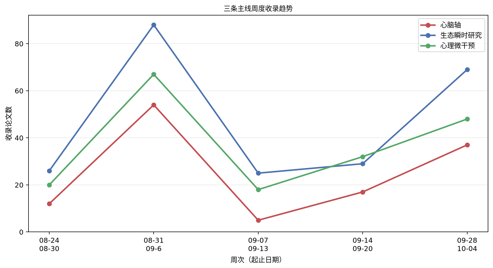

# 心脑、生态瞬时研究与心理微干预文献周报（2026-09-28 至 2026-10-04）

本期收录 118 篇文献。

## 重点推荐
收录 22 篇文献。

### 1. 青少年内感受的多模态研究及虚拟现实干预改善内感受障碍的方案

- 原文标题：Protocol for a Multimodal Investigation of Interoception in Adolescence and Testing Virtual Reality Interventions to Improve Interoceptive Impairments.
- 作者：Nathan M Boyle, Sarah H Guo, Madison M Angelo, Ann S Choe, Liuyi Chen, Martin A Lindquist, Angela S Guarda, Kellie Lk Tamashiro, Kimberly R Smith, Joseph F McGuire
- 期刊：JMIR research protocols，JCR Q3，IF 1.6（2025）
- 发表时间：2026-09-29
- 主题标签：心脑轴；心理微干预
- 关键词：内感受；虚拟现实干预；青少年精神疾病

**摘要**：背景：精神疾病主要起病于青少年期，是全球致残和致病的主要原因之一。内感受功能障碍被认为参与多种精神疾病的发生与维持，其特征是对内部身体信号的感知和解释出现紊乱。尽管内感受的重要性已被认可，但在青少年期这一伴随深刻神经生物学、生理和心理社会变化的关键发育阶段，内感受尚未得到充分刻画。因此，内感受功能障碍在精神疾病起病和进展中的确切作用仍不清楚。有必要开展研究以刻画青少年期内感受特征、阐明其对精神疾病的贡献，并确定能有效改善内感受障碍的干预措施。此类干预在设计时应考虑未来推广，优先兼顾可及性、可扩展性和标准化。虚拟现实（VR）是递送针对内感受的治疗技能的一种有前景的方法，其在干预递送过程中还可调动多种感觉系统（如视觉、听觉、身体信号）。这种沉浸式且可控的体验为在递送正念和放松训练等循证治疗策略时系统性地靶向内感受过程提供了独特平台。通过实现标准化递送和多感官体验的精确操控，VR可能克服传统干预方法在推广和可扩展性方面的关键障碍。目的：本项目对青少年内感受及相关学习过程进行多模态评估，并检验两种在VR中递送的单次干预是否改善内感受功能。方法：90名12至17岁青少年（60名伴有与内感受障碍相关精神疾病者，30名未受影响健康对照）将完成结构化诊断临床访谈和问卷评估组合，以刻画精神疾病的存在、精神症状严重程度、内感受觉察及相关构念（如睡眠、痛苦耐受、正念、自我效能）。青少年将完成经过验证的任务以评估内感受功能（如心脏内感受准确性、心率内感受觉察）和两种联想学习机制（如厌恶条件反射和奖赏学习）。心脏内感受将作为内感受功能的主要结局指标，同时探索其他系统的次要结局（如胃节律与神经活动之间的时间耦合）。最后，参与者将完成两种VR单次干预（即正念、放松训练），以检验其对内感受准确性和觉察的影响。结果：参与者招募于2024年12月开始。目前已有45名参与者入组。参与者平均年龄15.3±1.7岁，男女分布接近均衡。目前，伴与不伴精神疾病的青少年在人口学特征上无差异。结论：研究结果将为青少年内感受提供新见解，并阐明其在精神疾病发生和维持中的作用。该研究将为针对内感受的简短VR正念和放松干预的可行性和有效性提供初步证据，有助于为高危青少年的未来早期干预策略提供信息。临床试验：Open Science Foundation：9s48q；https://osf.io/9s48q（2024年5月4日注册）。

**原文链接**：[PubMed](https://doi.org/10.2196/103785)

### 2. 抑郁和焦虑症状的严重程度反映在消费级可穿戴戒指采集的生理与行为指标中

- 原文标题：Severity of depression and anxiety symptoms is reflected in physiological and behavioral metrics collected from a consumer-grade wearable ring.
- 作者：Saeid Azadifar, Alireza Sameh, Laura Nauha, Mikko Kärmeniemi, Maisa Niemelä, Vahid Farrahi
- 期刊：BMC medicine，JCR Q1，IF 8.7（2025）
- 发表时间：2026-09-29
- 主题标签：心脑轴；生态瞬时研究
- 关键词：可穿戴戒指；心率变异性；抑郁焦虑症状；生态瞬时研究；数字表型

**摘要**：背景：现代可穿戴设备可生成大量数字指标，可用于衡量人类在健康与疾病状态下的功能。本研究在一个大型人群队列中考察了消费级智能戒指生成的数字指标在抑郁和焦虑症状严重程度不同的个体之间是否存在差异以及如何不同。方法：横断面数据来自芬兰北部出生队列1986，参与者在33至35岁时被要求佩戴Oura Ring两周，该设备提供睡眠结构、夜间心率、以相邻正常心搏间期差值的均方根为指标的夜间心率变异性以及逐分钟运动强度的数字测量。纳入标准为至少有一个工作日和一个周末日佩戴时间不少于15小时。使用两种筛查工具评估抑郁和焦虑症状：广泛性焦虑障碍7项量表评估焦虑症状，Hopkins症状清单25评估抑郁和焦虑症状。根据GAD-7将参与者分为无、轻度和中重度焦虑症状组，根据HSCL-25分为有和无抑郁焦虑症状组。对时间序列数据进行可视化，并使用单因素协方差分析及Tukey事后检验评估组间统计差异。结果：共1290名参与者提供了足够有效数据并被纳入。经GAD-7评估为中重度焦虑以及经HSCL-25评估为有抑郁和焦虑症状的参与者，与无抑郁焦虑组相比，表现出较低的快速眼动睡眠和深睡眠百分比以及较高的浅睡眠。这两组还表现出更高的心率和睡眠期间更低的RMSSD，以及白天更低的体力活动水平。轻度焦虑组与无症状组及中重度焦虑组之间的差异总体上平均而言较不明显。结论：研究结果表明，抑郁和焦虑的严重程度可反映在消费级可穿戴戒指生成的行为和生理指标中。这些发现提示，此类设备可能是增强症状追踪和指导个性化照护策略的有前景工具。

**原文链接**：[PubMed](https://doi.org/10.1186/s12916-026-05276-y)

### 3. 使用心理生理结局识别日常护理实践中的压力相关事件——一项观察性多方法研究

- 原文标题：Identifying stress-relevant events in everyday nursing practice using psychophysiological outcomes - an observational multimethod study.
- 作者：Elizabeth A M Michels, Christian Rominger, Andreas R Schwerdtfeger, Georg F Kurze, Justus Klein, Jonas L Steinhäuser-Meerz, Hannah Tolle, Magdalena K Wekenborg
- 期刊：BMC nursing，JCR Q1，IF 5.2（2025）
- 发表时间：2026-09-29
- 主题标签：心脑轴；生态瞬时研究
- 关键词：生态瞬时评估；心率变异性；护士职业压力；心理生理监测；日常护理实践

**摘要**：背景：高压力工作条件在很大程度上导致护士的病假缺勤和劳动力短缺。然而，既往研究大多聚焦于一般性工作要求与资源，对哪些日常工作事件与急性应激反应相关所提供的洞见有限。本研究采用生态瞬时评估结合动态心率变异性（HRV）监测，考察护士工作期间与事件相关的观察者评定压力指标和生理压力指标。方法：对来自德国一所大学医院的护士开展了一项非干预性多方法现场研究。在8小时轮班期间，经过培训的观察者连续记录工作事件并评定瞬时压力，同时通过可穿戴心电图评估HRV（相邻RR间期差值的均方根；lnRMSSD）。事件被归类为临床护理负担、组织负担和积极事件。在控制身体活动的情况下，采用多层模型检验事件类别与观察者评定压力和lnRMSSD之间的关联。额外分析考察了个体特征（年龄、性别、慢性压力）和患者呼叫系统事件，包括呼叫原因。结果：分析了最多85名护士、1617个事件水平观测的数据。与其他事件类别相比，临床护理负担始终与更高的观察者评定压力相关，而积极事件与最低的观察者评定压力相关。对于HRV，临床护理负担与低于组织负担的lnRMSSD相关，而积极事件与其他类别之间未观察到显著差异。观察到性别与lnRMSSD之间存在探索性关联，男护士表现出更高的值。慢性压力与更高的观察者评定压力相关。患者呼叫系统事件在观察者评定压力或HRV方面与非呼叫工作事件无显著差异。然而，呼叫原因与观察者评定压力相关，与舒适和服务问题相关的呼叫相比急性医疗需求以及护理和移动支持呼叫被评定为压力更低。未发现显著的HRV关联。结论：护士的心理生理指标在日常工作事件之间存在差异，临床护理负担是最一致地与压力相关的事件类别。基于事件的评估与动态生理监测相结合在常规临床实践中可行，并能够以高生态效度识别压力相关情境。这些发现可为改善护士工作条件的有针对性干预提供信息。

**原文链接**：[PubMed](https://doi.org/10.1186/s12912-026-05434-w)

### 4. BRAIN-TIME：检验前瞻性恢复位置是否改变成瘾中同一干预的获益

- 原文标题：BRAIN-TIME: Testing Whether Prospective Recovery Position Modifies the Benefit of the Same Intervention in Addiction
- 作者：Anna Makarewicz, Remigiusz Recław, Anna Grzywacz, Krzysztof Chmielowiec, Łukasz Jaworski, Marta Kuczak-Wójtowicz, Jolanta Chmielowiec
- 期刊：Brain Sciences，JCR Q2，IF 3.4（2025）
- 发表时间：2026-09-29
- 主题标签：生态瞬时研究；心理微干预
- 关键词：即时适应性干预；动态治疗方案；恢复位置；治疗时机；成瘾

**摘要**：成瘾神经科学在识别涉及奖赏学习、显著性、认知控制、内感受、线索反应性和应激调节的脆弱性与机制方面已取得进展。然而，一个关键的转化问题仍未解决：不断演变的后扰动脑—行为轨迹何时才与治疗获益相关？预测模型可以估计未来的渴求、失误或恶化，适应性干预系统可以使用预先指定的调节变量来提供支持，但无论是动态治疗方案、即时适应性干预，还是因果机器学习，都没有明确规定一个时间量在能够作为调节变量本身之前必须满足什么证据标准。本视角文章追问：前瞻性恢复位置是否会改变同一干预的获益，并引入BRAIN-TIME作为一个可证伪的发作层级架构来回答该问题。它从一个明确的线索、应激、情感或睡眠相关扰动开始，相对于个体化参照追踪一个预先指定的恢复域，并将回顾性判定的持续重新进入与仅依据决策时点可用信息计算、不使用后续观察的前瞻性不完全恢复估计区分开来。其决定性的第一阶段检验是治疗效果调节：在一个共同的锁定标志点，同一干预和剂量的获益必须按预先指定的、具有实际意义的幅度随前瞻性估计的恢复位置而变化。最小概念验证结合了标准化低强度挑战、重复渴求或自主神经采样、独立的外向功能标准、阴性对照和随机固定内容干预。本文未报告原始数据，此处指定的每个量都是提议的构念、估计目标或证伪标准，而非观察到的结果。因此，BRAIN-TIME既不是复发分类器，也不是自主治疗规则。其核心主张刻意保持狭窄：只有当前瞻性发作位置被证明会改变同一干预的获益时，时间性恢复信息才与治疗时机相关。

**原文链接**：[Crossref](https://doi.org/10.3390/brainsci16101043)

### 5. 控制性深呼吸技术干预对年轻成人静息态EEG、主观心理困扰及执行功能表现的影响

- 原文标题：Controlled deep breathing technique intervention effects on resting EEG, subjective psychological distress, and executive function performance in young adults
- 作者：Ohav Ivgi, Oded Meiron
- 期刊：Frontiers in Public Health，JCR Q1，IF 4.1（2025）
- 发表时间：2026-09-29
- 主题标签：心脑轴；心理微干预
- 关键词：控制性深呼吸；脑电；心理困扰

**摘要**：控制性呼吸技术因其在情绪调节中的作用而受到广泛研究，但其对静息态神经振荡活动和心理困扰的影响仍未得到充分表征。本研究检验了控制性深呼吸技术（CDBT）干预是否能够调节健康成人的静息态脑电（EEG）活动和主观心理困扰。四十名健康成人（年龄18至40岁）被随机分配到实验组（CDBT）或对照组（自然呼吸）接受20分钟干预。在干预前后分别于睁眼和闭眼条件下记录静息态定量脑电（qEEG）。行为测量包括主观心理困扰评估和执行功能评估。静息态qEEG分析聚焦于额叶和顶叶电极的alpha/beta功率比。结果显示，与对照组相比，实验组alpha/beta比值显著升高，尤其在闭眼条件和顶叶电极处。实验组还表现出心理困扰评分的显著降低和执行功能测量的改善，而对照组未观察到显著变化。这些发现表明，CDBT可能调节与放松心理状态和执行功能改善相关的前额顶叶振荡动态，为CDBT可能影响健康成人的情绪调节和认知控制提供了初步证据。

**原文链接**：[Crossref](https://doi.org/10.3389/fpubh.2026.1952693)

### 6. 自主神经失衡作为慢性背痛疼痛预期与疼痛体验的预测因子：一项在混合方法设计中应用心率变异性生物反馈的初步研究方案（BACK.BEAT）

- 原文标题：Autonomic imbalance as a predictor of pain expectations and pain experience in chronic back pain: study protocol of a pilot study on the application of heart rate variability biofeedback in a mixed-methods design (BACK.BEAT).
- 作者：Sophie Schmitz, Bernd Löwe, Paul Hüsing
- 期刊：BMJ open，JCR Q2，IF 2.5（2025）
- 发表时间：2026-09-30
- 主题标签：心脑轴；生态瞬时研究；心理微干预
- 关键词：心率变异性生物反馈；慢性背痛；生态瞬时评估

**摘要**：引言：慢性背痛是全球致残的主要原因之一，日益被视为一种涉及伤害性、自主神经及认知情绪机制的生物心理社会状况。自主神经系统失调表现为心率变异性（HRV）降低，已被识别为慢性疼痛易感性的潜在生物标志物。同时，适应不良的疼痛预期会放大感知疼痛并导致症状持续。基于HRV的生物反馈通过节律性呼吸旨在恢复自主神经平衡，是调节慢性疼痛生理与心理层面的有前景但尚待深入探索的方法。本研究旨在考察慢性背痛个体日常HRV模式、疼痛预期与疼痛体验之间的关系，评估HRV生物反馈训练在改善HRV和减轻疼痛方面的可行性与有效性，并探索干预后患者疾病理解的潜在变化。方法与分析：本研究采用混合方法随机对照设计。慢性背痛参与者将被随机分配至HRV生物反馈干预组或对照组。将使用Garmin Vivosmart 5智能手表连续监测日常HRV，并与日常疼痛预期和体验相关联。实验室条件下的HRV生物反馈将使用NeXus-4生物反馈系统（MindMedia）进行。研究设计的可行性与可接受性将通过招募率、保留率、依从性以及研究程序和结局指标的适宜性进行分析。其次，HRV将使用时域（SDNN、RMSSD）和频域（lnLF、lnHF）参数进行分析。疼痛预期和日常疼痛体验将通过生态瞬时评估进行评估。定量分析将包括Pearson/Spearman相关、重复测量方差分析（ANOVA）（组×时间）和探索性回归模型。关于疾病感知的定性数据将进行主题分析。伦理与传播：本研究已获汉堡-埃彭多夫大学医学中心心理社会医学中心当地心理伦理委员会批准（LPEK-0866）。所有参与者将在参与前提供书面知情同意。研究结果将通过同行评审出版物、会议报告和学术论文传播，去标识化数据和分析代码将在伦理和法律可行的情况下依据可查找、可访问、可互操作、可重用（FAIR）数据原则提供。试验注册信息：本研究已在ISRCTN注册库注册（ISRCTN19147367）。

**原文链接**：[PubMed](https://doi.org/10.1136/bmjopen-2025-114578)

### 7. 相干呼吸与蓝光在急性应激后对工作场所环境中困倦感和应激反应的影响：一项随机双盲交叉试验

- 原文标题：The effects of coherent breathing and blue light after an acute stress on sleepiness and the stress response in a workplace setting: A randomized double-blind cross-over trial.
- 作者：Lucie Ráčková, Madison Diamond, Markéta Makarová, Pavel Morcinek, Inès Butin, Federico Nemmi, Stanislas Boyer, Laure Boyer, Julie Bienertová Vašků, Emma Chabani
- 期刊：PloS one，JCR Q2，IF 2.8（2025）
- 发表时间：2026-09-30
- 主题标签：心脑轴；心理微干预
- 关键词：相干呼吸；蓝光暴露；急性应激；工作场所干预；心率变异性

**摘要**：本研究评估了一种创新的三级应激管理干预在工作场所应用中的有效性，该干预通过ÉOS设备将0.1 Hz相干呼吸与蓝光暴露相结合。我们假设该干预比无外部刺激的被动休息更能有效缓解急性应激反应和困倦感。采用随机对照交叉双盲设计，在工作场所实验室环境中，对29名个体在暴露于马斯特里赫特急性应激测试后评估干预效果。使用线性混合效应模型评估主观应激（单条目量表）、困倦感（卡罗林斯卡困倦量表）、正负性情绪（正负性情绪量表），以及心率变异性（HRV）和脑电图指标。结果显示，该干预显著降低主观应激31.23%（CI 21.41%至41.83%），减少困倦感0.84分（SE 0.17），并增加正性情绪1.85分（SE 0.54）。对负性情绪、HRV、额叶alpha不对称性或theta/beta比率未发现显著影响。研究结果表明，将相干呼吸与蓝光暴露相结合能有效降低急性应激并改善情绪，且不引起困倦感，使其成为一种有前景的工作场所应激干预方法。本研究通过展示这些三级应激管理干预在改善职业环境中的幸福感和表现方面的潜力，为应激管理研究做出了贡献。未来研究应评估各成分的单独效应，考察长期结果，并纳入多样化人群以加强这些发现。

**原文链接**：[PubMed](https://doi.org/10.1371/journal.pone.0357293)

### 8. 从运动到情绪调节：基于运动的数字干预结合移动健康与生态瞬时评估促进老年人心理健康与认知功能：一项叙述性综述

- 原文标题：From movement to mood regulation: exercise-based digital interventions using mobile health and ecological momentary assessment for mental health and cognitive function in older adults: a narrative review
- 作者：Wenjie Wu
- 期刊：Frontiers in Psychiatry，JCR Q2，IF 3.8（2025）
- 发表时间：2026-09-30
- 主题标签：生态瞬时研究；心理微干预
- 关键词：生态瞬时评估；即时自适应干预；数字健康干预

**摘要**：本叙述性综述旨在综合当前关于将运动与移动健康技术及生态瞬时评估或干预（EMA/EMI）相结合以促进老年人心理与认知健康的证据。鉴于全球人口快速老龄化以及传统运动项目的高流失率，评估这些数字化、实时模态具有重要科学意义。为捕捉当前证据基础，研究在PubMed/MEDLINE、Scopus、Web of Science和Google Scholar进行了全面文献检索。纳入经同行评审的随机对照试验、试点研究和观察性设计，评估面向50岁及以上成年人的数字支持运动干预对心理与认知健康的作用，并进行叙述性综合。近期实证研究表明，数字模态（包括可穿戴活动监测器、智能手机应用和传感器触发的评估）在运动方案中的应用日益增多，以促进身体活动水平的实时追踪与调整。这些技术干预对心理与认知结局的潜在益处可能通过动态行为与神经生理反馈过程发挥作用。证据总体提示，较高的身体活动水平与情绪改善、抑郁症状减少和认知功能提升呈正相关，而久坐行为和疲劳则与不良情感结局相关。值得注意的是，采用EMA的研究揭示了相当大的个体内变异，表明动机、自我效能、压力、疲劳和社会情境的变化可能随时间影响行为参与和情绪反应性。生态瞬时干预和即时自适应干预进一步提示，在真实环境中提供的定制化运动提示可能有助于增加身体活动参与、减少久坐行为并改善部分认知结局，其潜在机制可能包括对自我调节、神经可塑性和适应性应激反应机制的情境敏感强化。总体而言，这些研究提供了新兴证据，支持以运动为导向的数字干预作为一种生物-数字框架，通过实时监测和适应性行为辅助促进老龄化人群的心理与认知健康。

**原文链接**：[Crossref](https://doi.org/10.3389/fpsyt.2026.1895581)

### 9. AppetiteCheck：瞬时迷走神经刺激作为进食行为内隐干预的可行性

- 原文标题：AppetiteCheck: Feasibility of Momentary Vagus Nerve Stimulation as an Implicit Intervention for Eating Behavior
- 作者：Tan Gemicioglu, Jas Brooks, Pedro Lopes, Tanzeem Choudhury
- 期刊：Proceedings of the ACM on Interactive, Mobile, Wearable and Ubiquitous Technologies，JCR Q1，IF 6.2（2025）
- 发表时间：2026-09-30
- 主题标签：心脑轴；心理微干预
- 关键词：迷走神经刺激；进食行为；心脑轴

**摘要**：过度进食和情绪性进食是常见的健康问题，即使没有进食障碍的人也会受到影响。迷走神经在肠脑轴中发挥关键作用，植入式迷走神经刺激器已被发现与食欲降低相关。本文提出经皮颈部迷走神经刺激（tcVNS）作为一种普适系统，可在进食过程中提供即时、低努力的干预。在一项24名参与者的研究中，我们在一次分心零食进食情境中评估了一款移动手持式tcVNS设备。结果发现，与假刺激相比，参与者在迷走神经刺激期间进食量减少了9.6%，进食速度减慢了23.6%。两种条件下餐后饱腹感相同，而迷走神经刺激期间心率更低。刺激被描述为细微且几乎难以察觉。总体而言，这些结果为非侵入性迷走神经刺激作为一种低注意力进食行为管理干预的可行性提供了证据，该干预可嵌入普适交互系统中。因此，我们将内隐界面的设计空间拓展至生理干预，推动未来将进食相关感知与低注意力干预相结合的普适系统。

**原文链接**：[Crossref](https://doi.org/10.1145/3831630)

### 10. MutterMeter：面向自我对话干预的耳戴式自我对话感知系统——基于层级声学-语言融合

- 原文标题：MutterMeter: Earable Sensing of Self-Talk through Hierarchical Acoustic-Linguistic Fusion toward Self-Talk Interventions
- 作者：Euihyeok Lee, Seonghyeon Kim, SangHun Im, Heung-Seon Oh, Seungwoo Kang
- 期刊：Proceedings of the ACM on Interactive, Mobile, Wearable and Ubiquitous Technologies，JCR Q1，IF 6.2（2025）
- 发表时间：2026-09-30
- 主题标签：生态瞬时研究；心理微干预
- 关键词：自我对话；耳戴式感知；生态瞬时评估；心理微干预；声学-语言融合

**摘要**：自我对话是一种有意义的心理信号，能够反映个体的情绪、动机和认知状态，但在日常生活中仍难以被捕捉。它常自发出现于压力、专注或反复决策的时刻，因此成为行为与认知干预（如教育性自我对话干预ESTI）的相关靶点。然而，ESTI在很大程度上依赖专家观察或回溯性自我报告，这限制了对转瞬即逝的自我对话模式的捕捉，也阻碍了其在真实环境中的可扩展性。为弥补这一空白，我们提出MutterMeter，一种移动式自我对话检测系统，可持续分析来自耳戴式麦克风的音频，并将话语分类为消极自我对话、积极自我对话和其他。以网球这一高压力且认知要求高的场景作为测试平台，MutterMeter采用层级框架，整合声学、语言和情境信息，同时自适应地平衡准确性与效率。在我们收集的首个此类数据集（34.5小时，n=29）上评估，MutterMeter在跨被试上取得宏平均F1分数0.815，优于基于大语言模型的模型和语音情绪识别模型等基线。此外，其自适应处理流程通过尽早确定高置信度案例来减少不必要的计算，同时保持稳健的检测性能。

**原文链接**：[Crossref](https://doi.org/10.1145/3831648)

### 11. 正念缓冲负性情绪对反刍的影响：一项基于正念干预的每日日记研究

- 原文标题：Mindfulness buffers the effect of negative affect on rumination: A daily diary study during a mindfulness‐based intervention
- 作者：Zitong Xin, Jialu Jin, Mo Chen, Stefan G. Hofmann, Xinghua Liu
- 期刊：Applied Psychology: Health and Well-Being，JCR Q2，IF 3.3（2025）
- 发表时间：2026-09-30
- 主题标签：生态瞬时研究；心理微干预
- 关键词：正念；负性情绪；反刍；每日日记；动态结构方程模型

**摘要**：负性情绪自动触发反刍是情绪困扰背后的核心病理机制。尽管正念被假设能够缓冲这一过程，但少有研究在系统干预过程中动态追踪这些效应。本研究采用单臂每日日记设计，在为期8周的正念干预（MBI）期间，考察每日正念是否缓冲负性情绪对反刍的影响。116名存在情绪困扰的参与者在MBI期间完成了对正念、负性情绪和状态反刍的每日评估。数据采用线性混合模型（LMM）和动态结构方程模型（DSEM）进行分析。LMM结果显示，MBI后参与者的每日正念显著提升，而每日负性情绪和状态反刍显著下降。鉴于单臂前后测设计缺乏对照组，这些前后变化应谨慎解读，不能完全归因于干预。DSEM结果表明，较高的每日正念缓冲了每日负性情绪对状态反刍的影响。进一步分析还提示，不同的正念成分在反刍的发生和维持中发挥不同作用。这些发现凸显了正念在削弱适应不良反刍中的保护作用，从而促进整体心理健康。

**原文链接**：[Crossref + PubMed](https://doi.org/10.1111/aphw.70230)

### 12. 超越二元：将数字健康干预的接受性操作化为时间到事件谱

- 原文标题：Beyond the Binary: Operationalizing Receptivity to Digital Health Interventions as a Time-to-Event Spectrum
- 作者：Samarth Negi, Varun Mishra, Chai Yin Kum, Oscar Castro, Tobias Kowatsch, Jacqueline L. Mair, Florian von Wangenheim
- 期刊：Proceedings of the ACM on Interactive, Mobile, Wearable and Ubiquitous Technologies，JCR Q1，IF 6.2（2025）
- 发表时间：2026-09-30
- 主题标签：生态瞬时研究；心理微干预
- 关键词：即时自适应干预；接受性；时间到事件建模；移动感知；自监督学习

**摘要**：即时自适应干预（JITAIs）旨在通过在对的时间提供对的支持来促进健康行为。JITAI效果的关键决定因素在于递送时机使用户处于接受状态，即接收、处理和使用支持的认知与行为容量。尽管既往研究已探索通过情境感知预测接受性，但标准方法通常将该构念在固定时间窗内操作化为二元结局，而理论定义将可用性描述为一种连续的、随时间变化的状态。在此粒度上建模接受性会增加学习复杂度，且深度序列模型在移动健康场景中还受限于标注交互数据的稀缺。为应对这些挑战，我们提出PRISM，一种深度学习框架，用于从纵向移动感知数据中将接受性建模为概率性时间到事件分布。PRISM将通道独立Transformer（PatchTST）编码器与离散时间生存目标相结合，并通过掩码片段重建对未标注传感器轨迹进行自监督预训练，以缓解标签稀缺问题。我们在LvL UP干预数据集上评估PRISM，利用初步研究数据进行预训练，并在大规模疗效试验上进行评估。结果表明，PRISM与既有接受性基准相比具有竞争力，自监督初始化在异质用户群体中使中位AUC提升高达15.5%。除单窗口评估外，PRISM在单一训练模型下跨多个决策时间范围保持稳定，而二元基线在每个截断点会退化或需要重新训练。在具有可变提示时机的独立数据集上的后续评估提供了初步证据，表明所学表征可跨队列和时间表迁移。这些发现提示，PRISM为在真实移动健康系统中部署稳健、时间感知的接受性模型提供了一条数据高效路径。

**原文链接**：[Crossref](https://doi.org/10.1145/3832017)

### 13. 每日心率变异性生物反馈练习对杏仁核结构协变网络的影响

- 原文标题：Effects of daily heart rate variability biofeedback practice on the amygdala's structural covariance network.
- 作者：Kalekirstos Alemu, Hyun Joo Yoo, Kaoru Nashiro, Jungwon Min, Padideh Nasseri, Christine Cho, Paul Choi, Shelby L Bachman, Shai Porat, Shubir Dutt, Julian F Thayer, Mara Mather
- 期刊：International journal of psychophysiology : official journal of the International Organization of Psychophysiology，JCR Q1，IF 3.3（2025）
- 发表时间：2026-08-30
- 主题标签：心脑轴；心理微干预
- 关键词：心率变异性生物反馈；杏仁核；结构协变；神经内脏整合；情绪调节

**摘要**：神经内脏整合模型认为，杏仁核与前额叶皮层之间的相互交互影响心率变异性与情绪调节。新近证据还提示，心率变异性会影响参与情绪调节的脑区。本研究在既往功能磁共振研究基础上，采用结构协变分析考察心率变异性生物反馈干预对杏仁核与皮层区域之间结构协变的影响。考察生物反馈干预期间杏仁核与皮层区域之间的协变，有助于理解心率变异性调节尝试如何影响参与心率变异性与情绪调节的神经结构。研究收集了151名参与者（100名年轻人和51名老年人）在完成5周每日生物反馈训练前后的MRI扫描，训练条件分为提高心率变异性（Osc+条件）或降低心率变异性（Osc-条件）。在两个年龄组中，两种干预条件与右侧杏仁核和左侧内侧前额叶皮层之间相反的结构协变模式相关。在Osc+条件下，左侧杏仁核的体积变化与右侧眶额皮层的体积变化呈反向关联，而Osc-条件下未观察到这种关联。这些发现与神经内脏整合模型的观点一致，即前额叶皮层对皮层下结构施加抑制性影响，且心率变异性影响参与情绪调节的脑区。

**原文链接**：[PubMed](https://doi.org/10.1016/j.ijpsycho.2026.113461)

### 14. 心率变异性作为多发性硬化症中自主神经（反应）活动与疲劳的生物标志物

- 原文标题：Heart rate variability as a biomarker of autonomic (re)activity and fatigue in multiple sclerosis.
- 作者：Guadalupe Garis, Carina Sander-Sandersfeld, Andrea Hildebrandt, Helmut Hildebrandt
- 期刊：Multiple sclerosis and related disorders，JCR Q2，IF 3.0（2025）
- 发表时间：2026-08-14
- 主题标签：心脑轴；心理微干预
- 关键词：心率变异性；自主神经系统；多发性硬化症；疲劳；心理干预

**摘要**：疲劳是多发性硬化症（MS）中一种使人衰弱的症状，与自主神经系统（ANS）功能障碍相关。心率变异性（HRV）提供了一种无创的ANS功能测量方法；然而，线性和非线性HRV参数在捕捉特定ANS（功能）障碍方面的相对敏感性仍不清楚。本研究调查了HRV参数的因子结构、它们对生物心理干预的反应，以及它们与MS相关疲劳的关系。汇总了两项临床试验的数据（N=78）。对时域、频域和非线性HRV参数进行了探索性因子分析（EFA）。重复测量方差分析检验了自我警觉训练（SAT；激活）、深呼吸（DB；放松）和渐进式肌肉放松（PMR；中间）对HRV的影响，并控制了年龄、抑郁和残疾。随后的回归分析调查了警觉任务期间HRV变化是否预测MS相关疲劳。EFA揭示了两个因子，可能反映副交感（PNS）或交感（SNS）活动。SAT降低了加载于两个因子上的HRV参数，DB增加了与主要反映SNS活动的因子相关的参数，PMR影响了两个因子。警觉任务期间SDNN变化减小预测了更高的特质疲劳，而状态疲劳与HRV无关。HRV有潜力在心理干预期间监测PNS-SNS相关活动，并测量MS相关特质疲劳中自主适应性的降低。

**原文链接**：[PubMed](https://doi.org/10.1016/j.msard.2026.107449)

### 15. 疑似缺血性心脏病患者情绪状态与心率变异性的关联：与日常生活中心脏症状的相关性

- 原文标题：Association of Emotional States With Heart Rate Variability in Patients With Suspected Ischemic Heart Disease: Relevant to Cardiac Symptoms During Daily Life.
- 作者：Tom Roovers, Ilse A C Vermeltfoort, Jos W Widdershoven, Willem J Kop
- 期刊：Biopsychosocial science and medicine，JCR 待 JCR 数据核验，IF matched
- 发表时间：2026-07-20
- 主题标签：心脑轴；生态瞬时研究
- 关键词：情绪状态；心率变异性；生态瞬时评估

**摘要**：目的：自主神经系统失调与心血管疾病风险相关。长期和短期情绪困扰也与不良心血管结局相关。然而，缺血性心脏病患者急性情绪状态与自主调节之间的关系仍不清楚。本研究考察即时情绪状态与反映自主活动的短期心率变异性指标之间的关联，以及它们在日常生活活动中对心脏症状的贡献。方法：因诱发性心肌缺血而转诊接受诊断性心肌灌注显像的患者，通过手机电子日记接受为期24小时的情绪状态和心脏症状生态瞬时评估。基于动态心电图的心率变异性指标（重复10分钟时段及24小时）与生态瞬时评估相匹配。关联采用广义估计方程模型分析。结果：共在26名患者中获得175次生态瞬时评估（平均年龄66.5岁，标准差9.3，女性7名，占26.9%）。负性情绪状态与心率变异性指标（正常至正常间期标准差和低频功率降低）及较高心率相关。负性情绪状态与心绞痛主诉（B=0.167，95%置信区间0.067至0.268，p<.001）和呼吸困难（B=0.136，95%置信区间0.071至0.202，p<.001）相关。较低的心率变异性指标也与这些心脏症状相关。心肌灌注显像中的缺血与24小时低频心率变异性呈负相关，但与日常生活中的负性情绪或心脏症状无关。结论：负性情绪与自主调节的潜在不良变化相关，并促成心脏症状。这些结果凸显了即时情绪状态对于理解自主神经失调和心血管症状的价值。

**原文链接**：[PubMed](https://doi.org/10.1097/psy.0000000000001508)

### 16. 血管收缩作为进食障碍的可转化靶点：自主神经失调、岛叶机制与新型多模态检测系统

- 原文标题：Vasoconstriction as a translational target in eating disorders: Autonomic dysregulation, insular mechanisms, and a novel multimodal detection system.
- 作者：Rachel D Torres, Lauren Harris, Cheri A Levinson
- 期刊：Neuroscience and biobehavioral reviews，JCR Q1，IF 8.5（2025）
- 发表时间：2026-07-17
- 主题标签：心脑轴；生态瞬时研究
- 关键词：血管收缩；自主神经失调；内感受；可穿戴传感器；神经性厌食症

**摘要**：进食障碍，尤其是神经性厌食症与非典型神经性厌食症（合称神经性厌食症谱系障碍），仍是最致命的精神疾病之一，复发率高且成人有效治疗有限。自主神经失调与内感受功能障碍已成为症状维持的重要机制候选因素，但现有框架尚未将这些过程整合为一个连贯且具生理基础的模型。本理论性论文提出，血管收缩——即交感神经介导的外周血管狭窄——是神经性厌食症谱系障碍中内感受、情绪与行为紊乱的一个具有机制意义且被低估的贡献因素。血管收缩塑造岛叶可获得的感觉证据，影响饥饿、温度与内脏线索的清晰度，并可能促成病理性运动、情绪抑制、焦虑与复发易感性。为操作化这一构念，我们提出一种多模态血管收缩检测器：一种基于可穿戴设备的、由皮肤电活动、血容量脉搏振幅与外周温度构成的z分数复合指标。该原型检测器在LabVIEW/Python流程中实现，可提供适合自然情境监测的连续血管张力指数。通过整合自主神经生理学、内感受科学与可穿戴传感器方法学，本框架将血管收缩定位为一个理论上连贯的候选生物标志物，可能阐明神经性厌食症谱系障碍的潜在机制并支持未来的转化研究。

**原文链接**：[PubMed](https://doi.org/10.1016/j.neubiorev.2026.106879)

### 17. 经皮耳迷走神经刺激联合经皮穴位电刺激治疗精神分裂症阴性症状的疗效及EEG-ECG机制：一项2×2析因随机对照试验方案

- 原文标题：Efficacy and EEG-ECG mechanisms of taVNS combined with TEAS for negative symptoms of schizophrenia: a protocol for a 2 × 2 factorial randomized controlled trial.
- 作者：Shumin Zhang, Yi Gong, Bingkui Zhang, Yapeng Cui, Yuanzheng Deng, Qifu Li, Wenjun Li, Vanhao Lo, Jun Qian, Fanrong Liang, Taipin Guo, Jinbo Sun
- 期刊：European archives of psychiatry and clinical neuroscience，JCR Q1，IF 3.9（2025）
- 发表时间：2026-07-16
- 主题标签：心脑轴；心理微干预
- 关键词：经皮耳迷走神经刺激；经皮穴位电刺激；精神分裂症阴性症状；EEG-ECG；随机对照试验

**摘要**：精神分裂症阴性症状（NSS）是该障碍的核心特征，与沉重的疾病负担和不良功能预后相关，而当前治疗选择仍然有限。鉴于这一未被满足的临床需求，我们将探索一种联合非药物干预的治療潜力，即经皮耳迷走神经刺激（taVNS）与经皮穴位电刺激（TEAS）的联合应用。在这项采用2×2析因设计的单盲、前瞻性、随机对照试验中，120名NSS参与者将按1:1:1:1比例随机分配至四组：taVNS联合TEAS、taVNS联合假TEAS、假taVNS联合TEAS、假taVNS联合假TEAS。参与者将接受每次30分钟、隔日一次、持续4周的治疗，随后进行4周随访。主要结局是第4周干预结束时相对于基线的阳性与阴性症状量表阴性症状因子分（PANSS-FSNS）的降低。本研究旨在评估taVNS和TEAS治疗NSS的单独及联合疗效与安全性。此外，将采用双模态同步脑电图（EEG）和心电图（ECG）记录，以探究干预背后的神经生理机制以及与治疗效果相关的潜在电生理变化。试验注册：国际传统医学临床试验注册平台（ITMCTR2025000634）；注册日期：2025年4月2日。

**原文链接**：[PubMed](https://doi.org/10.1007/s00406-026-02328-5)

### 18. 针对归属感与负担感的移动健康干预实施：一项关于LGBTQ+个体自伤想法与行为的生态瞬时评估研究

- 原文标题：Implementation of Mobile Health Intervention Targeting Belongingness and Burdensomeness: An Ecological Momentary Assessment Study of Self-Injurious Thoughts and Behaviors in LGBTQ+ Individuals.
- 作者：Konrad Bresin, Michaela S Ahrenholtz, Julia K Nicholas, MacKenzie Bewley
- 期刊：Suicide & life-threatening behavior，JCR Q2，IF 2.5（2025）
- 发表时间：2026-10
- 主题标签：生态瞬时研究；心理微干预
- 关键词：生态瞬时评估；移动健康干预；自伤想法与行为

**摘要**：目的：本文旨在检验一项旨在减少LGBTQ+个体自伤想法与行为的移动健康干预。该干预由旨在增强归属感与意义感的简短信息组成。方法：我们招募了过去一个月内有自伤想法和/或行为的LGBTQ+个体（N=55）。参与者完成了14天的生态瞬时评估，测量少数群体压力、受挫的归属感、感知到的负担感以及自伤想法与行为。随后，参与者被随机分配接受旨在灌输归属感与意义/目的的简短信息，或在14天内不接受干预。之后，参与者又完成了额外14天的生态瞬时评估。结果：结果显示，对照组参与者的自伤想法与计划随时间显著增加，而干预组参与者则没有显著变化。对于自伤行为、受挫的归属感和感知到的负担感，干预组显著下降，而对照组没有变化。结论：这些结果为自杀的人际理论提供了支持，并表明了一种具有潜在可扩展性的移动健康干预。公共卫生意义：本文发现证据表明，一项简短的移动健康干预减少了LGBTQ+个体的自杀性和非自杀性自伤想法与行为。

**原文链接**：[PubMed](https://doi.org/10.1111/sltb.70138)

### 19. 使用Headspace检验正念技能在初学者冥想者中的变化：以特质正念和感知压力为调节变量

- 原文标题：Testing How Mindfulness Skills Change for Novice Meditators Using Headspace: Examining Trait Mindfulness and Perceived Stress as Moderators.
- 作者：Mercedes Peña, Matthew J Zawadzki, Larisa Gavrilova, Martin S Hagger
- 期刊：Stress and health : journal of the International Society for the Investigation of Stress，JCR Q2，IF 2.9（2025）
- 发表时间：2026-10
- 主题标签：生态瞬时研究；心理微干预
- 关键词：正念干预；生态瞬时评估；感知压力；特质正念；注意与接纳

**摘要**：基于正念的干预能有效减轻压力并改善心理健康结果，但注意与接纳这两项正念技能在干预过程中如何发展仍不清晰，对首次学习这些技能的初学者冥想者尤为如此，也包括是否某些个体更易习得这些技能。本研究采用随机等待名单对照试验，检验Headspace应用程序在8周内对正念冥想新手注意与接纳变化的影响，并检验特质正念与感知压力的调节作用。非教职大学员工被随机分配到Headspace组或等待名单对照组，基线测量特质正念与感知压力。注意与接纳的生态瞬时评估调查数据在基线以及随机化后第2、5、8周以每天5次、连续4天的burst方式采集。结果显示，Headspace组第8周的注意与接纳显著高于基线，而对照组无此变化；Headspace组两项技能在第2周即出现显著变化。特质正念调节该效应，特质正念较低者在注意上提升更大，但接纳无此调节；感知压力也调节该效应，感知压力较低者在注意与接纳上提升更大。讨论部分关注将干预内容与个体需求匹配的意义，以确保不同特征水平的参与者都能从正念训练中获益。

**原文链接**：[PubMed](https://doi.org/10.1002/smi.70215)

### 20. 负性解释的瞬时持续性作为情绪痛苦的动态标记

- 原文标题：Momentary persistence of negative interpretations as a dynamic marker of emotional distress.
- 作者：Lisa M W Vos, Peter Kuppens, Tom Smeets, Jonas Everaert
- 期刊：Journal of psychopathology and clinical science，JCR Q1，IF 4.6（2025）
- 发表时间：2026-08-17
- 主题标签：生态瞬时研究；心理微干预
- 关键词：生态瞬时评估；负性解释持续性；认知情绪循环

**摘要**：负性解释的僵化修正已被认为与抑郁和社交焦虑有关，但现有证据主要来自依赖标准化虚构情境的受控认知任务研究。为追踪负性解释在日常生活中如何随时间持续，本研究开发了日常生活解释僵化任务（DL-IIT），并将该认知任务嵌入生态瞬时评估（EMA）方案中。DL-IIT旨在捕捉瞬时负性解释的出现与持续，并检验其与瞬时情绪及症状严重程度的动态联系。报告有不同程度抑郁和社交焦虑症状的社区成年人（N=179）参与了为期14天的EMA方案（完成12,950份EMA调查），测量瞬时解释与情绪。预注册的多层分析显示，较高的抑郁和社交焦虑症状各自与更大的瞬时负性解释持续性相关。在个体内水平上，负性解释的持续性预测随后负性情绪的增加，但不预测正性情绪的减少。在相反方向上，较高的负性情绪和较低的正性情绪预测随后更大的负性解释持续性。这些心境一致性情绪对认知的效应在症状严重程度较高时更强。补充的动态结构方程模型揭示了负性解释持续性与负性情绪之间的双向交叉滞后关联，以及与正性情绪之间的小幅双向效应。在所有模型中，情绪到认知的路径强于认知到情绪的路径。总体而言，这些发现表明负性解释的持续性既是一种与症状相关的个体差异标记，也是一种可能促成日常生活中自我强化认知—情绪循环的瞬时过程。DL-IIT提供了一种可扩展的方法，用于识别可通过即时干预以增强认知灵活性来靶向的高风险时刻。

**原文链接**：[PubMed](https://doi.org/10.1037/abn0001166)

### 21. 数字正念干预对轻中度晚年抑郁症的效果：一项随机对照试验

- 原文标题：Effect of a digital mindfulness intervention for mild-to-moderate late-life depression: A randomized controlled trial.
- 作者：Kemeng Zhu, Maoxin Hu, Chaomeng Liu, Yida Wang, Chengwei Guo, Haotian Shen, Nan Ding, Xiao Wang, Li Ren, Qinge Zhang
- 期刊：Journal of psychiatric research，JCR Q2，IF 3.6（2025）
- 发表时间：2026-06-06
- 主题标签：心脑轴；心理微干预
- 关键词：数字正念干预；晚年抑郁症；脑电图反馈；随机对照试验；心理微干预

**摘要**：背景：晚年抑郁症（LLD）在老龄化人群中日益成为公共卫生问题。尽管数字正念干预对抑郁、焦虑和失眠显示出前景，但其在患有LLD的老年人中的疗效及脑电图（EEG）相关指标仍不明确。本研究评估了FocusZen正念减压系统——一种带有EEG反馈的数字正念干预——对轻中度LLD的作用。方法：54名轻中度LLD参与者被随机分配至为期6周的干预组（n=27；每日进行FocusZen训练）或对照组（n=27；一般健康教育）。主要结局为HAMD-17评分变化。次要结局包括焦虑、睡眠质量、认知及额叶EEG频谱活动。数据采用混合效应模型和意向性治疗原则分析。结果：干预组在抑郁症状[HAMD-17：F(3, 132.69)=8.83，P<0.001]、焦虑[HAMA：F(3, 129.95)=8.34，P<0.001]和睡眠障碍[PSQI：F(3, 128.91)=5.55，P=0.01]方面显著降低，同时认知改善[MOCA：F(3, 133.19)=5.14，P=0.01]。干预组的应答率和缓解率更高。探索性EEG分析显示额叶theta[F(1.96, 43.12)=25.28，P<0.001]和alpha活动[F(1.44, 31.73)=22.92，P<0.001]增加。结论：基于FocusZen的数字正念减轻了轻中度LLD的抑郁、焦虑和睡眠症状并改善了认知，可能伴随额叶theta和alpha活动增强。试验注册：中国临床试验注册中心标识符：ChiCTR2400086063；https://www.chictr.org.cn/。

**原文链接**：[PubMed](https://doi.org/10.1016/j.jpsychires.2026.05.037)

### 22. 阿尔茨海默病中的无创神经调控：迈向以脑—心耦合作为生物标志物引导适应性干预的候选框架

- 原文标题：Non-invasive neuromodulation in Alzheimer's disease: toward brain-heart coupling as a candidate framework for biomarker-guided adaptive intervention.
- 作者：Weiran Zheng, Yuyu Ma, Chi Su, Zhiying Qiu, Ziyi Yan, Guizhi Xu, Duyan Geng, Alan Wang
- 期刊：Reviews in the neurosciences，JCR Q1，IF 4.8（2025）
- 发表时间：2026-10-02
- 主题标签：心脑轴；心理微干预
- 关键词：脑—心耦合；无创神经调控；心率变异性；中枢自主网络；生物标志物引导适应性干预

**摘要**：阿尔茨海默病已进入以生物学信息为基础的疾病修饰治疗时代，但持久的临床获益仍然有限，凸显了对补充性干预的需求。无创神经调控已成为一种有前景的策略，但该领域目前仍主要按设备类别、刺激靶点和短期认知结局来组织。仅凭这一框架难以解释研究中报道的显著异质性、阶段依赖性和有限的持久性。本叙述性综述综合了重复经颅磁刺激、经颅电刺激、感觉伽马夹带、聚焦超声、光生物调节和经皮迷走神经刺激的临床、临床前和机制证据。我们提出，设备分类是有用的起点，但作为解释框架并不完整，因为不同模态在不同证据水平上与涉及网络重构、自主神经调节、神经血管功能、炎症信号和清除相关生物学的重叠过程相关联。在此背景下，我们考察脑—心轴和中枢自主网络作为候选中间层面，在该层面上，刺激引起的中枢神经和外周生理反应可能被联合表征。基于这一观点，我们提出一个生物标志物层级，从心率变异性延伸到方向性和时变脑—心耦合测量，这些测量可作为生理状态、靶点参与和治疗反应性的候选标志物进行检验。然而，目前尚无前瞻性证据表明脑—心耦合因果性地中介了神经调控在阿尔茨海默病中的治疗效果。因此，我们将脑—心耦合作为一个可检验的候选框架，用于研究状态依赖性、靶点参与，并最终实现生物标志物引导的适应性神经调控。

**原文链接**：[PubMed + Crossref](https://doi.org/10.1515/revneuro-2026-0134)

## 心脑轴
收录 23 篇文献。

### 1. 注意转移无法抑制恐音症患者对触发声音的自主神经反应

- 原文标题：Autonomic responses to trigger sounds persist despite attentional redirection in misophonia.
- 作者：Marie-Anick Savard, Mary Brooks, Emily B J Coffey, Mickael L D Deroche
- 期刊：International journal of psychophysiology : official journal of the International Organization of Psychophysiology，JCR Q1，IF 3.3（2025）
- 发表时间：2026-09-28
- 主题标签：心脑轴
- 关键词：恐音症；自主神经系统；注意调节

**摘要**：恐音症是一种以特定声音触发过度情绪反应和自主神经唤醒增强为特征的障碍。尽管有证据表明高层认知过程参与恐音症，但尚不确定这些过程能否用于调节对触发声音的恐音反应。基于恐音症个体常报告听音乐作为应对机制的观察，本研究考察了将注意指向音乐如何调节恐音症个体在触发声音存在时的生理反应。患有和未患恐音症的参与者完成一项任务，即选择性地注意一只耳中的音乐，同时另一只耳播放声音（触发音、不愉快音或中性音）。研究连续记录了反映自主神经系统状态的指标（即瞳孔大小、皮肤电传导反应和心率）。恐音症患者对触发声音的生理反应（皮肤和瞳孔反应）与对照组相比表现出更高的唤醒，尤其是在静音条件下。这种对触发音的高唤醒在双流条件下持续存在，无论注意焦点如何，表明指向音乐的注意未能有意义地减弱两组参与者的触发反应。主观评分与生理测量大致一致，显示恐音症患者和面对一般不愉快声音时认知负荷更高（与注意条件无明显交互作用）。总体而言，这些数据展示了恐音症患者在暴露于触发音时所经历的预期生理和主观反应，但表明一旦触发识别发生，将注意转向音乐不足以调节这种反应。

**原文链接**：[PubMed](https://doi.org/10.1016/j.ijpsycho.2026.113476)

### 2. 感知心脏，看见世界：内感受与外感受之间注意分配的神经机制

- 原文标题：Sensing the heart, seeing the world: Neural mechanisms of attentional allocation between interoception and exteroception
- 作者：Sukhbinder Kumar, Joel S Winston, Hugo D Critchley, Timothy D Griffiths
- 期刊：未提供，JCR 待 JCR 数据核验，IF 待 JCR 数据核验
- 发表时间：2026-09-28
- 主题标签：心脑轴
- 关键词：内感受；外感受；注意分配；岛叶；心跳计数

**摘要**：适应性行为需要在来自外部环境的感觉信息（外感受）与源自体内的信号（内感受）之间灵活分配注意。虽然支持外感受注意的神经机制已被充分表征，但关于注意如何在相互竞争的内感受与外感受信息之间进行分配，人们所知甚少。我们使用功能性磁共振成像，将心跳计数期间的心脏内感受注意与匹配的视觉目标计数任务进行比较。两种任务期间的外部视觉输入完全相同，且行为准确性与主观信心在两种条件间无显著差异，从而提供了将注意指向内部或外部信息的受控比较。心脏内感受注意与视觉外感受注意主要激活了彼此不同的皮层网络。心脏注意招募了一个以岛叶为中心的分布式网络，支持内感受加工与认知控制；而视觉注意则激活了背侧额顶网络，并选择性地塑造视觉皮层活动，增强表征任务相关中央视觉信息的区域，同时抑制表征任务无关外周信息的区域。尽管存在这种功能分离，这些系统内的活动仍依赖于注意分配。外感受注意抑制了后岛叶活动，提示内感受加工被下调；而在内感受注意期间，外周视觉区域保持被抑制状态，提示外部导向的感觉加工被下调。更准确的心跳计数与右侧顶下小叶参与程度较低相关，这与外部感觉信息自下而上注意捕获减少相一致。总之，这些发现支持支持内部身体信号与外部感觉信息的神经系统之间存在注意资源的竞争性分配，为内感受与外感受注意提供了系统层面的解释。

**原文链接**：[Crossref](https://doi.org/10.64898/2026.09.22.751480)

### 3. 健康科学学生网络疑病症、负性情绪与人体测量指标同心率变异性的关系：一项关于数字健康信息行为的心理生理学研究

- 原文标题：The Relationship of Cyberchondria, Negative Affect, and Anthropometric Indices with Heart-Rate Variability Among Health Sciences Students: A Psychophysiological Study of Digital Health-Information Behavior
- 作者：Tuğçe Orkun Erkılıç, Bülent Bayraktar, Seda Çelikel Taşci
- 期刊：Behavioral Sciences，JCR Q1，IF 3.2（2025）
- 发表时间：2026-09-28
- 主题标签：心脑轴
- 关键词：网络疑病症；心率变异性；负性情绪

**摘要**：背景：我们考察了健康科学学生中网络疑病症是否与静息心率变异性（HRV）相关。方法：在这项针对土耳其600名学生的横断面研究中，我们使用12条目网络疑病症严重程度量表（CSS-12）评估网络疑病症，使用21条目抑郁焦虑压力量表（DASS-21）评估负性情绪，并测量自我报告的屏幕暴露、人体测量指标以及五分钟静息HRV。相邻RR间期差值的均方根（RMSSD）是主要生理结局。分层模型先纳入人口学变量、腰高比和身体活动，然后纳入屏幕暴露和焦虑，最后纳入CSS-12。结果：CSS-12与RMSSD呈负相关（r = −0.412）。在协变量调整后，CSS-12与较低的RMSSD相关（β = −0.256；p < 0.001），使解释方差增加4.9%（最终调整R2 = 0.272）。腰高比显示出较小的负向关联（β = −0.087）。总体而言，四因子CSS-12模型拟合良好；学术项目之间的比较未调整且为探索性。结论：在调整所测量的一般焦虑和总屏幕暴露后，较高的CSS-12得分与较低的静息RMSSD相关。未测量健康焦虑；因此，该模型无法确定这种关联反映的是网络疑病症相关行为、重叠的健康焦虑，还是其他未测量的心理和生理因素。未来需要纳入经验证的健康焦虑评估以及详细数字行为和HRV测量的前瞻性研究。

**原文链接**：[Crossref](https://doi.org/10.3390/bs16101759)

### 4. 综合瑜伽与瑜伽睡眠干预对学龄儿童心率变异性及自主神经功能的影响：一项实验研究

- 原文标题：Effects of an Integrated Yoga and Yoga Nidra Intervention on Heart Rate Variability and Autonomic Function in School-Aged Children: An Experimental Study
- 作者：Revathi Dama, Larry Seidlitz
- 期刊：Aathiyoga Indian Journal of Ancient Medicine and Yoga，JCR 待 JCR 数据核验，IF 待 JCR 数据核验
- 发表时间：2026-09-28
- 主题标签：心脑轴；心理微干预
- 关键词：心率变异性；自主神经功能；瑜伽睡眠；学龄儿童；副交感神经

**摘要**：背景：心率变异性（HRV）是心脏自主神经调节的可靠、非侵入性生物标志物。尽管有证据支持瑜伽练习可调节成人的自主神经功能，但儿科研究仍然有限。目的：本研究考察了一项综合瑜伽干预——包括蜂鸣式调息、手印、船式及瑜伽睡眠——对学龄儿童（8至12岁）16项综合HRV指标的急性效应。方法：来自印度泰米尔纳德邦奥罗维尔的82名学生被随机分配到干预组（n=41）和对照组（n=41）。HRV在三个阶段连续记录：干预前（3分钟）、瑜伽睡眠期间（20分钟）和干预后（3分钟）。通过LF/HF比值降低识别出相同的41名应答者。采用重复测量方差分析及Bonferroni校正的两两比较对16项HRV指标进行分析。结果：RMSSD（F=3.38，p=.037，η²=.053）、PNS指数（F=3.18，p=.045，η²=.050）、SNS指数（F=4.03，p=.020，η²=.063）、压力指数（F=3.98，p=.021，η²=.062）和SD1（F=3.33，p=.039，η²=.053）均观察到显著的总体效应。干预前至干预后的比较显示，副交感神经标志物显著增强（RMSSD：d=−0.44；PNS指数：d=−0.42；pNN50：d=−0.51），交感神经标志物显著降低（SNS指数：d=0.52；压力指数：d=0.53）。结论：该综合瑜伽干预在学龄儿童中产生了统计学显著且具有临床意义的向副交感神经优势的转变。

**原文链接**：[Crossref](https://doi.org/10.63300/ajmay04072026.03)

### 5. 内感受觉察与对不愉快图片增强的神经反应相关

- 原文标题：Interoceptive Awareness is Associated with Enhanced Neural Response to Unpleasant Images.
- 作者：Rebecca J Compton, Tiffany Mikulis, Caroline Frost, Danylo Shudrenko, Rosaleen Cochran, Trinity Ellis, Aidan O'Sullivan, Tapsi Suryawanshi, Nadine Tang
- 期刊：Social cognitive and affective neuroscience，JCR Q1，IF 3.6（2025）
- 发表时间：2026-09-29
- 主题标签：心脑轴
- 关键词：内感受觉察；晚期正电位；情绪加工

**摘要**：内感受，即对内部身体信号的感知，被认为对情绪体验和认知具有重要贡献，而内感受信念的个体差异可能影响对情绪信息的认知加工。针对这一问题，本研究考察了自我报告的内感受觉察与情绪性图片相对于中性图片的动机性注意EEG标记之间的相关性。115名本科生在记录EEG的同时观看中性、愉快和不愉快场景图片，并提取每种图片类型的晚期正电位（LPP）。群体结果重复了先前发现，即愉快和不愉快图片相比中性图片引发增强的LPP信号。此外，不愉快图片（相对于愉快或中性图片）LPP增强程度更大与自我报告的内感受觉察呈正相关。结果支持内感受信念在情绪信息皮层加工中的作用。

**原文链接**：[PubMed](https://doi.org/10.1093/scan/nsag081)

### 6. 多模态艺术干预促进孤独大学生心理繁荣：心理与探索性神经生理结果

- 原文标题：Multimodal art intervention for flourishing in lonely university students: psychological and exploratory neurophysiological outcomes
- 作者：Wen Zhang, Siyu Tian, Ruikai Yuan
- 期刊：Frontiers in Psychology，JCR Q1，IF 3.8（2025）
- 发表时间：2026-09-29
- 主题标签：心脑轴；心理微干预
- 关键词：多模态艺术干预；孤独感；心理繁荣；脑电图；积极情感

**摘要**：引言：孤独感在大学生中高度普遍，并与积极功能下降相关。然而，针对该群体繁荣相关结果的多模态艺术干预证据仍然有限。本研究考察为期八周、基于团体的多模态艺术干预是否能改善孤独大学生的心理繁荣、状态积极情感、审美体验以及探索性可穿戴脑电图指标。方法：60名孤独感偏高（UCLA孤独量表20题版本得分≥44）且心理健康未达繁荣状态（采用心理健康连续体简版评估）的学生被随机分配到干预组（n=30）或等待名单对照组（n=30）。干预包括八次每周团体课程，整合引导式音乐聆听、视觉创作、动作或角色扮演以及团体分享。结果随时间评估并分析组别×时间交互。结果：在繁荣、积极情感、审美体验和放松指数上观察到显著的组别×时间交互；注意力指数的组别×时间交互不显著。讨论：研究结果提供初步证据表明，基于团体的多模态艺术干预可能增强孤独大学生的审美投入、积极情感、心理繁荣和基于α波的放松，尽管注意力相关脑电指标未发生变化。多模态艺术项目可能为支持大学生福祉提供可行且可及的方法。

**原文链接**：[Crossref](https://doi.org/10.3389/fpsyg.2026.1908723)

### 7. D-STRESS：一种基于虚拟现实的客观高效工具用于检测军人亚临床PTSD

- 原文标题：D STRESS, an objective and efficient virtual reality-based tool to detect subthreshold PTSD in military population.
- 作者：Fanny Levy, Louis Humbert, Oumou Salama-Daouda, Sonia Pellissier, Jean-Pierre Simson, Sebastien Peyrefitte, Pierre Mahé, Christophe Trouvé, Christophe Rouquet, Ouamar Ferhani, Thomas Constant, Guillaume Levieux, Matthieu Montès, Damien Claverie, Marion Trousselard
- 期刊：Journal of psychiatric research，JCR Q2，IF 3.6（2025）
- 发表时间：2026-09-30
- 主题标签：心脑轴
- 关键词：亚临床PTSD；心率变异性；虚拟现实；自主神经系统；军事人员

**摘要**：背景：创伤后应激障碍（PTSD）在军人中高度流行。亚临床PTSD（sub-PTSD）尤其值得关注，因其可能进展为完全PTSD、伴随共病（尤其是自杀风险增加）以及对作战能力的负面影响。当前检测方法受限，尤其是与心理健康筛查相关的污名化问题。目的：本研究旨在验证一种客观工具D-STRESS，利用虚拟现实场景中采集的生理与行为数据检测军人亚临床PTSD。方法：84名现役参与者依据CAPS-5标准被分为四组：无PTSD（CAPS=0）、轻度亚临床PTSD（0<CAPS≤1）、中度亚临床PTSD（1<CAPS<2）和完全PTSD（CAPS≥2）。志愿者在旨在凸显与创伤相关恐惧条件化有关的多感官整合损伤的日常生活虚拟现实环境中导航。记录心率变异性（HRV）、皮肤电导、呼吸频率、体温以及行为测量和脑电活动数据。构建逻辑回归模型生成风险评分。结果：模型在区分中度亚临床PTSD与无PTSD组时达到76-88%的准确率和0.73-0.88的AUC值。最具判别力的变量为HRV参数和皮肤电导指标。结论：D-STRESS是一种有前景的、客观且无污名化的工具，用于检测军人群体中的亚临床PTSD。通过利用自主神经系统功能的副交感与交感标志物，它提供了传统方法的有效替代方案。需要在更大、更多样化的样本中进一步验证以确认其适用性和可靠性。

**原文链接**：[PubMed](https://doi.org/10.1016/j.jpsychires.2026.09.031)

### 8. 左侧与右侧DLPFC高频重复经颅磁刺激对担忧与副交感心脏控制的影响

- 原文标题：Effects of HF-rTMS over left and right DLPFC on worry and parasympathetic cardiac control.
- 作者：Renke Keppens, Viviana Verde, Laís B Razza, Stefanie De Smet, Aaron Van Boven, Jens Allaert, Marie-Anne Vanderhasselt, Chris Baeken, Stefan Duschek, Gustavo A Reyes Del Paso, Casandra I Montoro, Rudi De Raedt, Matias M Pulopulos
- 期刊：International journal of psychophysiology : official journal of the International Organization of Psychophysiology，JCR Q1，IF 3.3（2025）
- 发表时间：2026-09-30
- 主题标签：心脑轴
- 关键词：高频重复经颅磁刺激；背外侧前额叶皮层；心率变异性；担忧；副交感心脏控制

**摘要**：背外侧前额叶皮层（DLPFC）是调节侵入性思维与担忧的核心区域，但这些过程的偏侧化及其神经生理机制仍不清楚。以心率变异性（HRV）为指标的副交感心脏控制被认为与前额叶对情绪、认知和自主调节相关脑区的控制有关，但将这两个领域联系起来的实证证据并不一致。在这项预注册、单盲、假刺激对照、被试内设计中，我们考察了左侧与右侧DLPFC高频重复经颅磁刺激（HF-rTMS）对31名健康被试副交感心脏控制、担忧和侵入性思维的影响。HRV在静息状态和呼吸聚焦任务（BFT）中评估，BFT是一种经过验证的范式，用于测量注意聚焦、自发侵入性思维和担忧。与预测相反，主动刺激在调节HRV、侵入性思维或担忧方面与假刺激无差异。然而，与左侧DLPFC刺激相比，右侧DLPFC刺激与更高的自我报告担忧和更低的RMSSD相关。探索性分析提示，这些RMSSD差异在基线时不存在，而是在刺激后出现。值得注意的是，HRV变化与担忧变化无关，表明HF-rTMS对担忧的影响与副交感心脏控制的变化同时发生，但并不能由后者直接解释，这对将HRV简单解释为前额叶调节控制的关联指标提出了挑战。总体而言，这些发现为前额叶对自主和担忧相关过程贡献的半球不对称性提供了证据，并可能有助于理解抑制右侧或兴奋左侧DLPFC刺激方案对担忧相关症状的影响。

**原文链接**：[PubMed](https://doi.org/10.1016/j.ijpsycho.2026.113481)

### 9. 评估智力障碍人士心理健康的数字系统（MENTALSED）：开发与试点研究方案

- 原文标题：A Digital System to Assess Mental Health in People With Intellectual Disability (MENTALSED): Protocol for a Development and Pilot Study.
- 作者：Jairo Rodríguez-Medina, Clara Gonzalez Sanguino, Elena Betegón, Alba Ayuso-Lanchares, Teresa Boemo
- 期刊：JMIR research protocols，JCR Q3，IF 1.6（2025）
- 发表时间：2026-09-30
- 主题标签：心脑轴；生态瞬时研究
- 关键词：生态瞬时评估；智力障碍；心率变异性；数字表型；心理健康监测

**摘要**：背景：智力障碍人士心理健康问题患病率高，常因评估困难而被漏诊和延迟治疗。缺乏经过验证的工具、沟通障碍以及对他人报告的依赖，阻碍了症状的早期发现及其进展监测。目的：本研究描述MENTALSED的开发与试点方案，MENTALSED是一个数字评估系统，旨在通过生态瞬时评估，结合传统问卷并辅以心理生理测量，对智力障碍人士的心理健康和情绪福祉进行持续监测。方法：本研究采用混合方法设计，结合定量与定性程序。在文献综述之后，通过一项调查评估了一线照护专业人员的需求。基于这些发现，开发了自我报告和代理报告的EMA问卷。专业版由大学专家和一线照护专业人员进行评估。自我报告版在智力障碍人士焦点小组的支持下改编为易读格式，随后由智力障碍人士和专业人员评估。问卷在Avicenna Research平台上实施。纳入客观心理生理测量（通过胸带测量心率变异性，通过智能手表测量睡眠质量和心率）。所有数据整合到一个定制应用程序中，显示4个福祉维度。随后的试点研究将在自然环境中对智力障碍人士和支持专业人员进行为期2周的干预。结果：该项目由西班牙科学、创新与大学部、国家研究机构和欧洲区域发展基金/欧盟资助（资助号PID2023-150190OA-I00/MENTAL-SED）。需求评估和验证阶段于2025年1月至5月进行。截至稿件提交时，共招募91名参与者（71名专业人员和专家以及20名智力障碍人士），并参与了开发和验证阶段。为期2周的试点研究目前正在完成数据收集。试点阶段的数据分析预计于2026年10月开始，最终结果预计于2027年发表。结论：MENTALSED有望促进情绪和行为变化的早期发现，提高诊断准确性，并推动基于证据的预防性干预措施的开发。多种信息来源的整合有望帮助克服该人群心理健康评估中的传统局限。

**原文链接**：[PubMed](https://doi.org/10.2196/106072)

### 10. 青少年网络游戏障碍患者心率变异性与眼动特征的关系：冲动性的中介作用

- 原文标题：The relationship between heart rate variability and eye movement characteristics in adolescents with internet gaming disorder: the mediating role of impulsivity
- 作者：Yibo Zhang, Huijie Zhang, Jing Yao, Bailing Huang, Jie He, Fenglan Niu, Yanyan Li
- 期刊：Frontiers in Psychiatry，JCR Q2，IF 3.8（2025）
- 发表时间：2026-09-30
- 主题标签：心脑轴
- 关键词：心率变异性；网络游戏障碍；冲动性；眼动特征；青少年

**摘要**：背景：本研究旨在探讨青少年网络游戏障碍（IGD）患者心率变异性（HRV）与探索性眼动特征的改变，考察HRV、冲动性与探索性眼动特征之间的关联，并基于观察到的相关模式进一步进行探索性中介分析。方法：采用横断面病例对照研究，纳入75名符合IGD诊断标准的青少年和75名年龄、性别、教育程度匹配的健康对照（HCs）。所有参与者完成心理评估，包括20项网络游戏障碍测试、中文修订版Barratt冲动性量表第11版（BIS-11）、汉密尔顿焦虑量表和汉密尔顿抑郁量表。采集HRV参数，包括心率（HR）、NN间期标准差（SDNN）和相邻NN间期差值的均方根（RMSSD）。眼动参数包括注视次数（NEF）、反应性搜索分数（RSS）、总眼扫描长度（TESL）、平均眼扫描长度（MESL）和判别分析分数。统计分析使用SPSS 25.0。采用Pearson相关分析考察变量间关联，并应用Benjamini–Hochberg错误发现率（FDR）校正进行多重比较。使用SPSS中的PROCESS宏以bootstrap法进行中介分析，检验间接效应的显著性。结果：（1）与HC组相比，IGD组表现出HRV降低，特征为RMSSD和SDNN值显著下降、HR升高（均p<0.001）。（2）与HC组相比，IGD组眼动表现显著改变，包括NEF和RSS下降，以及TESL和MESL降低（均p<0.001）。（3）IGD组内Pearson相关分析显示，RMSSD与BIS-11总分呈负相关，BIS-11总分与RSS呈负相关，RMSSD与RSS呈正相关。（4）探索性中介分析显示，RMSSD与RSS之间通过BIS-11总分存在显著的间接关联（非标准化间接效应=0.0375，95% bootstrap CI [0.0061, 0.0903]），约占总关联的33.0%。结论：本研究考察了IGD的生理、认知和行为特征之间的相互关系。IGD青少年表现出HRV降低、冲动性增加和探索性眼动特征改变。冲动性在统计上解释了RMSSD与RSS之间部分关联。

**原文链接**：[Crossref](https://doi.org/10.3389/fpsyt.2026.1975790)

### 11. 基于心电图的心相位调整任务（PAT-ECG）：一种开放获取的心脏内感受准确性实验室测试

- 原文标题：The Electrocardiogram-Based Phase Adjustment Task (PAT-ECG): An Open-Access Laboratory Test of Cardiac Interoceptive Accuracy.
- 作者：James Hodgetts, Germano Gallicchio, Shaun Mckiernan, Christopher Ring, Jennifer Murphy, Andrew Cooke
- 期刊：Psychophysiology，JCR Q1，IF 3.2（2025）
- 发表时间：2026-10
- 主题标签：心脑轴
- 关键词：内感受准确性；心电图；相位调整任务；心脑交互；心理生理学

**摘要**：内感受准确性在情绪理论中占据核心地位，非典型内感受准确性日益被视为多种临床和亚临床状况病理生理学的一个特征。然而，现有的内感受准确性评估方法存在局限，可能制约研究进展。本研究首次呈现基于心电图的心相位调整任务（PAT-ECG）实现，这是一种严谨的心脏内感受准确性测量方法，并提供其使用所需的材料和实验代码。与现有PAT实现类似，该任务以每位参与者的心率呈现音调，并要求其调整音调相位以与心跳同步。关键在于，此实现以ECG取代了先前实现中使用的光电容积脉搏波信号，从而实现更优的时间分辨率以及通过R波峰值进行更精确的触发。我们还在任务执行过程中引入了一种新颖的相位延迟计时程序，并探索了新的数据分析方法。研究使用91名参与者的数据来演示该任务，并评估了八种将个体分类为内感受性或非内感受性的方案。17%的参与者通过PAT-ECG在静息状态下被归类为内感受性。研究结果扩展了关于分离的可变周期和固定周期内感受通路的证据。按置信度评分对试次进行加权进一步影响了内感受准确性得分。原始PAT代表了心脏内感受准确性评估的重大进步；这一开放获取的基于ECG的实现扩展了PAT的方法学精度，为进一步推进内感受理论和研究提供了更为严谨的评估工具。

**原文链接**：[PubMed](https://doi.org/10.1111/psyp.70415)

### 12. 精英射箭运动员的生理与心理反应：心率变异性、唾液生物标志物与运动表现

- 原文标题：Physiological and Psychological Responses in Elite Archers: Heart Rate Variability, Salivary Biomarkers, and Performance Outcomes.
- 作者：Shu-Chi Yuan, Chen-Kang Chang
- 期刊：Perceptual and motor skills，JCR Q2，IF 2.4（2025）
- 发表时间：2025-10-14
- 主题标签：心脑轴
- 关键词：心率变异性；迷走神经储备理论；唾液α-淀粉酶；竞技焦虑；运动表现

**摘要**：本研究通过测量精英射箭运动员在职业比赛期间的心率变异性（HRV）以及唾液α-淀粉酶和皮质醇，考察其生理反应。基于迷走神经储备理论，我们检验了心理生理动态变化，并评估了高分组与低分组比赛之间HRV和唾液生物标志物的差异，以考察其与运动表现的关系。八名精英射箭运动员（四男四女）参与研究，数据采集自中国企业家射箭联赛的184场比赛。HRV在赛前和赛中记录，唾液α-淀粉酶和皮质醇在赛前和赛后测量。心率从赛前的97.0 ± 11.5次/分显著升高至赛中的110.7 ± 15.3次/分，而作为心脏迷走控制指标的RMSSD保持稳定。高分组与低分组比赛之间的心率、RMSSD和高频功率相似。在控制赛前值后，高分组的赛后α-淀粉酶浓度（51.37 ± 49.44 U/ml）低于低分组（71.00 ± 88.13 U/ml；p = 0.037），而皮质醇水平保持不变。这些发现表明，精英射箭运动员通过交感神经唤醒调动认知和生理资源，同时维持迷走调节以保持精准与镇定。所观察到的自主神经特征与迷走神经储备理论一致，表明比赛期间自我调节能力得以维持。赛后较低的AA水平（交感-肾上腺髓质通路活动的指标）与更好的表现相关，提示有效的焦虑管理可能提升准确性。因此，管理比赛相关压力的心理技能训练可能改善精英射箭运动员的表现。

**原文链接**：[PubMed](https://doi.org/10.1177/00315125251387910)

### 13. 免疫系统与自主神经系统在重性抑郁障碍病理生理学中的相互作用：一项范围综述

- 原文标题：The interaction between the immune system and the autonomic nervous system in the pathophysiology of major depressive disorder: a scoping review.
- 作者：Emma Saillart, Katleen Jacobs, Stephan Claes, Elfi Vergaelen
- 期刊：Brain, behavior, & immunity - health，JCR Q2，IF 3.8（2025）
- 发表时间：2026-08-22
- 主题标签：心脑轴
- 关键词：重性抑郁障碍；自主神经系统；心率变异性

**摘要**：重性抑郁障碍（MDD）与免疫失调和自主神经系统（ANS）功能障碍均有关联，越来越多的证据表明这两个系统之间的双向相互作用可能参与抑郁的病理生理过程。然而，现有证据尚未得到全面综合，限制了对MDD中ANS-免疫轴的理解。本范围综述旨在梳理探究MDD中ANS与免疫系统相互作用的文献，识别评估这一关系的方法，并探讨其对分层的意义。遵循PRISMA-ScR和乔安娜布里格斯研究所指南，对12个数据库和试验注册库进行了截至2026年1月的系统检索。纳入的研究为同时考察MDD中ANS功能和免疫标志物的人类研究。数据按三个ANS领域进行综合：儿茶酚胺能信号传导、心脏自主测量和迷走神经功能。共纳入1989年至2025年间发表的25项研究。关于儿茶酚胺-免疫相互作用的研究报告了儿茶酚胺与炎症标志物之间的正相关关联和零结果，而体外研究显示既有抑制性也有增强性的免疫效应。若干探究心率变异性（HRV）的研究报告了炎症标志物与迷走神经介导的HRV指标之间的负相关关联，尽管其中许多研究缺乏协变量调整。探究迷走神经功能和迷走神经刺激的研究报告了免疫调节效应，但这些效应因刺激方式、持续时间和参与者分层而异。当前证据提示，ANS功能改变可能与MDD中的免疫失调有关，但结果仍具有异质性。需要采用标准化方法的更大规模纵向研究来阐明这些ANS-免疫相互作用。

**原文链接**：[PubMed](https://doi.org/10.1016/j.bbih.2026.101334)

### 14. 程序化反射疗法对睡眠质量差个体睡眠质量、失眠与疲劳的影响：自主神经系统调节的证据

- 原文标题：Effects of a programmed reflexology therapy on sleep quality, insomnia, and fatigue among individuals with poor sleep quality: evidence for autonomic nervous system modulation.
- 作者：Shih-Pei Chen, Ming-Han Gao, Chun-Ching Huang, Wen-Ching Huang
- 期刊：Complementary therapies in medicine，JCR Q1，IF 4.0（2025）
- 发表时间：2026-07-31
- 主题标签：心脑轴；心理微干预
- 关键词：反射疗法；心率变异性；自主神经系统；睡眠质量；失眠；疲劳

**摘要**：睡眠质量差与自主神经失调以及心血管、代谢和精神障碍风险增加密切相关。足部反射疗法是一种广泛使用的补充疗法，但其生理机制和相对疗效仍缺乏充分探索。本研究旨在比较手法反射疗法治疗与足部按摩设备对睡眠质量差的成年人自主神经系统功能、睡眠质量、失眠严重程度和疲劳的影响。采用随机交叉设计，32名睡眠质量差的参与者分别接受手法反射疗法和足部按摩设备干预，各持续6周（每周一次，每次30至40分钟）。在第1周和第6周于每次干预前后评估心率、血压和心率变异性（时域和频域指标）。主观结局包括匹兹堡睡眠质量指数、失眠严重程度指数和疲劳评估量表。结果显示，与足部按摩设备相比，手法反射疗法后参与者的匹兹堡睡眠质量指数总分及所有成分均显著降低，失眠严重程度以及心理和躯体疲劳的改善也更大。相比之下，足部按摩设备主要改善躯体疲劳。在生理层面，手法反射疗法引起心率即时下降以及心率变异性时域指标（SDNN、RMSSD、pNN50）显著升高，且在6周后仍持续存在。频域分析进一步显示低频降低、高频升高、低频与高频比值下降，表明副交感神经活动增强和累积性自主神经调节。结论认为，依据TIDieR框架实施的程序化手法反射疗法在改善睡眠质量差个体的自主神经平衡、睡眠质量、失眠严重程度和疲劳方面比机械足部按摩更有效。这些发现支持将手法反射疗法作为一种可行且基于证据的非药物补充干预，用于睡眠健康促进。临床试验注册：clinicaltrials.gov；注册号：NCT07402460；注册日期：2026年2月3日。

**原文链接**：[PubMed](https://doi.org/10.1016/j.ctim.2026.103409)

### 15. 心血管应激生理学与通向脑老化及健康的内感受通路

- 原文标题：Cardiovascular Stress Physiology and Interoceptive Pathways to Brain Aging and Health.
- 作者：Peter J Gianaros
- 期刊：Biopsychosocial science and medicine，JCR 待 JCR 数据核验，IF matched
- 发表时间：2026-07-24
- 主题标签：心脑轴
- 关键词：心脑轴；内感受；应激诱发血压反应性

**摘要**：目的：具有对急性心理应激源产生大幅且持久血压升高反应（应激诱发的血压反应性）这一表型倾向的个体，可能面临高血压和不良心血管结局的风险。这些不良结局本身会驱动脑血管疾病及晚年痴呆。本文所关注的核心问题是：应激诱发的血压反应性是否可被视为一种心血管应激生理学形式，并通过脑—心轴的“自下而上”或内感受通路，与脑血管疾病和痴呆易感性相关联。方法：本科学聚焦文章提出了一种启发式的“应激神经血管负荷”假说，用以阐述心血管生理学及内感受通路在脑内老化相关病理中的作用。结果：一些尚需重复验证的证据提示，应激诱发的血压反应性与脑白质病变、缺血性卒中风险以及更高的痴呆血管性决定因素发生率相关。结论：需要新一代研究来理解心血管应激生理学可能通过何种内感受通路使人易患脑血管疾病和痴呆，并识别可加以干预以支持健康脑老化的生物心理社会因素。

**原文链接**：[PubMed](https://doi.org/10.1097/psy.0000000000001510)

### 16. 抑郁与焦虑和压力相关生物标志物的差异性关联

- 原文标题：Differential associations of depression and anxiety with stress-related biomarkers.
- 作者：Peter B Fitzgerald, Yiqing Alice Fan, Evelyn Behar, Kathleen C Gunthert
- 期刊：Psychoneuroendocrinology，JCR Q2，IF 3.4（2025）
- 发表时间：2026-07-11
- 主题标签：心脑轴
- 关键词：抑郁；焦虑；心率变异性；皮质醇；炎症

**摘要**：背景：大量研究将抑郁和焦虑与慢性压力标志物（包括皮质醇失调和系统性炎症）联系起来。然而，由于诊断标准和重叠测量常混淆两种疾病的症状，尚不清楚这些关联反映的是疾病特异性特征还是共同的一般性痛苦。方法：利用MIDUS 2和MIDUS Refresher研究的数据（N=1190；806），我们考察了日间皮质醇斜率、C反应蛋白、白细胞介素（IL-6和IL-10）、肿瘤坏死因子-α以及低频心率变异性与情绪和焦虑症状问卷症状维度的关系：一般性痛苦（抑郁和焦虑共有）、快感缺失（抑郁特异）和焦虑性唤起（焦虑特异）。结果：在两个大型人群样本中，焦虑性唤起预测更平坦的日间皮质醇斜率、更高的C反应蛋白和IL-6以及更低的低频心率变异性，而快感缺失的关联较弱且较不一致。使用流行病学研究中心抑郁量表的探索性分析重复了抑郁与生物标志物失调相关的发现。然而，情绪和焦虑症状问卷的结果提示，此类关联可能很大程度上反映焦虑相关的唤起症状。探索性10年纵向分析揭示了焦虑性唤起与更平坦的日间皮质醇斜率和更低的低频心率变异性之间的双向关联。结论：研究结果提示，将抑郁与皮质醇、炎症和心率变异性联系起来的研究存在被忽视的细微差别。抑郁测量可能与焦虑症状混淆，而焦虑性唤起症状群可能与慢性压力的特定标志物关系尤为密切。

**原文链接**：[PubMed](https://doi.org/10.1016/j.psyneuen.2026.107958)

### 17. 墨西哥裔青年自杀意念与行为的自主神经系统相关因素：基于既往史与前瞻性预测的研究

- 原文标题：Autonomic nervous system correlates of past and prospective suicidal thoughts and behaviors in Mexican-origin youth.
- 作者：Lauren C Gonzalves, David Gerrick Weissman, Vincent A Chávez, Richard Robins, Amanda E Guyer, Paul David Hastings
- 期刊：Development and psychopathology，JCR Q1，IF 3.5（2025）
- 发表时间：2026-07-14
- 主题标签：心脑轴
- 关键词：自主神经系统；自杀意念与行为；呼吸性窦性心律不齐；皮肤电反应；墨西哥裔青年

**摘要**：本研究探讨了拉丁裔青年自杀意念与行为（STB）的前瞻性或神经生物学预测因素，相关研究尚少。研究假设，基线及社会排斥反应中的自主神经系统（ANS）活动，能够区分有或无自杀史及自杀意念的墨西哥裔青少年，并预测其后续自杀风险。研究纳入229名墨西哥裔青少年（平均年龄17.16岁，女性110名），在基线和Cyberball社会排斥任务中记录皮肤电反应和呼吸性窦性心律不齐，分别作为交感与副交感活动的指标。STB在10至20岁期间共评估11次；62名青少年在生理测量前已有STB史，61名在随后2.5年内报告了STB。与基线相比，Cyberball任务诱发了副交感神经撤退，但未伴随交感神经激活。有STB史的青少年在基线和社交排斥期间的交感活动均低于无STB史者。较低的基线交感活动与Cyberball期间更大的交感失耦合激活共同预测了前瞻性STB。研究结果支持应激脆弱性的生物生态学理论，提示急性自主神经活动可作为自杀风险的生物标志物，并进一步识别了可能作为干预靶点的病理生理机制，以降低墨西哥裔青年的自杀风险。

**原文链接**：[PubMed](https://doi.org/10.1017/s0954579426101680)

### 18. 基于模式的心率变异性方法在躯体症状障碍中的应用：来自SOMA.SSD研究的证据

- 原文标题：A pattern-based heart rate variability approach in somatic symptom disorder: Evidence from the SOMA.SSD study.
- 作者：Paul Hüsing, Wei-Lieh Huang, Kerstin Maehder, Franz Pauls, Yvonne Nestoriuc, Bernd Löwe, Kristina Blankenburg, Sophie Schmitz, Stefanie Hahn, Anne Toussaint
- 期刊：Journal of psychosomatic research，JCR Q2，IF 3.3（2025）
- 发表时间：2026-06-13
- 主题标签：心脑轴
- 关键词：心率变异性；躯体症状障碍；自主神经功能；模式分类；纵向研究

**摘要**：背景：心率变异性（HRV）已被提出作为躯体症状障碍（SSD）中自主神经功能障碍的标志物，但基于单一参数的发现仍不一致。基于模式的方法可能为自主神经调节提供更具整合性的刻画。方法：本研究在来自SOMA.SSD队列的148名SSD患者中应用了四模式HRV分类（正常、低、相对高交感、相对高迷走）。基线时使用5分钟ECG记录评估静息态HRV。精神病理学（PHQ-15、PHQ-9、SSD-12）在基线、6个月和12个月时进行评估。采用ANOVA和线性混合效应模型分析组间差异和纵向效应。结果：总体而言，基线时四种HRV模式组之间的症状水平无显著差异。然而，事后比较表明，与正常HRV组相比，低HRV模式的患者报告了更高的躯体症状严重程度、抑郁症状和SSD相关痛苦。这些差异在12个月内保持稳定，未发现显著的时间或交互效应。相对高交感和相对高迷走模式与精神病理学增加无关。结论：基于模式的HRV分类适用于SSD患者，并凸显了低HRV模式的临床相关性。该方法可能支持心身研究中的生理学信息亚型划分，并可能对未来临床分层具有启示意义。

**原文链接**：[PubMed](https://doi.org/10.1016/j.jpsychores.2026.112901)

### 19. 经皮迷走神经刺激对睡眠质量与失眠的影响：一项系统综述与元分析

- 原文标题：Transcutaneous vagus nerve stimulation influences sleep quality and insomnia: A systematic review and meta-analysis.
- 作者：Beom Jin Choi, Hyuk Choi, Nyeonju Kang
- 期刊：Sleep medicine reviews，JCR Q1，IF 11.6（2025）
- 发表时间：2026-05-23
- 主题标签：心脑轴；心理微干预
- 关键词：经皮迷走神经刺激；睡眠质量；失眠；迷走神经；元分析

**摘要**：睡眠质量、睡眠时相或睡眠时长的损害会破坏正常睡眠模式。本系统综述与元分析考察了经皮迷走神经刺激（tVNS）方案对睡眠结局的影响。共纳入13项采用平行或交叉设计的随机对照试验，这些试验实施了tVNS干预并评估了睡眠质量（匹兹堡睡眠质量指数）与失眠严重程度（雅典失眠量表与失眠严重程度指数）。效应量通过比较活性tVNS组与对照组之间的变化来计算。调节效应分析检验了刺激不同靶区域是否影响睡眠结局。元回归分析分别考察了tVNS方案对睡眠质量的影响与人口学特征及多项tVNS参数之间的潜在关系。随机效应元分析表明，tVNS方案与更好的睡眠质量和更低的失眠严重程度相关。调节变量分析显示，靶向耳甲区域的tVNS可诱导更好的睡眠质量。元回归分析显示，更好的睡眠质量与参与者较低的年龄相关。这些发现表明，tVNS方案，尤其是靶向耳甲区域的方案，与睡眠质量和失眠严重程度的有利变化相关，年龄可能调节治疗反应。

**原文链接**：[PubMed](https://doi.org/10.1016/j.smrv.2026.102311)

### 20. 成人临床人群中内感受与焦虑、压力和强迫症的关系——一项系统综述与叙述性综合

- 原文标题：The relationship between interoception and anxiety, stress and obsessive-compulsive disorders in adult clinical populations - A systematic review and narrative synthesis.
- 作者：Lucy Snell, Matthew Garner, Gaby Pfeifer, Jayne Morriss
- 期刊：Journal of affective disorders，JCR Q1，IF 5.7（2025）
- 发表时间：2026-05-14
- 主题标签：心脑轴
- 关键词：内感受；焦虑障碍；心脑交互

**摘要**：内感受被定义为对内部身体状态的感知，已被视为焦虑相关障碍发生与维持的关键机制。本系统综述综合了成人临床人群中内感受与焦虑关系的证据，特别关注不同内感受维度（即准确性、注意和信念）如何与不同的焦虑、压力和强迫症表现相关。研究系统检索了PsycINFO、PubMed和Web of Science（最后更新于2025年4月）。33项研究符合纳入标准，涵盖所综述的临床状况，包括广泛性焦虑障碍、惊恐障碍、创伤后应激障碍、强迫症和社交焦虑障碍，采用自我报告、行为学和神经影像学测量，涉及心脏、呼吸和胃肠轴。证据支持既存在共享的也存在障碍特异性的内感受特征。惊恐障碍和广泛性焦虑障碍最一致地与内感受注意增强和准确性改变相关，尤其是在威胁相关任务中。强迫症的特征是适应不良的内感受信念和对身体感觉的注意升高。创伤后应激障碍和社交焦虑障碍的证据有限，无法得出明确结论。神经影像学发现表明内感受脑网络内的功能连接发生改变。许多研究发表于过去五年内，反映出该领域日益增长的研究兴趣。尽管内感受似乎是一个与焦虑障碍相关的跨诊断维度，但当前证据基础混杂且受方法学变异影响。尽管如此，新兴的内感受模式支持靶向内感受过程的潜在临床效用。需要更高的标准化和跨文化考量来指导未来研究和临床转化。

**原文链接**：[PubMed](https://doi.org/10.1016/j.jad.2026.121961)

### 21. 社会评价性反馈中的心脏动态：来自主体间表征相似性分析的证据

- 原文标题：Cardiac dynamics during social evaluative feedback: Evidence from intersubject representational similarity analysis.
- 作者：Jinhee Kim, Meeseung Lee, Daon Lee, Minyoung Kim, Hackjin Kim
- 期刊：Biological psychology，JCR Q1，IF 3.3（2025）
- 发表时间：2026-05-01
- 主题标签：心脑轴
- 关键词：社会评价性反馈；心率变异性；主体间表征相似性分析

**摘要**：在日常互动中，社会评价性反馈会引发防御性反应，且这种反应存在个体差异，因此有必要阐明这种差异背后的心理生理机制。本研究考察了社会反馈防御性反应的心脏相关指标，重点关注心脏活动如何反映个体在自我保护行为上的差异。参与者完成一项基于移动端的互评艺术作品任务，同时通过可穿戴智能手表的光电容积描记法连续监测心脏活动。任务中，参与者接收来自同伴的积极、消极或中性反馈，随后评价同伴作品的创造性，以此作为防御性行为反应的指标。研究采用时间性主体间表征相似性分析（IS-RSA）分析反馈诱发的心率反应，以评估动态心脏相似性模式如何与不同反馈条件下个体行为倾向的差异相关联。结果显示，社会反馈系统性地影响了对同伴作品的后续评价。消极反馈引发短暂的心率减速，其幅度与静息心率变异性呈负相关。IS-RSA进一步揭示，在积极反馈后做出更有利判断的个体，在反馈后早期阶段表现出更强的主体间心脏相似性。后续分组分析表明，这种趋同反映了行为偏差较强个体的短暂心率减速。总体而言，这些发现阐明了社会情境中自我保护偏差的生理基础，并凸显了个体心理生理变异性的作用。

**原文链接**：[PubMed](https://doi.org/10.1016/j.biopsycho.2026.109278)

### 22. 在画廊观看原作与在实验室观看复制品的生理影响：一项比较研究

- 原文标题：The Physiological Impact of Viewing Original Artworks in a gallery vs. Reproductions in a laboratory: A Comparative Study.
- 作者：Courtney Worrell, Madeline Kirkpatrick, Camila Ribeiro Perez, Sorcha Alford, Pierette Fortuna, Leyla Bumbra, Lucy Bradnock, Anthony J Woods
- 期刊：Brain, behavior, and immunity，JCR Q1，IF 7.5（2025）
- 发表时间：2026-05-01
- 主题标签：心脑轴
- 关键词：心脑轴；心率变异性；神经内脏整合

**摘要**：参与视觉艺术与压力降低和幸福感提升相关，但其生物学机制尚不清楚。本研究检验了在画廊观看画作是否比在实验室观看匹配的高质量复制品引发不同的免疫和生理反应。五十名以大学附属机构为主的健康成年人（18-40岁）被准随机分配到画廊观看原作组（n=25）或受控实验室环境观看复制品组（n=25）。在观看前后测量唾液皮质醇和促炎细胞因子（IL-6、TNF-α、IL-1β、IL-8），并在20分钟观看期间连续记录心率变异性（HRV）和皮肤温度。调整采样间隔的线性混合效应模型显示，IL-6存在显著的时间×组别交互作用（F(1,45.99)=5.98，p=0.018），反映画廊条件下前后降幅更大（约30%），而实验室组无显著变化。皮质醇呈现类似交互作用（F(1,45)=8.73，p=0.005），画廊条件下降幅更大（约22%）。TNF-α总体随时间下降但无显著交互作用，IL-1β和IL-8无显著效应。画廊观看者表现出更动态的自主神经活动，包括更高的HRV和短暂的皮肤温度下降。实验室观看者表现出更平坦的HRV曲线和逐渐升温。仅画廊条件显示跨系统关联：更大的迷走神经介导HRV反应（SDNN、HF）与皮质醇和IL-6的更大幅降幅相关。在博物馆环境中观看真实艺术作品与内分泌、炎症和自主神经的协调变化相关，而在实验室环境中观看复制品时未观察到这些变化。

**原文链接**：[PubMed](https://doi.org/10.1016/j.bbi.2026.106789)

### 23. 左侧背外侧前额叶高精度tDCS调节高考试焦虑个体的非线性HRV

- 原文标题：High definition tDCS of the left dorsolateral prefrontal cortex modulates nonlinear HRV in high test anxiety individuals.
- 作者：Peibing Liu, Shuliang Bai, Biao Zeng, Renlai Zhou
- 期刊：Neuropsychological rehabilitation，JCR Q3，IF 1.8（2025）
- 发表时间：2026-01-13
- 主题标签：心脑轴；心理微干预
- 关键词：高精度经颅直流电刺激；心率变异性；考试焦虑；背外侧前额叶；自主神经调节

**摘要**：既往神经刺激研究强调了左侧背外侧前额叶皮层（DLPFC）在调节自主神经系统反应中的重要性，该区域的激活可显著增强心率变异性（HRV）——自主灵活性的关键指标。高考试焦虑（HTA）个体在评价性情境中常表现出HRV降低，提示其对压力的生理适应能力下降。本研究探讨离线高精度经颅直流电刺激（HD-tDCS）靶向左侧DLPFC对高考试焦虑个体非线性HRV指标的影响。共进行两项实验：实验一测量23名HTA参与者在HD-tDCS应用前后的HRV。实验二在24名低考试焦虑（LTA）参与者中重复该tDCS方案。结果发现，HTA组在HD-tDCS后非线性HRV显著增强，而LTA组HRV未见明显变化。这些结果表明，靶向左侧DLPFC的HD-tDCS可能是管理考试焦虑的有效干预手段，因为它似乎改善了高焦虑个体的自主神经调节。

**原文链接**：[PubMed](https://doi.org/10.1080/09602011.2026.2613958)

## 生态瞬时研究
收录 56 篇文献。

### 1. 基于Transformer模型的智能手机感知对成人瞬时情感强度监测的增量价值：观察性研究

- 原文标题：Incremental Value of Smartphone Sensing for Monitoring Momentary Affect Intensity in Adults Using Transformer-Based Models: Observational Study.
- 作者：Yiqin Zhu, Yuyi Yang, Renee J Thompson
- 期刊：JMIR mHealth and uHealth，JCR Q1，IF 6.3（2025）
- 发表时间：2026-09-28
- 主题标签：生态瞬时研究
- 关键词：生态瞬时评估；被动感知；数字表型

**摘要**：背景：智能手机的普及和统计学的进步为持续追踪情感强度提供了机会，而情感强度是多种心理过程和行为的关键。研究已证明利用被动感知对瞬时负性情感和正性情感进行个性化预测的潜力。然而，研究通常纳入所有可用数据源而未区分其增量价值，也未考察用自我报告的语义位置（如工作场所）优化位置特征是否能改善个性化预测。目的：评估三个具体目标：（1）不同数据源组合相较于个性化基线模型如何改善预测性能；（2）模型预测是否因被动数据聚合时间尺度不同而存在差异；（3）纳入自我报告的语义位置是否能改善模型预测。方法：成人（最终n=133）完成14天生态瞬时评估方案，每天报告5次情绪体验并同步进行智能手机感知。测试数据（n=532次EMA）使用每名个体最后4次调查，其余用于训练和验证（负性情感n=6805、正性情感n=6800次EMA）。评估个性化、被动感知和情感历史的不同组合是否改善基线预测，以及全信息时间融合Transformer在6个时间尺度（1、3、6、12、24和48小时）下、有无自我报告语义位置特征时的表现。结果：使用每名个体训练集平均情感的基线模型对负性情感（MAE=0.66，95%CI 0.60-0.73；R²=40.2%）和正性情感（MAE=0.71，95%CI 0.65-0.78；R²=36.1%）表现出中等预测性能。全信息TFT改善了负性情感预测（MAE=0.62，95%CI 0.56-0.69；R²=45.2%；ΔMAE=-0.04，95%CI -0.06至-0.01；P≤.004；Cohen d=-0.27），但未改善正性情感预测（MAE=0.70，95%CI 0.64-0.78；R²=32.5%；ΔMAE=-0.01，95%CI -0.03至0.02；P>.10；Cohen d=-0.04）。经FDR校正后无任何时间尺度两两比较显著（负性情感：PFDR=.05-.98；正性情感：PFDR=.08-.99）。加入自我报告位置未改善负性情感预测（ΔMAE=0.02，95%CI -0.01至0.04；P>.20；Cohen d=0.11）或正性情感预测（ΔMAE=0.01，95%CI -0.01至0.03；P>.33；Cohen d=0.07）。然而，纳入自我报告语义位置改变了重要输入变量的构成和相对排序，且这些变化在负性情感与正性情感之间、过去输入与未来输入之间有所不同。结论：纳入智能手机特征对瞬时负性情感预测有适度且显著的改善，但对正性情感预测无改善。模型性能未因被动数据聚合时间尺度不同而变化。虽然加入自我报告语义位置未提高预测准确性，但改变了变量重要性模式，可能为解释数字行为标记提供额外情境。未来的个性化预测应将个体平均情感作为必要基准。这些发现支持被动智能手机感知作为主动EMA的补充而非替代。

**原文链接**：[PubMed](https://doi.org/10.2196/90970)

### 2. 帮助还是控制？一项关于母女二元组在创伤聚焦治疗期间互动的多方法案例研究

- 原文标题：Helping or controlling? A multi-method case study of a mother-daughter dyad and their interactions during trauma-focused therapy.
- 作者：Kyra E Verboon, Marie-Louise J Kullberg, Bart Verkuil, Peter Muris, A Bexkens, Bernet M Elzinga
- 期刊：European journal of psychotraumatology，JCR Q1，IF 4.2（2025）
- 发表时间：2026-09-28
- 主题标签：生态瞬时研究
- 关键词：生态瞬时评估；创伤聚焦治疗；亲子互动

**摘要**：背景：父母在创伤后支持儿童方面发挥关键作用，但关于创伤聚焦治疗期间日常亲子互动的情况知之甚少。目的：本研究旨在考察强化创伤聚焦治疗期间父母过度保护与焦虑养育行为及青少年PTSD症状相关的日常动态，并评估多方法、多 informant 评估方法的附加价值。方法：对一对母女二元组（包括一名正在接受强化创伤聚焦治疗的14岁青少年）进行了为期五周的评估。数据收集包括基线与随访问卷、生态瞬时评估（EMA；每天四次提示）、观察性评估以及定性访谈，从而能够从多个视角捕捉养育行为与青少年PTSD症状。结果：在该母女二元组中，EMA捕捉到了母亲行为与PTSD症状的显著日常波动，并揭示了母亲过度保护与青少年PTSD症状之间的双向关联。这些在回顾性调查中均不可见。将EMA发现与观察性和定性数据整合，进一步揭示了母亲的意图、情境影响以及母女视角之间的差异。结论：本案例研究说明了多方法、多 informant 方法在捕捉创伤聚焦治疗期间具有临床相关性的亲子动态方面的附加价值。尽管这些方法可能比单一方法评估对家庭和临床医生要求更高，但它们能为日常生活中的亲子动态提供更丰富、更细致的洞察。未来研究应聚焦于开发更高效的评估策略，例如使用简短EMA方案或将EMA整合进临床照护。

**原文链接**：[PubMed](https://doi.org/10.1080/20008066.2026.2731853)

### 3. 使用Stan与mlts R包进行贝叶斯多层潜变量时间序列模型的教程

- 原文标题：A tutorial on Bayesian multilevel latent time series models using stan with the mlts R package.
- 作者：Kenneth Koslowski, Fabian Felix Münch, Tobias Koch, Jana Holtmann
- 期刊：Psychological methods，JCR Q1，IF 7.5（2025）
- 发表时间：2026-09-28
- 主题标签：生态瞬时研究
- 关键词：贝叶斯多层潜变量时间序列模型；动态结构方程模型；密集纵向数据；mlts R包；向量自回归模型

**摘要**：本教程介绍并演示如何使用R包mlts估计贝叶斯多层潜变量时间序列模型。我们提供了针对密集纵向数据的动态结构方程建模的概念性概述，重点说明其如何结合时间序列分析、多层建模与潜变量方法。教程逐步指导如何用mlts设定、估计和解释两水平向量自回归模型。我们展示了mlts提供的建模扩展，包括多指标测量模型、个体间协变量、潜变量交互效应、删失变量的处理以及多组模型。还讨论了数据准备、模型诊断和不同测量间隔处理等实践考量。模型拟合评估通过后验预测检验进行。通过使用实证数据的工作示例，我们展示了mlts如何在避免自定义Stan编程复杂性的同时，支持灵活的贝叶斯动态结构方程建模分析。本教程旨在使行为科学领域的应用研究者更容易掌握密集纵向数据的高级动态建模方法。

**原文链接**：[PubMed](https://doi.org/10.1037/met0000866)

### 4. 参与度作为自杀意念与自杀尝试的预测因子：来自精神科门诊患者为期12个月生态瞬时评估研究的证据

- 原文标题：Engagement as a predictor of suicidal ideation and suicide attempts: Evidence from a 12-month ecological momentary assessment study in psychiatric outpatients.
- 作者：Felipe M Herrmann, Maria Luisa Barrigón, Jorge López-Castroman, Philippe Courtet, Alejandro Porras-Segovia, Enrique Baca-García
- 期刊：Journal of psychiatric research，JCR Q2，IF 3.6（2025）
- 发表时间：2026-09-29
- 主题标签：生态瞬时研究
- 关键词：生态瞬时评估；自杀意念；自杀尝试；参与度；精神科门诊患者

**摘要**：生态瞬时评估（EMA）能够实时监测自杀意念，为静态评估所无法捕捉的动态风险过程提供窗口。然而，目前尚不清楚EMA参与模式——而非回答内容——是否对自杀风险具有临床意义。这项为期一年的前瞻性队列研究考察了EMA参与度是否预测高危自杀风险精神科门诊患者在12个月期间的每日自杀意念及临床医生评估的自杀尝试。参与者（N=585；平均年龄44.1岁，SD=14.4；64.4%为女性）通过MEmind手机应用完成每日EMA。参与度以两项指标衡量：（1）EMA总应答次数；（2）EMA一致性，定义为至少完成一次EMA的天数累计比例。混合效应模型估计了参与度与（a）每日主动和被动自杀意念及（b）从电子健康记录中获取的自杀尝试之间的关联。二次模型显示，EMA一致性与主动自杀意念之间呈倒U型关系（β2=-185.55，p=.035）。较高的EMA一致性预测自杀尝试的可能性更低（aOR=0.72，p=.038），且这一保护效应呈非线性模式（β2=-10.75，p=.031）。一致的EMA参与与自杀尝试风险降低相关，且独立于人口学因素。参与度本身，超越自我报告的意念，可能作为自杀性的行为标志物。

**原文链接**：[PubMed](https://doi.org/10.1016/j.jpsychires.2026.09.034)

### 5. 情绪的生态瞬时评估：简短量表的信度与效度

- 原文标题：Ecological Momentary Assessment of Mood: Reliability and Validity of a brief measure
- 作者：Madeleine Jones, Nina H. Di Cara, Oliver Davis, Claire Haworth
- 期刊：未提供，JCR 待 JCR 数据核验，IF 待 JCR 数据核验
- 发表时间：2026-09-29
- 主题标签：生态瞬时研究
- 关键词：生态瞬时评估；情绪测量；信度与效度

**摘要**：背景：生态瞬时评估（EMA）有助于捕捉情绪随时间变化的敏感性。然而，目前尚无广泛使用的、金标准的情绪瞬时测量工具，这使得不同研究之间的结果难以比较。测量工具在条目数量上往往各不相同，试图在信度与缺失率之间取得平衡。目的：本研究评估了一种简短EMA情绪测量工具在信度、缺失率和结构效度方面的表现。方法：我们在英国一所大学的年轻成人样本中收集了EMA数据（n=171）。参与者通过手机上的PIEL Survey应用程序接收通知，在两周内每天四次回答一份简短的情绪调查。该调查通过与焦点小组共同创作开发，要求参与者对五个条目进行情绪评分（0–10分）：愉快、沮丧、放松、悲伤和担忧。我们使用多层建模方法评估了参与者内和参与者间的信度。结构效度通过与正性负性情绪量表得分进行比较来评估。同时使用主成分分析探讨其潜在维度结构。我们还进一步考察了依从率和“随意作答”程度（由反应时、标准差和总体信度定义）。结果：我们的数据显示，使用概化理论和多层建模均具有良好的内部一致性信度和可接受的变异。正性和负性条目均表现出较高的参与者间信度（RkR≥0.98，RkRn≥0.98）和中等程度的参与者内信度（Rc≥0.64，Rcn≥0.56）。结构效度也较高：我们的测量工具与现有的较长情绪测量工具呈中等相关。我们发现两个主成分共同解释了测量工具75.8%的变异，似乎代表了不同的正性情绪和负性情绪维度。我们还发现依从率较高，总体缺失应答仅占23.3%，在不同时间窗口、工作日和研究时间点上存在一定变异。总体而言，我们的样本中没有随意作答者。结论：总之，这个五条目测量工具足够简短，能够在非临床样本中保持高依从率，同时不牺牲信度或结构效度。这表明在生态瞬时评估中使用更短条目的调查具有前景，可能有助于提高依从率并减少随意作答水平。未来研究应考虑该测量工具在不同人群中是否也能保持信度。

**原文链接**：[Crossref](https://doi.org/10.31234/osf.io/xncjp_v2)

### 6. 评估智力障碍人士心理健康的数字系统（MENTALSED）：开发与试点研究方案

- 原文标题：A Digital System to Assess Mental Health in People With Intellectual Disability (MENTALSED): Protocol for a Development and Pilot Study.
- 作者：Jairo Rodríguez-Medina, Clara Gonzalez Sanguino, Elena Betegón, Alba Ayuso-Lanchares, Teresa Boemo
- 期刊：JMIR research protocols，JCR Q3，IF 1.6（2025）
- 发表时间：2026-09-30
- 主题标签：心脑轴；生态瞬时研究
- 关键词：生态瞬时评估；智力障碍；心率变异性；数字表型；心理健康监测

**摘要**：背景：智力障碍人士心理健康问题患病率高，常因评估困难而被漏诊和延迟治疗。缺乏经过验证的工具、沟通障碍以及对他人报告的依赖，阻碍了症状的早期发现及其进展监测。目的：本研究描述MENTALSED的开发与试点方案，MENTALSED是一个数字评估系统，旨在通过生态瞬时评估，结合传统问卷并辅以心理生理测量，对智力障碍人士的心理健康和情绪福祉进行持续监测。方法：本研究采用混合方法设计，结合定量与定性程序。在文献综述之后，通过一项调查评估了一线照护专业人员的需求。基于这些发现，开发了自我报告和代理报告的EMA问卷。专业版由大学专家和一线照护专业人员进行评估。自我报告版在智力障碍人士焦点小组的支持下改编为易读格式，随后由智力障碍人士和专业人员评估。问卷在Avicenna Research平台上实施。纳入客观心理生理测量（通过胸带测量心率变异性，通过智能手表测量睡眠质量和心率）。所有数据整合到一个定制应用程序中，显示4个福祉维度。随后的试点研究将在自然环境中对智力障碍人士和支持专业人员进行为期2周的干预。结果：该项目由西班牙科学、创新与大学部、国家研究机构和欧洲区域发展基金/欧盟资助（资助号PID2023-150190OA-I00/MENTAL-SED）。需求评估和验证阶段于2025年1月至5月进行。截至稿件提交时，共招募91名参与者（71名专业人员和专家以及20名智力障碍人士），并参与了开发和验证阶段。为期2周的试点研究目前正在完成数据收集。试点阶段的数据分析预计于2026年10月开始，最终结果预计于2027年发表。结论：MENTALSED有望促进情绪和行为变化的早期发现，提高诊断准确性，并推动基于证据的预防性干预措施的开发。多种信息来源的整合有望帮助克服该人群心理健康评估中的传统局限。

**原文链接**：[PubMed](https://doi.org/10.2196/106072)

### 7. 精神科住院后家庭冲突情境下求助行为与自杀意念的动态关联

- 原文标题：Dynamic associations between help-seeking and suicidal ideation across family conflict contexts following psychiatric hospitalization.
- 作者：Allegra S Anderson, Anastacia Y Kudinova, Leslie A Brick, Marisa E Marraccini, Michael Armey, Nicole R Nugent
- 期刊：Journal of affective disorders，JCR Q1，IF 5.7（2025）
- 发表时间：2026-09-30
- 主题标签：生态瞬时研究
- 关键词：生态瞬时评估；自杀意念；求助行为；家庭冲突；青少年

**摘要**：青少年在精神科住院出院后复发自杀想法与行为的风险升高，但对其在高风险过渡期内求助行为如何动态展开仍知之甚少。既往研究提示，家庭冲突既可能是自杀想法与行为的直接风险因素，也可能是与青少年在自杀痛苦期如何反应相关的人际情境。阐明青少年最可能在何时寻求支持，以及家庭情境如何塑造这些动态关联，对于指导干预工作至关重要。本研究采用生态瞬时评估与时间变化效应模型，在96名13至18岁因自杀想法与行为住院的青少年样本中，考察出院后三周内一般性问题相关求助（即与他人谈论自己的问题）与自杀意念强度之间的动态关联，并在不同家庭冲突水平下检验自杀意念与求助之间的关联。结果显示，求助在出院后早期与自杀意念强度呈正相关，且效应随时间减弱。因此，青少年在返回其环境后不久的痛苦加剧时刻可能更倾向于寻求支持。关联因家庭情境而异：报告较低和平均水平家庭冲突的青少年表现出更强的自杀意念强度与求助之间的耦合，而报告较高冲突的青少年中未出现显著关联。研究提示，求助可能与住院后早期痛苦加剧的时段更为紧密地对应，尤其是在家庭冲突较低的青少年中。强化支持性关系，尤其是在家庭情境中的支持性关系，可能有助于促进这一高风险过渡期内的求助行为。

**原文链接**：[PubMed](https://doi.org/10.1016/j.jad.2026.122577)

### 8. 利用生态瞬时评估与连续血糖监测实时捕捉糖尿病心理因素：范围综述

- 原文标题：Real-Time Psychological Factors Using Ecological Momentary Assessment With Continuous Glucose Monitoring in Diabetes Mellitus: Scoping Review.
- 作者：Kara Mizokami-Stout, Kira Voelker, Melissa DeJonckheere, Lynn Ang, Evan L Reynolds, Joyce M Lee, Rodica Pop-Busui, Brian C Callaghan, Emily Hirschfeld, Jennifer J Iyengar, Dana Albright
- 期刊：JMIR diabetes，JCR Q2，IF 2.9（2025）
- 发表时间：2026-09-30
- 主题标签：生态瞬时研究
- 关键词：生态瞬时评估；连续血糖监测；糖尿病

**摘要**：背景：生态瞬时评估（EMA）是一种在真实或接近真实时间中捕捉情绪状态、体验和行为的工具。将EMA与连续血糖监测（CGM）数据同步采集，可深入理解心理社会因素对瞬时血糖水平的影响。然而，EMA与CGM数据采集和分析的研究方法差异很大。目的：本范围综述旨在总结分析糖尿病中同步生物心理社会EMA与CGM数据的研究目标、方法和结果。方法：本研究遵循PRISMA-ScR指南开展。纳入对糖尿病患者同步采集并分析EMA与CGM数据的原创研究。从PubMed、Embase和EBSCOhost中检索2009年5月至2025年12月的782项研究，排除重复、非原创研究及未同步测量EMA与CGM数据的文章后，最终纳入19项研究。提取并总结方法学数据，包括研究特征、EMA方案与结局、CGM结局及整合EMA与CGM的研究目标，并识别和总结方法学空白。结果：19项研究中16项主要招募成人，多数研究（n=14，74%）纳入1型糖尿病患者。EMA实施时长中位数为14天（范围3-18天），每日提示次数中位数为5.5次（范围1-28次）。EMA结局涵盖多种生物心理社会因素（情绪、自我照护行为、人际互动、症状和认知）。74%的研究分析了盲法CGM数据，中位时长14天（范围3-18天）。42%使用非标准化CGM血糖结局（餐后血糖、进食模式、低血糖事件）。整合EMA与CGM数据分析回答了广泛的研究目标，包括心理社会因素对瞬时血糖指标的影响、瞬时血糖对情绪状态、心境、个人行为、睡眠和认知的影响或反向关系，以及研究方案或移动应用优化等。方法学空白包括EMA与CGM结局缺乏标准化、数据采集时长、统计分析报告和研究人群等方面。结论：本综述详细总结了使用EMA与CGM血糖数据联合测量的原创研究方法与结果。这些联合方法有助于阐明心理社会因素与瞬时血糖之间的关系，这对于未来开发糖尿病心理与行为干预至关重要。然而，未来EMA与CGM数据采集和分析需要方案标准化并扩大参与者人群，以确保数据准确性、可重复性和可推广性。

**原文链接**：[PubMed + Crossref](https://doi.org/10.2196/87688)

### 9. 基于智能手机的被动感知活动水平与心理社会干预期间行为激活的纵向观察研究：针对患有抑郁症的老年人

- 原文标题：Smartphone-Based Passive Sensing of Activity Levels and Behavioral Activation During Psychosocial Interventions for Older Adults With Depression: Longitudinal Observational Study.
- 作者：Soohyun Kim, Oded Bein, Emily Carter, Hongzhe Zhang, Jihui L Diaz, Zilong Yu, Patricia Marino, Jo Anne Sirey, Dimitris Kiosses, George Alexopoulos, Nili Solomonov, Samprit Banerjee
- 期刊：Journal of medical Internet research，JCR Q1，IF 8.2（2025）
- 发表时间：2026-09-30
- 主题标签：生态瞬时研究；心理微干预
- 关键词：被动感知；行为激活；晚年抑郁症

**摘要**：背景：抑郁症的一个关键症状是行为激活减少，即活动水平低以及与外界的意义性参与减少。因此，客观且及时的活动水平测量有助于在治疗过程中精确追踪个体的活动水平。既往成人抑郁症研究表明，使用被动感知测量的活动水平（如步数和离家时间）可预测抑郁复发、持续以及对社会心理干预反应不佳。然而，关于被动感知测量如何与行为激活相关的研究仍然稀缺，尤其是在晚年抑郁症中。目的：本研究旨在考察社区居住的抑郁老年人在接受心理社会干预期间，被动感知活动水平与自我报告行为激活之间的关联。方法：样本来自威尔·康奈尔ALACRITY中心三项临床试验中的抑郁老年人（N=75；平均年龄70.7岁，SD 8.34岁；n=68，90.7%为女性；n=46，61.3%为白人）。参与者被随机分配接受为期9周的行为干预或对照条件。活动水平通过智能手机记录的每日步数和离家时间测量。自我报告行为激活使用BADS（抑郁症行为激活量表）测量。我们应用函数回归模型（标量对函数）检验活动水平与干预前后行为激活变化之间的关联。结果：在心理治疗组中，较高的步数与治疗最后阶段（第46-63天）行为激活的更大改善呈正向逐点关联。在该区间开始时，估计系数为β(46)=1.51（95% CI 0.07-2.94），并增加至β(63)=6.61（95% CI 0.80-12.41）。在积极对照组中，较长的离家时间与第2天至第49天的行为激活呈负向逐点关联。第2天估计值为β(2)=-0.04（95% CI -0.07至-0.001），第49天为β(49)=-0.50（95% CI -0.98至-0.03），最大负向估计出现在第32天（β[32]=-0.75，95% CI -1.37至-0.13）。这些逐点区间为描述性结果，未进行多重性校正。结论：这些初步的、假设生成性发现表明，对老年人进行被动感知可以测量晚年抑郁症干预期间活动水平的变化。由于临床变化幅度有限，且未正式检验组间功能差异，被动感知应被解释为一种补充性的低负担测量，而非经过验证的临床评估的替代。

**原文链接**：[PubMed](https://doi.org/10.2196/92348)

### 10. 面向轮班护士移动健康数据采集的可迁移评估框架：开发与可行性研究

- 原文标题：A Transferable Evaluation Framework for Mobile Health Data Collection in Shift-Work Nurses: Development and Feasibility Study.
- 作者：Kyulhee Park, Kihye Han
- 期刊：JMIR formative research，JCR Q2，IF 2.4（2025）
- 发表时间：2026-09-30
- 主题标签：生态瞬时研究
- 关键词：生态瞬时评估；移动健康；轮班护士；可行性研究；依从性

**摘要**：背景：轮班护士在工作排班、健康行为和恢复模式上存在显著变异性，传统回顾性调查因回忆偏差而难以捕捉。尽管移动健康工具可实现生态瞬时数据采集，但现有通用调查平台缺乏与轮班同步的通知逻辑，并对疲惫的临床工作者造成过高的认知负担，限制了其在护理研究中的适用性。目的：本研究旨在提出并演示一个可迁移的双视角评估框架，用于高负担职业环境中的移动健康数据采集工具，并以新开发的“护士工作-生活与健康”应用作为定制化范例。方法：采用三阶段以用户为中心的迭代设计：（1）需求评估；（2）应用开发，包括alpha测试（n=5）和beta测试（n=16）；（3）为期14天的可行性与过程评估。可行性研究评估了5名轮班护士在连续14天内完成每日近实时日志记录的情况，采集内容包括轮班特征、睡眠、营养与水分摄入、身体活动以及急性疲劳与压力。为补充终端用户评估（n=5），一名专家护理研究者参与了后续半结构化访谈以评估方法学严谨性。评估以技术接受模型和系统可用性量表为指导。整合客观系统日志与主观调查以分析依从性、完成率和用户负担。结果：第一阶段需求评估确定了关键功能需求，包括轮班同步通知、针对下班后疲劳的低认知负担时间线录入以及自动时间戳以验证即时记录。第二阶段中，应用表现出较高的可用性和接受度，alpha测试总均分为3.47（SD 0.53），beta测试为3.48（SD 0.55）（范围1-4）。第三阶段可行性研究中，应用表现出100%的保留率和94.3%的依从性（平均13.2天，SD 1.1天）。数据录入完成率为88.5%，平均录入时间为3.4分钟。参与者报告总体满意度高且用户负担低，平均得分分别为3.82和3.65。时间戳日志支持了近实时数据采集的可行性，且未干扰临床工作流程。专家护理研究者的定性反馈强调了该方法学优势，包括减少回忆偏差和支持自我监测的潜力，同时也指出了需要改进之处。结论：通过整合终端用户主观感知、客观使用日志和专家研究者的定性审查，本研究建立了一个面向移动健康研究工具的可迁移评估框架。研究结果表明，针对轮班定制的移动平台可在复杂临床环境中实现高时间保真度的数据采集，为数字健康研究者在全面部署前提供了可复制的评估方案。

**原文链接**：[PubMed](https://doi.org/10.2196/103689)

### 11. 何处与何人：休闲活动在晚年塑造瞬时情感状态中的作用

- 原文标题：Where and with whom? The role of leisure activities in shaping momentary affective states in later life.
- 作者：Yuanyuan Fu, Tingyu Li, Huiying Liu, Xiaotong Meng, Boye Fang
- 期刊：Aging & mental health，JCR Q2，IF 2.9（2025）
- 发表时间：2026-09-30
- 主题标签：生态瞬时研究
- 关键词：生态瞬时评估；瞬时情感；休闲活动；社交情境；中老年人

**摘要**：目的：本研究考察智力、身体和社交活动与高唤醒积极情感、低唤醒积极情感、高唤醒消极情感和低唤醒消极情感之间的瞬时关联，以及社交和物理情境如何调节这些关联。方法：在中国对153名中老年人进行了连续7天的生态瞬时评估，共完成6102份调查。采用带CAR(1)相关结构的两层线性混合效应模型进行分析。结果：身体活动与情感状态之间的关联因社交情境而异：与独处相比，与配偶或其他社交伙伴在一起与更高的高唤醒积极情感和更低的低唤醒积极情感相关，与配偶或其他家庭成员在一起与更低的低唤醒消极情感相关，与配偶在一起与更低的低唤醒消极情感相关。当参与者与其他家庭成员或其他社交伙伴在一起时，社交活动与高唤醒积极情感的关联低于独处时。与在家相比，在户外调节了若干休闲活动与情感的关联，而在室内则未显示出显著调节作用。结论：本研究对休闲活动与瞬时情感体验之间的关联以及这些关联如何随社交和物理情境而变化提供了更细致的理解，对心理健康促进项目和干预具有启示意义。

**原文链接**：[PubMed](https://doi.org/10.1080/13607863.2026.2738060)

### 12. 利用消费级可穿戴设备监测休息-活动节律以增强痴呆老年人照护者及痴呆患者的行为干预：可行性与可接受性研究

- 原文标题：Enhancing a Behavioral Intervention Using Rest-Activity Rhythm Monitoring via a Consumer Wearable in Older Dementia Caregivers and People With Dementia: Feasibility and Acceptability Study.
- 作者：Sarah T Stahl, Juleen Rodakowski, Riddhi Patira, Stephen F Smagula
- 期刊：JMIR formative research，JCR Q2，IF 2.4（2025）
- 发表时间：2026-09-30
- 主题标签：生态瞬时研究；心理微干预
- 关键词：休息-活动节律；可穿戴设备；行为干预；痴呆照护者；生态瞬时评估

**摘要**：背景：尽管休息-活动节律紊乱已被确认为老年人心理或大脑健康不良结局的风险因素，但临床上并未常规监测或治疗这一问题，部分原因在于缺乏便于临床医生使用的休息-活动节律监测系统。目的：本研究测试了利用消费级可穿戴设备（Apple Watch）进行休息-活动节律监测以个性化定制为期6周行为干预的可行性与可接受性。我们选择痴呆患者及其家庭照护者作为目标人群，因为休息-活动模式紊乱在这些群体中较为常见。方法：这项单臂试验通过基于Apple Watch的应用程序myRhythmWatch增强了行为激活节律治疗，为用户及其治疗师提供客观的休息-活动节律监测以定制治疗。治疗师利用myRhythmWatch应用程序中的信息可视化参与者的行为模式、识别治疗目标并追踪进展。参与者包括21名老年人（15名痴呆照护者：平均年龄61.8岁，标准差8.4岁；6名痴呆患者：平均年龄81.45岁，标准差8.5岁）。可行性结局包括：（1）足以评估休息-活动节律的依从比例（定义为连续至少3个有效日且每日至少20小时）和（2）有效天数总数。可接受性通过李克特量表测量参与者对干预的满意度。我们次要分析了完成这些测量的11名照护者中干预前后抑郁（9项患者健康问卷评分）和失眠（失眠严重程度指数）评分的变化。结果：所有21名参与者均获得了表征休息-活动节律快照的最低数据要求。照护者平均获得35个有效休息-活动节律监测日，所有15名照护者在试验第6周时仍在使用该应用程序。相比之下，痴呆患者平均获得30个有效日，6名痴呆患者中仅有6名在试验结束时仍为活跃用户。照护者平均完成了6次治疗会话中的5.7次（标准差0.46），参与者对项目各组成部分的满意度为“高”。抑郁症状改善，干预前后效应量为中等（t10=2.417；P=.02；Hedges g=0.67，95% CI 0.04-1.28），失眠症状改善的效应量为大（t10=3.377；P=.004；Hedges g=0.94，95% CI 0.25-1.61）。结论：这些发现表明，无痴呆的老年人对休息-活动节律监测的参与度很高。这支持了利用客观休息-活动节律监测为老年人个性化定制干预的可行性。有必要开展随机对照试验以确定添加休息-活动节律监测是否能提高干预效率、疗效或持久性。虽然在部分痴呆患者中可行，但我们观察到使用率较低，表明在痴呆患者中实施基于消费级可穿戴设备的长期休息-活动节律监测存在更多障碍。

**原文链接**：[PubMed + Crossref](https://doi.org/10.2196/88773)

### 13. 环境情境与基于事件的生态瞬时评估在香烟和大麻使用中的报告完整性

- 原文标题：Environmental Context and Reporting Completeness of Event‐Based Ecological Momentary Assessment in Cigarette and Cannabis Use
- 作者：Jasmin (Jiuying) Han, Michael R. Desjardins, Julia McQuoid, Janardan Devkota, Joseph J. C. Waring, Kekoa Lopez‐Paguyo, Nhung Nguyen, Pamela M. Ling, Johannes Thrul
- 期刊：Drug and Alcohol Review，JCR Q2，IF 2.9（2025）
- 发表时间：2026-09-30
- 主题标签：生态瞬时研究
- 关键词：生态瞬时评估；报告完整性；环境情境

**摘要**：引言：生态瞬时评估（EMA）使研究者能够捕捉日常生活中发生的物质使用行为，但参与者可能不会报告每一次使用事件。人们所处环境是否影响这些报告的完整性，目前尚不清楚。方法：我们考察了年轻成人通过基于事件的EMA报告香烟和大麻使用的一致性，以及报告是否因其所到访场所的社会脆弱性而存在差异。我们分析了加利福尼亚州34名年轻成人（730个参与者日）连续30天的GPS-enabled EMA和每日日记数据。我们将通过EMA报告的每日香烟和大麻使用事件与次日日记中报告的事件进行比较，并将EMA报告分类为低于、匹配或高于日记。使用GPS数据和社会脆弱性指数，我们测量了参与者每日活动空间相对于住所的社会脆弱性。结果：贝叶斯多层多项逻辑回归显示，相对于住所，日常活动空间的社会脆弱性越高，通过EMA报告的使用事件少于每日日记的几率越大，香烟（aOR 1.55，95% CrI 1.25–1.93）和大麻（aOR 1.28，95% CrI 1.06–1.55）均如此。香烟的这一关联在一个更大的独立数据集中也得到观察。讨论与结论：这些发现表明，实时物质使用报告的完整性可能部分取决于参与者在哪里度过时间。使用基于事件EMA的研究者在解释不完整报告和设计研究以提高数据完整性时，应考虑环境情境。

**原文链接**：[Crossref](https://doi.org/10.1111/dar.70267)

### 14. 面向心理健康人在回路数字表型的缝缝式设计考量

- 原文标题：Seamful Design Considerations for Human-in-the-Loop Digital Phenotyping of Mental Health
- 作者：Vedant Das Swain, Tunwa Tongtawee, Olivia Wang, Joyce Hsu, Nicholas Jacobson, Varun Mishra
- 期刊：Proceedings of the ACM on Interactive, Mobile, Wearable and Ubiquitous Technologies，JCR Q1，IF 6.2（2025）
- 发表时间：2026-09-30
- 主题标签：生态瞬时研究
- 关键词：数字表型；被动感知；人在回路

**摘要**：通过被动感知实现的心理健康数字表型（DPMH）是个人健康信息学与数字福祉中一种有前景的方法。其吸引力在于无干扰性，使其看起来无缝。然而，正是这一特质导致用户觉得它缺乏人情味、不可信且缺乏参与感。为应对无缝性带来的挑战，研究者提出缝缝式设计以刻意促使用户参与。然而，如何将这一原则纳入数字表型仍不明确。为解决这一问题，我们开展了一项形成性研究，开发了DYMOND。它是一个技术探针，可估计抑郁、解释估计结果、揭示差异，并让用户对底层模型拥有控制权。在为期6周的部署中，22名中度至重度抑郁个体使用DYMOND监测自身状态。他们每两周与研究者访谈一次，以协作重新配置模型并共同设计新界面。我们对57次会话的分析揭示了（i）数据、建模和输出中的缝缝——摩擦点，以及（ii）帮助用户评估和缓解缝缝的设计需求。这些发现为人在回路DPMH的设计需求提供了依据，以支持能动性、透明性和协作性反思。本研究为被动感知的理论重新概念化提供了洞见，为整合大语言模型和人机交互以改善数字心理健康界面提供了机会，并为让专家利益相关者参与DPMH提供了路径。

**原文链接**：[Crossref](https://doi.org/10.1145/3832021)

### 15. CrossShift：量化移动感知中用于心理健康的个体间差异

- 原文标题：CrossShift: Quantifying Interpersonal Differences in Mobile Sensing for Mental Health
- 作者：Panyu Zhang, Minseo Park, Tomiris Ismatzoda, Azizbek Mustafakulov, Uzair Ahmed, Otabek Najimov, Jumabek Alikhanov, Surjya Ghosh, Uichin Lee
- 期刊：Proceedings of the ACM on Interactive, Mobile, Wearable and Ubiquitous Technologies，JCR Q1，IF 6.2（2025）
- 发表时间：2026-09-30
- 主题标签：生态瞬时研究
- 关键词：移动感知；心理健康；概念偏移；跨用户泛化；数字表型

**摘要**：用于心理健康的移动感知系统利用无处不在的行为数据来监测压力和焦虑等状态，从而实现即时干预和情境感知照护。然而，这些系统在真实世界中的可扩展性受到跨用户泛化能力差的严重限制——这一挑战通常被归因于个体间差异，但很少被系统性地量化。我们提出CrossShift，一个结构化的实证框架，用于分解和测量移动心理健康感知中的用户层面协变量偏移、标签偏移、条件偏移和概念偏移。CrossShift在一个为该领域量身定制的统一分析框架内整合了偏移检验、偏移量化、模型评估和偏移到泛化的归因。我们在八个多样化数据集上评估了该框架，其中包括三个新采集的数据集和五个公开移动感知数据仓库。我们的分析揭示，手机使用、睡眠和社交互动特征是跨用户协变量偏移最一致的来源。至关重要的是，我们发现概念偏移——即从行为到心理状态映射的变异——是性能下降的主要驱动因素。我们的发现表明，可扩展的移动心理健康感知需要超越一刀切的模型，转向偏移感知的系统设计。我们进一步讨论了CrossShift如何支持真实世界部署中的分布外用户检测和选择性个性化。

**原文链接**：[Crossref](https://doi.org/10.1145/3831954)

### 16. AI生成的个性化睡眠反馈对高中女子足球运动员的可行性与初步效果：一项试点随机对照试验

- 原文标题：Feasibility and Preliminary Effects of AI-Generated Personalized Sleep Feedback in High School Female Soccer Players: Pilot Randomized Controlled Trial.
- 作者：Hayato Kedoin, Yuzuru Itoh, Takumi Nirengi, Yuji Sato, Shun Sugisawa, Yusuke Nishio, Ryo Akitsu
- 期刊：JMIR formative research，JCR Q2，IF 2.4（2025）
- 发表时间：2026-10-01
- 主题标签：生态瞬时研究；心理微干预
- 关键词：生态瞬时研究；心理微干预；可穿戴设备；个性化睡眠反馈；移动健康干预

**摘要**：背景：充足睡眠有助于高中女子运动员的情绪调节和伤害预防，但该群体普遍存在睡眠不足。可穿戴设备能够持续评估客观睡眠指标，但基于每日睡眠数据的个性化反馈仍研究不足。目的：本研究评估了一种多组分AI支持的移动健康干预的技术与操作可行性，该干预向高中女子足球运动员提供个性化睡眠反馈。睡眠效率是主要初步疗效结局；其他睡眠相关指标为次要或探索性结局，情绪状态和运动损伤严重程度为探索性结局。方法：我们在单支球队的25名高中女子足球运动员中开展了一项试点随机对照试验。研究说明和系统设置于2025年8月18日开始，试验于2026年4月7日在日本大学医院医疗信息网络临床试验注册中心回顾性注册。第1至4周为基线期。第5周基线问卷后，参与者按基线总睡眠时间中位数和匹兹堡睡眠质量指数评分分层，并按1:1随机分配至干预组（n=12）或对照组（n=13）。第6至9周，干预组在有效前夜Fitbit数据的日期通过LINE接收GPT-4o生成的个性化反馈，对照组则接收每日非个性化睡眠信息。技术与操作可行性结局包括消息发送成功率、有效Fitbit佩戴夜数、问卷完成率、技术问题、不良事件和隐私泄露。次要结局包括总睡眠时间、入睡后觉醒时间、主观睡眠质量、睡眠困难和日间嗜睡。深睡、浅睡和快速眼动睡眠时长、情绪状态和运动损伤严重程度为探索性结局。结果：25名参与者均完成试验。两组消息发送成功率和问卷完成率均为100%。干预组有效Fitbit佩戴夜数中位数为26（IQR 24-28），对照组为22（IQR 15-26）。未发生重大技术问题、不良事件或隐私泄露。主要初步疗效结局睡眠效率的变化有利于干预组（Hodges-Lehmann组间差异2%，95% CI 0.50%-4%；P=.046；r=0.35）。在日文版匹兹堡睡眠质量指数总分和睡眠困难评分上，以及探索性结局中的快速眼动睡眠时长和总情绪紊乱上，也观察到名义上的组间差异。总睡眠时间、入睡后觉醒时间、深睡或浅睡时长、日间嗜睡或运动损伤严重程度未见组间差异。结论：该多组分AI支持的移动健康干预在单队环境中表现出技术与操作可行性。在睡眠效率和部分主观睡眠及情绪结局上观察到初步的、假设生成性的组间差异。这些发现不应被解释为已确立有效性的证据，需要在足够把握度的试验中加以验证。

**原文链接**：[PubMed](https://doi.org/10.2196/101615)

### 17. 胶质母细胞瘤的数字表型与无创生活质量监测：Lalaby-Glio应用程序的可行性与可用性研究

- 原文标题：Digital Phenotyping and Noninvasive Quality-of-Life Monitoring in Glioblastoma: Feasibility and Usability Study of the Lalaby-Glio App.
- 作者：Sabina Asensio-Cuesta, Elies Fuster-García, Juan M García-Gómez, Carlos Sáez, Daniel Sánchez-García, Ángel Sánchez-García, Jorge Soler, Inmaculada Maestu, Teresa Soria-Comes, Maria De Julian Campayo
- 期刊：JMIR formative research，JCR Q2，IF 2.4（2025）
- 发表时间：2026-10-01
- 主题标签：生态瞬时研究
- 关键词：数字表型；生态瞬时评估；生活质量；胶质母细胞瘤；被动感知

**摘要**：背景：多形性胶质母细胞瘤是成人中最常见且最具侵袭性的原发性脑肿瘤，尽管采用Stupp方案治疗，预后仍然很差。鉴于疾病及其治疗带来的巨大负担，监测健康相关生活质量至关重要。基于智能手机的方法可能实现连续、低负担的监测。目的：本研究旨在评估Lalaby-Glio应用程序用于监测胶质母细胞瘤患者健康相关生活质量的可行性与可用性，并探索主观整体生活质量与被动智能手机传感器数据之间初步的假设生成性关联。方法：研究包括四个阶段：（1）通过结合被动智能手机传感器（运动、步数、位置、声音、光照暴露、互联网使用和通话活动）与临床医生设计的每日5条目问卷以及每周欧洲癌症研究与治疗组织生活质量问卷核心30和脑肿瘤20，对Lalaby进行胶质母细胞瘤特异性监测的适配；（2）在4名开始Stupp治疗的成人（年龄≥18岁）中开展为期6周的可行性研究；（3）在胶质母细胞瘤患者以及103名健康成人非患者补充样本中，使用截图原型或已安装的应用程序进行可用性测试；（4）使用患者层面自助法对被动传感器数据与主观整体生活质量之间的关联进行探索性Spearman相关分析，由于样本量小，不推断因果或预测性结论。结果：我们招募了4名患者（3名男性，1名女性；平均年龄54.3岁，标准差8岁），其中3名完成了全部6周，1名在2周后死亡。参与度较高，共完成168份问卷（22份QLQ-C30、19份QLQ-BN20和127条每日状态记录）。平均应用程序使用时间为每天1.8分钟（标准差2.7），每周问卷的平均完成时间为7.2分钟（标准差3.3）。每周患者报告结局测量显示，治疗期间功能、症状和整体生活质量存在显著的个体间和个体内变异。胶质母细胞瘤患者的可用性良好（总体平均3.7/5）。在健康参与者中（平均年龄20.9岁，标准差1.4岁；72/103，69.9%为女性），安装应用程序者（n=46）的平均系统可用性量表得分为72.9（标准差10.2），高于标准基准，91.3%（94/103）认为自然启发式设计适合肿瘤学场景。被动感知产生了91.7 MB数据；整体生活质量与通话（ρ=-0.598；P=.01）和运动（ρ=-0.604；P<.001）呈负相关，而步数呈正相关但不显著（ρ=0.392；P=.63）。这些相关性应被解释为初步信号，而非稳健的数字生物标志物证据。结论：Lalaby-Glio在早期概念验证环境中用于监测胶质母细胞瘤患者的健康相关生活质量似乎是可行且可用的，并能捕捉患者报告随时间的变化。被动智能手机感知显示出补充基于患者报告结局监测的潜力，并可生成关于生活质量客观行为相关因素的初步假设。

**原文链接**：[PubMed](https://doi.org/10.2196/89765)

### 18. 自恋与攻击性的时间动态：时间尺度、调节因素及多样本中的可推广性

- 原文标题：The temporal dynamics of narcissism and aggression: Timescales, moderators, and generalizations in diverse samples.
- 作者：Yuping Liu, Tengwei Sun, Bingtao Zhou, Sander Thomaes, Bo Yang, Jaap J A Denissen
- 期刊：Journal of personality and social psychology，JCR Q1，IF 6.8（2025）
- 发表时间：2026-10-01
- 主题标签：生态瞬时研究
- 关键词：自恋；攻击性；动态评估；个体内过程；密集纵向

**摘要**：自恋与攻击性的关系已受到大量研究关注，主要结论是自恋水平较高的个体倾向于表现出更多攻击行为。然而，多数证据来自采用个体间分析的横断和实验研究，且高度依赖西方便利样本，致使时间动态和个体内过程在很大程度上仍未被探索。本预注册研究检验了四个中国大学生和犯罪者的大规模数据集：两个动态评估样本（427名大学生和775名犯罪者；分别为19,331和42,820个观测值）以及两个长期纵向样本（大学生N=1,404、969、822、613，犯罪者N=2,064、1,716、1,609、1,393，各进行为期一年的四次评估）。结果表明，自恋与攻击性在瞬时水平上能够相互前瞻性预测，但在长期水平上不能。这些相互效应在大学生和犯罪者样本中基本得到重复。个体层面的自恋和攻击性调节了若干动态关联，其中最稳健的模式显示，在犯罪者中，较高的个体层面攻击性持续增强了自恋状态对后续攻击性的效应。总体而言，本研究据我们所知首次提供了自恋与攻击性之间动态相互关联的个体内证据，同时也为这些过程的稳健性、文化可推广性和人群代表性提供了更强支持。

**原文链接**：[PubMed](https://doi.org/10.1037/pspp0000616)

### 19. 转移性乳腺癌成年患者的生活质量：症状与积极情感在个体间和个体内变化的影响

- 原文标题：Quality of Life in Adults With Metastatic Breast Cancer: The Impact of Between- and Within-Person Changes in Symptoms and Positive Affect.
- 作者：Brenna Mossman, Brent J Small, Elizabeth L Addington, Judith Tedlie Moskowitz, Mikaela A Velazquez-Sosa, Jennifer D Rodriguez, Aigner Bobbitt, Alene Mathurin, Lesley Glenn, Shontè Drakeford, Roxana Guerra, Claudine Isaacs, Ami Chitalia, Christopher Gallagher, Deena Graham, Nina Kadan-Lottick, Suzanne C O'Neill, Claire C Conley
- 期刊：Cancer medicine，JCR Q2，IF 3.5（2025）
- 发表时间：2026-10
- 主题标签：生态瞬时研究
- 关键词：生态瞬时评估；转移性乳腺癌；生活质量

**摘要**：引言：生活质量对转移性乳腺癌患者至关重要。本研究采用生态瞬时评估考察转移性乳腺癌患者日常生活中的生活质量。方法：2023至2024年从中大西洋地区5个站点招募转移性乳腺癌患者，纳入标准为英语或西班牙语使用者、预期寿命超过6个月且可使用智能手机。参与者被邀请在4周内完成12次生态瞬时评估，评估内容包括整体生活质量、症状严重程度（抑郁、焦虑、疼痛、疲劳、认知迟缓、食欲下降、恶心、胃肠不适、性欲减退）和积极情感（社会连接、平静、喜悦）。采用多层混合效应模型分析生活质量与症状严重程度及积极情感在个体间和个体内变异之间的关系，并探索生活质量与入组时转移性乳腺癌确诊后年数的关联。结果：共纳入108名参与者（平均年龄57.8岁），平均确诊后4.4年。个体间效应显示，报告更多恶心和更少喜悦的个体生活质量更差。个体内效应显示，个体在抑郁、焦虑、疲劳、食欲下降和性欲减退更严重时，以及社会连接、喜悦和平静更少时，其生活质量低于个人平均水平。生活质量与确诊后年数无关。基线年龄和伴侣状态与确诊时估计生活质量正相关。确诊后每年生活质量变化与基线就业状态正相关，与HR阳性疾病负相关。结论：症状严重程度和积极情感在个体内和个体间的变异均与生活质量相关，凸显了采用适应性、针对性干预策略以优化所有患者生活质量的必要性。

**原文链接**：[PubMed](https://doi.org/10.1002/cam4.72338)

### 20. 测量日常生活中的应对策略：经验取样法与日记法研究的系统综述

- 原文标题：Measuring Coping Strategies in Daily Life: A Systematic Review of Experience Sampling Methodology and Daily Diary Studies.
- 作者：Petra Mikolič Brence, Sara Bugarinović, Gaja Zager Kocjan
- 期刊：Stress and health : journal of the International Society for the Investigation of Stress，JCR Q2，IF 2.9（2025）
- 发表时间：2026-10
- 主题标签：生态瞬时研究
- 关键词：应对策略；经验取样法；日记法

**摘要**：日记法和经验取样法（ESM）的进步促进了对日常生活中应对策略及其在塑造健康与幸福感中作用的研究。本综述考察了用于研究自然情境中应对的研究设计、测量方法和分析实践。我们系统综述了2025年12月5日前发表的使用日记法或ESM在多个日子或时刻测量应对策略的研究。研究考察了取样方案、评估频率与持续时间、应对策略的测量、压力源评估的纳入，以及用于建模应对过程的分析技术。共55项研究符合纳入标准。结果显示，80%采用日终日记设计，通常持续1至3周，而更高频率的ESM方案较少见，范围为2至14天。应对策略常使用简化或单条目测量，多改编自既有问卷。许多研究纳入了对压力源强度或可控性等评估，从而能够检验应对灵活性。多层模型是主导的分析方法，使研究者能够区分个体内动态与个体间差异。然而，分析以同时性为主，时间顺序模型相对罕见。总体而言，该文献在捕捉日常情境中的应对方面取得了实质性进展，但测量的异质性和时间建模的有限使用制约了关于应对与心理及生理健康结果之间时间联系的累积知识。未来研究将受益于理论假设、评估策略和分析方法之间更好的协调。

**原文链接**：[PubMed](https://doi.org/10.1002/smi.70223)

### 21. 南非正向青年发展项目中青少年生理与感知压力的个体内动态变化

- 原文标题：Within-person dynamics of physiological and perceived stress among South African youth in positive youth development programs.
- 作者：Roya Abbasi-Asl, Natasha Keces, Richard M Lerner, Margaret Mackin, Ruoying Zhang, Elizabeth M Dowling, Jonathan M Tirrell, Alexa Hasse, Kirsten Olander, Angela Larkan, Chuma Mashita, Raah Msimango, Sinenhlanhla Mkhithi, Tyler Howard
- 期刊：Applied psychology. Health and well-being，JCR Q2，IF 3.3（2025）
- 发表时间：2026-10
- 主题标签：生态瞬时研究
- 关键词：密集纵向研究；动态结构方程模型；生理压力；感知压力；正向青年发展

**摘要**：本研究考察了南非农村正向青年发展（PYD）项目中青少年生理压力（唾液皮质醇）与感知压力（自我报告）之间的每周个体内关系。参与者（N=35，平均年龄=11.6岁，SD=0.62）参与了一项密集纵向研究，包括连续16周采集唾液皮质醇并完成简短每周调查。研究采用动态结构方程模型检验生理压力与感知压力随时间的变化，以及自回归和交叉滞后效应。结果显示，项目青少年的生理压力随时间显著下降，而感知压力保持低位且稳定。研究还发现，某一周较高的压力——无论生理还是感知——均预测下一周更高的压力（自回归效应），但两类压力之间不能相互预测（交叉滞后效应），且这些关系存在个体差异。研究提示，即使在同一个PYD项目情境中，不同压力指标仍保持区分，并可能遵循个体特异性模式。研究讨论了对未来PYD研究和项目的启示。

**原文链接**：[PubMed](https://doi.org/10.1111/aphw.70212)

### 22. 以少数群体压力视角考察黑人成人的慢性疼痛与危险饮酒：日常微侵犯的作用

- 原文标题：Chronic pain and hazardous drinking among black adults through a minority stress lens: The role of daily microaggressions.
- 作者：Tanya Smit, Andrew H Rogers, Jaye L Derrick, Michael S Businelle, Andres G Viana, Ezemenari M Obasi, Michael J Zvolensky
- 期刊：Drug and alcohol dependence，JCR Q1，IF 3.5（2025）
- 发表时间：2026-08-19
- 主题标签：生态瞬时研究
- 关键词：生态瞬时评估；种族微侵犯；慢性疼痛

**摘要**：背景：危险饮酒与慢性疼痛是高度流行且经常共病的健康状况，对美国黑人群体造成了不成比例的影响。种族微侵犯（即基于种族贬低他人的日常言语或非言语轻视）可能与患有慢性疼痛的黑人成人的疼痛和酒精使用均有关联。方法：本研究采用生态瞬时评估（EMA）方法，考察日常种族微侵犯与瞬时疼痛和酒精使用之间的关联。参与者为107名黑人成人（31.8%为女性；平均年龄=28.10岁，SD=4.05；年龄范围22-46岁），均自我报告患有慢性疼痛且存在危险饮酒。结果：多层模型显示，种族微侵犯与疼痛干扰、疼痛严重程度、酒精渴求和酒精消费之间存在显著的正向个体内关联，酒精消费还存在显著的个体间正向关联。此外，出现了剂量-反应模式，即经历更多微侵犯与个体内水平更高的疼痛严重程度、疼痛干扰和酒精渴求相关，并与个体间水平更高的疼痛严重程度、疼痛干扰和酒精消费相关。结论：这些发现表明，种族微侵犯与该人群的疼痛和酒精使用均有关联。承认并应对种族主义相关经历对健康影响的干预措施，可能对改善慢性疼痛黑人成人的疼痛相关和酒精结局、减少健康 disparities 具有重要意义。

**原文链接**：[PubMed](https://doi.org/10.1016/j.drugalcdep.2026.113312)

### 23. 质量胜于数量：以不同睡眠指标预测有自杀意念与行为的精神科患者的情感状态

- 原文标题：Quality beats quantity: Predicting affective states by different sleep indices in psychiatric patients with suicidal thoughts and behavior.
- 作者：Lena Spangenberg, Philip Santangelo, Heide Glaesmer, Thomas Forkmann, Jannik Eimen, Katarina Stengler, Maria Strauss, Juliane Brüdern
- 期刊：Behaviour research and therapy，JCR Q1，IF 4.3（2025）
- 发表时间：2026-08-14
- 主题标签：生态瞬时研究
- 关键词：生态瞬时评估；睡眠质量；情感动态；自杀意念与行为；即时干预

**摘要**：睡眠障碍是情感失调的跨诊断风险因素，而情感失调被认为在自杀相关意念与行为（STBs）的关联中起中介作用。然而，多数生态瞬时评估（EMA）研究依赖单夜睡眠指标。本研究旨在考察睡眠与情感的关联，在高STB风险样本中比较多种EMA衍生睡眠指标与原始睡眠测量对情感的预测效用。精神科住院患者在近期自杀危机后出院（N=136），完成对睡眠质量（SQ）、总睡眠时间（TST）和情感的EMA。多水平模型检验累积性或变异性敏感的睡眠指标是否比原始分数更能预测次日正性情感（PA）、负性情感（NA）及情感不稳定性。以三夜累积测量为指标的累积睡眠质量，在个体内和个体间水平上均持续优于原始睡眠质量和其他指标，可预测更高的PA和更低的NA。相比之下，总睡眠时间指标与情感无稳健关联。这些发现凸显累积睡眠质量作为短期情感脆弱性的临床相关标志物。未来研究应探索其是否转化为STB风险增加，以探讨对风险监测和即时干预的潜在意义。

**原文链接**：[PubMed](https://doi.org/10.1016/j.brat.2026.105143)

### 24. COVID-19疫情期间跨性别与非二元性别父母的日常家庭压力源情绪反应性

- 原文标题：Mood reactivity to daily family stressors among transgender and nonbinary parents during the COVID-19 pandemic.
- 作者：Shixin Fang, Samantha L Tornello, Damon E Jones
- 期刊：Journal of family psychology : JFP : journal of the Division of Family Psychology of the American Psychological Association (Division 43)，JCR Q1，IF 2.4（2025）
- 发表时间：2026-08-13
- 主题标签：生态瞬时研究
- 关键词：每日日记法；生态瞬时研究；情绪反应性；家庭压力源；跨性别与非二元性别父母

**摘要**：COVID-19疫情因长期存在的不平等和性别肯定照护的中断，对跨性别与非二元性别（TGNB）父母造成了不成比例的影响。疫情期间与污名化性别身份相关的压力升高，可能泛化到其日常家庭生活中的其他压力源，如父母压力和父母间冲突，进而预测TGNB父母的日常情绪。然而，基于身份的污名如何与TGNB父母对家庭压力源的日常情绪反应相关联，目前知之甚少。本研究采用每日日记法，考察疫情期间父母压力和父母间冲突是否在个体间和个体内水平上与父母消极情绪相关联，以及终生性别身份微攻击暴露是否调节对这些家庭压力源的情绪反应性。数据来自美国79名TGNB父母（平均年龄=40.61，标准差=9.35；85.90%为白人），他们在2020年5月至6月COVID-19疫情期间完成了基线评估和为期8天的随访每日日记调查。多层模型结果显示，两种家庭压力源均在个体间和个体内水平上与父母消极情绪相关联。个体内关联仅为同时性，未发现前瞻性次日效应的证据。跨层交互作用显示，终生性别身份微攻击暴露减弱了对父母间冲突的情绪反应性，即父母间冲突仅对终生性别身份微攻击暴露较低至中等的TGNB父母的日常消极情绪升高具有预测作用。这些发现将日常家庭压力过程确定为在公共卫生危机期间支持TGNB父母家庭福祉的潜在干预靶点。

**原文链接**：[PubMed](https://doi.org/10.1037/fam0001535)

### 25. 多发性硬化患者日内血液生物标志物与生态瞬时评估采集的可行性研究

- 原文标题：Feasibility of intra-day blood biomarker and ecological momentary assessment collection in multiple sclerosis.
- 作者：Mara Ll Majer, Doriana Taccardi, Hailey Gm Gowdy, Vina W Li, Amanda M Zacharias, Qingling Duan, Mays Shawawrah, Ana C Wing, Moogeh Baharnoori, Marcia Finlayson, Nader Ghasemlou
- 期刊：Multiple sclerosis and related disorders，JCR Q2，IF 3.0（2025）
- 发表时间：2026-08-03
- 主题标签：生态瞬时研究
- 关键词：生态瞬时评估；多发性硬化；血液生物标志物

**摘要**：背景：识别疲劳、疼痛和情绪的时间模式可能有助于增进我们对多发性硬化患者变异性特征的理解。将实时自我报告测量与重复生物标志物采集相结合，可为这些动态生物心理社会特征提供更全面且更具时间特异性的理解。目的：评估多发性硬化患者进行晨间和晚间静脉穿刺采集生物标志物，同时完成每日多次、持续10天的生态瞬时评估（EMA；或症状电子日记）的可行性。方法：参与者（N=29）完成基线问卷。其中28人在10天内每天三次完成测量疲劳、疼痛和情绪的EMA日记。其中21人完成了12小时内的两次血液采样（08:00和20:00），23人完成了可用性问卷。评估了招募能力、数据采集流程、流程可接受性及概念验证。结果：EMA日记和两次血液采集的总体依从率为57.1%。72%（21/29）的参与者完成了12小时内的两次采血。电子日记的总体完成率为86.2%。工作日的EMA完成率高于周末（p=0.01）。讨论：在多发性硬化患者中，EMA日记与静脉穿刺的联合使用具有可行性。自我报告测量与血液生物标志物的配对可能有助于识别症状模式，从而为个性化治疗策略提供依据。

**原文链接**：[PubMed](https://doi.org/10.1016/j.msard.2026.107426)

### 26. 大型语言模型在动态评估中的情境洞察：边缘型人格障碍中情感与自尊对日常事件的差异性反应

- 原文标题：Contextual insights from large language models in ambulatory assessment: Differential reactivity of affect and self-esteem to daily events in borderline personality disorder.
- 作者：David Levi Tekampe, Tobias D Kockler, Ulrich W Ebner-Priemer, Angelica Mendes, Martin Bohus, Philip S Santangelo
- 期刊：Journal of psychopathology and clinical science，JCR Q1，IF 4.6（2025）
- 发表时间：2026-07-27
- 主题标签：生态瞬时研究
- 关键词：动态评估；生态瞬时评估；边缘型人格障碍；大型语言模型；情感反应性

**摘要**：动态评估研究通常依赖封闭式情境清单，而开放式事件描述虽能保留更丰富的个体化情境信息，却很少被大规模分析。边缘型人格障碍以显著的不稳定性为特征，为检验可扩展的日常生活情境动态分析方法提供了具有临床信息价值的应用场景。本研究考察了使用大型语言模型推导的事件情境与情感倾向（即情绪内涵）与265名女性（131名边缘型人格障碍个体和134名健康对照）在为期4天、每天12次的高频动态评估中自我报告的即时平静感、情感效价和自尊之间的关联。我们评估了一套自动化大型语言模型流程，用于对10844条自由文本条目进行分类并评定事件相关情感倾向，从而实现对动态评估中情境与评价的定量建模。自由文本条目被分为五个类别：日常事务与家务、休闲与娱乐、社会与人际关系、工作与职业活动、健康与福祉，另加一个不确定类别。结果显示，边缘型人格障碍组在各结局指标上均表现出更低水平，且与对照组相比，在社会/人际事件中平静感和自尊显著更低，在健康与福祉相关活动中自尊也显著更低。当情感倾向与事件类别同时纳入模型时，比平时更积极的情感倾向与更高的平静感、效价和自尊相关，而比平时更消极的情感倾向与更低的状态相关，且边缘型人格障碍组在平静感、效价和自尊方面表现出更强的情感倾向反应性。通过在动态评估研究中运用大型语言模型对自由文本条目进行自动文本分类和情感分析，我们有效地将情境信息纳入了分析。

**原文链接**：[PubMed](https://doi.org/10.1037/abn0001143)

### 27. 冷酷无情特质的长期发展轨迹揭示从青春期晚期到成年早期过渡期间对压力的日常情绪反应性

- 原文标题：Long-term developmental trajectories of callous-unemotional traits inform daily emotional reactivity to stress during the transition from late adolescence to young adulthood.
- 作者：Rui Gong, Hao Zheng, Yao Zheng
- 期刊：Development and psychopathology，JCR Q1，IF 3.5（2025）
- 发表时间：2026-07-22
- 主题标签：生态瞬时研究
- 关键词：冷酷无情特质；日常日记；压力反应性；情绪动态；发展轨迹

**摘要**：冷酷无情（CU）特质与多种心理社会适应不良相关。目前鲜有研究考察其在青春期晚期至成年早期过渡阶段的发展模式，以及该模式是否可能在压力情境中作为应对日常压力源的机制。本研究采用多时间尺度方法，阐明CU特质的长期发展轨迹如何与过渡期的社会情绪适应不良及日常情绪动态相关联。研究进行了三波纵向追踪（N=313；平均年龄18岁，72%女性，30%白人），并在三年内嵌入两个为期30天的每日日记密集测量阶段。潜变量增长曲线模型显示，CU特质在群体水平上呈小幅上升。CU特质的较高初始水平和较快增长与第三波较高的抑郁症状和同伴问题，以及较低的同理心和同伴依恋相关。多层模型显示，CU特质增长较快的个体表现出较低的日常情绪问题、对压力的钝化反应以及较少的与压力无关的情绪波动；这些关联在两年半的时间里持续存在。这些发现表明，CU特质的发展性增长可能在短期内缓冲日常压力反应性，但长期来看可能具有适应不良性。

**原文链接**：[PubMed](https://doi.org/10.1017/s0954579426101746)

### 28. 社区社会经济地位与青少年对同伴反馈的脑反应：检验与实验室外评估的消极和积极情绪的关系

- 原文标题：Neighborhood socioeconomic status and adolescent brain responses to peer feedback: Testing relationships with negative and positive affect assessed outside of the lab.
- 作者：Brent I Rappaport, James E Glazer, Allison M Letkiewicz, Lilian Y Li, Madeline M McGregor, Sarah E Sarkas, Aishwarya Sritharan, Lili Massac, Katherine Durham, Randy P Auerbach, Stewart A Shankman
- 期刊：Development and psychopathology，JCR Q1，IF 3.5（2025）
- 发表时间：2026-07-21
- 主题标签：生态瞬时研究
- 关键词：社区社会经济地位；同伴反馈；事件相关电位；生态瞬时评估；青少年情绪

**摘要**：较低的社会经济地位是精神病理的风险因素。生活在低社会经济地位社区的青少年经历大量压力源，尤其是社会压力源，这可能对同伴反馈敏感的青少年尤为具有压力性。本研究旨在检验社区社会经济地位是否调节青少年对同伴反馈的脑反应与实验室外通过生态瞬时评估测量的情绪之间的关系。为测量对接纳相对于拒绝的神经反应，172名13至18岁青少年完成了一项事件相关电位任务，在任务中他们收到来自同伴的接纳或拒绝反馈。他们还通过生态瞬时评估对其积极和消极情绪进行了一周的评定。社区社会经济地位调节了对同伴接纳的脑反应与消极情绪之间的关系。具体而言，对于生活在低社会经济地位社区的青少年，对接纳的钝化脑反应与消极情绪升高有关。预防和干预工作可能受益于关注增加对社会反馈的愉悦反应。

**原文链接**：[PubMed](https://doi.org/10.1017/s0954579426101722)

### 29. 生态瞬时评估中的采样方法与观测数据模式：一项针对高风险青年非自杀性自伤的研究

- 原文标题：Sampling methodology and observed data patterns in ecological momentary assessment: A study of nonsuicidal self-injury among high-risk young adults.
- 作者：Sarah E Victor, Kirsten Christensen, Terry H Trieu
- 期刊：Psychological assessment，JCR Q1，IF 3.1（2025）
- 发表时间：2026-07-20
- 主题标签：生态瞬时研究
- 关键词：生态瞬时评估；采样方法；非自杀性自伤

**摘要**：以往使用生态瞬时评估（EMA）的研究在比较信号触发与事件触发协议对研究结果的影响时结论不一。尚无研究针对高严重性、低频率行为（如非自杀性自伤，NSSI）比较这两种方法，而事件触发EMA正是此类行为所推荐采用的。本研究考察了36名从社区招募的高风险青年的EMA数据；参与者以随机顺序分别完成各1周的信号触发和事件触发EMA。与信号触发方法相比，事件触发方法呈现出更高的NSSI冲动均值与变异性，但NSSI行为总数更少。NSSI的相关因素（如自杀意念和负性情绪）在事件触发调查中报告率更高，但变异性并无差异。同一调查中构念之间的关联强度因协议类型而异，但在所考察的预测变量之间并不一致。鉴于样本量较小且存在第二类错误风险，需要在更大、更多样的样本中进行重复验证。结果凸显了EMA采样方法对观测数据特征及关联的实质性影响，对未来考察高严重性、低频率行为的EMA研究具有启示意义。

**原文链接**：[PubMed](https://doi.org/10.1037/pas0001491)

### 30. 生态瞬时干预改善老年人24小时运动行为的有效性：一项系统综述与元分析

- 原文标题：Effectiveness of ecological momentary interventions for improving 24-hour movement behaviors in older adults: A systematic review and meta-analysis.
- 作者：Yaqin Li, Jiekai Yang, Yuting Yang, Xiaofei Nie, Lili Yang
- 期刊：International journal of nursing studies，JCR Q1，IF 8.7（2025）
- 发表时间：2026-06-28
- 主题标签：生态瞬时研究；心理微干预
- 关键词：生态瞬时干预；24小时运动行为；老年人

**摘要**：引言：24小时运动行为整合了身体活动、久坐时间和睡眠，是关乎老年人健康与功能的新兴健康框架。生态瞬时干预通过实时、情境化定制的反馈，提供了一种创新的数字手段来改善此类行为。然而，由于缺乏系统综述，生态瞬时干预能否有效改善老年人的24小时运动行为仍不明确。目的：本综述全面分析生态瞬时干预对老年人24小时运动行为各组成部分的影响。方法：系统检索PubMed、Web of Science、Cochrane Library、CINAHL、Embase、中国知网（CNKI）和万方数据，检索时间自建库至2025年9月。采用修订版Cochrane随机试验偏倚风险工具评估纳入研究的方法学质量。使用Stata软件以标准化均数差（SMD）及95%置信区间（CI）估计干预效应，并采用I2统计量评估异质性。当元分析不适用时采用叙述性综合。使用GRADE方法评估证据的总体确定性。方案已在PROSPERO注册（CRD420251144447）。结果：在识别出的记录中，12项研究符合条件。五项研究的元分析显示，生态瞬时干预显著增加了每日中高强度身体活动（SMD=0.24，95%CI 0.09至0.39，p=.002；I2=0%；中等证据确定性）。探索性亚组分析未发现显著的调节因素，敏感性分析支持这些发现的稳健性。两项研究的叙述性分析表明，生态瞬时干预有潜力改善睡眠质量和睡眠效率。六项研究的元分析显示，对久坐行为无统计学显著效应。结论：本综述的证据表明，生态瞬时干预可能增加老年人群的每日中高强度身体活动并改善睡眠质量。仍需更多严谨试验进一步证实这些发现。

**原文链接**：[PubMed](https://doi.org/10.1016/j.ijnurstu.2026.105627)

### 31. 运动对心境障碍史患者情绪状态的动态影响

- 原文标题：The dynamic influence of exercise on emotional state among people with a history of mood disorder.
- 作者：Emma K Stapp, Mathilde M Husky, Lihong Cui, Kathleen R Merikangas
- 期刊：Psychiatry research，JCR Q1，IF 5.1（2025）
- 发表时间：2026-07-03
- 主题标签：生态瞬时研究
- 关键词：生态瞬时评估；运动；情绪状态

**摘要**：背景：有计划或有动机的体育活动（运动）可直接干预，并与重性抑郁障碍（MDD）呈负相关，提示其可能支持双相障碍（BD）的康复。然而，运动对情绪的影响速度尚不清楚。本研究刻画了有心境障碍史者在数小时内运动与随后情绪状态的关联。方法：年龄11至85岁、心境正常、被诊断为BD（n=110）、MDD（n=157）、无心境障碍的焦虑（n=96）或无任何障碍（n=96）的参与者，通过生态瞬时评估在两周内每天四次自我报告其情绪状态（悲伤、焦虑、激活、精力充沛，1至7分）以及是否正在运动。我们使用动态结构方程模型刻画运动对随后情绪在个体内和群体水平的隐含影响。结果：在患有重性心境障碍（BD或MDD）者中，运动与随后焦虑的显著降低相关（-1.706，95%可信区间-2.296至-1.048），总体上以及男性和女性中均如此。然而，运动与随后悲伤、激活或精力充沛感受的变化无关。BD与MDD、无心境障碍的焦虑或无任何障碍个体之间的运动-情绪动态无显著差异。但在BD亚型中，个体内水平存在变异。结论：运动似乎能在数小时内对BD或MDD患者的情绪状态产生有益影响，尤其是降低焦虑。需要独立重复和临床试验才能就心境障碍亚型的特异性得出结论。

**原文链接**：[PubMed](https://doi.org/10.1016/j.psychres.2026.117319)

### 32. 精神分裂症患者日常社交互动中的积极情感预测目标进展与社交动机

- 原文标题：Positive affect during social interactions predicts goal progress and social motivation in daily life for people with schizophrenia.
- 作者：Jasmine Mote, David E Gard, Kim T Mueser, Daniel Fulford
- 期刊：Schizophrenia research，JCR Q2，IF 3.7（2025）
- 发表时间：2026-07-06
- 主题标签：生态瞬时研究；心理微干预
- 关键词：生态瞬时评估；社交动机；积极情感

**摘要**：积极与消极情感体验会影响社交动机，包括对社交联结的渴望与努力。尽管精神分裂症患者报告其日常生活中的社交动机低于匹配对照组且消极情感更多，但他们也能从社交互动中获得愉悦感。本研究旨在考察近期社交互动相关的积极与消极情感在多大程度上预测日常生活中的社交目标进展与动机。在一项数字健康干预（动机与技能支持，MASS）背景下，30名精神分裂症谱系障碍患者围绕一个社交目标努力，并连续60天每天完成两次生态瞬时评估，内容涉及近期社交互动中的情感体验、目标进展以及社交动机的不同方面。结果显示，参与者对社交互动的积极情感报告多于消极情感。然而，在整个干预过程中，只有积极情感（而非消极情感）预测了更大的社交目标进展和朝向目标的社交动机。这些结果表明，促进社交互动中的积极情感体验，其作用可能超过减少消极情感，对于改善该人群的社交动机可能具有重要意义。

**原文链接**：[PubMed](https://doi.org/10.1016/j.schres.2026.07.005)

### 33. 预期性与消费性奖赏反应性的体内关联：一项交叉滞后面板分析

- 原文标题：In vivo associations between anticipatory and consummatory reward responsiveness: A cross lagged panel analysis.
- 作者：Emma G Balkind, Kayla A Lord, Jessica S Fields, Nathaniel Santiago, Gabrielle I Liverant
- 期刊：Psychiatry research，JCR Q1，IF 5.1（2025）
- 发表时间：2026-06-16
- 主题标签：生态瞬时研究
- 关键词：生态瞬时评估；预期性奖赏反应性；消费性奖赏反应性；交叉滞后分析；快感缺失

**摘要**：奖赏系统功能涉及一系列复杂过程，包括追求奖赏的动机、奖赏显著性和享乐能力。这些过程的损伤与多种精神病理形式有关。在奖赏加工的若干时间要素中，预期性奖赏反应性（ARR）指对预期奖赏的期待（即想要），而消费性奖赏反应性（CRR）涉及对已体验奖赏的反应（即喜欢）。从概念上看，个体预期未来奖赏的能力可能促进其对奖赏获得的初始反应。然而，少有研究考察奖赏加工这两个不同成分之间的时间关联。本研究利用生态瞬时评估（EMA）探讨日常奖赏活动中ARR与CRR之间的关系。544名本科生完成了基线问卷，评估人口学信息和抑郁症状。随后，参与者连续七天每天三次完成EMA问卷，评估ARR和CRR。采用最大似然估计的多层模型（含随机截距和随机斜率）检验各时间点之间平均ARR与CRR的滞后关联。结果发现，ARR可预测随后的CRR，且CRR与未来的ARR之间存在双向关系。在控制快感缺失症状后，仅ARR与随后CRR之间的关联仍然成立。研究结果支持奖赏反应性两个不同方面之间的时间关联，并指出ARR是一个关键治疗靶点，可能对奖赏反应迟钝患者未来的享乐能力产生下游影响。

**原文链接**：[PubMed](https://doi.org/10.1016/j.psychres.2026.117290)

### 34. 压力与心血管疾病：在两种当代理论中检验警觉通路

- 原文标题：Stress and cardiovascular disease: Testing a vigilance pathway in two contemporary theories.
- 作者：Riley M O'Neill, George M Slavich, Julian F Thayer, Craig C Weinkauf, Melissa Flores, Chul Ahn, Matthew Allison, Timothy W Smith, Joshua M Smyth, Daniel J Taylor, Bert N Uchino, John M Ruiz
- 期刊：Health psychology : official journal of the Division of Health Psychology, American Psychological Association，JCR Q2，IF 2.9（2025）
- 发表时间：2026-06-08
- 主题标签：生态瞬时研究
- 关键词：生态瞬时评估；心理压力；心血管疾病

**摘要**：目的：尽管有强有力的证据表明心理压力与心血管疾病（CVD）相关，但风险如何传递的解释因缺乏生态效度模型而受限。近期概念进展包括广义不安全压力理论和社会安全理论，提出由情境暴露驱动的持续生理激活以及补偿性情境警觉作为一条通路。本研究首次对广义不安全压力理论和社会安全理论模型在临床前CVD上进行整合检验。方法：300名成人的多元社区样本（平均年龄42.44岁；50%女性；60%非西班牙裔白人，19%西班牙裔/拉丁裔，15%非西班牙裔黑人，6%非西班牙裔其他）完成了一项为期2年的纵向研究，包括问卷调查、生态瞬时评估（EMA）和测量疾病进展的颈动脉扫描。居住数据经地理编码以评估犯罪暴露风险。数据收集于2012年和2014年。结果：正如假设，更大的环境不安全性（地理编码犯罪率；B=0.02，p<.05）和更大的日常社会警觉（EMA自我报告；Bs=0.09，ps<.05）与更大的疾病进展相关。尽管更高的日常社会安全（EMA自我报告；B=-0.04，p<.001）与更低的社会警觉相关，但社会警觉并未中介任一安全指标与疾病进展之间的关联。结论：结果与压力的持续激活概念化一致，并适度支持了具体的理论主张。这些发现表明未来的压力-CVD研究应考虑多层次安全影响和持续监测行为，以更准确地捕捉日常压力体验。

**原文链接**：[PubMed](https://doi.org/10.1037/hea0001615)

### 35. 使用可穿戴设备测定的身体行为与机器学习在一般人群中检测抑郁和焦虑症状的数字表型研究

- 原文标题：Digital phenotyping using wearable-determined physical behaviours and machine learning to detect depression and anxiety symptoms in a general population.
- 作者：Alireza Sameh, Laura Nauha, Marjo Seppänen, Maisa Niemelä, Mourad Oussalah, Raija Korpelainen, Vahid Farrahi
- 期刊：Psychiatry research，JCR Q1，IF 5.1（2025）
- 发表时间：2026-05-25
- 主题标签：生态瞬时研究
- 关键词：数字表型；可穿戴设备；机器学习

**摘要**：背景：抑郁和焦虑是普遍存在的心理健康障碍，但其诊断仍然具有挑战性。数字表型为检测抑郁和焦虑提供了一种有前景的方法。本研究旨在探讨身体行为指标在多大程度上可作为数字表型，并结合机器学习算法识别有和无抑郁及焦虑症状的个体。方法：在46岁时，来自1966年芬兰北部出生队列的参与者（n=2810）连续14天佩戴腕部和腰部加速度计。通过腰部和腕部设备的数据测量身体活动、久坐和睡眠行为。为每位参与者提取了54项身体行为指标。使用三种经验证的量表评估抑郁和焦虑的严重程度：贝克抑郁量表-II、广泛性焦虑障碍量表-7和霍普金斯症状清单-25。应用五种机器学习算法识别抑郁和焦虑症状。使用SHapley加法解释评估各指标的贡献。结果：随机森林在三种量表中均取得最佳性能，准确率为66%-72%，AUC为66%-70%。其他模型在预测抑郁和焦虑症状方面准确率较低。在SHAP分析中，起床时间、卧床时间、就寝时间和长时间久坐时段成为最重要的特征。结论：使用机器学习模型的身体行为指标可以以合理的准确度区分有和无抑郁及焦虑症状的参与者。我们的发现支持身体行为数字表型在一般人群中预测抑郁和焦虑症状的效用。

**原文链接**：[PubMed](https://doi.org/10.1016/j.psychres.2026.117242)

### 36. 情绪调节策略有效性的关键检验：个体差异与情境背景

- 原文标题：A critical test of emotion regulation strategy effectiveness in daily life: Individual differences and situational contexts.
- 作者：Mario Wenzel, Theda Radtke, Thomas Kubiak, Zarah Rowland
- 期刊：Emotion (Washington, D.C.)，JCR Q1，IF 3.8（2025）
- 发表时间：2026-06-04
- 主题标签：生态瞬时研究
- 关键词：情绪调节；生态瞬时评估；动态评估；个体差异；情境背景

**摘要**：情绪调节被认为对享乐幸福感至关重要，大量证据将情绪调节策略与身心健康指标联系起来。研究通常强调特定策略的一般短期有效性，假设某些策略比其他策略更能可靠地调节情绪。然而，这种方法存在关键局限。为评估其有效性，我们对12个动态评估数据集进行了协调数据分析（N=1511名参与者；N=161513个测量场合），考察日常生活中的策略有效性。接纳、重评和社会分享平均而言与随后更有利的情绪相关，而反刍、抑制以及程度较轻的分心则不然。然而，每种策略的有效性都存在显著的个体间差异，表明平均而言被认为有效的策略对相当一部分个体无效甚至适得其反。最引人注目的是，约75%至80%的有效性方差可由个体试图调节的情绪状态强度解释，表明观察到的有效性在很大程度上反映的是情境难度而非策略的内在属性。对一种新的负性情绪堆积测量的补充分析进一步揭示，在负性情绪短暂飙升期间，个体更依赖被认为适应性的策略，而随着高负性情绪持续，个体更依赖被认为适应不良的策略。总之，这些发现挑战了日常生活中短期、策略层面有效性的主流关注，并强调需要更好地捕捉人-策略-情境匹配以及情绪事件时间动态的情绪调节评估。

**原文链接**：[PubMed](https://doi.org/10.1037/emo0001687)

### 37. 性少数与性别少数群体中已实施污名事件的情感强度与情绪调节策略使用

- 原文标题：Affective intensity of enacted stigma events and emotion regulation strategy use among sexual and gender minorities.
- 作者：Christina Dyar
- 期刊：Emotion (Washington, D.C.)，JCR Q1，IF 3.8（2025）
- 发表时间：2026-06-01
- 主题标签：生态瞬时研究
- 关键词：生态瞬时评估；已实施污名；情绪调节；情感强度；性少数与性别少数

**摘要**：情绪调节选择框架（Sheppes，2020）提出，压力源的情感强度（即压力源带来的痛苦程度）会影响情绪调节策略的选择。本研究旨在已实施污名的情境中检验该假设，以确定更令人痛苦的已实施污名经历是否会差异化地预测不同情绪调节策略的使用。我们还旨在确定更令人痛苦的已实施污名经历是否对情感具有更大且更长期的影响，并考察可能增加已实施污名事件情感强度的日常因素。我们使用了来自一项生态瞬时评估研究的数据，该研究考察了109名老年性少数与性别少数群体样本中的已实施污名，该群体在已实施污名研究中严重缺乏代表性。更令人痛苦的已实施污名事件与更明显的反刍和应对自我效能相关，且这种关联超出了仅仅经历任何已实施污名的效应。与痛苦较轻的事件相比，更令人痛苦的已实施污名事件与负性情感具有更强且更持久的关联。更高的压力源负担和更低的应对自我效能也前瞻性地预测了后续已实施污名事件的更高情感强度。本研究在已实施污名情境中部分支持了情绪调节选择框架。这凸显了升高的压力源负担和应对自我效能在影响对已实施污名事件的情绪反应以及这些经历后的情绪调节中的作用。

**原文链接**：[PubMed](https://doi.org/10.1037/emo0001697)

### 38. 在多元社区样本中考察日常情感变异性与个体差异的关系

- 原文标题：Examining daily affect variability by individual differences among a diverse community sample.
- 作者：Veronica M Kraft, Dusti R Jones, Joshua M Smyth, Timothy W Smith, Bert N Uchino, Daniel J Taylor, John M Ruiz
- 期刊：Emotion (Washington, D.C.)，JCR Q1，IF 3.8（2025）
- 发表时间：2026-05-25
- 主题标签：生态瞬时研究
- 关键词：生态瞬时评估；情感变异性；个体差异

**摘要**：日常情绪体验的变异性可能对心理和身体健康具有重要意义，并可能受到年龄、性别、种族和族裔等个体差异的影响。关于情感变异性个体差异的研究有限，且现有研究未能涵盖多元、多层次的身份特征。因此，本研究旨在提供更具包容性的证据，以说明个体差异在情感变异性中的作用。我们在一个多元的成人社区样本中评估了瞬时正性情感和负性情感。300名成人（年龄18至80岁；50%为女性；19%为西班牙裔，15%为黑人）完成了为期2天的生态瞬时评估，在清醒时段内以45分钟为区块随机采样。采用正性情感和负性情感变异性的个体标准差，通过独立样本t检验评估正性情感和负性情感变异性的个体差异。使用一般线性模型评估正性情感和负性情感变异性个体差异之间的交互效应。相关分析表明，年龄较大与较低的正性情感和负性情感变异性相关。独立样本t检验表明，女性与更大的正性情感变异性相关，而认同为白人则与较低的正性情感和负性情感变异性相关。年龄、性别和种族/族裔之间的两向和三向交互作用与正性情感或负性情感变异性均无显著关联。尽管观察到的效应并非在所有人口学特征上一致，但总体而言，这些结果凸显了个体差异在情感动力学中的相关性，并强调了将其纳入情感变异性研究的价值。

**原文链接**：[PubMed](https://doi.org/10.1037/emo0001691)

### 39. 青少年孤独感与抑郁症状：多时间尺度考察

- 原文标题：Loneliness and depressive symptoms in adolescents: A multi-timescale examination.
- 作者：Tak Tsun Lo, J Loes Pouwels, Jacqueline M Vink, Nina van den Broek, Hend Eltanamly, Dominique F Maciejewski, Maaike Verhagen
- 期刊：Development and psychopathology，JCR Q1，IF 3.5（2025）
- 发表时间：2026-05-26
- 主题标签：生态瞬时研究
- 关键词：孤独感；抑郁症状；经验采样

**摘要**：孤独感和抑郁感对青少年是否具有适应性？进化孤独理论认为是的：最初，孤独感激活抑郁反应以进行自我保护。反过来，这些感受使青少年为重新建立联结做好准备，从而减少孤独感（H1a：短期平衡反馈回路）。如果这一过程失败，孤独感和抑郁症状可能成为长期特质，并随时间相互加剧（H1b：长期强化反馈回路）。因此，孤独感与抑郁症状之间的短期平衡反馈回路可能缓冲其长期增长（H2：跨时间尺度影响）。我们在荷兰青少年中检验了这些假设（第一波年龄均值=12.9，第一波年龄标准差=0.7，53%为女性），使用六波、每半年一次的追踪面板数据（N=774；2017-2021）以及7天、每1.5小时一次的经验采样数据（子样本n=84；2021年年中）。残差动态结构方程模型显示，短期（每1.5小时）和长期（每半年）均存在强化反馈回路，支持H1b但不支持H1a。贝叶斯潜在变化分数模型支持H2：在孤独感升高一小时后感到更抑郁的青少年，其半年期特质孤独感增幅较小。然而，这一缓冲效应并不能由每小时抑郁到孤独感的关系所预测，且两种每小时关系均不能预测抑郁症状的半年期变化。我们的发现表明，孤独感之后不久感到抑郁可能保护青少年免于长期孤独。

**原文链接**：[PubMed](https://doi.org/10.1017/s0954579426101552)

### 40. 夜间睡眠中断预测次日PTSD症状：一项在伴与不伴PTSD的性侵幸存者中开展的生态瞬时评估预研究

- 原文标题：Nightly Sleep Disruption Predicts Next-Day PTSD Symptoms: A Pilot Ecological Momentary Assessment Study in Sexual Assault Survivors With and Without PTSD.
- 作者：Rebecca C Cox, Bunmi O Olatunji
- 期刊：Journal of sleep research，JCR Q1，IF 4.6（2025）
- 发表时间：2026-05-26
- 主题标签：生态瞬时研究
- 关键词：生态瞬时评估；睡眠中断；创伤后应激障碍；性侵幸存者；多层模型

**摘要**：睡眠中断是创伤后应激障碍（PTSD）的标志性特征。采用生态瞬时评估的研究提示，睡眠中断可预测次日PTSD症状，但反向效应的证据并不一致。本研究在一个由伴与不伴PTSD的性侵幸存者组成的预研究样本（N=35）中，考察主观睡眠与PTSD症状严重程度之间的双向关联。参与者连续1周每天早晨填写睡眠日记，并每天3次自我报告PTSD症状严重程度与负性情绪。多层模型显示，在控制先前PTSD症状与负性情绪后，较短的睡眠时长与较长的入睡潜伏期显著预测次日更高的PTSD症状（p's<0.05）。相反，反向模型检验未发现日间PTSD症状与随后任何睡眠结局指标的中断之间存在显著关联（p's>0.05）。这些发现提示，夜间睡眠中断可能预示PTSD症状加重的风险。文中还讨论了针对睡眠以治疗PTSD症状的意义。

**原文链接**：[PubMed](https://doi.org/10.1111/jsr.70361)

### 41. 老年人认知功能的生态瞬时评估：自评认知功能与测试型认知功能之间的关系

- 原文标题：Ecological momentary assessment of cognitive functioning among older adults: The relationship between self-reported and test-based cognitive functioning.
- 作者：Fien De Block, Tiia Kekäläinen, Benedicte Deforche, Geert Crombez, Delfien Van Dyck, Louise Poppe
- 期刊：The Clinical neuropsychologist，JCR Q2，IF 2.6（2025）
- 发表时间：2026-05-25
- 主题标签：生态瞬时研究
- 关键词：生态瞬时评估；认知功能；个体内信度；老年人；自评与测试型测量

**摘要**：目的：近年来，使用生态瞬时评估（EMA）测量个体内认知表现波动的做法日益增多。然而，所采用的许多测量工具缺乏坚实的方法学基础。本研究评估了老年人中测试型与自评瞬时认知评估的个体内信度，并考察了测试型与自评瞬时认知功能之间的关联。方法：54名参与者（65岁及以上）完成了一个为期10天的测试期，在此期间每天完成三次评估，通过智能手机测量自评认知功能（三个条目）和测试型认知功能（1-back任务和空间点记忆任务）。通过考察评估内和评估间的测量变异性来评估个体内信度。采用广义线性混合模型分析自评与测试型瞬时认知功能之间的关联。结果：在瞬时测量中，自评条目、1-back任务反应时和空间点记忆任务反应时表现出足够的个体内信度，而空间点记忆任务正确率信度较低。自评瞬时认知功能仅与空间点记忆任务广度显著相关。结论：在EMA研究中选择认知评估工具时，建立个体内信度至关重要。此外，测试型与自评瞬时认知功能的测量结果并不一致相关，不应互换使用。除实证发现外，本研究还强调了认知EMA研究的关键实践教训，包括需要考虑练习效应、任务难度、试次数量以及所使用的结局指标。

**原文链接**：[PubMed](https://doi.org/10.1080/13854046.2026.2668071)

### 42. 黑人本科生中的微冒犯、负性情绪与酒精使用行为：一项每日日记研究

- 原文标题：Microaggressions, negative affect, and alcohol use behaviors among Black undergraduates: A daily diary study.
- 作者：Julia D Buckner, Michael J Zvolensky, Jayden Nord
- 期刊：Journal of substance use and addiction treatment，JCR Q2，IF 2.8（2025）
- 发表时间：2026-05-18
- 主题标签：生态瞬时研究
- 关键词：微冒犯；负性情绪；酒精使用；每日日记；黑人本科生

**摘要**：引言：尽管关于美国黑人酒精相关健康差异的心理-社会-文化模型认为，这些差异部分源于环境因素（如种族主义）与个体因素（如负性情绪）的交互作用，但目前仍缺乏研究检验这些变量是否与饮酒存在近端关联。因此，本研究采用每日日记法，检验基于种族的微冒犯经历是否与黑人成年人经历负性情绪、为应对微冒犯相关负性情绪而更多饮酒以及其他酒精相关结局有关。方法：样本包括148名报告过去一个月饮酒的黑人本科生，他们连续两周每天完成一次关于微冒犯经历、负性情绪和饮酒行为的评估。结果：在控制非种族主义日常压力源后，经历微冒犯的日子饮酒可能性更高，负性情绪和酒精渴求也更强。此外，经历更多微冒犯与更多负性情绪和酒精相关问题在统计上显著相关。微冒犯通过负性情绪间接与酒精问题和应对动机性饮酒相关。结论：这是已知首个发现基于种族的微冒犯经历与饮酒、更多负性情绪、应对动机性饮酒及酒精相关问题存在近端关联的研究。

**原文链接**：[PubMed](https://doi.org/10.1016/j.josat.2026.210030)

### 43. 检测情境依赖性ADHD-风险耦合的方法学挑战：对Goueta等人（2025）的评论

- 原文标题：Methodological provocations for detecting context-dependent ADHD-risk coupling: a commentary on Goueta et al. (2025).
- 作者：Lili Yi, Huisheng Yao
- 期刊：Journal of child psychology and psychiatry, and allied disciplines，JCR Q1，IF 6.6（2025）
- 发表时间：2026-05-19
- 主题标签：生态瞬时研究
- 关键词：生态瞬时评估；被动感知；ADHD；青少年风险行为；密集纵向测量

**摘要**：Goueta等人（《儿童心理学与精神病学杂志》，2025年，66卷，1209页）采用随机截距交叉滞后面板模型（RI-CLPM）考察了ADHD症状与青少年危险行为之间的双向联系。其发现——稳定的个体间差异而非个体内波动主要驱动这一关联——挑战了常见的临床假设。在肯定其方法学严谨性的同时，本评论提出五项改进建议，以更好地捕捉ADHD-风险的动态关联。第一，将多样危险行为聚合可能掩盖与症状耦合的独特波动，需要多变量模型将冲动性与社交偏差分离。第二，仅依赖家长报告会引入偏差；未来研究应纳入多报告者设计、生态瞬时评估（EMA）和被动感知。第三，标准时间指标忽略了关键发展里程碑；围绕显著转折点的事件 contingent 采样可以解决过程非平稳性问题。第四，整合时变中介变量（如睡眠和父母监控）可以揭示风险升高的精确窗口，以用于针对性干预。最后，维度评分可能掩盖非线性阈值效应和药物影响。通过解决行为异质性、报告者方差、发展情境和非线性问题，未来研究可以阐明ADHD症状波动预测青少年风险的确切时间、对象和条件。

**原文链接**：[PubMed](https://doi.org/10.1111/jcpp.70173)

### 44. 日常亲子互动中情绪成分的映射：一种多层心理网络方法

- 原文标题：Mapping emotional components in daily parent-child interactions: A multilevel psychological network approach.
- 作者：Ziwen Teuber, Sonsoles López-Pernas, Gesine Jordan, Anke Maria Weber, Samuel Greiff, Su Yeong Kim, Theresa Dicke
- 期刊：Emotion (Washington, D.C.)，JCR Q1，IF 3.8（2025）
- 发表时间：2026-05-07
- 主题标签：生态瞬时研究
- 关键词：经验取样法；多层心理网络；亲子情绪互动

**摘要**：日常亲子互动充满情绪，为理解情绪加工与养育功能提供了有价值的视角。为考察关键情绪成分在个体内与个体间如何相互作用，本研究将经验取样法与多层心理网络方法相结合，并以若干重要情绪与养育理论为基础。所考察的情绪成分包括：（a）父母自身的情绪，（b）他们对子女情绪的感知，以及（c）他们使用的自我聚焦与子女聚焦的认知重评和反刍策略。数据来自121名美国父母（平均年龄43.18岁，标准差8.54），在预调查之后进行了为期28天的追踪。研究得到三个心理网络，各自提供了不同但互补的洞见。个体内时间网络揭示了自我聚焦与子女聚焦情绪调节之间的相互溢出效应，且父母自身情绪驱动了两者的波动。同期网络显示，父母在单次互动中使用一致的自我聚焦与子女聚焦策略来调节情绪。个体间网络显示，情绪模式在母亲与父亲之间存在差异，并与特质性情绪反应性相关。本研究采用整合取向，通过纳入自我聚焦与子女聚焦两套情绪系统来解析父母的情绪加工。研究结果强调了帮助父母应对并行情绪过程的重要性，以支持其自身福祉与子女的情绪发展。然而，由于所有测量均依赖父母自我报告，包括对子女情绪的报告，研究结果可能无法完全捕捉子女的情绪体验。未来纳入子女视角的研究将有助于更全面地理解这些过程。

**原文链接**：[PubMed](https://doi.org/10.1037/emo0001678)

### 45. 焦虑和抑郁缓解期青少年睡眠与情感的关系

- 原文标题：The relation between sleep and affect in youth during remission from anxiety and depression.
- 作者：Bas E A M Kooiman, Anna H Vuuregge, Suzanne J Robberegt, Nineke Wilts, Yvonne A J Stikkelbroek, Claudi L Bockting, Anouk Schrantee, Joram D Mul, Paul J Lucassen, Casper J Albers, Marike Lancel, Maaike H Nauta
- 期刊：Journal of affective disorders，JCR Q1，IF 5.7（2025）
- 发表时间：2026-04-27
- 主题标签：生态瞬时研究
- 关键词：睡眠；情感；生态瞬时评估

**摘要**：目的：在焦虑和抑郁障碍缓解期的青少年中，较低日间正性情感或较高负性情感与不理想睡眠可能通过双向恶性反馈回路相互强化。这些回路的强度可能促成四个月后焦虑或抑郁症状的增加。方法：13至21岁缓解期青少年参与为期两周的基于应用程序的每日日记并记录情感条目，佩戴腕部加速度计评估睡眠，并在基线和四个月随访时完成焦虑、抑郁和睡眠问卷。使用滞后相关的自回归模型从每日均值和波动估计正性情感和负性情感，从总睡眠时间和睡眠效率估计睡眠，并评估总体和个体的双向关联。回归分析检验双向及探索性单向关联作为四个月焦虑和抑郁症状进程的预测因素。探索性比较有和无临床相关睡眠问题的亚组。结果：在118名青少年中，日间正性情感与随后夜间睡眠呈负相关，尤其在无自报临床睡眠问题组中。无其他关联显著，且无关联稳健显著预测症状进程。结论：未发现反馈回路，仅提示日间正性情感较高的青少年随后睡眠更短且效率更低。客观睡眠与情感的相互作用可能无法在日间模式中捕捉，可能需要研究低睡眠质量的更长累积或延迟效应。

**原文链接**：[PubMed](https://doi.org/10.1016/j.jad.2026.121878)

### 46. 变异性不等于灵活性：情绪调节切换在情境稳定时预测即时痛苦增加

- 原文标题：Variability is not flexibility: Emotion regulation switching predicts increased momentary distress when context is stable.
- 作者：Mark Shuquan Chen, Kaiwen Bi, Wisteria Deng, Yutong Zhu, Jutta Joormann
- 期刊：Journal of psychopathology and clinical science，JCR Q1，IF 4.6（2025）
- 发表时间：2026-03-30
- 主题标签：生态瞬时研究
- 关键词：情绪调节灵活性；生态瞬时评估；策略切换；即时痛苦；情境评估

**摘要**：近期研究挑战了特定情绪调节策略普遍适应的假设，转而强调情绪调节策略与情绪诱发情境之间匹配的重要性（即情绪调节灵活性）。然而，多数研究并未直接评估情绪调节的情境，而是依赖测量情绪调节的变异性作为灵活性的代理指标。本研究旨在使用一种新型计算工具，在两项研究中直接评估情绪调节与情境的交互作用。在一项每日日记研究（研究1，N=92，1149份日记）和一项生态瞬时评估研究（研究2，N=158，12217次观测）中，我们应用Bray-Curtis相异指数——一种量化两个剖面（即情绪调节与情境的模式）之间变化类型和程度的计算工具——来检验情绪调节努力缩放（即认可度变化）和策略切换（即替换变化）是否因情境保持稳定或发生变化而对即时痛苦产生不同的预测作用。在情境稳定时，更大的瞬时策略切换预测更高的负性情感（研究1）和即时精神病理症状（研究2）。这些发现挑战了将变异性作为灵活性代理指标的做法，强调若不直接评估情境，就无法评价真正的灵活性。我们讨论了这些发现对情绪调节灵活性和精神病理学研究的意义，强调在推进临床科学中优先进行严谨情境评估的必要性。

**原文链接**：[PubMed](https://doi.org/10.1037/abn0001108)

### 47. 日常生活中多维分裂型人格与情绪调节策略

- 原文标题：Multidimensional schizotypy and emotion regulation strategies in daily life.
- 作者：Alysia M Berglund, Laura M Hernández, Kathryn C Kemp, Neus Barrantes-Vidal, Thomas R Kwapil
- 期刊：Journal of psychopathology and clinical science，JCR Q1，IF 4.6（2025）
- 发表时间：2026-03-05
- 主题标签：生态瞬时研究
- 关键词：分裂型人格；情绪调节；经验取样法

**摘要**：分裂型人格是一个多维构念，涵盖精神分裂症谱系心理病理的临床与亚临床表现，由阳性、阴性和紊乱三个维度组成。这些维度与情绪体验的紊乱存在差异性关联；然而，少有研究考察多维分裂型人格与情绪调节（ER）之间的关联。本研究采用经验取样法（ESM），检验阳性、阴性和紊乱分裂型人格与日常生活中情绪调节策略（接纳、认知重评、分心、回避、抑制和分享）存在差异性关联的假设。样本为708名非临床招募的年轻成人，在2024年2月至2025年5月期间，每天被提示八次，连续7天完成关于情绪体验和情绪调节策略使用的ESM问卷。与研究假设一致，分裂型人格各维度与情绪体验及情绪调节策略使用呈现出差异性的关联模式。紊乱分裂型人格与反刍、分心和抑制相关，此外还与情绪觉察降低和情绪困扰增加相关。阳性分裂型人格与反刍、认知重评、分心和抑制的使用增加相关，而阴性分裂型人格则与情绪觉察降低以及情绪调节策略使用减少相关，包括认知重评、分心、与他人分享和接纳。总体而言，本研究为分裂型人格中情绪调节困难的差异性模式提供了证据，并表明在分裂型人格的阳性、阴性和紊乱维度中，个体更多选择推定为适应不良的策略（如反刍、抑制）或脱离情绪调节策略。

**原文链接**：[PubMed](https://doi.org/10.1037/abn0001122)

### 48. COPE-EMBRACE：使用实时评估应对脑炎后的压力

- 原文标题：COPE-EMBRACE: Coping with stress after encephalitis using real-time assessment.
- 作者：K Fifield, R Thomas, E Dawe-Lane, R Kusosa, E O'Connor, N Cummins, T A Pollak, T Wykes, A Easton, S K Simblett
- 期刊：Neuropsychological rehabilitation，JCR Q3，IF 1.8（2025）
- 发表时间：2026-02-17
- 主题标签：生态瞬时研究；心理微干预
- 关键词：生态瞬时评估；压力应对；脑炎；抑郁；可行性

**摘要**：脑炎可因炎症导致获得性脑损伤，引发认知问题和疲劳，加剧日常压力。脑炎后人群的实时压力应对机制及其与抑郁的关系尚不明确。生态瞬时评估（EMA）可能弥补标准化横断面自评的局限。本研究评估收集情绪与应对EMA数据的可行性与可接受性。20名脑炎后成人（12名女性，年龄范围26至67岁）在4个月内完成每日及自主发起的情绪与应对EMA，并通过后研究访谈采用框架分析探讨可接受性。平均每日依从率为79.3%（范围37.3%至97.5%），表明EMA可行，但自主发起EMA使用率低提示存在挑战。线性混合效应模型显示应对风格与抑郁水平在个体内及随时间存在显著关系。框架分析归纳出两个主题：脑炎经历及其与压力反应的关系，以及EMA体验的障碍与促进因素。定性分析表明m-Path应用及日常情绪测量具有可接受性。结果表明，长期每日EMA在脑炎成人中收集情绪与应对数据是可行的。然而，应利用患者与公众参与来确定适用性。经过调整后，EMA可作为针对日常生活压力应对的心理干预。

**原文链接**：[PubMed](https://doi.org/10.1080/09602011.2026.2619548)

### 49. 主动性情绪调节的策略—情境匹配及人格的作用

- 原文标题：Strategy-Situation Fit of Proactive Emotion Regulation and the Role of Personality.
- 作者：Mario Wenzel, Zarah Rowland
- 期刊：Journal of personality，JCR Q1，IF 3.3（2025）
- 发表时间：2025-12-23
- 主题标签：生态瞬时研究
- 关键词：主动性情绪调节；情境选择；生态瞬时评估；策略—情境匹配；人格可塑性

**摘要**：引言：情绪调节研究主要关注反应性策略，而主动性情绪调节仍较少被理解。本研究通过情境选择考察主动性情绪调节，即个体有意选择环境以促进理想情绪结果，并检验该策略如何适应情境需求（策略—情境匹配）。方法：我们重新分析了一个包含179名参与者和29956次瞬时观测的生态瞬时评估数据集，以检验关于情境敏感性、策略—情境匹配和人格预测因素的预注册假设。结果：结果支持我们的假设：（a）当参与者体验到高于平常的瞬时情感幸福感时，他们表现出更多情境选择，表明存在情境敏感性；（b）这种情境敏感的策略使用与整体情感幸福感的改善相关，表明存在适应性的策略—情境匹配；（c）较高水平的人格可塑性，而非稳定性，预测了更好的策略—情境匹配。结论：这些发现强调了情境选择的适应潜力，并突出人格，尤其是可塑性，在塑造预期性调节过程中的作用。结果有助于完善情绪调节理论，并为根据个体情绪调节倾向差异定制干预提供了方向。

**原文链接**：[PubMed](https://doi.org/10.1111/jopy.70040)

### 50. 美德对你有益吗？

- 原文标题：Is Virtue Good for You?
- 作者：Michael M Prinzing, Merve Balkaya-Ince, Karen K Melton, Sarah Schnitker
- 期刊：Journal of personality，JCR Q1，IF 3.3（2025）
- 发表时间：2025-12-15
- 主题标签：生态瞬时研究
- 关键词：美德；幸福感；经验取样；日重现法；人内关联

**摘要**：引言：美德究竟有益于其拥有者，还是仅对他人有益而对自身无益？我们检验了两种极具影响力但答案相互矛盾的理论。具体而言，我们聚焦于三种对美德促进幸福理论而言的困难案例，即三种并不明显令人愉悦的美德：同情、耐心与自控。方法：两项预注册研究（总观测数N=43164；参与者N=1218）检验了每种美德与幸福感之间的人内与人际关联。研究1采用青少年经验取样法。研究2采用美国成人的日重现法。结果：研究1发现全面呈正相关。研究2发现与实现论幸福感存在正向的人内和人际关联，但与情感幸福感的关联更为复杂。研究2还揭示，能够提供机会践行这些美德的情境具有挑战性且令人不悦。然而，践行同情、耐心与自控似乎有助于人们应对这些挑战。结论：这些发现与美德对他人有益而对自身无益的理论相矛盾，而与善行带来安康的理论相一致。它们还提供了关于同情、耐心与自控等美德如何可能有益于其拥有者的初步证据。

**原文链接**：[PubMed](https://doi.org/10.1111/jopy.70038)

### 51. 以多层模型检验生态瞬时评估的个体内变异：一项系统综述及研究与实践建议

- 原文标题：Examining intra-individual variability of ecological momentary assessment with multilevel modeling: A systematic review and recommendations for research and practice.
- 作者：Catherine Luna, Shenghai Dai, Carolyn Pagan, Chang Liu, Maureen Schmitter-Edgecombe
- 期刊：The Clinical neuropsychologist，JCR Q2，IF 2.6（2025）
- 发表时间：2025-12-10
- 主题标签：生态瞬时研究
- 关键词：生态瞬时评估；多层模型；个体内变异

**摘要**：目的：生态瞬时评估（EMA）是分析心理构念（包括认知）个体内变异（IIV）的常用方法。多层模型（MLM）是密集纵向设计中分析EMA数据的广泛使用方法。本系统综述考察心理学家在EMA研究中如何使用和报告MLM。它评估（1）对生态瞬时评估研究报告清单（CREMAS）指南的依从性，（2）除CREMAS指南外常报告的常见要素，以及（3）分析EMA数据时报告MLM的一致性，旨在改进该领域的研究设计与报告一致性。方法：第一阶段检索研究数据库，以探索EMA数据常用的统计分析。随后，对2021年1月至2023年2月期间发表、以MLM作为分析EMA数据主要方法的心理学研究论文进行系统综述。第二阶段包括对2024年11月至2025年4月发表论文的更新系统综述，以考察报告模式是否随时间改善。结果：第一阶段确认MLM是分析EMA最常用的统计程序。共综述43篇文章，发现（1）总体上对CREMAS指南依从性较强，（2）常报告额外组成部分，以及（3）MLM数据准备与分析的报告存在差异。第二阶段综述14篇文章，发现与第一阶段相似的结果。结论：为进一步提高透明度并规范报告，我们建议对CREMAS指南进行若干补充，并为未来研究制定一套EMA研究中多层模型报告（REMMES）指南。

**原文链接**：[PubMed](https://doi.org/10.1080/13854046.2025.2592660)

### 52. 有你还是没有你？人们在社交互动中自主感更低，但与亲密他人互动时除外

- 原文标题：With or Without You? People Feel Less Autonomous During Social Interactions, Except With Close Others.
- 作者：Elaine Hoan, Geoff MacDonald, Jessie Sun
- 期刊：Personality & social psychology bulletin，JCR Q1，IF 3.3（2025）
- 发表时间：2025-10-16
- 主题标签：生态瞬时研究
- 关键词：经验取样法；社交互动；自主感；关联感；依恋回避

**摘要**：社交互动能够提升幸福感和关联感。然而，人们对社交互动的代价，例如自主感的丧失，了解较少。本研究检验了自主感与关联感之间可能存在的权衡。大学生参与者完成了经验取样法自我报告（N = 352，10,046 次观测），报告了过去一小时内他们的社交互动、社会联结感、自主感和积极情感。与独处相比，参与者在社交互动时报告了更低的自主感。这一现象在依恋回避水平较高的人群中尤为明显。关键在于，互动对象很重要：与独处相比，人们在与非亲密他人互动时报告更低的自主感，在与朋友和家人互动时自主感水平相似，而在与浪漫伴侣互动时自主感更高。这些发现为与非亲密他人社交互动中的自主感—关联感权衡提供了生态效度证据，同时表明与浪漫伴侣的互动能够独特地同时满足自主感和关联感需求。

**原文链接**：[PubMed](https://doi.org/10.1177/01461672251378784)

### 53. 微水平注意偏向与情感动态预测暴食症成人的暴食行为及后续体重变化

- 原文标题：Micro-Level Attention Bias and Affect Dynamics Predict Binge Eating and Subsequent Weight Change in Adults With Binge-Eating Disorder.
- 作者：Kathryn E Smith, Alexandro Smith, Kathleen A Page
- 期刊：The International journal of eating disorders，JCR Q1，IF 4.7（2025）
- 发表时间：2026-10-02
- 主题标签：生态瞬时研究
- 关键词：生态瞬时评估；暴食症；注意偏向；情感动态；体重变化

**摘要**：目的：情感调节模型认为暴食行为旨在减少负性情感或增加正性情感，而对面部食物线索的注意偏向可能是一种增加情感驱动暴食易感性的认知机制。本研究考察了日常生活中对高热量加工食品线索的瞬时注意偏向是否增强情感与暴食症状之间的关联，并探讨这些关联的个体特异性指标是否能预测6个月后的结果。方法：暴食症及亚临床暴食症成人（N=46）完成了为期14天的生态瞬时评估方案，其中包括基于智能手机的点探测任务。采用广义线性混合模型检验瞬时注意偏向是否调节情感与后续暴食症状之间的关联。随后将基于EMA数据得出的个体特异性斜率作为6个月体重变化百分比及进食障碍严重程度的预测因子进行检验。结果：负性情感与注意偏向之间存在显著的人内交互作用，表明在高热量加工食品线索注意偏向较强的时刻，负性情感升高与后续暴食症状之间的关联更强。正性情感未发现显著效应。前瞻性分析显示，负性情感与暴食症状之间较强的个体特异性关联预测了6个月内更大的体重增加百分比。个体特异性效应未能预测随访时的进食障碍严重程度。讨论：研究结果支持食物线索注意过程在日常生活暴食风险中的作用，即对高热量加工食品线索的瞬时注意偏向可能增强暴食症成人中负性情感与暴食之间的关联。结果还提示，负性情感-暴食耦合可能是暴食症后续体重增加的一个预后标志物。

**原文链接**：[PubMed](https://doi.org/10.1002/eat.70209)

### 54. 慢性下背痛中疼痛强度的个体化机器学习预测

- 原文标题：Individualized machine-learning predictions of pain intensity in chronic low back pain.
- 作者：M S Herbert, J Nan, J N Fishbein, H W Bulls, S Bustamante, S Fikingas, Y Wang, D Ramanathan, J Mishra
- 期刊：The journal of pain，JCR Q1，IF 4.4（2025）
- 发表时间：2026-10-02
- 主题标签：生态瞬时研究
- 关键词：生态瞬时评估；机器学习；慢性下背痛

**摘要**：慢性下背痛（cLBP）构成重大公共卫生负担，且其表现因与抑郁高度共病而进一步复杂化。维持cLBP的过程很可能高度个体化，并跨越生物、心理和社会领域，这为优化治疗带来了重大挑战。本概念验证研究应用了一套系统化的个体化机器学习（ML）流程，利用来自生态瞬时评估和智能手表可穿戴设备获取的可干预生物心理社会变量，预测个体疼痛强度。参与者为六名患有cLBP和重性抑郁障碍的成年人（平均年龄=43.0，SD=15.14；67%为女性）。总计29个候选预测变量被每日测量，持续30天，包括身体活动、睡眠、心率、消极与积极情绪、饮食质量和社交连接等指标。我们为每位参与者拟合ML模型，并确定每位参与者预测疼痛强度的排名最高变量。结果显示，各参与者的模型平均误差为28.4%±12.3%。疼痛强度的首要预测因子在很大程度上因个体而异。例如，尽管抑郁和焦虑情绪在大多数参与者的疼痛强度前五预测因子之列，但预测强度在各参与者之间差异相当大。我们还发现积极情绪、身体活动、饮食质量和社交因素的预测强度存在显著差异。本研究为我们的系统化个体化建模ML流程提供了概念验证，该流程用于识别患有cLBP和抑郁的成年人中个体化、可干预的疼痛强度预测因子。未来研究需要对该ML流程进行进一步开发和验证，并探索其指导个性化治疗策略的效用。展望：慢性下背痛高度流行且因人而异。我们的研究结果展示了应用系统化个体化机器学习流程从可干预生物心理社会变量预测个体疼痛强度的概念验证。该方法可能为未来研究更个性化的疼痛评估和管理方法奠定基础。

**原文链接**：[PubMed](https://doi.org/10.1016/j.jpain.2026.106456)

### 55. 将可穿戴技术整合进精神病患者的数字治疗（SloMo）：混合方法协同设计与可行性研究

- 原文标题：Integrating Wearable Technology in Digital Therapy for People With Psychosis (SloMo): Mixed Methods Co-Design and Feasibility Study.
- 作者：Kathryn M Taylor, Thomas Ward, Matteo Cella, Philippa Garety, Amy Grant, Katie Philps, Anna Wojdecka, Melanie Flory, Amy Hardy
- 期刊：JMIR human factors，JCR Q1，IF 3.9（2025）
- 发表时间：2026-10-02
- 主题标签：生态瞬时研究；心理微干预
- 关键词：可穿戴技术；数字治疗；精神病；协同设计；可行性研究

**摘要**：背景：针对精神病的数字健康干预（如SloMo）利用智能手机技术帮助将治疗中的学习迁移到真实生活情境。其使用依赖于动机、回忆和觉察。可穿戴设备可追踪压力的生理信号，通过在最需要时鼓励使用应对策略来提升参与度。目的：本研究旨在为可穿戴技术与SloMo移动应用协同设计一个整合的用户界面，并通过可行性研究探讨其在精神病患者中的可用性、可接受性、参与度和初步临床结局。方法：协同设计团队采用双钻框架开发了可穿戴增强版SloMo应用。团队包括10名来自英国三家国家健康服务体系心理健康信托机构的经验专家，他们曾作为随机对照试验的一部分完成SloMo，并被有意招募以确保人口学背景的多样性。用户在2018年为期5个月的数据收集期内连续测试该应用8周，提供反馈以指导迭代改进。通过定量评分和访谈收集自我报告的参与度、可用性和可接受性，并采用定性内容分析进行评估。在使用前后完成偏执和幸福感的评估，进行描述性总结，计算变化分数并评估可靠变化。结果：选择Spire Stone衣物附着式生物传感器（监测呼吸频率和压力生理）来增强SloMo。开发了整合界面的最小可行产品。反馈表明，用户需要该技术易于使用、安全，并通过用户控制实现个性化。8名（8/10，80%）用户报告可穿戴设备促使他们更多使用SloMo应用的功能和其他应对策略。自我报告的参与度因经验专家用户的技术体验而异：技术使用较多者（n=3）与更高的有用性（偏执减少25%，SD 6%）和可接受性（满意度84%，SD 13%）相关。相反，使用设备较少者（n=7）认为其有用性较低（偏执增加11%，SD 17%），满意度仅为中等（63%，SD 20%）。结论：可穿戴技术是可接受的，可与数字支持的精神病治疗整合，以促进参与并可能支持困难管理。然而，需要进一步开发工作以确保更广泛用户需求下的可接受性和有用性。

**原文链接**：[PubMed](https://doi.org/10.2196/91188)

### 56. 短视频使用与情感动态的时间关联：一项针对中国大学生的14天生态瞬时评估研究

- 原文标题：Temporal associations between short-form video use and affective dynamics: A 14-day ecological momentary assessment among Chinese university students
- 作者：Yu Gu, Wen Zheng, Johannes Thrul
- 期刊：未提供，JCR 待 JCR 数据核验，IF 待 JCR 数据核验
- 发表时间：2026-10-02
- 主题标签：生态瞬时研究
- 关键词：短视频使用；情感动态；生态瞬时评估；贝叶斯动态结构方程模型；情感惯性

**摘要**：短视频使用与情绪健康不佳相关，但其与日常生活中情感的短期时间关系仍不清楚。我们开展了一项为期14天的生态瞬时评估（EMA）研究，以考察所报告的短视频使用（SV）与情感状态之间的双向关联，区分个体内波动与个体间差异，并评估每日短视频使用率是否与情感惯性及创新变异性相关。共有134名中国大学生提供了17514份有效EMA应答，产生14899个完整的同日滞后1期转换。采用贝叶斯动态结构方程模型，我们在瞬时时间尺度上识别出若干关联：1）前一次调查间隔期间的短视频使用与随后评估时较低的正性情感相关；2）短视频使用与高于零的负性情感强度在两个方向上均呈正相关，而短视频使用与全零负性情感状态之间未观察到可信关联。在日时间尺度上：1）每日短视频使用率与正性或负性情感的平均水平均不相关；2）较高的每日短视频使用与正性情感及高于零负性情感中较弱的惯性相关，并与正性情感中较低的创新变异性相关。总之，我们的发现凸显了短视频使用与情感在多个时间尺度上的动态关联。这些发现推动进一步研究，采用客观使用日志和能够支持因果推断的设计。

**原文链接**：[Crossref](https://doi.org/10.31234/osf.io/2kg8t_v2)

## 心理微干预
收录 30 篇文献。

### 1. 数字疗法改善睡眠质量的有效性：系统综述与网络荟萃分析

- 原文标题：The effectiveness of digital therapeutics in improving sleep quality: a systematic review and network meta-analysis.
- 作者：Zihang Tong, Guancheng Ye, Shun Fan, Yusheng Li, Jiacheng Zhang, Haining Zhang, Qiaoling Chen, Hongyi Wang, Huanan Li, Jingui Wang
- 期刊：BMC medicine，JCR Q1，IF 8.7（2025）
- 发表时间：2026-09-28
- 主题标签：心理微干预
- 关键词：数字疗法；失眠；网络荟萃分析

**摘要**：背景：失眠是一种全球流行的睡眠障碍。通过在线平台提供的数字疗法提供了新的干预选择。然而，现有系统综述大多集中于验证单一数字疗法，在统一网络内对不同类型数字疗法的比较证据有限。本网络荟萃分析旨在评估各种数字疗法对睡眠质量的比较有效性，从而为失眠管理的临床决策提供循证指导。方法：系统检索PubMed、Cochrane Library、Embase和Web of Science，纳入符合条件的随机对照试验。结局包括失眠严重程度指数、匹兹堡睡眠质量指数、睡眠日记和客观睡眠参数。睡眠日记参数包括主观总睡眠时间、主观入睡后觉醒时间、主观入睡潜伏期和主观睡眠效率；客观睡眠参数包括总睡眠时间、入睡后觉醒时间、睡眠效率和入睡潜伏期。此外，采用最小临床重要差异评估所有结局的临床相关性。结果：共纳入96项随机对照试验，包含18419名参与者，评估了6种数字疗法：数字认知行为疗法、数字简短行为疗法、数字正念疗法、昼夜节律支持、虚拟现实和远程神经反馈。纳入研究的质量评估显示，2项为低风险，79项存在一些担忧，15项为高风险。网络荟萃分析表明，与对照治疗相比，数字认知行为疗法可能显著降低失眠严重程度指数评分（MD：-4.24分，95% CI：-4.83至-3.65；中等确定性证据），降低匹兹堡睡眠质量指数评分（MD：-2.28分，95% CI：-2.88至-1.68；低确定性证据），缩短主观入睡潜伏期（MD：-12.57分钟，95% CI：-15.14至-10.00；低确定性证据），改善主观睡眠效率（MD：7.27%，95% CI：5.77至8.77；低确定性证据），并减少主观入睡后觉醒时间（MD：-17.19分钟，95% CI：-20.96至-13.41；低确定性证据）。数字正念疗法显著降低失眠严重程度指数评分（MD：-2.28分，95% CI：-4.00至-0.55；低确定性证据）并缩短入睡潜伏期（MD：-7.96分钟，95% CI：-15.50至-0.42；中等确定性证据）。基于不一致性模型，虚拟现实显著减少入睡后觉醒时间（MD：-13.38分钟，95% CI：-24.40至-2.36；中等确定性证据）。在这些发现中，仅数字认知行为疗法达到失眠严重程度指数改善的最小临床重要差异。远程神经反馈、数字简短行为疗法和昼夜节律支持相对于对照治疗在任何结局上均未显示出统计学显著效应。鉴于研究数量和样本量的限制，来自客观结局的发现需谨慎解读。结论：数字疗法是改善睡眠质量的有前景的干预手段。数字认知行为疗法最能降低失眠严重程度；其他结局具有统计学显著性但未达到最小临床重要差异，其临床意义尚不确定。此外，不同数字疗法之间头对头比较得出的大多数效应估计仍不够精确。未来需要大规模、高质量的随机对照试验来确认和扩展这些发现。试验注册：https://www.crd.york.ac.uk/PROSPERO/view/CRD420251269932。

**原文链接**：[PubMed](https://doi.org/10.1186/s12916-026-05129-8)

### 2. 基于互联网情绪调节干预下抑郁症状网络的重组：来自大型真实世界队列的证据

- 原文标题：Depression symptom network reorganization under internet-based emotion regulation intervention: Evidence from a large real-world cohort.
- 作者：Jianjie Xu, Sihan Liu, Hanyi Zhang, Lu Chen, Xiangxi Lv, Mengyu Miranda Gao, Yueqin Hu, Shaozheng Qin, Mark Shuquan Chen, Zhuo Rachel Han
- 期刊：The American psychologist，JCR Q1，IF 6.6（2025）
- 发表时间：2026-09-28
- 主题标签：心理微干预
- 关键词：抑郁症状网络；互联网干预；情绪调节；真实世界队列；症状中心性

**摘要**：抑郁可被概念化为一个由相互作用症状构成的网络。尽管基于互联网的干预已被广泛使用，但其与症状网络结构变化之间的关联仍不明确。本研究在一个由26643名成年人组成的真实世界观察性队列中，考察了完成基于互联网情绪调节干预前后抑郁症状网络结构、全局连接度及症状中心性的差异，并按症状减轻状态进行分层。对于总体样本，分析表明两个核心抑郁症状（即抑郁心境与快感缺失）在干预后中心性降低，而若干非核心症状则升高或保持不变。症状减轻亚组与症状未减轻亚组在基线时表现出大致相当的网络特征。干预后，症状减轻亚组显示出更低的全局网络强度、重组的网络拓扑结构以及核心症状中心性降低，而症状未减轻亚组则未表现出显著的网络改变。使用残差化症状变化分数的进一步分析显示了相似模式：在基线抑郁症状严重程度相当的个体中，结局优于预期者比结局差于预期者表现出更低的干预后网络连接度。临床锚定的改善分析进一步表明，在多种替代性改善定义下均观察到抑郁心境中心性降低。尽管观察性设计无法进行因果推断，本研究提供了大规模描述性真实世界证据，说明在数字干预的常规使用过程中，抑郁症状网络如何随症状减轻而变化。

**原文链接**：[PubMed](https://doi.org/10.1037/amp0001798)

### 3. 综合瑜伽与瑜伽睡眠干预对学龄儿童心率变异性及自主神经功能的影响：一项实验研究

- 原文标题：Effects of an Integrated Yoga and Yoga Nidra Intervention on Heart Rate Variability and Autonomic Function in School-Aged Children: An Experimental Study
- 作者：Revathi Dama, Larry Seidlitz
- 期刊：Aathiyoga Indian Journal of Ancient Medicine and Yoga，JCR 待 JCR 数据核验，IF 待 JCR 数据核验
- 发表时间：2026-09-28
- 主题标签：心脑轴；心理微干预
- 关键词：心率变异性；自主神经功能；瑜伽睡眠；学龄儿童；副交感神经

**摘要**：背景：心率变异性（HRV）是心脏自主神经调节的可靠、非侵入性生物标志物。尽管有证据支持瑜伽练习可调节成人的自主神经功能，但儿科研究仍然有限。目的：本研究考察了一项综合瑜伽干预——包括蜂鸣式调息、手印、船式及瑜伽睡眠——对学龄儿童（8至12岁）16项综合HRV指标的急性效应。方法：来自印度泰米尔纳德邦奥罗维尔的82名学生被随机分配到干预组（n=41）和对照组（n=41）。HRV在三个阶段连续记录：干预前（3分钟）、瑜伽睡眠期间（20分钟）和干预后（3分钟）。通过LF/HF比值降低识别出相同的41名应答者。采用重复测量方差分析及Bonferroni校正的两两比较对16项HRV指标进行分析。结果：RMSSD（F=3.38，p=.037，η²=.053）、PNS指数（F=3.18，p=.045，η²=.050）、SNS指数（F=4.03，p=.020，η²=.063）、压力指数（F=3.98，p=.021，η²=.062）和SD1（F=3.33，p=.039，η²=.053）均观察到显著的总体效应。干预前至干预后的比较显示，副交感神经标志物显著增强（RMSSD：d=−0.44；PNS指数：d=−0.42；pNN50：d=−0.51），交感神经标志物显著降低（SNS指数：d=0.52；压力指数：d=0.53）。结论：该综合瑜伽干预在学龄儿童中产生了统计学显著且具有临床意义的向副交感神经优势的转变。

**原文链接**：[Crossref](https://doi.org/10.63300/ajmay04072026.03)

### 4. 多模态艺术干预促进孤独大学生心理繁荣：心理与探索性神经生理结果

- 原文标题：Multimodal art intervention for flourishing in lonely university students: psychological and exploratory neurophysiological outcomes
- 作者：Wen Zhang, Siyu Tian, Ruikai Yuan
- 期刊：Frontiers in Psychology，JCR Q1，IF 3.8（2025）
- 发表时间：2026-09-29
- 主题标签：心脑轴；心理微干预
- 关键词：多模态艺术干预；孤独感；心理繁荣；脑电图；积极情感

**摘要**：引言：孤独感在大学生中高度普遍，并与积极功能下降相关。然而，针对该群体繁荣相关结果的多模态艺术干预证据仍然有限。本研究考察为期八周、基于团体的多模态艺术干预是否能改善孤独大学生的心理繁荣、状态积极情感、审美体验以及探索性可穿戴脑电图指标。方法：60名孤独感偏高（UCLA孤独量表20题版本得分≥44）且心理健康未达繁荣状态（采用心理健康连续体简版评估）的学生被随机分配到干预组（n=30）或等待名单对照组（n=30）。干预包括八次每周团体课程，整合引导式音乐聆听、视觉创作、动作或角色扮演以及团体分享。结果随时间评估并分析组别×时间交互。结果：在繁荣、积极情感、审美体验和放松指数上观察到显著的组别×时间交互；注意力指数的组别×时间交互不显著。讨论：研究结果提供初步证据表明，基于团体的多模态艺术干预可能增强孤独大学生的审美投入、积极情感、心理繁荣和基于α波的放松，尽管注意力相关脑电指标未发生变化。多模态艺术项目可能为支持大学生福祉提供可行且可及的方法。

**原文链接**：[Crossref](https://doi.org/10.3389/fpsyg.2026.1908723)

### 5. 针对抑郁与焦虑的个性化单次认知行为干预的实施结果与效果

- 原文标题：Implementation Outcomes and Effectiveness of a Personalized Single Session Cognitive Behavioral Intervention for Depression and Anxiety
- 作者：Yui Ting Chloe Au, Yousheng Lester LAI, Jolie LOH, Mary Eileen McNamara, Jasper A. J. Smits, Kean J. Hsu
- 期刊：未提供，JCR 待 JCR 数据核验，IF 待 JCR 数据核验
- 发表时间：2026-09-29
- 主题标签：心理微干预
- 关键词：单次干预；认知行为干预；抑郁与焦虑

**摘要**：单次干预（SSIs）近年来作为心理治疗干预日益流行，因其有望在一次会谈中提供治疗性和问题聚焦的体验。然而，针对SSIs在现有医疗环境中的推广与实施结果的关注较少。本研究评估了在新加坡一所大学培训诊所中，针对抑郁与焦虑的个性化单次认知行为干预（SSCBI）的效果及其广泛实施的适宜性。采用混合方法设计，成年治疗来访者（N=24）完成了治疗前和随访测量，评估抑郁、焦虑以及认知与情感主观幸福感。定量分析显示抑郁症状（d=0.94，p<.001）和焦虑症状（d=0.45，p=.038）均有所减轻。对来访者（n=9）和临床工作者（n=9）进行了半结构化访谈，主题分析识别出十二个关键主题，映射到五个实施结果：可接受性、适宜性、可行性、忠实度和采纳度。来访者和临床工作者均报告该干预具有高可接受性，强调其结构、相关性和在支持应对技能发展方面的实用性。临床工作者认为该方案对表现相对不复杂的来访者是可行且适宜的，所有治疗会谈均实现了完整的方案依从。招募率（63.5%）和完成率（78.1%）超过了预注册的可行性基准。这些发现提供了初步证据，支持我们的个性化SSCBI作为一种有效且可扩展的简短心理干预，尤其适用于资源有限的环境。未来研究应考察其长期影响、成本效益以及在社区和初级保健环境中的更广泛适用性。

**原文链接**：[Crossref](https://doi.org/10.31234/osf.io/dsg4x_v2)

### 6. 基于智能手机的被动感知活动水平与心理社会干预期间行为激活的纵向观察研究：针对患有抑郁症的老年人

- 原文标题：Smartphone-Based Passive Sensing of Activity Levels and Behavioral Activation During Psychosocial Interventions for Older Adults With Depression: Longitudinal Observational Study.
- 作者：Soohyun Kim, Oded Bein, Emily Carter, Hongzhe Zhang, Jihui L Diaz, Zilong Yu, Patricia Marino, Jo Anne Sirey, Dimitris Kiosses, George Alexopoulos, Nili Solomonov, Samprit Banerjee
- 期刊：Journal of medical Internet research，JCR Q1，IF 8.2（2025）
- 发表时间：2026-09-30
- 主题标签：生态瞬时研究；心理微干预
- 关键词：被动感知；行为激活；晚年抑郁症

**摘要**：背景：抑郁症的一个关键症状是行为激活减少，即活动水平低以及与外界的意义性参与减少。因此，客观且及时的活动水平测量有助于在治疗过程中精确追踪个体的活动水平。既往成人抑郁症研究表明，使用被动感知测量的活动水平（如步数和离家时间）可预测抑郁复发、持续以及对社会心理干预反应不佳。然而，关于被动感知测量如何与行为激活相关的研究仍然稀缺，尤其是在晚年抑郁症中。目的：本研究旨在考察社区居住的抑郁老年人在接受心理社会干预期间，被动感知活动水平与自我报告行为激活之间的关联。方法：样本来自威尔·康奈尔ALACRITY中心三项临床试验中的抑郁老年人（N=75；平均年龄70.7岁，SD 8.34岁；n=68，90.7%为女性；n=46，61.3%为白人）。参与者被随机分配接受为期9周的行为干预或对照条件。活动水平通过智能手机记录的每日步数和离家时间测量。自我报告行为激活使用BADS（抑郁症行为激活量表）测量。我们应用函数回归模型（标量对函数）检验活动水平与干预前后行为激活变化之间的关联。结果：在心理治疗组中，较高的步数与治疗最后阶段（第46-63天）行为激活的更大改善呈正向逐点关联。在该区间开始时，估计系数为β(46)=1.51（95% CI 0.07-2.94），并增加至β(63)=6.61（95% CI 0.80-12.41）。在积极对照组中，较长的离家时间与第2天至第49天的行为激活呈负向逐点关联。第2天估计值为β(2)=-0.04（95% CI -0.07至-0.001），第49天为β(49)=-0.50（95% CI -0.98至-0.03），最大负向估计出现在第32天（β[32]=-0.75，95% CI -1.37至-0.13）。这些逐点区间为描述性结果，未进行多重性校正。结论：这些初步的、假设生成性发现表明，对老年人进行被动感知可以测量晚年抑郁症干预期间活动水平的变化。由于临床变化幅度有限，且未正式检验组间功能差异，被动感知应被解释为一种补充性的低负担测量，而非经过验证的临床评估的替代。

**原文链接**：[PubMed](https://doi.org/10.2196/92348)

### 7. 探索基于意象的混合数字干预用于青少年自伤的可接受性与可行性（Imaginator 2.0）：一项共同生产的质性研究

- 原文标题：Exploring the acceptability and feasibility of a blended imagery-based digital intervention for self-harm in young people (Imaginator 2.0): a co-produced qualitative study.
- 作者：Lindsay H Dewa, Athina Servi, Emily Gardner-Bougaard, Saida Jabril Mohamed, Aaron McDermott, Ben Aveyard, Rachel Rodrigues, Adam Hampshire, Nejra Van Zalk, Martina Di Simplicio
- 期刊：Child and adolescent mental health，JCR Q1，IF 4.4（2025）
- 发表时间：2026-09-30
- 主题标签：心理微干预
- 关键词：心理意象；数字干预；自伤；青少年；可行性

**摘要**：背景：约20%的12至25岁青少年存在自伤行为，但被认为既可接受又能有效减少自伤行为的干预措施十分罕见。数字干预可能有效，但往往缺乏持续参与和共同设计。Imaginator 2.0是一项简短的混合干预，配有共同设计的应用程序，使用心理意象帮助青少年管理自伤。本研究探讨Imaginator 2.0对青少年的可接受性和感知可行性。方法：通过Microsoft Teams对2022年4月至2023年12月期间在英国使用过Imaginator 2.0的青少年的目的性样本进行半结构化访谈。开放式问题涵盖治疗和应用程序体验、心理意象以及整体干预体验。三名有自伤亲身经历的青少年（共同研究者）参与了从设计到传播的所有研究阶段。采用主题分析。结果：共访谈十名参与者（均为女性）。生成四个主题：Imaginator 2.0的治疗影响、心理意象的疗效与局限、应用程序体验与参与度、Imaginator 2.0的期望与改进需求。该应用程序被认为可作为自伤的支持工具且是治疗的有用辅助。大多数参与者描述意象计划、音频、情绪追踪和危机支持功能有帮助，而日记和目标追踪功能则不太受欢迎。心理意象被认为有助于减少自伤，但在危机期间并不总是足够。总体而言，参与者表示Imaginator 2.0帮助他们管理情绪和行为，并重视治疗师与患者的关系。然而，大多数人认为该应用程序需要更好的治疗整合和更强的个性化。结论：这些发现支持Imaginator 2.0作为一种简短的早期干预，用于帮助接受心理健康服务的青少年管理和控制自伤。下一步是根据参与者反馈和可行性测试进一步改进Imaginator 2.0，随后开展随机对照试验，比较Imaginator 2.0与常规照护。

**原文链接**：[PubMed + Crossref](https://doi.org/10.1111/camh.70135)

### 8. 利用消费级可穿戴设备监测休息-活动节律以增强痴呆老年人照护者及痴呆患者的行为干预：可行性与可接受性研究

- 原文标题：Enhancing a Behavioral Intervention Using Rest-Activity Rhythm Monitoring via a Consumer Wearable in Older Dementia Caregivers and People With Dementia: Feasibility and Acceptability Study.
- 作者：Sarah T Stahl, Juleen Rodakowski, Riddhi Patira, Stephen F Smagula
- 期刊：JMIR formative research，JCR Q2，IF 2.4（2025）
- 发表时间：2026-09-30
- 主题标签：生态瞬时研究；心理微干预
- 关键词：休息-活动节律；可穿戴设备；行为干预；痴呆照护者；生态瞬时评估

**摘要**：背景：尽管休息-活动节律紊乱已被确认为老年人心理或大脑健康不良结局的风险因素，但临床上并未常规监测或治疗这一问题，部分原因在于缺乏便于临床医生使用的休息-活动节律监测系统。目的：本研究测试了利用消费级可穿戴设备（Apple Watch）进行休息-活动节律监测以个性化定制为期6周行为干预的可行性与可接受性。我们选择痴呆患者及其家庭照护者作为目标人群，因为休息-活动模式紊乱在这些群体中较为常见。方法：这项单臂试验通过基于Apple Watch的应用程序myRhythmWatch增强了行为激活节律治疗，为用户及其治疗师提供客观的休息-活动节律监测以定制治疗。治疗师利用myRhythmWatch应用程序中的信息可视化参与者的行为模式、识别治疗目标并追踪进展。参与者包括21名老年人（15名痴呆照护者：平均年龄61.8岁，标准差8.4岁；6名痴呆患者：平均年龄81.45岁，标准差8.5岁）。可行性结局包括：（1）足以评估休息-活动节律的依从比例（定义为连续至少3个有效日且每日至少20小时）和（2）有效天数总数。可接受性通过李克特量表测量参与者对干预的满意度。我们次要分析了完成这些测量的11名照护者中干预前后抑郁（9项患者健康问卷评分）和失眠（失眠严重程度指数）评分的变化。结果：所有21名参与者均获得了表征休息-活动节律快照的最低数据要求。照护者平均获得35个有效休息-活动节律监测日，所有15名照护者在试验第6周时仍在使用该应用程序。相比之下，痴呆患者平均获得30个有效日，6名痴呆患者中仅有6名在试验结束时仍为活跃用户。照护者平均完成了6次治疗会话中的5.7次（标准差0.46），参与者对项目各组成部分的满意度为“高”。抑郁症状改善，干预前后效应量为中等（t10=2.417；P=.02；Hedges g=0.67，95% CI 0.04-1.28），失眠症状改善的效应量为大（t10=3.377；P=.004；Hedges g=0.94，95% CI 0.25-1.61）。结论：这些发现表明，无痴呆的老年人对休息-活动节律监测的参与度很高。这支持了利用客观休息-活动节律监测为老年人个性化定制干预的可行性。有必要开展随机对照试验以确定添加休息-活动节律监测是否能提高干预效率、疗效或持久性。虽然在部分痴呆患者中可行，但我们观察到使用率较低，表明在痴呆患者中实施基于消费级可穿戴设备的长期休息-活动节律监测存在更多障碍。

**原文链接**：[PubMed + Crossref](https://doi.org/10.2196/88773)

### 9. 我们能与年轻人建立连接吗？对年轻人心理健康求助行为及对数字化单次干预认知的质性探索

- 原文标题：Can we connect with young adults? A qualitative exploration into young adults' mental health help-seeking and perceptions of digital single-session interventions.
- 作者：Tom A Jenkins, Sophie Dallison, Molly Haywood, Isla Wallace, Atiyya Nisar, Jeffrey Lambert, Pamela Jacobsen, Maria E Loades
- 期刊：Psychology and psychotherapy，JCR Q1，IF 3.4（2025）
- 发表时间：2026-09-30
- 主题标签：心理微干预
- 关键词：单次干预；数字化干预；心理健康求助；年轻人；质性研究

**摘要**：目的：英国年轻人心理健康问题日益增多，而心理健康服务可及性有限。数字化单次干预（SSIs）提供免费、可扩展的心理健康支持，可能有助于弥合这一治疗缺口。为促进SSIs的适配与实施，我们旨在了解年轻人寻求心理健康支持的途径，以及他们如何看待一种基于行为激活的SSI——名为“行动带来改变”（ABC）及其承载平台。设计：采用半结构化访谈的质性研究。方法：对英国22名年轻人（年龄19至25岁）进行访谈，探讨：（1）当他们开始出现心理困扰时，会去哪里寻求心理健康支持；（2）他们对ABC以及为青少年开发的用于访问该干预的网站有何看法。数据采用框架法进行分析。结果：生成四个主题：（1）寻求帮助与支持时该转向何处；（2）“我觉得人们真的就是凭感觉”：与SSIs建立信任；（3）这会有用吗？对SSIs的矛盾态度；（4）这适合我吗？参与SSIs的考量。年轻人既重视线上支持也重视线下支持，只要被认为可信；社交媒体内容尤其被视为不可信。年轻人对SSIs既表达希望也表达怀疑，并强调了如何提升对SSIs的信任与参与度的考量。结论：SSIs可作为现有心理健康服务的一种可及补充。研究结果强调了共同开发、以人为中心的设计以及与可信提供者合作进行传播的重要性。

**原文链接**：[PubMed](https://doi.org/10.1111/papt.70107)

### 10. 数字正念干预对情绪状态的影响：生活取向的调节作用

- 原文标题：Effect of Digital Mindfulness Intervention on Mood States: The Moderating Role of Life Orientation
- 作者：Arisha, Nosheen Iffat Zohra
- 期刊：International Journal of Emerging Multidisciplinaries: Social Science，JCR 待 JCR 数据核验，IF 待 JCR 数据核验
- 发表时间：2026-09-30
- 主题标签：心理微干预
- 关键词：数字正念干预；情绪状态；生活取向；心理健康；可行性

**摘要**：本研究考察了为期10天的基于应用程序的正念干预对积极和消极情绪状态的影响，并在巴基斯坦大学生样本中探讨了生活取向的调节作用。研究采用前测—后测实验设计，26名参与者被随机分配到实验组（n=13），每天使用Medito正念应用程序，或等待名单对照组（n=13）。情绪状态采用简版情绪状态量表（POMS）评估，正念水平采用正念注意觉知量表（MAAS）测量。生活取向在基线时采用生活取向测验修订版（LOT-R）评估。采用配对样本t检验和Wilcoxon符号秩检验考察组内变化，采用Mann-Whitney U检验评估组间差异。采用Bootstrap分析（1000次抽样）进行稳健推断。结果表明，实验组消极情绪出现非显著但具有实际意义的下降（t(12)=2.08，p=.060，d=.58），积极情绪有适度改善。组间情绪变化得分未观察到统计学显著差异。Spearman相关分析显示，实验组中生活取向与情绪变化无显著关联，提示生活取向并未调节正念干预效果。研究结果在样本量较小的局限性和数字正念递送的可行性背景下进行了讨论，并强调了其对个性化心理健康干预的启示。

**原文链接**：[Crossref](https://doi.org/10.54938/ijemdss.2026.05.5.800)

### 11. 减少性与性别少数群体少数群体压力的数字干预：一项试点可行性与可用性研究

- 原文标题：Digital intervention to reduce minority stress in sexual and gender minority populations: a pilot feasibility and usability study
- 作者：Marina Bonato, Paolo Meneguzzo, Martina Bonzanini, Alberto Scala, Andrea Garolla, Marina Miscioscia
- 期刊：Scientific Reports，JCR Q1，IF 4.9（2025）
- 发表时间：2026-09-30
- 主题标签：心理微干预
- 关键词：数字干预；接纳承诺疗法；少数群体压力；LGBTQIA+；可行性与可用性

**摘要**：本研究旨在评估一项数字接纳承诺疗法干预（iACT）对女同性恋、男同性恋、双性恋、跨性别、酷儿、间性、无性恋及其他性与性别多元（LGBTQIA+）个体的可行性、可用性与可接受性，同时初步探索少数群体压力与幸福感相关结局的变化。我们开展了一项为期四周、采用随机前后测设计的试点研究，使用为LGBTQIA+个体改编的自助式iACT项目。数据收集于2025年6月至9月。参与者（N=85；实验组n=35，对照组n=50）完成了基线与干预后评估，测量抑郁、焦虑、压力、心理灵活性、情绪调节、少数群体压力、心理韧性与可用性。该项目表现出极佳的可用性。参与者反馈表明，该干预被认为有用、易获取且具有肯定性，促进了自我接纳、内省与反思。质性反馈也指出了局限，包括任务被认为过于引导性或重复、音频材料冗长以及个性化不足。探索性分析显示，实验组参与者在心理困扰、压力、情绪清晰度、目标导向行为与预期歧视方面表现出显著的干预前后改善，这些改善在多重比较校正后仍然显著，效应量为小到较大。组间比较在压力、情绪清晰度与预期歧视方面有利于实验组，效应量为小到中等，但这些差异在校正后未保持显著。一个关键局限是较高且不均衡的流失率（实验组51.4% vs 对照组15.3%），这提示在解释探索性结局发现时需谨慎。总体而言，研究结果支持为LGBTQIA+个体量身定制的自助式iACT项目的可行性与可接受性，并提示在压力、少数群体压力与情绪调节方面的初步变化。这些结果可为未来评估面向面临污名、非披露或结构性照护障碍个体的酷儿肯定性数字干预的试验提供参考。

**原文链接**：[Crossref](https://doi.org/10.1038/s41598-026-70953-0)

### 12. 心理健康症状不会增加密集正念冥想训练期间痛苦体验的风险：来自前瞻性匹配对照干预研究的证据

- 原文标题：Mental Health Symptoms Do Not Increase Risk for Distressing Experiences During Intensive Mindfulness Meditation Training: Evidence from a Prospective Matched-Control Intervention Study
- 作者：Yoel A. Behar, Yuval Hadash, Omer Dar, Amit Bernstein
- 期刊：Mindfulness，JCR Q1，IF 4.1（2025）
- 发表时间：2026-09-30
- 主题标签：心理微干预
- 关键词：正念冥想；密集训练；痛苦体验；抑郁焦虑症状；匹配对照干预研究

**摘要**：目的：检验心理健康问题是否与密集冥想训练期间的痛苦体验以及训练后这些体验的影响相关。方法：开展预注册前瞻性匹配对照研究，比较6天内观正念冥想静修（n=89）与匹配对照组（n=44）的日常生活。结果：出乎意料的是，静修前较低的而非较高的抑郁和焦虑症状，与静修期间相比匹配对照组日常生活更多报告痛苦体验相关。此外，在2周随访时，静修前低焦虑症状和高焦虑症状的静修参与者均报告静修期间痛苦体验的积极影响多于消极影响。结论：研究结果挑战了抑郁和焦虑症状是密集冥想训练期间痛苦体验增加或这些冥想相关体验不良影响的风险因素这一主张。预注册：该研究已在ClinicalTrials.gov预注册（标识符：NCT04749264；2020年12月20日）。

**原文链接**：[Crossref](https://doi.org/10.1007/s12671-026-02982-9)

### 13. 程序化反射疗法对睡眠质量差个体睡眠质量、失眠与疲劳的影响：自主神经系统调节的证据

- 原文标题：Effects of a programmed reflexology therapy on sleep quality, insomnia, and fatigue among individuals with poor sleep quality: evidence for autonomic nervous system modulation.
- 作者：Shih-Pei Chen, Ming-Han Gao, Chun-Ching Huang, Wen-Ching Huang
- 期刊：Complementary therapies in medicine，JCR Q1，IF 4.0（2025）
- 发表时间：2026-07-31
- 主题标签：心脑轴；心理微干预
- 关键词：反射疗法；心率变异性；自主神经系统；睡眠质量；失眠；疲劳

**摘要**：睡眠质量差与自主神经失调以及心血管、代谢和精神障碍风险增加密切相关。足部反射疗法是一种广泛使用的补充疗法，但其生理机制和相对疗效仍缺乏充分探索。本研究旨在比较手法反射疗法治疗与足部按摩设备对睡眠质量差的成年人自主神经系统功能、睡眠质量、失眠严重程度和疲劳的影响。采用随机交叉设计，32名睡眠质量差的参与者分别接受手法反射疗法和足部按摩设备干预，各持续6周（每周一次，每次30至40分钟）。在第1周和第6周于每次干预前后评估心率、血压和心率变异性（时域和频域指标）。主观结局包括匹兹堡睡眠质量指数、失眠严重程度指数和疲劳评估量表。结果显示，与足部按摩设备相比，手法反射疗法后参与者的匹兹堡睡眠质量指数总分及所有成分均显著降低，失眠严重程度以及心理和躯体疲劳的改善也更大。相比之下，足部按摩设备主要改善躯体疲劳。在生理层面，手法反射疗法引起心率即时下降以及心率变异性时域指标（SDNN、RMSSD、pNN50）显著升高，且在6周后仍持续存在。频域分析进一步显示低频降低、高频升高、低频与高频比值下降，表明副交感神经活动增强和累积性自主神经调节。结论认为，依据TIDieR框架实施的程序化手法反射疗法在改善睡眠质量差个体的自主神经平衡、睡眠质量、失眠严重程度和疲劳方面比机械足部按摩更有效。这些发现支持将手法反射疗法作为一种可行且基于证据的非药物补充干预，用于睡眠健康促进。临床试验注册：clinicaltrials.gov；注册号：NCT07402460；注册日期：2026年2月3日。

**原文链接**：[PubMed](https://doi.org/10.1016/j.ctim.2026.103409)

### 14. 经皮迷走神经刺激对睡眠质量与失眠的影响：一项系统综述与元分析

- 原文标题：Transcutaneous vagus nerve stimulation influences sleep quality and insomnia: A systematic review and meta-analysis.
- 作者：Beom Jin Choi, Hyuk Choi, Nyeonju Kang
- 期刊：Sleep medicine reviews，JCR Q1，IF 11.6（2025）
- 发表时间：2026-05-23
- 主题标签：心脑轴；心理微干预
- 关键词：经皮迷走神经刺激；睡眠质量；失眠；迷走神经；元分析

**摘要**：睡眠质量、睡眠时相或睡眠时长的损害会破坏正常睡眠模式。本系统综述与元分析考察了经皮迷走神经刺激（tVNS）方案对睡眠结局的影响。共纳入13项采用平行或交叉设计的随机对照试验，这些试验实施了tVNS干预并评估了睡眠质量（匹兹堡睡眠质量指数）与失眠严重程度（雅典失眠量表与失眠严重程度指数）。效应量通过比较活性tVNS组与对照组之间的变化来计算。调节效应分析检验了刺激不同靶区域是否影响睡眠结局。元回归分析分别考察了tVNS方案对睡眠质量的影响与人口学特征及多项tVNS参数之间的潜在关系。随机效应元分析表明，tVNS方案与更好的睡眠质量和更低的失眠严重程度相关。调节变量分析显示，靶向耳甲区域的tVNS可诱导更好的睡眠质量。元回归分析显示，更好的睡眠质量与参与者较低的年龄相关。这些发现表明，tVNS方案，尤其是靶向耳甲区域的方案，与睡眠质量和失眠严重程度的有利变化相关，年龄可能调节治疗反应。

**原文链接**：[PubMed](https://doi.org/10.1016/j.smrv.2026.102311)

### 15. 左侧背外侧前额叶高精度tDCS调节高考试焦虑个体的非线性HRV

- 原文标题：High definition tDCS of the left dorsolateral prefrontal cortex modulates nonlinear HRV in high test anxiety individuals.
- 作者：Peibing Liu, Shuliang Bai, Biao Zeng, Renlai Zhou
- 期刊：Neuropsychological rehabilitation，JCR Q3，IF 1.8（2025）
- 发表时间：2026-01-13
- 主题标签：心脑轴；心理微干预
- 关键词：高精度经颅直流电刺激；心率变异性；考试焦虑；背外侧前额叶；自主神经调节

**摘要**：既往神经刺激研究强调了左侧背外侧前额叶皮层（DLPFC）在调节自主神经系统反应中的重要性，该区域的激活可显著增强心率变异性（HRV）——自主灵活性的关键指标。高考试焦虑（HTA）个体在评价性情境中常表现出HRV降低，提示其对压力的生理适应能力下降。本研究探讨离线高精度经颅直流电刺激（HD-tDCS）靶向左侧DLPFC对高考试焦虑个体非线性HRV指标的影响。共进行两项实验：实验一测量23名HTA参与者在HD-tDCS应用前后的HRV。实验二在24名低考试焦虑（LTA）参与者中重复该tDCS方案。结果发现，HTA组在HD-tDCS后非线性HRV显著增强，而LTA组HRV未见明显变化。这些结果表明，靶向左侧DLPFC的HD-tDCS可能是管理考试焦虑的有效干预手段，因为它似乎改善了高焦虑个体的自主神经调节。

**原文链接**：[PubMed](https://doi.org/10.1080/09602011.2026.2613958)

### 16. AI生成的个性化睡眠反馈对高中女子足球运动员的可行性与初步效果：一项试点随机对照试验

- 原文标题：Feasibility and Preliminary Effects of AI-Generated Personalized Sleep Feedback in High School Female Soccer Players: Pilot Randomized Controlled Trial.
- 作者：Hayato Kedoin, Yuzuru Itoh, Takumi Nirengi, Yuji Sato, Shun Sugisawa, Yusuke Nishio, Ryo Akitsu
- 期刊：JMIR formative research，JCR Q2，IF 2.4（2025）
- 发表时间：2026-10-01
- 主题标签：生态瞬时研究；心理微干预
- 关键词：生态瞬时研究；心理微干预；可穿戴设备；个性化睡眠反馈；移动健康干预

**摘要**：背景：充足睡眠有助于高中女子运动员的情绪调节和伤害预防，但该群体普遍存在睡眠不足。可穿戴设备能够持续评估客观睡眠指标，但基于每日睡眠数据的个性化反馈仍研究不足。目的：本研究评估了一种多组分AI支持的移动健康干预的技术与操作可行性，该干预向高中女子足球运动员提供个性化睡眠反馈。睡眠效率是主要初步疗效结局；其他睡眠相关指标为次要或探索性结局，情绪状态和运动损伤严重程度为探索性结局。方法：我们在单支球队的25名高中女子足球运动员中开展了一项试点随机对照试验。研究说明和系统设置于2025年8月18日开始，试验于2026年4月7日在日本大学医院医疗信息网络临床试验注册中心回顾性注册。第1至4周为基线期。第5周基线问卷后，参与者按基线总睡眠时间中位数和匹兹堡睡眠质量指数评分分层，并按1:1随机分配至干预组（n=12）或对照组（n=13）。第6至9周，干预组在有效前夜Fitbit数据的日期通过LINE接收GPT-4o生成的个性化反馈，对照组则接收每日非个性化睡眠信息。技术与操作可行性结局包括消息发送成功率、有效Fitbit佩戴夜数、问卷完成率、技术问题、不良事件和隐私泄露。次要结局包括总睡眠时间、入睡后觉醒时间、主观睡眠质量、睡眠困难和日间嗜睡。深睡、浅睡和快速眼动睡眠时长、情绪状态和运动损伤严重程度为探索性结局。结果：25名参与者均完成试验。两组消息发送成功率和问卷完成率均为100%。干预组有效Fitbit佩戴夜数中位数为26（IQR 24-28），对照组为22（IQR 15-26）。未发生重大技术问题、不良事件或隐私泄露。主要初步疗效结局睡眠效率的变化有利于干预组（Hodges-Lehmann组间差异2%，95% CI 0.50%-4%；P=.046；r=0.35）。在日文版匹兹堡睡眠质量指数总分和睡眠困难评分上，以及探索性结局中的快速眼动睡眠时长和总情绪紊乱上，也观察到名义上的组间差异。总睡眠时间、入睡后觉醒时间、深睡或浅睡时长、日间嗜睡或运动损伤严重程度未见组间差异。结论：该多组分AI支持的移动健康干预在单队环境中表现出技术与操作可行性。在睡眠效率和部分主观睡眠及情绪结局上观察到初步的、假设生成性的组间差异。这些发现不应被解释为已确立有效性的证据，需要在足够把握度的试验中加以验证。

**原文链接**：[PubMed](https://doi.org/10.2196/101615)

### 17. 评估基于智能手机的焦虑与抑郁症状干预：一项随机对照试验

- 原文标题：Evaluating smartphone-based interventions for anxiety and depressive symptoms: A randomized controlled trial.
- 作者：Michael J Zvolensky, Lorra Garey, Matthew W Gallagher, Marshall K Cheney, Anka A Vujanovic, Darla E Kendzor, Lancer D Stephens, Ashley B Cole, Bingjing Mao, Krista M Kezbers, Audrey R Montgomery, Justin M Shepherd, Duckhyun Jo, Brooke Y Redmond, Jessica M Thai, Michael S Businelle
- 期刊：Behaviour research and therapy，JCR Q1，IF 4.3（2025）
- 发表时间：2026-08-14
- 主题标签：心理微干预
- 关键词：智能手机干预；焦虑；抑郁；正念放松；随机对照试验

**摘要**：目的：本研究评估了两种基于智能手机的干预措施在新冠疫情期间对焦虑和抑郁症状的影响。方法：来自美国、具有不同种族和族裔背景、焦虑和/或抑郁水平升高的成年人（N=822；64.4%为女性；平均年龄=38.3岁，SD=12.76）被随机分配接受智能手机递送的焦虑、抑郁和焦虑敏感性降低干预（EASE）或基于正念与放松的数字干预（MR）；其中206人（25.1%）为非裔美国人，208人（25.3%）为美洲印第安人，202人（24.6%）为拉丁裔，206人（25.1%）为非拉丁裔白人。结果：两组均表现出较高参与度。主要分析显示，在6个月主要终点上，两组在焦虑和抑郁方面的组间差异较小且无统计学显著性。个体内效应量表明，随访期间焦虑、抑郁、可能临床焦虑和/或抑郁障碍状态、焦虑敏感性及新冠恐惧均有所下降。探索性亚组分析提示不同种族和族裔群体在组内变化模式上存在差异，但这些分析未具备检验调节或等效性的统计效力。结论：研究结果表明，两种低成本且高度可推广的数字干预针对不同的心理过程，在新冠疫情期间为美国多样化成年人样本提供了临床获益。

**原文链接**：[PubMed](https://doi.org/10.1016/j.brat.2026.105144)

### 18. 生态瞬时干预改善老年人24小时运动行为的有效性：一项系统综述与元分析

- 原文标题：Effectiveness of ecological momentary interventions for improving 24-hour movement behaviors in older adults: A systematic review and meta-analysis.
- 作者：Yaqin Li, Jiekai Yang, Yuting Yang, Xiaofei Nie, Lili Yang
- 期刊：International journal of nursing studies，JCR Q1，IF 8.7（2025）
- 发表时间：2026-06-28
- 主题标签：生态瞬时研究；心理微干预
- 关键词：生态瞬时干预；24小时运动行为；老年人

**摘要**：引言：24小时运动行为整合了身体活动、久坐时间和睡眠，是关乎老年人健康与功能的新兴健康框架。生态瞬时干预通过实时、情境化定制的反馈，提供了一种创新的数字手段来改善此类行为。然而，由于缺乏系统综述，生态瞬时干预能否有效改善老年人的24小时运动行为仍不明确。目的：本综述全面分析生态瞬时干预对老年人24小时运动行为各组成部分的影响。方法：系统检索PubMed、Web of Science、Cochrane Library、CINAHL、Embase、中国知网（CNKI）和万方数据，检索时间自建库至2025年9月。采用修订版Cochrane随机试验偏倚风险工具评估纳入研究的方法学质量。使用Stata软件以标准化均数差（SMD）及95%置信区间（CI）估计干预效应，并采用I2统计量评估异质性。当元分析不适用时采用叙述性综合。使用GRADE方法评估证据的总体确定性。方案已在PROSPERO注册（CRD420251144447）。结果：在识别出的记录中，12项研究符合条件。五项研究的元分析显示，生态瞬时干预显著增加了每日中高强度身体活动（SMD=0.24，95%CI 0.09至0.39，p=.002；I2=0%；中等证据确定性）。探索性亚组分析未发现显著的调节因素，敏感性分析支持这些发现的稳健性。两项研究的叙述性分析表明，生态瞬时干预有潜力改善睡眠质量和睡眠效率。六项研究的元分析显示，对久坐行为无统计学显著效应。结论：本综述的证据表明，生态瞬时干预可能增加老年人群的每日中高强度身体活动并改善睡眠质量。仍需更多严谨试验进一步证实这些发现。

**原文链接**：[PubMed](https://doi.org/10.1016/j.ijnurstu.2026.105627)

### 19. 精神分裂症患者日常社交互动中的积极情感预测目标进展与社交动机

- 原文标题：Positive affect during social interactions predicts goal progress and social motivation in daily life for people with schizophrenia.
- 作者：Jasmine Mote, David E Gard, Kim T Mueser, Daniel Fulford
- 期刊：Schizophrenia research，JCR Q2，IF 3.7（2025）
- 发表时间：2026-07-06
- 主题标签：生态瞬时研究；心理微干预
- 关键词：生态瞬时评估；社交动机；积极情感

**摘要**：积极与消极情感体验会影响社交动机，包括对社交联结的渴望与努力。尽管精神分裂症患者报告其日常生活中的社交动机低于匹配对照组且消极情感更多，但他们也能从社交互动中获得愉悦感。本研究旨在考察近期社交互动相关的积极与消极情感在多大程度上预测日常生活中的社交目标进展与动机。在一项数字健康干预（动机与技能支持，MASS）背景下，30名精神分裂症谱系障碍患者围绕一个社交目标努力，并连续60天每天完成两次生态瞬时评估，内容涉及近期社交互动中的情感体验、目标进展以及社交动机的不同方面。结果显示，参与者对社交互动的积极情感报告多于消极情感。然而，在整个干预过程中，只有积极情感（而非消极情感）预测了更大的社交目标进展和朝向目标的社交动机。这些结果表明，促进社交互动中的积极情感体验，其作用可能超过减少消极情感，对于改善该人群的社交动机可能具有重要意义。

**原文链接**：[PubMed](https://doi.org/10.1016/j.schres.2026.07.005)

### 20. COPE-EMBRACE：使用实时评估应对脑炎后的压力

- 原文标题：COPE-EMBRACE: Coping with stress after encephalitis using real-time assessment.
- 作者：K Fifield, R Thomas, E Dawe-Lane, R Kusosa, E O'Connor, N Cummins, T A Pollak, T Wykes, A Easton, S K Simblett
- 期刊：Neuropsychological rehabilitation，JCR Q3，IF 1.8（2025）
- 发表时间：2026-02-17
- 主题标签：生态瞬时研究；心理微干预
- 关键词：生态瞬时评估；压力应对；脑炎；抑郁；可行性

**摘要**：脑炎可因炎症导致获得性脑损伤，引发认知问题和疲劳，加剧日常压力。脑炎后人群的实时压力应对机制及其与抑郁的关系尚不明确。生态瞬时评估（EMA）可能弥补标准化横断面自评的局限。本研究评估收集情绪与应对EMA数据的可行性与可接受性。20名脑炎后成人（12名女性，年龄范围26至67岁）在4个月内完成每日及自主发起的情绪与应对EMA，并通过后研究访谈采用框架分析探讨可接受性。平均每日依从率为79.3%（范围37.3%至97.5%），表明EMA可行，但自主发起EMA使用率低提示存在挑战。线性混合效应模型显示应对风格与抑郁水平在个体内及随时间存在显著关系。框架分析归纳出两个主题：脑炎经历及其与压力反应的关系，以及EMA体验的障碍与促进因素。定性分析表明m-Path应用及日常情绪测量具有可接受性。结果表明，长期每日EMA在脑炎成人中收集情绪与应对数据是可行的。然而，应利用患者与公众参与来确定适用性。经过调整后，EMA可作为针对日常生活压力应对的心理干预。

**原文链接**：[PubMed](https://doi.org/10.1080/09602011.2026.2619548)

### 21. 数字失眠干预后睡眠与酒精消费结果的性别差异

- 原文标题：Sex differences in sleep and alcohol consumption outcomes following a digital insomnia intervention.
- 作者：Justin J Verlinden, Mairead E Moloney, Olga A Vsevolozhskaya, Lee M Ritterband, Karen S Ingersoll, Jessica Weafer
- 期刊：Drug and alcohol dependence，JCR Q1，IF 3.5（2025）
- 发表时间：2026-08-19
- 主题标签：心理微干预
- 关键词：数字失眠干预；性别差异；酒精消费

**摘要**：背景：睡眠不良是重度饮酒的公认风险因素，且有证据表明睡眠可作为减少酒精消费的潜在治疗靶点。睡眠不良与问题性饮酒之间的关系在女性中似乎更强，但迄今尚无研究评估失眠治疗后的酒精消费性别差异。本研究合并两项临床试验样本，考察数字认知行为疗法治疗失眠（Sleep Healthy Using the Internet；SHUTi）对睡眠和酒精结果的性别差异效应。方法：184名伴有失眠的重度饮酒者（每周暴饮事件：女性/男性一次饮酒4/5杯以上；AUDIT评分大于7；ISI评分大于14）被随机分配至SHUTi项目（n=102）或主动对照项目（n=82）。参与者在基线、9周干预期结束后即刻以及干预后3个月和6个月完成自评评估。结果：线性混合效应模型显示，SHUTi随时间的效果在女性中强于男性，表现为睡眠结果改善以及总饮酒天数和重度饮酒天数频率减少（ps≤0.038）。组内效应量的后续比较显示，SHUTi女性参与者酒精消费的减少幅度（Cohen's d范围=0.92-2.23）始终大于SHUTi男性参与者（Cohen's d范围=0.65-1.95）。结论：研究结果表明，与男性相比，SHUTi在改善伴有失眠的女性睡眠和减少饮酒方面可能更有效。这些结果可能对伴有失眠的重度饮酒者的性别特异性预防和治疗工作具有重要启示。

**原文链接**：[PubMed](https://doi.org/10.1016/j.drugalcdep.2026.113322)

### 22. 情绪调节与失眠作为数字心理健康干预中候选变化过程

- 原文标题：Emotion regulation and insomnia as candidate processes of change in a digital mental health intervention.
- 作者：A Theurel, M A Martinie, A Fournier, A Witt, I Millot, R Shankland
- 期刊：Behaviour research and therapy，JCR Q1，IF 4.3（2025）
- 发表时间：2026-07-31
- 主题标签：心理微干预
- 关键词：情绪调节；失眠；数字心理健康干预

**摘要**：背景：数字心理健康干预可以改善痛苦和幸福感，但统计上解释这些效应的过程仍不清楚。我们在大学生中考察了情绪调节和失眠作为候选过程。方法：数据来自ETUCARE项目的三臂随机试验，该项目是面向法国大学生的八周多组分项目。ITT数据集包含1064名参与者（在线：n=460；混合：n=235；对照：n=369）；947人贡献了FIML估计。平行中介分析估计了通过情绪调节和失眠的间接效应。依从性≥70%的样本提供了符合方案敏感性分析，探索性交叉滞后模型考察了纵向关联。结果：ETUCARE分配与情绪调节改善（β=.166，p<.001）和失眠减少（β=-.142，p<.001）相关。两者对痛苦和幸福感均显示出显著间接效应：更好的情绪调节和更低的失眠与更低的痛苦和更高的幸福感相关。合并路径解释了与痛苦总关联的33.6%。约束模型与各结局在绝对量级相似但方向相反相容，但未确立等价性。ITT和符合方案估计高度一致。结论：这些发现与数字干预的基于过程的解释一致，其中情绪调节和睡眠代表与心理健康多个领域变化统计相关的候选共享过程。这些发现未确立因果机制或时间先后。尽管如此，针对情绪调节和睡眠可能是可扩展数字干预的有前景策略。未来实验研究应阐明其时间动态并识别最活跃的干预成分。

**原文链接**：[PubMed](https://doi.org/10.1016/j.brat.2026.105123)

### 23. 数字接纳承诺疗法中心理灵活性变化过程与自闭症成人生活质量之间关联的初步考察

- 原文标题：Preliminary Examination of Associations Between Psychological Flexibility Processes of Change and Quality of Life in Digital Acceptance and Commitment Therapy for Autistic Adults.
- 作者：Michael E Levin, Ty B Aller, Heather H Kelley, Korena S Klimczak, Benjamin Covington
- 期刊：Journal of clinical psychology，JCR Q2，IF 2.7（2025）
- 发表时间：2026-08-04
- 主题标签：心理微干预
- 关键词：接纳承诺疗法；心理灵活性；数字干预；生活质量；自闭症成人

**摘要**：理解心理灵活性过程与自闭症成人生活质量之间的关系，有助于指导治疗开发，以提高自闭症成人对心理卫生服务的可接受性。本预注册研究（https://osf.io/t3pws）是一项混合方法试点开放试验的二次分析，初步检验了在56名接受为期6周数字自助接纳承诺疗法（ACT）干预的自闭症成人样本中，哪些心理灵活性子过程与生活质量的改善相关。在线自评评估在治疗前、6周（治疗后）和10周（1个月随访）时收集。治疗前至治疗后在价值观进展和价值观行动上的改善，与治疗前至随访时生活质量的改善相关，而经验开放性、行为觉察或价值观阻碍则无此关联。定性主题提示，对想法、情绪和行为的心理灵活性可能被认为会影响生活质量。一项探索性分析发现，对数字ACT项目更高的依从性与治疗前至治疗后在觉察和价值观阻碍上的更大改善相关，但与其他心理灵活性子过程无关。尽管这些是受单臂设计限制的初步关联性发现，但它们提示心理灵活性，尤其是价值观，是未来研究改善自闭症成人生活质量机制的一个有前景的候选方向。

**原文链接**：[PubMed](https://doi.org/10.1002/jclp.70191)

### 24. 无国界干预——一项面向痴呆照护者的自动化自我引导AI增强心理教育干预：平行组随机等待名单对照试验

- 原文标题：Intervention Without Borders - an Automated Self-Guided AI-Enhanced Psychoeducation Intervention for Dementia Caregivers: Parallel-Group Randomized Waitlist-Controlled Trial.
- 作者：Sheung-Tak Cheng, Peter H F Ng
- 期刊：The American journal of geriatric psychiatry : official journal of the American Association for Geriatric Psychiatry，JCR Q1，IF 5.1（2025）
- 发表时间：2026-01-08
- 主题标签：心理微干预
- 关键词：痴呆照护者；自动化自我引导干预；AI增强心理教育

**摘要**：目的：在国际样本中检验一项全自动化、自我引导的干预（PDC30）能否在1个月等待名单对照期内改善照护者的幸福感。设计：随机等待名单对照试验。环境：全球可访问的网页平台。参与者：441人在互联网上回应研究宣传，其中来自43个国家的274人符合研究标准并被随机分配。合格参与者为每周为社区居住的痴呆亲属提供至少10小时照护的成年人，患者健康问卷-9（PHQ-9）得分不低于5分，且近期未接受过照护者干预。干预：PDC30可24/7使用，是一种自我引导、自动化干预，包括一本指南、一个AI驱动的咨询聊天机器人，以及用于认知行为技术、放松和照护者-受照护者联结的互动应用。测量：在基线和1、2、3个月随访时，采用PHQ-9评估抑郁。次要结局采用经验证的简版工具测量焦虑、负担和积极获益。结果：采用混合效应回归的意向性治疗分析显示，除焦虑外，所有结局均存在治疗×时间2效应。在1个月随访时，恰与独家使用PDC30的时期重合，干预组照护者在抑郁（d = -0.37）、负担（d = -0.34）和积极获益（d = 0.42）方面表现出显著改善。在对照组参与者接受干预后，这些差异大多消失，而两组此后改善均得以维持。参与者报告每周使用网站数次，总体满意，并认为聊天机器人最有帮助。结论：对抑郁及其他结局的效果与面对面项目中所观察到的效果一致，提示设计良好的自动化干预具有可行性。该研究证明了PDC30的可行性、可接受性及潜在全球健康影响。

**原文链接**：[PubMed](https://doi.org/10.1016/j.jagp.2026.01.001)

### 25. 数字第三浪潮干预对成人幸福感与心理健康结局的影响：随机对照试验的系统综述与元分析

- 原文标题：Impacts of digital third-wave interventions for adults on wellbeing and mental health outcomes: A systematic review and meta-analysis of randomized controlled trials
- 作者：Tom C. Gordon, Andrew H. Kemp, Josh Hope-Bell, Darren J. Edwards
- 期刊：PLOS Digital Health，JCR Q1，IF 7.7（2025）
- 发表时间：2026-10-01
- 主题标签：心理微干预
- 关键词：数字干预；第三浪潮干预；元分析

**摘要**：旨在综合数字第三浪潮过程导向干预（如接纳承诺疗法、正念、慈悲）在改善成人幸福感与缓解心理健康症状方面的疗效。研究进行了一项前瞻性注册的系统综述（OSF：10.17605/OSF.IO/5RMU2）与随机对照试验的随机效应元分析，检索六个数据库至2026年1月。采用GRADE框架评估证据确定性。干预（k=147；N=26391）在干预后即刻对幸福感（k=46，g=0.36）、抑郁（k=110，g=0.44）、焦虑（k=93，g=0.40）、压力（k=66，g=0.46）、生活质量（k=32，g=0.30）和心理灵活性（k=51，g=0.41）产生小到中等程度的改善。多数结局的异质性较大（I2>75%）。在健康样本（61项试验；n=15770）、心理健康样本（41项试验；n=6130）和医学样本（46项试验；n=4491）中均观察到获益，人群类型对干预后即刻效应无显著调节作用。对照类型对若干分析具有显著调节作用，相对于非活性对照，活性对照的效应更小。指导对干预后即刻效应无显著调节作用，但可预测更大的短期抑郁效应（QM=4.17，p=.048）。在短期随访中，所有结局的效应仍具统计学支持；在中程随访中，仅抑郁、焦虑和压力仍具统计学支持。多数干预后即刻结局的GRADE证据确定性为中等，生活质量为低。数字第三浪潮干预在症状、幸福感和过程结局方面产生小到中等的平均获益。相对于活性对照的效应更小，提示合并获益应结合对照强度进行解读。未来研究应优先采用严格的活性对照、更长的随访，并直接检验心理灵活性的变化是否中介症状与幸福感的改善。

**原文链接**：[Crossref](https://doi.org/10.1371/journal.pdig.0001764)

### 26. 将可穿戴技术整合进精神病患者的数字治疗（SloMo）：混合方法协同设计与可行性研究

- 原文标题：Integrating Wearable Technology in Digital Therapy for People With Psychosis (SloMo): Mixed Methods Co-Design and Feasibility Study.
- 作者：Kathryn M Taylor, Thomas Ward, Matteo Cella, Philippa Garety, Amy Grant, Katie Philps, Anna Wojdecka, Melanie Flory, Amy Hardy
- 期刊：JMIR human factors，JCR Q1，IF 3.9（2025）
- 发表时间：2026-10-02
- 主题标签：生态瞬时研究；心理微干预
- 关键词：可穿戴技术；数字治疗；精神病；协同设计；可行性研究

**摘要**：背景：针对精神病的数字健康干预（如SloMo）利用智能手机技术帮助将治疗中的学习迁移到真实生活情境。其使用依赖于动机、回忆和觉察。可穿戴设备可追踪压力的生理信号，通过在最需要时鼓励使用应对策略来提升参与度。目的：本研究旨在为可穿戴技术与SloMo移动应用协同设计一个整合的用户界面，并通过可行性研究探讨其在精神病患者中的可用性、可接受性、参与度和初步临床结局。方法：协同设计团队采用双钻框架开发了可穿戴增强版SloMo应用。团队包括10名来自英国三家国家健康服务体系心理健康信托机构的经验专家，他们曾作为随机对照试验的一部分完成SloMo，并被有意招募以确保人口学背景的多样性。用户在2018年为期5个月的数据收集期内连续测试该应用8周，提供反馈以指导迭代改进。通过定量评分和访谈收集自我报告的参与度、可用性和可接受性，并采用定性内容分析进行评估。在使用前后完成偏执和幸福感的评估，进行描述性总结，计算变化分数并评估可靠变化。结果：选择Spire Stone衣物附着式生物传感器（监测呼吸频率和压力生理）来增强SloMo。开发了整合界面的最小可行产品。反馈表明，用户需要该技术易于使用、安全，并通过用户控制实现个性化。8名（8/10，80%）用户报告可穿戴设备促使他们更多使用SloMo应用的功能和其他应对策略。自我报告的参与度因经验专家用户的技术体验而异：技术使用较多者（n=3）与更高的有用性（偏执减少25%，SD 6%）和可接受性（满意度84%，SD 13%）相关。相反，使用设备较少者（n=7）认为其有用性较低（偏执增加11%，SD 17%），满意度仅为中等（63%，SD 20%）。结论：可穿戴技术是可接受的，可与数字支持的精神病治疗整合，以促进参与并可能支持困难管理。然而，需要进一步开发工作以确保更广泛用户需求下的可接受性和有用性。

**原文链接**：[PubMed](https://doi.org/10.2196/91188)

### 27. 虚拟现实与放松练习如何随时间影响阻生第三磨牙术后的疼痛、睡眠、恐动症与焦虑？一项随机对照研究

- 原文标题：How Virtual Reality and Relaxation Exercises Shape Pain, Sleep, Kinesiophobia and Anxiety Over Time After Impacted Third Molar Surgery?: A Randomized Controlled Study
- 作者：Buse Kilinc Ozay, Emre Serdar Atalay, Sara Samur Erguven, Aydın Ozkan, Ozlem Akkoyun Sert, Necmiye Un Yildirim
- 期刊：Journal of Oral Rehabilitation，JCR Q1，IF 3.8（2025）
- 发表时间：2026-10-02
- 主题标签：心理微干预
- 关键词：放松练习；虚拟现实；术后焦虑；疼痛；心理微干预

**摘要**：背景：阻生第三磨牙（ITM）的外科拔除是最常实施的口腔外科手术之一。ITM术后放松练习与VR的效果仍缺乏充分研究。目的：本研究旨在评估放松练习与VR对ITM术后疼痛、睡眠质量、恐动症及焦虑水平的影响。方法：本研究纳入36名年龄在18至35岁之间、根据Pell和Gregory分类为下颌第三磨牙Class 2 position B的个体。所有第三磨牙拔除均在局部麻醉下进行。放松练习组（G1）接受放松练习与患者教育；放松练习+VR组（G2）接受放松练习、VR与患者教育；对照组（G3）仅接受患者教育。我们使用视觉模拟量表（VAS）评估疼痛水平，使用颞下颌关节紊乱恐动症坦帕量表评估恐动症水平，使用视觉模拟睡眠量表评估睡眠质量，并使用状态-特质焦虑量表的状态分量表（STAI-S）评估焦虑水平。同一名研究者在三个时间点进行评估：ITM拔除后即刻以及术后第2天和第7天。结果：在术后第2天和第7天，三组在VAS和STAI-S得分上存在显著差异（p<0.05）。结论：放松练习，无论单独使用还是与VR联合使用，似乎都是管理ITM术后疼痛与焦虑的可行方法，并可能成为未来康复研究的一个有前景的方向。试验注册：ClinicalTrials.gov/NCT06917989

**原文链接**：[Crossref](https://doi.org/10.1111/joor.70324)

### 28. 压力管理干预对健康成人血压变化的影响：一项系统综述与元分析

- 原文标题：Effect of interventions for stress management on blood pressure changes in healthy adults: a systematic review and meta-analysis.
- 作者：Juna Kamijima, Ai Ikeda, Hadrien Charvat, Tetsuya Ohira, Isao Muraki, Tomonori Okamura, Shiho Sato, Moemi Miura, Qisheng Li, Shiori Ikeda, Kazumasa Yamagishi, Takeshi Tanigawa
- 期刊：Journal of human hypertension，JCR Q2，IF 3.3（2025）
- 发表时间：2026-10-03
- 主题标签：心理微干预
- 关键词：压力管理；血压；元分析

**摘要**：非药物治疗或生活方式调整被推荐为高血压管理的一线方法。慢性压力是通过行为改变可调控的高血压风险因素。然而，此前尚无研究针对血压正常的一般人群，以高血压一级预防为目标，对压力管理进行元分析。我们系统检索了PubMed、Web of Science、Scopus和Cochrane图书馆中符合条件的试验，限于截至2025年10月发表的英文文献。纳入的研究对象为无高血压的健康成人，采用压力管理干预并报告血压结局。效应量以收缩压和舒张压变化的组间均数差计算，并采用随机效应模型进行合并。元分析共纳入22项随机对照试验，最大总样本量为3089人。在所考虑的不同干预类型中，与对照组相比，身心运动在收缩压上显示出一致的降低（组间均数差 mmHg [95%置信区间]）（-2.17 [-3.29, -1.05]）；冥想（-1.49 [-2.67, -0.31]）；以及放松（-4.76 [-8.48, -1.04]）。同样，舒张压也出现降低，数值分别为-1.69 [-2.81, -0.56]、-1.00 [-1.84, -0.15]和-1.71 [-3.99, 0.56]。压力管理干预可能降低血压正常一般人群的收缩压和舒张压。压力管理有可能有助于降低未来心血管风险。

**原文链接**：[PubMed](https://doi.org/10.1038/s41371-026-01236-4)

### 29. 单次数字心理健康干预改善自闭症成人生活满意度的纵向试点评估

- 原文标题：A Longitudinal Pilot Evaluation of a Single Session Digital Mental Health Intervention to Improve Satisfaction With Life Among Autistic Adults
- 作者：Ty B. Aller, Francesca M Knudsen, Benjamin Covington, Heather Kelley, Michael Levin
- 期刊：未提供，JCR 待 JCR 数据核验，IF 待 JCR 数据核验
- 发表时间：2026-10-03
- 主题标签：心理微干预
- 关键词：单次干预；数字心理健康干预；自闭症成人

**摘要**：背景：自闭症成人比非自闭症成人经历更高比例的心理健康问题，并在获得心理健康服务方面面临更多障碍。数字心理健康干预（DMHIs）易于共同设计并针对不同群体进行情境化调整，为改善自闭症成人心理健康服务可及性提供了可扩展的选择。尽管既往研究发现DMHIs在自闭症成人中具有可接受性和有效性，但低依从性和低参与率始终是成功实施的障碍。方法：研究团队为自闭症成人共同设计了一项基于接纳承诺疗法（ACT）的单次数字心理健康干预。在N=79名自闭症成人的开放试验中测试了该项目，并在基线、2周和6周随访时评估结果。结果：发现单次数字心理健康干预在自闭症成人中可行且可接受。从基线到2周随访，主观幸福感、生活质量、心理困扰和心理灵活性均有所改善，并在6周随访时得以维持。结论：结果支持单次数字心理健康干预可能是向自闭症成人传播循证心理健康支持的有效机制。结果为使用随机对照试验对该基于ACT的单次数字心理健康干预进行更严谨的疗效研究奠定了基础。

**原文链接**：[Crossref](https://doi.org/10.31234/osf.io/zgqn8_v2)

### 30. 利用数字工具促进围产期心理韧性（HealthyMoms4MentalHealth应用程序）：瑞典一项随机对照试验的研究方案

- 原文标题：Promoting psychological resilience during the perinatal period with a digital tool (the HealthyMoms4MentalHealth-app): a study protocol for a randomised controlled trial in Sweden
- 作者：Marie Löf, Katarina Ekelöf, Christine Delisle Nyström, Gunilla Lönnberg, Brjánn Ljótsson, Gerd Almqvist Tangen, Caroline Lilliecreutz, Kristin Thomas
- 期刊：BMC Public Health，JCR Q1，IF 4.4（2025）
- 发表时间：2026-10-03
- 主题标签：心理微干预
- 关键词：围产期；心理韧性；数字干预

**摘要**：背景：怀孕和分娩是重大的人生转变，可能显著影响女性心理健康，其中抑郁和焦虑最为常见。国际和瑞典研究估计，多达四分之一的女性在孕期或产后经历焦虑或抑郁症状。母亲心理健康不佳与母婴不良结局相关，包括早产和低出生体重。心理韧性已成为关键保护因素，与孕期心理困扰减少和情绪调节改善相关。尽管可扩展的数字干预具有潜力，但很少有经过科学评估或针对围产期量身定制。目的：评估一种新的数字干预（HealthyMoms4MentalHealth应用程序）对围产期女性心理韧性的有效性。方法：本研究为双臂平行组随机对照试验。共440名孕妇将被随机分配到干预组（HealthyMoms4MentalHealth应用程序+标准护理）或对照组（主动对照应用程序+标准护理）。结局将在随机化前基线（孕12至14周）、孕晚期随访（孕35至37周）和产后随访（产后8至9周）进行评估。主要结局为心理韧性，次要结局包括心理幸福感和抑郁症状。探索性结局包括分娩恐惧、自我关怀、产前和产后依恋以及健康行为。该干预采用以人为中心的设计方法开发，基于积极心理学、自我关怀以及来自围产期护理专业人员定性访谈的实证数据。干预从孕12至14周开始，持续至产后8周，旨在成为一种面向大部分围产期人群的普遍性、健康促进和上游数字干预。主动对照应用程序包括孕期健康饮食、健康体重增长和身体活动的内容。结论：本试验将为针对围产期量身定制的数字心理健康干预的有效性提供证据。研究结果可能为孕妇和产后女性提供可扩展、可及的健康促进心理健康支持的未来策略提供信息。试验注册：该试验已在ClinicalTrial.gov注册：试验标识符NCT06862193；试验日期2025年3月5日。完整方案和统计分析计划将随试验注册记录提供。方案版本：3.0，2025年11月3日。

**原文链接**：[Crossref](https://doi.org/10.1186/s12889-026-26804-8)

## 数据分析

- 本周唯一收录：118 篇。
- 三条主线：心脑轴 37 篇；生态瞬时研究 69 篇；心理微干预 48 篇。
- 较上一统计周 增加 60 篇。
- 提示：交叉研究可同时计入多条主线，因此三条主线之和可能高于唯一论文数。

### 热门主题

生态瞬时评估（45）；心率变异性（20）；数字表型（7）；自主神经系统（6）；情绪调节（6）；被动感知（5）；内感受（5）；数字干预（5）；失眠（4）；心理微干预（4）；经验取样法（4）；动态结构方程模型（3）

### 关键词云图

### 三主线周度趋势

